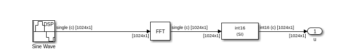
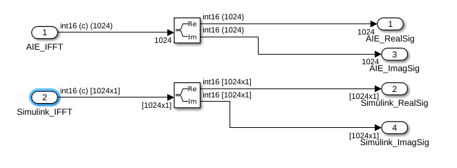
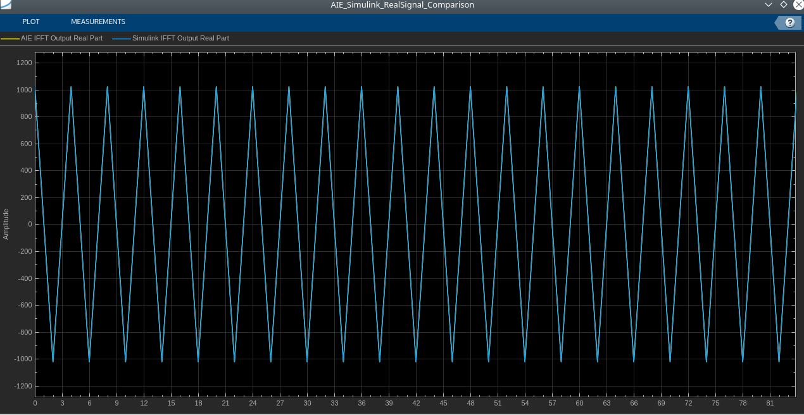
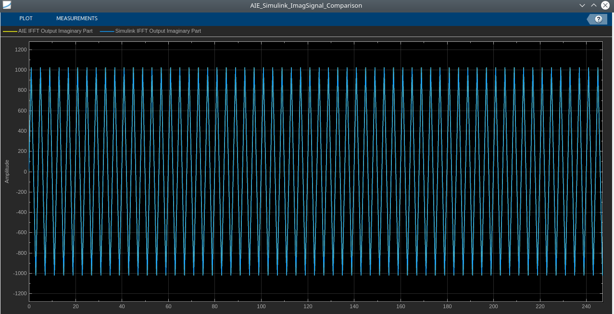
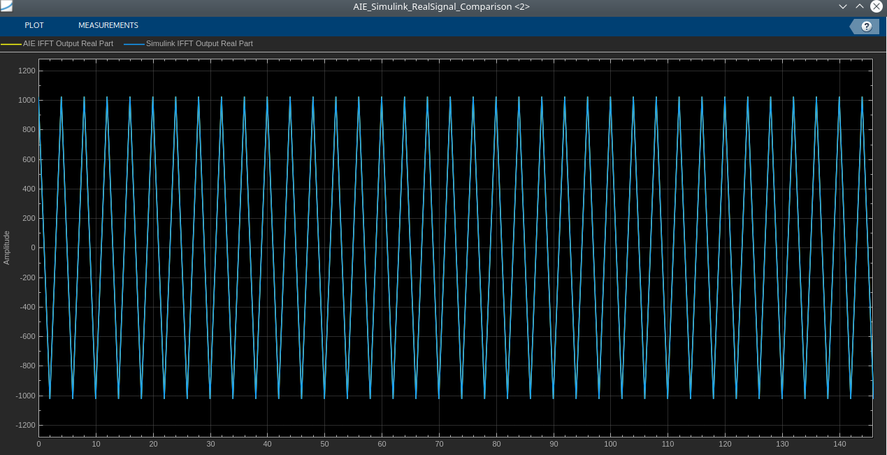
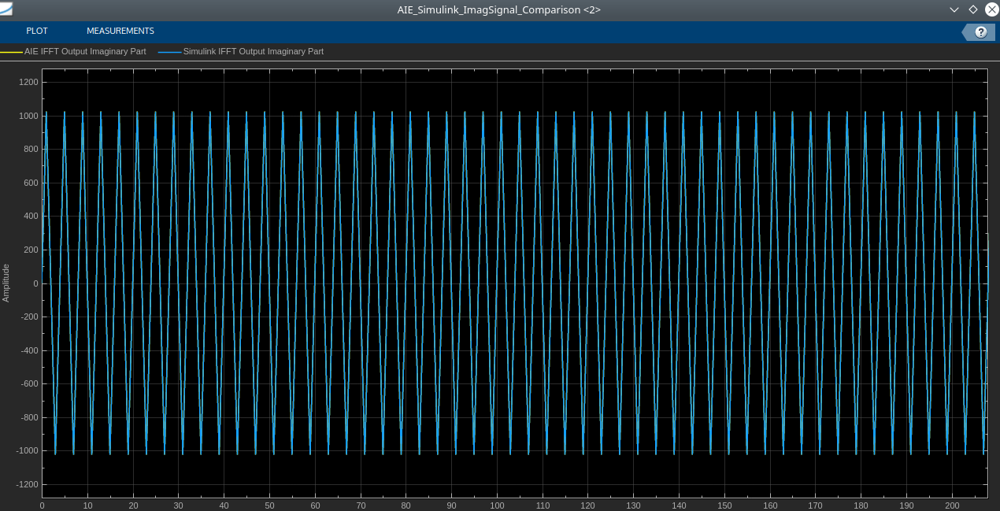

# IFFT Stream

  
  

## Library

AI Engine/DSP/Stream IO

## Description

Stream-based IFFT implementation targeted for AI Engines. The IFFT block
has two stream ports per subframe processor to maximize performance. The
specified value for SSR parameter should be of the form 2^N, where N is
a positive integer.

## Parameters

### Main  
#### Input/Output Data Type

Describes the type of individual data samples input/output of the
  stream IFFT. It can be cint16, cint32, cfloat types.

#### IFFT Size

This is an unsigned integer which describes the point size of the
  transformation. This must be 2^N, where N is in the range 4 to 11
  inclusive.

#### Input Frame Size (Number of Samples)

Specifies the number of samples for a particular frame. The value must
  be in the range 8 to 1024 and the default value is 64. The IFFT
  operation will not begin until this number of samples has been input.

#### Scale Output Down by 2^

Describes the power of 2 shift down applied before output. The
  following table shows the range of valid values of this parameter for
  different data types.
  
  | Data Type | Scale output down by 2^     |
  |-----------|-----------------------------|
  | cint16    | \[0, log2(IFFT Size) + 15\] |
  | cint32    | \[0, log2(IFFT Size) + 31\] |
  | cfloat    | 0                           |

#### SSR

This parameter is intended to improve performance and support IFFT
  sizes beyond the limitations of a single tile. For an SSR value of 'n'
  (which must be of the form 2^N, where N is a positive integer), the
  IFFT operation is performed in parallel and the actual IFFT size is
  divided by 'n'. For example, a 16384 point IFFT with SSR value of 8
  creates 8 stream inputs and there will be 8 subframe IFFTs each of
  point size 2048. The specified IFFT size and SSR values should be such
  that (2 \* IFFT size / SSR) is in the range of 16 and 4096.

#### Number of Cascade Stages
This determines the number of kernels the FFT will be divided over in series to improve throughput.

# IFFT Stream Block Examples 

This example compares AI Engine IFFT Stream block in Vitis Model Composer with the Simulink IFFT block.

**IFFT Stream Block Example1:**

**FFT_Complex_Signal_2MHz Subsystem blocks:**

**AIE_Simulink_TimeDomain_SignalComparison Subsystem blocks:**

**IFFT Stream Output Signal Real Part Comparison in Time-Domain:**

**IFFT Stream Output Signal Imaginary Part Comparison in Time-Domain:**

**IFFT Stream Block Example2:**

**IFFT Stream Output Signal Real Part Comparison in Time-Domain:**

**IFFT Stream Output Signal Imaginary Part Comparison in Time-Domain:**

