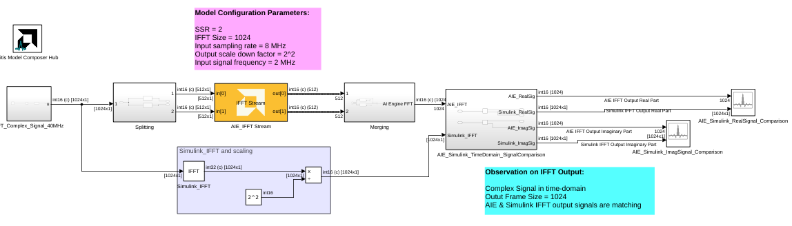
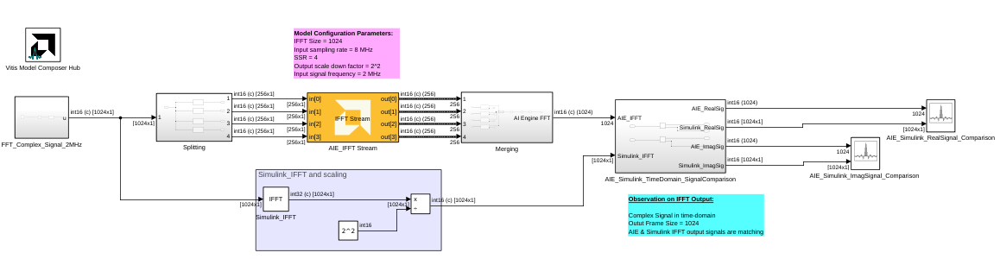

# IFFT Stream

  
  

## Library

AI Engine/DSP/Stream IO

## Description

Stream-based IFFT implementation targeted for AI Engines. The IFFT block
has two stream ports per subframe processor to maximize performance. The
specified value for SSR parameter should be of the form 2^N, where N is
a positive integer.

## Parameters

### Main  
#### Input/Output Data Type

Describes the type of individual data samples input/output of the
  stream IFFT. It can be cint16, cint32, cfloat types.

#### Twiddle factor data type
Describes the data type of the twiddle factors of the transform. It must be `cint16` or `cfloat` and must also satisfy the following rules:
* 32-bit twiddle factors are only supported when the input/output data type is also 32-bit.
* The twiddle factor data type must be an integer type if the input/output data type is an integer type.
* The twiddle factor data type must be `cfloat` if the input/output data type is a float type.

#### IFFT Size

This is an unsigned integer which describes the point size of the
  transformation. This must be 2^N, where N is in the range 4 to 16
  inclusive.

#### Input Frame Size (Number of Samples)

Specifies the number of samples for a particular frame. The value must
  be in the range 8 to 1024 and the default value is 64. The IFFT
  operation will not begin until this number of samples has been input.

#### Scale Output Down by 2^

Describes the power of 2 shift down applied before output. The
  following table shows the range of valid values of this parameter for
  different data types.
  
  | Data Type | Scale output down by 2^     |
  |-----------|-----------------------------|
  | cint16    | \[0, log2(IFFT Size) + 15\] |
  | cint32    | \[0, log2(IFFT Size) + 31\] |
  | cfloat    | 0                           |

#### Rounding mode

Describes the selection of rounding to be applied during the shift down stage of processing.

The following modes are available:
* **Round to positive infinity:** Round halfway towards positive infinity.
* **Round to negative infinity:** Round halfway towards negative infinity.
* **Round symmetrical to infinity:** Round halfway towards infinity (away from zero).
* **Round symmetrical to zero:** Round halfway towards zero (away from infinity).
* **Round convergent to even:** Round halfway towards nearest even number.
* **Round convergent to odd:** Round halfway towards nearest odd number.

These modes round to the nearest integer. They differ only in how they round for values that are exactly between two integers.

#### Saturation mode

Describes the selection of saturation to be applied during the shift down stage of processing.

The following modes are available:
* **None:** No saturation is performed and the value is truncated on the MSB side.
* **Asymmetric:** Rounds an n-bit signed value in the range `-2^(n-1)` to `2^(n-1)-1`.
* **Symmetric:** Rounds an n-bit signed value in the range `-2^(n-1)-1` to `2^(n-1)-1`.

#### Use Widget for SSR Kernels
This parameter is applicable to streaming and parallel (SSR>1) implementations of the FFT. These implementations require stream to window conversions on the hardware.

When this parameter is disabled, stream to window conversion will occur within the FFT kernels themselves.

When this parameter is enabled, stream to window conversion will occur on its own AI Engine tiles. This will improve performance at the expense of additional tiles being used.

#### SSR

This parameter is intended to improve performance and support IFFT
  sizes beyond the limitations of a single tile. For an SSR value of 'n'
  (which must be of the form 2^N, where N is a positive integer), the
  IFFT operation is performed in parallel and the actual IFFT size is
  divided by 'n'. For example, a 16384 point IFFT with SSR value of 8
  creates 8 stream inputs and there will be 8 subframe IFFTs each of
  point size 2048. The specified IFFT size and SSR values should be such
  that (2 \* IFFT size / SSR) is in the range of 16 and 4096.

####  Number of Cascade Stages
This determines the number of kernels the IFFT will be divided over in series to improve throughput. For int data types, and FFT size of 2^N, the maximum cascade length is N/2 when N is even and (N+1)/2 when N is odd. For float data type, the maximum cascade length is N.

## Examples 

***Click on the images below to open each model.***

--------------
Copyright (C) 2024 Advanced Micro Devices, Inc. All rights reserved.
SPDX-License-Identifier: MIT
