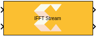
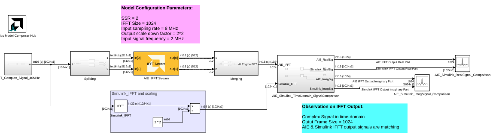
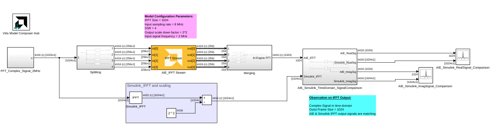

<!-- Library: aieDSP -->

# IFFT Stream
Stream-based IFFT implementation targeted for AI Engines.
  
  

## Library

AI Engine/DSP/Stream IO

## Description

Stream-based IFFT implementation targeted for AI Engines. The IFFT block
has two stream ports per subframe processor to maximize performance. The
specified value for SSR parameter should be of the form 2^N, where N is
a positive integer.

## Parameters

### Main  
#### Input data type  
Set the data type of the block input. The data type of the input signal to the block must match this setting. Valid types are `cint16`, `cint32`, `cfloat`.

#### Output data type
Set the data type of the block output. Valid types are `cint16`, `cint32`, `cfloat`.

#### Twiddle factor data type
Describes the data type of the twiddle factors of the transform. It must be `cint16`, `cint32`, or `cfloat` and must also satisfy the following rules:
* 32-bit twiddle factors are only supported when the input/output data type is also 32-bit.
* The twiddle factor data type must be an integer type if the input/output data type is an integer type.
* The twiddle factor data type must be `cfloat` if the input/output data type is a float type.

#### IFFT Size

This is an unsigned integer which describes the point size of the
  transformation. This must be 2^N, where N is in the range 4 to 16
  inclusive.

#### Input Frame Size (Number of Samples)

Specifies the number of samples for a particular frame. The value must
  be in the range 8 to 1024 and the default value is 64. The IFFT
  operation will not begin until this number of samples has been input.

#### Scale Output Down by 2^

Describes the power of 2 shift down applied before output. The
  following table shows the range of valid values of this parameter for
  different data types.
  
  | Data Type | Scale output down by 2^     |
  |-----------|-----------------------------|
  | cint16    | \[0, log2(IFFT Size) + 15\] |
  | cint32    | \[0, log2(IFFT Size) + 31\] |
  | cfloat    | 0                           |

#### Rounding mode

Describes the selection of rounding to be applied during the shift down stage of processing.

The following modes are available:
* **Round to positive infinity:** Round halfway towards positive infinity.
* **Round to negative infinity:** Round halfway towards negative infinity.
* **Round symmetrical to infinity:** Round halfway towards infinity (away from zero).
* **Round symmetrical to zero:** Round halfway towards zero (away from infinity).
* **Round convergent to even:** Round halfway towards nearest even number.
* **Round convergent to odd:** Round halfway towards nearest odd number.

These modes round to the nearest integer. They differ only in how they round for values that are exactly between two integers.

#### Saturation mode

Describes the selection of saturation to be applied during the shift down stage of processing.

The following modes are available:
* **None:** No saturation is performed and the value is truncated on the MSB side.
* **Asymmetric:** Rounds an n-bit signed value in the range `-2^(n-1)` to `2^(n-1)-1`.
* **Symmetric:** Rounds an n-bit signed value in the range `-2^(n-1)-1` to `2^(n-1)-1`.

#### Twiddle Mode
This parameter controls the amplitude of the twiddle factors. It applies to `cint16` and `cint32` twiddle factors only; it does not apply to `cfloat` twiddle factors.

Twiddle mode 0 means use max amplitude twiddles which saturate at `2^(N-1)-1`, where N is the number of bits in the type (e.g. `cint16` has 16 bits per component).

Twiddle mode 1 means use 1/2 max magnitude twiddles, i.e. `2^(N-1)`. This avoids saturation, but loses 1 bit of precision and so noise overall will be higher.

#### Use Widget for SSR Kernels
This parameter is applicable to streaming and parallel (SSR>1) implementations of the FFT. These implementations require stream to window conversions on the hardware.

When this parameter is disabled, stream to window conversion will occur within the FFT kernels themselves.

When this parameter is enabled, stream to window conversion will occur on its own AI Engine tiles. This will improve performance at the expense of additional tiles being used.

#### SSR

This parameter is intended to improve performance and support IFFT
  sizes beyond the limitations of a single tile. For an SSR value of 'n'
  (which must be of the form 2^N, where N is a positive integer), the
  IFFT operation is performed in parallel and the actual IFFT size is
  divided by 'n'. For example, a 16384 point IFFT with SSR value of 8
  creates 8 stream inputs and there will be 8 subframe IFFTs each of
  point size 2048. The specified IFFT size and SSR values should be such
  that (2 \* IFFT size / SSR) is in the range of 16 and 4096.

####  Number of Cascade Stages
This determines the number of kernels the IFFT will be divided over in series to improve throughput. For int data types, and FFT size of 2^N, the maximum cascade length is N/2 when N is even and (N+1)/2 when N is odd. For float data type, the maximum cascade length is N.

## Examples 

***Click on the images below to open each model.***

<!--
DESCRIPTION:
Model: IFFT_Stream_Ex1
Generated: 09-Jan-2026 13:46:32

Vitis Model Composer Configuration:
  Target Device: xcvc1902-vsva2197-1LP-e-S

Vitis Model Composer Blocks:
  - AIE: IFFT Stream
  - AIE: To Fixed Size

Description:
This MATLAB script creates a Vitis Model Composer Simulink model that uses the AI Engine IFFT Stream block. A 2MHz complex input signal is provided to the block,  and the block's output is compared to a Simulink golden reference.

-->

<!--
MATLAB CREATION SCRIPT:

% create_IFFT_Stream_Ex1_model.m
% Auto-generated script to recreate the IFFT_Stream_Ex1 Simulink model
% Generated on: 09-Jan-2026 13:46:32

%% Model Configuration
modelName = 'IFFT_Stream_Ex1_recreated';

%% Create New Model
if bdIsLoaded(modelName)
    close_system(modelName, 0);
end

new_system(modelName);
open_system(modelName);
fprintf('Created new model: %s\n', modelName);

%% Add Vitis Model Composer Hub Block
hubBlockPath = [modelName '/Vitis Model Composer Hub'];
add_block('vmcUtilities/Vitis Model Composer Hub', hubBlockPath, ...
    'Position', [-123 -202 -68 -149]);

hubBlk = xmcFindHubBlock(modelName);
vmchub_set_param(hubBlk, modelName, 'SelectHardware', 'xcvc1902-vsva2197-1LP-e-S');

%% Add Top-Level Blocks
add_block('aieDSP/IFFT Stream', [modelName '/AIE_IFFT Stream'], ...
    'Position', [350 -14 480 44]);
set_param([modelName '/AIE_IFFT Stream'], ...
    'data_type', 'cint16', ...
    'data_out_type', 'cint16', ...
    'twiddle_type', 'cint16', ...
    'point_size', '1024', ...
    'input_window_size', '1024', ...
    'shift_val', '2', ...
    'rnd_mode', 'Round symmetrical to infinity', ...
    'sat_mode', '0-None', ...
    'ssr', '2', ...
    'twiddle_mode', '0', ...
    'use_ssr_widget_kernels', 'off', ...
    'casc_length', '1', ...
    'transform_fft_nifft', '0', ...
    'TP_API', '1', ...
    'TP_DYN_PT_SIZE', '0');
add_block('built-in/ArrayPlot', [modelName '/AIE_Simulink_ImagSignal_Comparison '], ...
    'Position', [1220 52 1265 103]);
set_param([modelName '/AIE_Simulink_ImagSignal_Comparison '], ...
    'NumInputPorts', '2', ...
    'OpenAtSimulationStart', 'on', ...
    'WindowPosition', '[2.000000,37.000000,1280.000000,655.000000,]', ...
    'XDataMode', 'Sample increment and X-offset', ...
    'SampleIncrement', '1', ...
    'XOffset', '0', ...
    'CustomXData', '[]', ...
    'XScale', 'Linear', ...
    'YScale', 'Linear', ...
    'PlotType', 'Line', ...
    'PlotBaseValue', '0', ...
    'AxesScaling', 'OnceAtStop', ...
    'AxesScalingNumUpdates', '100', ...
    'MaximizeAxes', 'Auto', ...
    'LayoutDimensions', '[1,1]', ...
    'ActiveDisplay', '1', ...
    'PlotAsMagnitudePhase', 'off', ...
    'YLabel', 'Amplitude', ...
    'YLimits', '[-1280,1280]', ...
    'ShowGrid', 'on', ...
    'ShowLegend', 'on', ...
    'ChannelNames', '[]');
add_block('built-in/ArrayPlot', [modelName '/AIE_Simulink_RealSignal_Comparison'], ...
    'Position', [1320 -3 1365 48]);
set_param([modelName '/AIE_Simulink_RealSignal_Comparison'], ...
    'NumInputPorts', '2', ...
    'OpenAtSimulationStart', 'on', ...
    'WindowPosition', '[2.000000,37.000000,1280.000000,655.000000,]', ...
    'XDataMode', 'Sample increment and X-offset', ...
    'SampleIncrement', '1', ...
    'XOffset', '0', ...
    'CustomXData', '[]', ...
    'XScale', 'Linear', ...
    'YScale', 'Linear', ...
    'PlotType', 'Line', ...
    'PlotBaseValue', '0', ...
    'AxesScaling', 'OnceAtStop', ...
    'AxesScalingNumUpdates', '100', ...
    'MaximizeAxes', 'Auto', ...
    'LayoutDimensions', '[1,1]', ...
    'ActiveDisplay', '1', ...
    'PlotAsMagnitudePhase', 'off', ...
    'YLabel', 'Amplitude', ...
    'YLimits', '[-1281.125,1280.125]', ...
    'ShowGrid', 'on', ...
    'ShowLegend', 'on', ...
    'ChannelNames', '[]');
add_block('built-in/Constant', [modelName '/Constant'], ...
    'Position', [405 185 435 215]);
set_param([modelName '/Constant'], ...
    'Value', '2^2', ...
    'VectorParams1D', 'on', ...
    'OutMin', '[]', ...
    'OutMax', '[]', ...
    'OutDataTypeStr', 'int16', ...
    'LockScale', 'off', ...
    'SampleTime', 'inf', ...
    'FramePeriod', 'inf');
add_block('built-in/Product', [modelName '/Divide'], ...
    'Position', [520 142 550 173]);
set_param([modelName '/Divide'], ...
    'Inputs', '*/', ...
    'Multiplication', 'Element-wise(.*)', ...
    'CollapseMode', 'All dimensions', ...
    'CollapseDim', '1', ...
    'InputSameDT', 'off', ...
    'OutMin', '[]', ...
    'OutMax', '[]', ...
    'OutDataTypeStr', 'int16', ...
    'LockScale', 'off', ...
    'RndMeth', 'Floor', ...
    'SaturateOnIntegerOverflow', 'off', ...
    'SampleTime', '-1');
add_block('dspxfrm3/IFFT', [modelName '/Simulink_IFFT'], ...
    'Position', [285 131 325 169]);
set_param([modelName '/Simulink_IFFT'], ...
    'FFTImplementation', 'Auto', ...
    'CompMethod', 'Table lookup', ...
    'TableOpt', 'NEW', ...
    'TableOptActive', 'Speed', ...
    'BitRevOrder', 'off', ...
    'cs_in', 'off', ...
    'Normalize', 'off', ...
    'InheritFFTLength', 'off', ...
    'FFTLength', '1024', ...
    'WrapInput', 'on', ...
    'mode', 'Complex', ...
    'outSamplingMode', 'Sample based', ...
    'roundingMode', 'Floor', ...
    'overflowMode', 'off', ...
    'firstCoeffMode', 'Same word length as input', ...
    'firstCoeffWordLength', '16', ...
    'firstCoeffFracLength', '15', ...
    'firstCoeffDataTypeStr', 'Inherit: Same word length as input', ...
    'firstCoeffLastDataTypeStr', 'Inherit: Same word length as input', ...
    'prodOutputMode', 'Binary point scaling', ...
    'prodOutputWordLength', '32', ...
    'prodOutputFracLength', '0', ...
    'prodOutputDataTypeStr', 'fixdt(1,32,0)', ...
    'prodOutputLastDataTypeStr', 'fixdt(1,32,0)', ...
    'accumMode', 'Inherit via internal rule', ...
    'accumWordLength', '32', ...
    'accumFracLength', '30', ...
    'accumDataTypeStr', 'Inherit: Inherit via internal rule', ...
    'accumLastDataTypeStr', 'Inherit: Inherit via internal rule', ...
    'outputMode', 'Binary point scaling', ...
    'outputWordLength', '32', ...
    'outputFracLength', '0', ...
    'outputDataTypeStr', 'fixdt(1,32,0)', ...
    'outputMin', '[]', ...
    'outputMax', '[]', ...
    'outputLastDataTypeStr', 'fixdt(1,32,0)', ...
    'LockScale', 'off');
add_block('vmcUtilities/Vitis Model Composer Hub', [modelName '/Vitis Model Composer Hub'], ...
    'Position', [-123 -202 -68 -149]);
set_param([modelName '/Vitis Model Composer Hub'], ...
    'CodeGeneration', 'off', ...
    'StartColumn', '1', ...
    'NumberOfColumns', '1', ...
    'TargetDirectory', './code', ...
    'exportDesign', 'off', ...
    'analyzeDesign', 'off', ...
    'validateDesignOnHw', 'off', ...
    'ExportType', 'AI Engines', ...
    'IpVendor', 'xilinx.com', ...
    'IpLibrary', 'hls', ...
    'IpVersion', '1.0', ...
    'IpHWLanguage', 'Verilog', ...
    'AieCompilerOptions', '{}', ...
    'CreateTestbench', 'off', ...
    'TestbenchStackSize', '10', ...
    'RunRtlSim', 'off', ...
    'RunCSim', 'off', ...
    'RunAieSim', 'off', ...
    'AieSimTimeout', '50000', ...
    'RunAieSimProfiling', 'off', ...
    'LaunchVitisAnalyzer', 'off', ...
    'PlotOutput', 'off', ...
    'GenHwImage', 'off', ...
    'GenLibadfXo', 'off', ...
    'GenHwValidationCode', 'off', ...
    'PlatformType', 'Not Specified', ...
    'HwSystemType', 'Baremetal', ...
    'HwValidationTarget', 'hw', ...
    'ProjDevice', 'xcvc1902-vsva2197-1LP-e-S', ...
    'SamplePeriod', '-1', ...
    'ClockFrequency', '200', ...
    'DataPathParallelism', '1', ...
    'xilinxfamily', 'versalaicore', ...
    'part', 'xcvc1902', ...
    'speed', '-1LP-e-S', ...
    'package', 'vsva2197', ...
    'directory', './netlist', ...
    'testbench', 'off', ...
    'incr_netlist', 'off', ...
    'synthesis_tool', 'Vivado', ...
    'clock_wrapper', 'Clock Enables', ...
    'dbl_ovrd', 'According to Block Masks', ...
    'dcm_input_clock_period', '10', ...
    'sysclk_period', '10', ...
    'simulink_period', '1', ...
    'eval_field', '0', ...
    'LogFileName', '''''', ...
    'NThreads', '4');

%% Create AIE_Simulink_TimeDomain_SignalComparison Subsystem
add_block('built-in/SubSystem', [modelName '/AIE_Simulink_TimeDomain_SignalComparison'], ...
    'Position', [845 -8 1020 108]);

% Remove default blocks
defaultBlocks = find_system([modelName '/AIE_Simulink_TimeDomain_SignalComparison'], 'SearchDepth', 1, 'Type', 'block');
for i = 1:length(defaultBlocks)
    if ~strcmp(defaultBlocks{i}, [modelName '/AIE_Simulink_TimeDomain_SignalComparison'])
        delete_block(defaultBlocks{i});
    end
end

add_block('built-in/Inport', [[modelName '/AIE_Simulink_TimeDomain_SignalComparison'] '/AIE_IFFT'], ...
    'Position', [80 168 110 182]);
set_param([[modelName '/AIE_Simulink_TimeDomain_SignalComparison'] '/AIE_IFFT'], ...
    'Port', '1', ...
    'IconDisplay', 'Port number', ...
    'OutputFunctionCall', 'off', ...
    'OutMin', '[]', ...
    'OutMax', '[]', ...
    'OutDataTypeStr', 'Inherit: auto', ...
    'LockScale', 'off', ...
    'BusOutputAsStruct', 'off', ...
    'BusVirtuality', 'inherit', ...
    'Unit', 'inherit', ...
    'PortDimensions', '-1', ...
    'VarSizeSig', 'Inherit', ...
    'SampleTime', '-1', ...
    'SignalType', 'auto', ...
    'LatchByDelayingOutsideSignal', 'off', ...
    'LatchInputForFeedbackSignals', 'off', ...
    'Interpolate', 'on', ...
    'DataMode', 'inherit', ...
    'MessageQueueUseDefaultAttributes', 'on', ...
    'MessageQueueCapacity', '1', ...
    'MessageQueueType', 'LIFO', ...
    'MessageQueueOverwriting', 'on');
add_block('built-in/Inport', [[modelName '/AIE_Simulink_TimeDomain_SignalComparison'] '/Simulink_IFFT'], ...
    'Position', [80 243 110 257]);
set_param([[modelName '/AIE_Simulink_TimeDomain_SignalComparison'] '/Simulink_IFFT'], ...
    'Port', '2', ...
    'IconDisplay', 'Port number', ...
    'OutputFunctionCall', 'off', ...
    'OutMin', '[]', ...
    'OutMax', '[]', ...
    'OutDataTypeStr', 'Inherit: auto', ...
    'LockScale', 'off', ...
    'BusOutputAsStruct', 'off', ...
    'BusVirtuality', 'inherit', ...
    'Unit', 'inherit', ...
    'PortDimensions', '-1', ...
    'VarSizeSig', 'Inherit', ...
    'SampleTime', '-1', ...
    'SignalType', 'auto', ...
    'LatchByDelayingOutsideSignal', 'off', ...
    'LatchInputForFeedbackSignals', 'off', ...
    'Interpolate', 'on', ...
    'DataMode', 'inherit', ...
    'MessageQueueUseDefaultAttributes', 'on', ...
    'MessageQueueCapacity', '1', ...
    'MessageQueueType', 'LIFO', ...
    'MessageQueueOverwriting', 'on');
add_block('built-in/ComplexToRealImag', [[modelName '/AIE_Simulink_TimeDomain_SignalComparison'] '/Complex to Real-Imag'], ...
    'Position', [245 158 275 187]);
set_param([[modelName '/AIE_Simulink_TimeDomain_SignalComparison'] '/Complex to Real-Imag'], ...
    'Output', 'Real and imag', ...
    'SampleTime', '-1');
add_block('built-in/ComplexToRealImag', [[modelName '/AIE_Simulink_TimeDomain_SignalComparison'] '/Complex to Real-Imag1'], ...
    'Position', [245 233 275 262]);
set_param([[modelName '/AIE_Simulink_TimeDomain_SignalComparison'] '/Complex to Real-Imag1'], ...
    'Output', 'Real and imag', ...
    'SampleTime', '-1');
add_block('built-in/Outport', [[modelName '/AIE_Simulink_TimeDomain_SignalComparison'] '/AIE_RealSig'], ...
    'Position', [485 158 515 172]);
set_param([[modelName '/AIE_Simulink_TimeDomain_SignalComparison'] '/AIE_RealSig'], ...
    'Port', '1', ...
    'StorageClass', 'Auto', ...
    'IconDisplay', 'Port number', ...
    'OutputFunctionCall', 'off', ...
    'OutMin', '[]', ...
    'OutMax', '[]', ...
    'OutDataTypeStr', 'Inherit: auto', ...
    'LockScale', 'off', ...
    'BusOutputAsStruct', 'off', ...
    'BusVirtuality', 'inherit', ...
    'DataMode', 'inherit', ...
    'Unit', 'inherit', ...
    'PortDimensions', '-1', ...
    'VarSizeSig', 'Inherit', ...
    'SampleTime', '-1', ...
    'SignalType', 'auto', ...
    'EnsureOutportIsVirtual', 'off', ...
    'OutputWhenDisabled', 'held', ...
    'InitialOutput', '[]', ...
    'MustResolveToSignalObject', 'off', ...
    'OutputWhenUnConnected', 'off', ...
    'OutputWhenUnconnectedValue', '0', ...
    'VectorParamsAs1DForOutWhenUnconnected', 'on');
add_block('built-in/Outport', [[modelName '/AIE_Simulink_TimeDomain_SignalComparison'] '/Simulink_RealSig'], ...
    'Position', [485 233 515 247]);
set_param([[modelName '/AIE_Simulink_TimeDomain_SignalComparison'] '/Simulink_RealSig'], ...
    'Port', '2', ...
    'StorageClass', 'Auto', ...
    'IconDisplay', 'Port number', ...
    'OutputFunctionCall', 'off', ...
    'OutMin', '[]', ...
    'OutMax', '[]', ...
    'OutDataTypeStr', 'Inherit: auto', ...
    'LockScale', 'off', ...
    'BusOutputAsStruct', 'off', ...
    'BusVirtuality', 'inherit', ...
    'DataMode', 'inherit', ...
    'Unit', 'inherit', ...
    'PortDimensions', '-1', ...
    'VarSizeSig', 'Inherit', ...
    'SampleTime', '-1', ...
    'SignalType', 'auto', ...
    'EnsureOutportIsVirtual', 'off', ...
    'OutputWhenDisabled', 'held', ...
    'InitialOutput', '[]', ...
    'MustResolveToSignalObject', 'off', ...
    'OutputWhenUnConnected', 'off', ...
    'OutputWhenUnconnectedValue', '0', ...
    'VectorParamsAs1DForOutWhenUnconnected', 'on');
add_block('built-in/Outport', [[modelName '/AIE_Simulink_TimeDomain_SignalComparison'] '/AIE_ImagSig'], ...
    'Position', [485 193 515 207]);
set_param([[modelName '/AIE_Simulink_TimeDomain_SignalComparison'] '/AIE_ImagSig'], ...
    'Port', '3', ...
    'StorageClass', 'Auto', ...
    'IconDisplay', 'Port number', ...
    'OutputFunctionCall', 'off', ...
    'OutMin', '[]', ...
    'OutMax', '[]', ...
    'OutDataTypeStr', 'Inherit: auto', ...
    'LockScale', 'off', ...
    'BusOutputAsStruct', 'off', ...
    'BusVirtuality', 'inherit', ...
    'DataMode', 'inherit', ...
    'Unit', 'inherit', ...
    'PortDimensions', '-1', ...
    'VarSizeSig', 'Inherit', ...
    'SampleTime', '-1', ...
    'SignalType', 'auto', ...
    'EnsureOutportIsVirtual', 'off', ...
    'OutputWhenDisabled', 'held', ...
    'InitialOutput', '[]', ...
    'MustResolveToSignalObject', 'off', ...
    'OutputWhenUnConnected', 'off', ...
    'OutputWhenUnconnectedValue', '0', ...
    'VectorParamsAs1DForOutWhenUnconnected', 'on');
add_block('built-in/Outport', [[modelName '/AIE_Simulink_TimeDomain_SignalComparison'] '/Simulink_ImagSig'], ...
    'Position', [485 278 515 292]);
set_param([[modelName '/AIE_Simulink_TimeDomain_SignalComparison'] '/Simulink_ImagSig'], ...
    'Port', '4', ...
    'StorageClass', 'Auto', ...
    'IconDisplay', 'Port number', ...
    'OutputFunctionCall', 'off', ...
    'OutMin', '[]', ...
    'OutMax', '[]', ...
    'OutDataTypeStr', 'Inherit: auto', ...
    'LockScale', 'off', ...
    'BusOutputAsStruct', 'off', ...
    'BusVirtuality', 'inherit', ...
    'DataMode', 'inherit', ...
    'Unit', 'inherit', ...
    'PortDimensions', '-1', ...
    'VarSizeSig', 'Inherit', ...
    'SampleTime', '-1', ...
    'SignalType', 'auto', ...
    'EnsureOutportIsVirtual', 'off', ...
    'OutputWhenDisabled', 'held', ...
    'InitialOutput', '[]', ...
    'MustResolveToSignalObject', 'off', ...
    'OutputWhenUnConnected', 'off', ...
    'OutputWhenUnconnectedValue', '0', ...
    'VectorParamsAs1DForOutWhenUnconnected', 'on');

% Connect blocks in AIE_Simulink_TimeDomain_SignalComparison
add_line([modelName '/AIE_Simulink_TimeDomain_SignalComparison'], 'Simulink_IFFT/2', 'Complex to Real-Imag1/2', 'autorouting', 'on');
add_line([modelName '/AIE_Simulink_TimeDomain_SignalComparison'], 'Complex to Real-Imag/3', 'AIE_ImagSig/2', 'autorouting', 'on');
add_line([modelName '/AIE_Simulink_TimeDomain_SignalComparison'], 'Complex to Real-Imag1/3', 'Simulink_ImagSig/2', 'autorouting', 'on');
add_line([modelName '/AIE_Simulink_TimeDomain_SignalComparison'], 'Complex to Real-Imag1/2', 'Simulink_RealSig/2', 'autorouting', 'on');
add_line([modelName '/AIE_Simulink_TimeDomain_SignalComparison'], 'Complex to Real-Imag/2', 'AIE_RealSig/2', 'autorouting', 'on');
add_line([modelName '/AIE_Simulink_TimeDomain_SignalComparison'], 'AIE_IFFT/2', 'Complex to Real-Imag/2', 'autorouting', 'on');

%% Create FFT_Complex_Signal_40MHz Subsystem
add_block('built-in/SubSystem', [modelName '/FFT_Complex_Signal_40MHz'], ...
    'Position', [-110 -13 -25 53]);

% Remove default blocks
defaultBlocks = find_system([modelName '/FFT_Complex_Signal_40MHz'], 'SearchDepth', 1, 'Type', 'block');
for i = 1:length(defaultBlocks)
    if ~strcmp(defaultBlocks{i}, [modelName '/FFT_Complex_Signal_40MHz'])
        delete_block(defaultBlocks{i});
    end
end

add_block('built-in/DataTypeConversion', [[modelName '/FFT_Complex_Signal_40MHz'] '/Data Type Conversion'], ...
    'Position', [195 28 270 62]);
set_param([[modelName '/FFT_Complex_Signal_40MHz'] '/Data Type Conversion'], ...
    'OutMin', '[]', ...
    'OutMax', '[]', ...
    'OutDataTypeStr', 'int16', ...
    'LockScale', 'off', ...
    'ConvertRealWorld', 'Stored Integer (SI)', ...
    'RndMeth', 'Floor', ...
    'SaturateOnIntegerOverflow', 'off', ...
    'SampleTime', '-1');
add_block('dspxfrm3/FFT', [[modelName '/FFT_Complex_Signal_40MHz'] '/FFT'], ...
    'Position', [50 26 90 64]);
set_param([[modelName '/FFT_Complex_Signal_40MHz'] '/FFT'], ...
    'FFTImplementation', 'Auto', ...
    'CompMethod', 'Table lookup', ...
    'TableOpt', 'NEW', ...
    'TableOptActive', 'Speed', ...
    'BitRevOrder', 'off', ...
    'Normalize', 'off', ...
    'InheritFFTLength', 'on', ...
    'FFTLength', '64', ...
    'WrapInput', 'on', ...
    'roundingMode', 'Floor', ...
    'overflowMode', 'off', ...
    'firstCoeffMode', 'Same word length as input', ...
    'firstCoeffWordLength', '16', ...
    'firstCoeffFracLength', '15', ...
    'firstCoeffDataTypeStr', 'Inherit: Same word length as input', ...
    'firstCoeffLastDataTypeStr', 'Inherit: Same word length as input', ...
    'prodOutputMode', 'Inherit via internal rule', ...
    'prodOutputWordLength', '32', ...
    'prodOutputFracLength', '30', ...
    'prodOutputDataTypeStr', 'Inherit: Inherit via internal rule', ...
    'prodOutputLastDataTypeStr', 'Inherit: Inherit via internal rule', ...
    'accumMode', 'Inherit via internal rule', ...
    'accumWordLength', '32', ...
    'accumFracLength', '30', ...
    'accumDataTypeStr', 'Inherit: Inherit via internal rule', ...
    'accumLastDataTypeStr', 'Inherit: Inherit via internal rule', ...
    'outputMode', 'Inherit via internal rule', ...
    'outputWordLength', '16', ...
    'outputFracLength', '0', ...
    'outputDataTypeStr', 'Inherit: Inherit via internal rule', ...
    'outputMin', '[]', ...
    'outputMax', '[]', ...
    'outputLastDataTypeStr', 'Inherit: Inherit via internal rule', ...
    'LockScale', 'off');
add_block('dspsrcs4/Sine Wave', [[modelName '/FFT_Complex_Signal_40MHz'] '/Sine Wave'], ...
    'Position', [-190 23 -145 67]);
set_param([[modelName '/FFT_Complex_Signal_40MHz'] '/Sine Wave'], ...
    'Amplitude', '4', ...
    'Frequency', '2e6', ...
    'Phase', '0', ...
    'SampleMode', 'Discrete', ...
    'OutComplex', 'Complex', ...
    'CompMethod', 'Trigonometric fcn', ...
    'TableSize', 'Speed', ...
    'SampleTime', '1/8e6', ...
    'SamplesPerFrame', '1024', ...
    'ResetState', 'Restart at time zero', ...
    'OutputFrames', 'off', ...
    'additionalParams', 'off', ...
    'allowOverrides', 'on', ...
    'dataType', 'single', ...
    'wordLen', '16', ...
    'udDataType', 'sfix(16)', ...
    'fracBitsMode', 'Best precision', ...
    'numFracBits', '15', ...
    'OutDataTypeStr', 'single', ...
    'LastOutDataTypeStr', 'single');
add_block('built-in/Outport', [[modelName '/FFT_Complex_Signal_40MHz'] '/u'], ...
    'Position', [370 38 400 52]);
set_param([[modelName '/FFT_Complex_Signal_40MHz'] '/u'], ...
    'Port', '1', ...
    'StorageClass', 'Auto', ...
    'IconDisplay', 'Port number', ...
    'OutputFunctionCall', 'off', ...
    'OutMin', '[]', ...
    'OutMax', '[]', ...
    'OutDataTypeStr', 'Inherit: auto', ...
    'LockScale', 'off', ...
    'BusOutputAsStruct', 'off', ...
    'BusVirtuality', 'inherit', ...
    'DataMode', 'inherit', ...
    'Unit', 'inherit', ...
    'PortDimensions', '-1', ...
    'VarSizeSig', 'Inherit', ...
    'SampleTime', '-1', ...
    'SignalType', 'auto', ...
    'EnsureOutportIsVirtual', 'off', ...
    'OutputWhenDisabled', 'held', ...
    'InitialOutput', '[]', ...
    'MustResolveToSignalObject', 'off', ...
    'OutputWhenUnConnected', 'off', ...
    'OutputWhenUnconnectedValue', '0', ...
    'VectorParamsAs1DForOutWhenUnconnected', 'on');

% Connect blocks in FFT_Complex_Signal_40MHz
add_line([modelName '/FFT_Complex_Signal_40MHz'], 'Data Type Conversion/2', 'u/2', 'autorouting', 'on');
add_line([modelName '/FFT_Complex_Signal_40MHz'], 'FFT/2', 'Data Type Conversion/2', 'autorouting', 'on');
add_line([modelName '/FFT_Complex_Signal_40MHz'], 'Sine Wave/2', 'FFT/2', 'autorouting', 'on');

%% Create Merging Subsystem
add_block('built-in/SubSystem', [modelName '/Merging'], ...
    'Position', [580 -20 725 60]);

% Remove default blocks
defaultBlocks = find_system([modelName '/Merging'], 'SearchDepth', 1, 'Type', 'block');
for i = 1:length(defaultBlocks)
    if ~strcmp(defaultBlocks{i}, [modelName '/Merging'])
        delete_block(defaultBlocks{i});
    end
end

add_block('built-in/Inport', [[modelName '/Merging'] '/In1'], ...
    'Position', [20 88 50 102]);
set_param([[modelName '/Merging'] '/In1'], ...
    'Port', '1', ...
    'IconDisplay', 'Port number', ...
    'OutputFunctionCall', 'off', ...
    'OutMin', '[]', ...
    'OutMax', '[]', ...
    'OutDataTypeStr', 'Inherit: auto', ...
    'LockScale', 'off', ...
    'BusOutputAsStruct', 'off', ...
    'BusVirtuality', 'inherit', ...
    'Unit', 'inherit', ...
    'PortDimensions', '-1', ...
    'VarSizeSig', 'Inherit', ...
    'SampleTime', '-1', ...
    'SignalType', 'auto', ...
    'LatchByDelayingOutsideSignal', 'off', ...
    'LatchInputForFeedbackSignals', 'off', ...
    'Interpolate', 'on', ...
    'DataMode', 'inherit', ...
    'MessageQueueUseDefaultAttributes', 'on', ...
    'MessageQueueCapacity', '1', ...
    'MessageQueueType', 'LIFO', ...
    'MessageQueueOverwriting', 'on');
add_block('built-in/Inport', [[modelName '/Merging'] '/In2'], ...
    'Position', [20 118 50 132]);
set_param([[modelName '/Merging'] '/In2'], ...
    'Port', '2', ...
    'IconDisplay', 'Port number', ...
    'OutputFunctionCall', 'off', ...
    'OutMin', '[]', ...
    'OutMax', '[]', ...
    'OutDataTypeStr', 'Inherit: auto', ...
    'LockScale', 'off', ...
    'BusOutputAsStruct', 'off', ...
    'BusVirtuality', 'inherit', ...
    'Unit', 'inherit', ...
    'PortDimensions', '-1', ...
    'VarSizeSig', 'Inherit', ...
    'SampleTime', '-1', ...
    'SignalType', 'auto', ...
    'LatchByDelayingOutsideSignal', 'off', ...
    'LatchInputForFeedbackSignals', 'off', ...
    'Interpolate', 'on', ...
    'DataMode', 'inherit', ...
    'MessageQueueUseDefaultAttributes', 'on', ...
    'MessageQueueCapacity', '1', ...
    'MessageQueueType', 'LIFO', ...
    'MessageQueueOverwriting', 'on');
add_block('built-in/Mux', [[modelName '/Merging'] '/Mux'], ...
    'Position', [485 96 490 134]);
set_param([[modelName '/Merging'] '/Mux'], ...
    'Inputs', '2', ...
    'DisplayOption', 'bar');
add_block('built-in/Reshape', [[modelName '/Merging'] '/Reshape'], ...
    'Position', [585 103 615 127]);
set_param([[modelName '/Merging'] '/Reshape'], ...
    'OutputDimensionality', 'Customize', ...
    'OutputDimensions', '[512, 2]');
add_block('built-in/Reshape', [[modelName '/Merging'] '/Reshape1'], ...
    'Position', [845 103 875 127]);
set_param([[modelName '/Merging'] '/Reshape1'], ...
    'OutputDimensionality', '1-D array', ...
    'OutputDimensions', '[1, 10]');
add_block('built-in/Terminator', [[modelName '/Merging'] '/Terminator'], ...
    'Position', [350 50 370 70]);
add_block('built-in/Terminator', [[modelName '/Merging'] '/Terminator1'], ...
    'Position', [365 140 385 160]);
add_block('aieUtilities/To Fixed Size', [[modelName '/Merging'] '/To Fixed Size'], ...
    'Position', [175 22 290 78]);
set_param([[modelName '/Merging'] '/To Fixed Size'], ...
    'Mode', 'Produce a valid output signal', ...
    'OutputSize', 'Inherit: Same as input', ...
    'CopyMethod', 'Buffer samples to form output', ...
    'HasStatusOutput', 'on');
add_block('aieUtilities/To Fixed Size', [[modelName '/Merging'] '/To Fixed Size1'], ...
    'Position', [175 112 290 168]);
set_param([[modelName '/Merging'] '/To Fixed Size1'], ...
    'Mode', 'Produce a valid output signal', ...
    'OutputSize', 'Inherit: Same as input', ...
    'CopyMethod', 'Buffer samples to form output', ...
    'HasStatusOutput', 'on');
add_block('built-in/Math', [[modelName '/Merging'] '/Transpose'], ...
    'Position', [730 99 760 131]);
set_param([[modelName '/Merging'] '/Transpose'], ...
    'Operator', 'transpose', ...
    'AlgorithmMethod', 'Exact', ...
    'SignedPower', 'off', ...
    'OutputSignalType', 'auto', ...
    'SampleTime', '-1', ...
    'OutMin', '[]', ...
    'OutMax', '[]', ...
    'OutDataTypeStr', 'Inherit: Same as first input', ...
    'LockScale', 'off', ...
    'RndMeth', 'Floor', ...
    'SaturateOnIntegerOverflow', 'on', ...
    'IntermediateResultsDataTypeStr', 'Inherit: Inherit via internal rule', ...
    'AlgorithmType', 'Newton-Raphson', ...
    'Iterations', '3');
add_block('built-in/Outport', [[modelName '/Merging'] '/AI Engine FFT'], ...
    'Position', [1000 108 1030 122]);
set_param([[modelName '/Merging'] '/AI Engine FFT'], ...
    'Port', '1', ...
    'StorageClass', 'Auto', ...
    'IconDisplay', 'Port number', ...
    'OutputFunctionCall', 'off', ...
    'OutMin', '[]', ...
    'OutMax', '[]', ...
    'OutDataTypeStr', 'Inherit: auto', ...
    'LockScale', 'off', ...
    'BusOutputAsStruct', 'off', ...
    'BusVirtuality', 'inherit', ...
    'DataMode', 'inherit', ...
    'Unit', 'inherit', ...
    'PortDimensions', '-1', ...
    'VarSizeSig', 'Inherit', ...
    'SampleTime', '-1', ...
    'SignalType', 'auto', ...
    'EnsureOutportIsVirtual', 'off', ...
    'OutputWhenDisabled', 'held', ...
    'InitialOutput', '[]', ...
    'MustResolveToSignalObject', 'off', ...
    'OutputWhenUnConnected', 'off', ...
    'OutputWhenUnconnectedValue', '0', ...
    'VectorParamsAs1DForOutWhenUnconnected', 'on');

% Connect blocks in Merging
add_line([modelName '/Merging'], 'In1/2', 'To Fixed Size/2', 'autorouting', 'on');
add_line([modelName '/Merging'], 'Reshape1/2', 'AI Engine FFT/2', 'autorouting', 'on');
add_line([modelName '/Merging'], 'Mux/2', 'Reshape/2', 'autorouting', 'on');
add_line([modelName '/Merging'], 'To Fixed Size/2', 'Mux/2', 'autorouting', 'on');
add_line([modelName '/Merging'], 'Transpose/2', 'Reshape1/2', 'autorouting', 'on');
add_line([modelName '/Merging'], 'To Fixed Size/3', 'Terminator/2', 'autorouting', 'on');
add_line([modelName '/Merging'], 'In2/2', 'To Fixed Size1/2', 'autorouting', 'on');
add_line([modelName '/Merging'], 'To Fixed Size1/2', 'Mux/3', 'autorouting', 'on');
add_line([modelName '/Merging'], 'To Fixed Size1/3', 'Terminator1/2', 'autorouting', 'on');
add_line([modelName '/Merging'], 'Reshape/2', 'Transpose/2', 'autorouting', 'on');

%% Create Splitting Subsystem
add_block('built-in/SubSystem', [modelName '/Splitting'], ...
    'Position', [115 -20 235 55]);

% Remove default blocks
defaultBlocks = find_system([modelName '/Splitting'], 'SearchDepth', 1, 'Type', 'block');
for i = 1:length(defaultBlocks)
    if ~strcmp(defaultBlocks{i}, [modelName '/Splitting'])
        delete_block(defaultBlocks{i});
    end
end

add_block('built-in/Inport', [[modelName '/Splitting'] '/In1'], ...
    'Position', [20 68 50 82]);
set_param([[modelName '/Splitting'] '/In1'], ...
    'Port', '1', ...
    'IconDisplay', 'Port number', ...
    'OutputFunctionCall', 'off', ...
    'OutMin', '[]', ...
    'OutMax', '[]', ...
    'OutDataTypeStr', 'Inherit: auto', ...
    'LockScale', 'off', ...
    'BusOutputAsStruct', 'off', ...
    'BusVirtuality', 'inherit', ...
    'Unit', 'inherit', ...
    'PortDimensions', '-1', ...
    'VarSizeSig', 'Inherit', ...
    'SampleTime', '-1', ...
    'SignalType', 'auto', ...
    'LatchByDelayingOutsideSignal', 'off', ...
    'LatchInputForFeedbackSignals', 'off', ...
    'Interpolate', 'on', ...
    'DataMode', 'inherit', ...
    'MessageQueueUseDefaultAttributes', 'on', ...
    'MessageQueueCapacity', '1', ...
    'MessageQueueType', 'LIFO', ...
    'MessageQueueOverwriting', 'on');
add_block('built-in/Selector', [[modelName '/Splitting'] '/EvenSample'], ...
    'Position', [225 81 300 119]);
set_param([[modelName '/Splitting'] '/EvenSample'], ...
    'NumberOfDimensions', '1', ...
    'IndexMode', 'One-based', ...
    'InputPortWidth', '1024', ...
    'SampleTime', '-1', ...
    'IndexOptions', 'Index vector (dialog)', ...
    'Indices', '2:2:1024', ...
    'OutputSizes', '1', ...
    'RuntimeRangeChecks', 'off');
add_block('built-in/Selector', [[modelName '/Splitting'] '/oddSample'], ...
    'Position', [225 21 300 59]);
set_param([[modelName '/Splitting'] '/oddSample'], ...
    'NumberOfDimensions', '1', ...
    'IndexMode', 'One-based', ...
    'InputPortWidth', '1024', ...
    'SampleTime', '-1', ...
    'IndexOptions', 'Index vector (dialog)', ...
    'Indices', '1:2:1024', ...
    'OutputSizes', '1', ...
    'RuntimeRangeChecks', 'off');
add_block('built-in/Outport', [[modelName '/Splitting'] '/Out1'], ...
    'Position', [420 58 450 72]);
set_param([[modelName '/Splitting'] '/Out1'], ...
    'Port', '1', ...
    'StorageClass', 'Auto', ...
    'IconDisplay', 'Port number', ...
    'OutputFunctionCall', 'off', ...
    'OutMin', '[]', ...
    'OutMax', '[]', ...
    'OutDataTypeStr', 'Inherit: auto', ...
    'LockScale', 'off', ...
    'BusOutputAsStruct', 'off', ...
    'BusVirtuality', 'inherit', ...
    'DataMode', 'inherit', ...
    'Unit', 'inherit', ...
    'PortDimensions', '-1', ...
    'VarSizeSig', 'Inherit', ...
    'SampleTime', '-1', ...
    'SignalType', 'auto', ...
    'EnsureOutportIsVirtual', 'off', ...
    'OutputWhenDisabled', 'held', ...
    'InitialOutput', '[]', ...
    'MustResolveToSignalObject', 'off', ...
    'OutputWhenUnConnected', 'off', ...
    'OutputWhenUnconnectedValue', '0', ...
    'VectorParamsAs1DForOutWhenUnconnected', 'on');
add_block('built-in/Outport', [[modelName '/Splitting'] '/Out2'], ...
    'Position', [420 88 450 102]);
set_param([[modelName '/Splitting'] '/Out2'], ...
    'Port', '2', ...
    'StorageClass', 'Auto', ...
    'IconDisplay', 'Port number', ...
    'OutputFunctionCall', 'off', ...
    'OutMin', '[]', ...
    'OutMax', '[]', ...
    'OutDataTypeStr', 'Inherit: auto', ...
    'LockScale', 'off', ...
    'BusOutputAsStruct', 'off', ...
    'BusVirtuality', 'inherit', ...
    'DataMode', 'inherit', ...
    'Unit', 'inherit', ...
    'PortDimensions', '-1', ...
    'VarSizeSig', 'Inherit', ...
    'SampleTime', '-1', ...
    'SignalType', 'auto', ...
    'EnsureOutportIsVirtual', 'off', ...
    'OutputWhenDisabled', 'held', ...
    'InitialOutput', '[]', ...
    'MustResolveToSignalObject', 'off', ...
    'OutputWhenUnConnected', 'off', ...
    'OutputWhenUnconnectedValue', '0', ...
    'VectorParamsAs1DForOutWhenUnconnected', 'on');

% Connect blocks in Splitting
add_line([modelName '/Splitting'], 'oddSample/2', 'Out1/2', 'autorouting', 'on');
add_line([modelName '/Splitting'], 'EvenSample/2', 'Out2/2', 'autorouting', 'on');
add_line([modelName '/Splitting'], 'In1/2', 'EvenSample/2', 'autorouting', 'on');
add_line([modelName '/Splitting'], 'In1/2', 'oddSample/2', 'autorouting', 'on');
add_line([modelName '/Splitting'], 'In1/2', 'oddSample/2', 'autorouting', 'on');

%% Connect Top-Level Blocks
add_line(modelName, 'Simulink_IFFT/2', 'Divide/2', 'autorouting', 'on');
add_line(modelName, 'Constant/2', 'Divide/3', 'autorouting', 'on');
add_line(modelName, 'FFT_Complex_Signal_40MHz/2', 'Splitting/2', 'autorouting', 'on');
add_line(modelName, 'FFT_Complex_Signal_40MHz/2', 'Simulink_IFFT/2', 'autorouting', 'on');
add_line(modelName, 'FFT_Complex_Signal_40MHz/2', 'Simulink_IFFT/2', 'autorouting', 'on');
add_line(modelName, 'Divide/2', 'AIE_Simulink_TimeDomain_SignalComparison/3', 'autorouting', 'on');
add_line(modelName, 'Merging/2', 'AIE_Simulink_TimeDomain_SignalComparison/2', 'autorouting', 'on');
add_line(modelName, 'AIE_IFFT Stream/3', 'Merging/3', 'autorouting', 'on');
add_line(modelName, 'AIE_IFFT Stream/2', 'Merging/2', 'autorouting', 'on');
add_line(modelName, 'Splitting/3', 'AIE_IFFT Stream/3', 'autorouting', 'on');
add_line(modelName, 'Splitting/2', 'AIE_IFFT Stream/2', 'autorouting', 'on');
add_line(modelName, 'AIE_Simulink_TimeDomain_SignalComparison/5', 'AIE_Simulink_ImagSignal_Comparison /3', 'autorouting', 'on');
add_line(modelName, 'AIE_Simulink_TimeDomain_SignalComparison/3', 'AIE_Simulink_RealSignal_Comparison/3', 'autorouting', 'on');
add_line(modelName, 'AIE_Simulink_TimeDomain_SignalComparison/2', 'AIE_Simulink_RealSignal_Comparison/2', 'autorouting', 'on');
add_line(modelName, 'AIE_Simulink_TimeDomain_SignalComparison/4', 'AIE_Simulink_ImagSignal_Comparison /2', 'autorouting', 'on');

%% Save Model
save_system(modelName);
fprintf('\nModel saved: %s.slx\n', modelName);
-->

<!--
DESCRIPTION:
Model: IFFT_Stream_Ex2
Generated: 09-Jan-2026 13:46:36

Vitis Model Composer Configuration:
  Target Device: xcvc1902-vsva2197-1LP-e-S

Vitis Model Composer Blocks:
  - AIE: IFFT Stream
  - AIE: To Fixed Size

Description:
This MATLAB script creates a Vitis Model Composer Simulink model that uses the AI Engine IFFT Stream block. A 2MHz complex input signal is provided to the block,  and the block's output is compared to a Simulink golden reference.

-->

<!--
MATLAB CREATION SCRIPT:

% create_IFFT_Stream_Ex2_model.m
% Auto-generated script to recreate the IFFT_Stream_Ex2 Simulink model
% Generated on: 09-Jan-2026 13:46:36

%% Model Configuration
modelName = 'IFFT_Stream_Ex2_recreated';

%% Create New Model
if bdIsLoaded(modelName)
    close_system(modelName, 0);
end

new_system(modelName);
open_system(modelName);
fprintf('Created new model: %s\n', modelName);

%% Add Vitis Model Composer Hub Block
hubBlockPath = [modelName '/Vitis Model Composer Hub'];
add_block('vmcUtilities/Vitis Model Composer Hub', hubBlockPath, ...
    'Position', [47 8 102 61]);

hubBlk = xmcFindHubBlock(modelName);
vmchub_set_param(hubBlk, modelName, 'SelectHardware', 'xcvc1902-vsva2197-1LP-e-S');

%% Add Top-Level Blocks
add_block('aieDSP/IFFT Stream', [modelName '/AIE_IFFT Stream'], ...
    'Position', [530 191 670 269]);
set_param([modelName '/AIE_IFFT Stream'], ...
    'data_type', 'cint16', ...
    'data_out_type', 'cint16', ...
    'twiddle_type', 'cint16', ...
    'point_size', '1024', ...
    'input_window_size', '1024', ...
    'shift_val', '2', ...
    'rnd_mode', 'Round symmetrical to infinity', ...
    'sat_mode', '0-None', ...
    'ssr', '4', ...
    'twiddle_mode', '0', ...
    'use_ssr_widget_kernels', 'off', ...
    'casc_length', '1', ...
    'transform_fft_nifft', '0', ...
    'TP_API', '1', ...
    'TP_DYN_PT_SIZE', '0');
add_block('built-in/ArrayPlot', [modelName '/AIE_Simulink_ImagSignal_Comparison '], ...
    'Position', [1390 262 1435 313]);
set_param([modelName '/AIE_Simulink_ImagSignal_Comparison '], ...
    'NumInputPorts', '2', ...
    'OpenAtSimulationStart', 'on', ...
    'WindowPosition', '[5.000000,41.000000,1272.000000,651.000000,]', ...
    'XDataMode', 'Sample increment and X-offset', ...
    'SampleIncrement', '1', ...
    'XOffset', '0', ...
    'CustomXData', '[]', ...
    'XScale', 'Linear', ...
    'YScale', 'Linear', ...
    'PlotType', 'Line', ...
    'PlotBaseValue', '0', ...
    'AxesScaling', 'OnceAtStop', ...
    'AxesScalingNumUpdates', '100', ...
    'MaximizeAxes', 'Auto', ...
    'LayoutDimensions', '[1,1]', ...
    'ActiveDisplay', '1', ...
    'PlotAsMagnitudePhase', 'off', ...
    'YLabel', 'Amplitude', ...
    'YLimits', '[-1280,1280]', ...
    'ShowGrid', 'on', ...
    'ShowLegend', 'on', ...
    'ChannelNames', '[]');
add_block('built-in/ArrayPlot', [modelName '/AIE_Simulink_RealSignal_Comparison'], ...
    'Position', [1510 202 1555 253]);
set_param([modelName '/AIE_Simulink_RealSignal_Comparison'], ...
    'NumInputPorts', '2', ...
    'OpenAtSimulationStart', 'on', ...
    'WindowPosition', '[5.000000,41.000000,1272.000000,651.000000,]', ...
    'XDataMode', 'Sample increment and X-offset', ...
    'SampleIncrement', '1', ...
    'XOffset', '0', ...
    'CustomXData', '[]', ...
    'XScale', 'Linear', ...
    'YScale', 'Linear', ...
    'PlotType', 'Line', ...
    'PlotBaseValue', '0', ...
    'AxesScaling', 'OnceAtStop', ...
    'AxesScalingNumUpdates', '100', ...
    'MaximizeAxes', 'Auto', ...
    'LayoutDimensions', '[1,1]', ...
    'ActiveDisplay', '1', ...
    'PlotAsMagnitudePhase', 'off', ...
    'YLabel', 'Amplitude', ...
    'YLimits', '[-1281.125,1280.125]', ...
    'ShowGrid', 'on', ...
    'ShowLegend', 'on', ...
    'ChannelNames', '[]');
add_block('built-in/Constant', [modelName '/Constant'], ...
    'Position', [575 395 605 425]);
set_param([modelName '/Constant'], ...
    'Value', '2^2', ...
    'VectorParams1D', 'on', ...
    'OutMin', '[]', ...
    'OutMax', '[]', ...
    'OutDataTypeStr', 'int16', ...
    'LockScale', 'off', ...
    'SampleTime', 'inf', ...
    'FramePeriod', 'inf');
add_block('built-in/Product', [modelName '/Divide'], ...
    'Position', [690 352 720 383]);
set_param([modelName '/Divide'], ...
    'Inputs', '*/', ...
    'Multiplication', 'Element-wise(.*)', ...
    'CollapseMode', 'All dimensions', ...
    'CollapseDim', '1', ...
    'InputSameDT', 'off', ...
    'OutMin', '[]', ...
    'OutMax', '[]', ...
    'OutDataTypeStr', 'int16', ...
    'LockScale', 'off', ...
    'RndMeth', 'Floor', ...
    'SaturateOnIntegerOverflow', 'off', ...
    'SampleTime', '-1');
add_block('dspxfrm3/IFFT', [modelName '/Simulink_IFFT'], ...
    'Position', [455 341 495 379]);
set_param([modelName '/Simulink_IFFT'], ...
    'FFTImplementation', 'Auto', ...
    'CompMethod', 'Table lookup', ...
    'TableOpt', 'NEW', ...
    'TableOptActive', 'Speed', ...
    'BitRevOrder', 'off', ...
    'cs_in', 'off', ...
    'Normalize', 'off', ...
    'InheritFFTLength', 'off', ...
    'FFTLength', '1024', ...
    'WrapInput', 'on', ...
    'mode', 'Complex', ...
    'outSamplingMode', 'Sample based', ...
    'roundingMode', 'Floor', ...
    'overflowMode', 'off', ...
    'firstCoeffMode', 'Same word length as input', ...
    'firstCoeffWordLength', '16', ...
    'firstCoeffFracLength', '15', ...
    'firstCoeffDataTypeStr', 'Inherit: Same word length as input', ...
    'firstCoeffLastDataTypeStr', 'Inherit: Same word length as input', ...
    'prodOutputMode', 'Binary point scaling', ...
    'prodOutputWordLength', '32', ...
    'prodOutputFracLength', '0', ...
    'prodOutputDataTypeStr', 'fixdt(1,32,0)', ...
    'prodOutputLastDataTypeStr', 'fixdt(1,32,0)', ...
    'accumMode', 'Inherit via internal rule', ...
    'accumWordLength', '32', ...
    'accumFracLength', '30', ...
    'accumDataTypeStr', 'Inherit: Inherit via internal rule', ...
    'accumLastDataTypeStr', 'Inherit: Inherit via internal rule', ...
    'outputMode', 'Binary point scaling', ...
    'outputWordLength', '32', ...
    'outputFracLength', '0', ...
    'outputDataTypeStr', 'fixdt(1,32,0)', ...
    'outputMin', '[]', ...
    'outputMax', '[]', ...
    'outputLastDataTypeStr', 'fixdt(1,32,0)', ...
    'LockScale', 'off');
add_block('vmcUtilities/Vitis Model Composer Hub', [modelName '/Vitis Model Composer Hub'], ...
    'Position', [47 8 102 61]);
set_param([modelName '/Vitis Model Composer Hub'], ...
    'CodeGeneration', 'off', ...
    'StartColumn', '1', ...
    'NumberOfColumns', '1', ...
    'TargetDirectory', './code', ...
    'exportDesign', 'off', ...
    'analyzeDesign', 'off', ...
    'validateDesignOnHw', 'off', ...
    'ExportType', 'AI Engines', ...
    'IpVendor', 'xilinx.com', ...
    'IpLibrary', 'hls', ...
    'IpVersion', '1.0', ...
    'IpHWLanguage', 'Verilog', ...
    'AieCompilerOptions', '{}', ...
    'CreateTestbench', 'off', ...
    'TestbenchStackSize', '10', ...
    'RunRtlSim', 'off', ...
    'RunCSim', 'off', ...
    'RunAieSim', 'off', ...
    'AieSimTimeout', '50000', ...
    'RunAieSimProfiling', 'off', ...
    'LaunchVitisAnalyzer', 'off', ...
    'PlotOutput', 'off', ...
    'GenHwImage', 'off', ...
    'GenLibadfXo', 'off', ...
    'GenHwValidationCode', 'off', ...
    'PlatformType', 'Not Specified', ...
    'HwSystemType', 'Baremetal', ...
    'HwValidationTarget', 'hw', ...
    'ProjDevice', 'xcvc1902-vsva2197-1LP-e-S', ...
    'SamplePeriod', '-1', ...
    'ClockFrequency', '200', ...
    'DataPathParallelism', '1', ...
    'xilinxfamily', 'versalaicore', ...
    'part', 'xcvc1902', ...
    'speed', '-1LP-e-S', ...
    'package', 'vsva2197', ...
    'directory', './netlist', ...
    'testbench', 'off', ...
    'incr_netlist', 'off', ...
    'synthesis_tool', 'Vivado', ...
    'clock_wrapper', 'Clock Enables', ...
    'dbl_ovrd', 'According to Block Masks', ...
    'dcm_input_clock_period', '10', ...
    'sysclk_period', '10', ...
    'simulink_period', '1', ...
    'eval_field', '0', ...
    'LogFileName', '''''', ...
    'NThreads', '4');

%% Create AIE_Simulink_TimeDomain_SignalComparison Subsystem
add_block('built-in/SubSystem', [modelName '/AIE_Simulink_TimeDomain_SignalComparison'], ...
    'Position', [1015 202 1190 318]);

% Remove default blocks
defaultBlocks = find_system([modelName '/AIE_Simulink_TimeDomain_SignalComparison'], 'SearchDepth', 1, 'Type', 'block');
for i = 1:length(defaultBlocks)
    if ~strcmp(defaultBlocks{i}, [modelName '/AIE_Simulink_TimeDomain_SignalComparison'])
        delete_block(defaultBlocks{i});
    end
end

add_block('built-in/Inport', [[modelName '/AIE_Simulink_TimeDomain_SignalComparison'] '/AIE_IFFT'], ...
    'Position', [80 168 110 182]);
set_param([[modelName '/AIE_Simulink_TimeDomain_SignalComparison'] '/AIE_IFFT'], ...
    'Port', '1', ...
    'IconDisplay', 'Port number', ...
    'OutputFunctionCall', 'off', ...
    'OutMin', '[]', ...
    'OutMax', '[]', ...
    'OutDataTypeStr', 'Inherit: auto', ...
    'LockScale', 'off', ...
    'BusOutputAsStruct', 'off', ...
    'BusVirtuality', 'inherit', ...
    'Unit', 'inherit', ...
    'PortDimensions', '-1', ...
    'VarSizeSig', 'Inherit', ...
    'SampleTime', '-1', ...
    'SignalType', 'auto', ...
    'LatchByDelayingOutsideSignal', 'off', ...
    'LatchInputForFeedbackSignals', 'off', ...
    'Interpolate', 'on', ...
    'DataMode', 'inherit', ...
    'MessageQueueUseDefaultAttributes', 'on', ...
    'MessageQueueCapacity', '1', ...
    'MessageQueueType', 'LIFO', ...
    'MessageQueueOverwriting', 'on');
add_block('built-in/Inport', [[modelName '/AIE_Simulink_TimeDomain_SignalComparison'] '/Simulink_IFFT'], ...
    'Position', [80 243 110 257]);
set_param([[modelName '/AIE_Simulink_TimeDomain_SignalComparison'] '/Simulink_IFFT'], ...
    'Port', '2', ...
    'IconDisplay', 'Port number', ...
    'OutputFunctionCall', 'off', ...
    'OutMin', '[]', ...
    'OutMax', '[]', ...
    'OutDataTypeStr', 'Inherit: auto', ...
    'LockScale', 'off', ...
    'BusOutputAsStruct', 'off', ...
    'BusVirtuality', 'inherit', ...
    'Unit', 'inherit', ...
    'PortDimensions', '-1', ...
    'VarSizeSig', 'Inherit', ...
    'SampleTime', '-1', ...
    'SignalType', 'auto', ...
    'LatchByDelayingOutsideSignal', 'off', ...
    'LatchInputForFeedbackSignals', 'off', ...
    'Interpolate', 'on', ...
    'DataMode', 'inherit', ...
    'MessageQueueUseDefaultAttributes', 'on', ...
    'MessageQueueCapacity', '1', ...
    'MessageQueueType', 'LIFO', ...
    'MessageQueueOverwriting', 'on');
add_block('built-in/ComplexToRealImag', [[modelName '/AIE_Simulink_TimeDomain_SignalComparison'] '/Complex to Real-Imag'], ...
    'Position', [245 158 275 187]);
set_param([[modelName '/AIE_Simulink_TimeDomain_SignalComparison'] '/Complex to Real-Imag'], ...
    'Output', 'Real and imag', ...
    'SampleTime', '-1');
add_block('built-in/ComplexToRealImag', [[modelName '/AIE_Simulink_TimeDomain_SignalComparison'] '/Complex to Real-Imag1'], ...
    'Position', [245 233 275 262]);
set_param([[modelName '/AIE_Simulink_TimeDomain_SignalComparison'] '/Complex to Real-Imag1'], ...
    'Output', 'Real and imag', ...
    'SampleTime', '-1');
add_block('built-in/Outport', [[modelName '/AIE_Simulink_TimeDomain_SignalComparison'] '/AIE_RealSig'], ...
    'Position', [485 158 515 172]);
set_param([[modelName '/AIE_Simulink_TimeDomain_SignalComparison'] '/AIE_RealSig'], ...
    'Port', '1', ...
    'StorageClass', 'Auto', ...
    'IconDisplay', 'Port number', ...
    'OutputFunctionCall', 'off', ...
    'OutMin', '[]', ...
    'OutMax', '[]', ...
    'OutDataTypeStr', 'Inherit: auto', ...
    'LockScale', 'off', ...
    'BusOutputAsStruct', 'off', ...
    'BusVirtuality', 'inherit', ...
    'DataMode', 'inherit', ...
    'Unit', 'inherit', ...
    'PortDimensions', '-1', ...
    'VarSizeSig', 'Inherit', ...
    'SampleTime', '-1', ...
    'SignalType', 'auto', ...
    'EnsureOutportIsVirtual', 'off', ...
    'OutputWhenDisabled', 'held', ...
    'InitialOutput', '[]', ...
    'MustResolveToSignalObject', 'off', ...
    'OutputWhenUnConnected', 'off', ...
    'OutputWhenUnconnectedValue', '0', ...
    'VectorParamsAs1DForOutWhenUnconnected', 'on');
add_block('built-in/Outport', [[modelName '/AIE_Simulink_TimeDomain_SignalComparison'] '/Simulink_RealSig'], ...
    'Position', [485 233 515 247]);
set_param([[modelName '/AIE_Simulink_TimeDomain_SignalComparison'] '/Simulink_RealSig'], ...
    'Port', '2', ...
    'StorageClass', 'Auto', ...
    'IconDisplay', 'Port number', ...
    'OutputFunctionCall', 'off', ...
    'OutMin', '[]', ...
    'OutMax', '[]', ...
    'OutDataTypeStr', 'Inherit: auto', ...
    'LockScale', 'off', ...
    'BusOutputAsStruct', 'off', ...
    'BusVirtuality', 'inherit', ...
    'DataMode', 'inherit', ...
    'Unit', 'inherit', ...
    'PortDimensions', '-1', ...
    'VarSizeSig', 'Inherit', ...
    'SampleTime', '-1', ...
    'SignalType', 'auto', ...
    'EnsureOutportIsVirtual', 'off', ...
    'OutputWhenDisabled', 'held', ...
    'InitialOutput', '[]', ...
    'MustResolveToSignalObject', 'off', ...
    'OutputWhenUnConnected', 'off', ...
    'OutputWhenUnconnectedValue', '0', ...
    'VectorParamsAs1DForOutWhenUnconnected', 'on');
add_block('built-in/Outport', [[modelName '/AIE_Simulink_TimeDomain_SignalComparison'] '/AIE_ImagSig'], ...
    'Position', [485 193 515 207]);
set_param([[modelName '/AIE_Simulink_TimeDomain_SignalComparison'] '/AIE_ImagSig'], ...
    'Port', '3', ...
    'StorageClass', 'Auto', ...
    'IconDisplay', 'Port number', ...
    'OutputFunctionCall', 'off', ...
    'OutMin', '[]', ...
    'OutMax', '[]', ...
    'OutDataTypeStr', 'Inherit: auto', ...
    'LockScale', 'off', ...
    'BusOutputAsStruct', 'off', ...
    'BusVirtuality', 'inherit', ...
    'DataMode', 'inherit', ...
    'Unit', 'inherit', ...
    'PortDimensions', '-1', ...
    'VarSizeSig', 'Inherit', ...
    'SampleTime', '-1', ...
    'SignalType', 'auto', ...
    'EnsureOutportIsVirtual', 'off', ...
    'OutputWhenDisabled', 'held', ...
    'InitialOutput', '[]', ...
    'MustResolveToSignalObject', 'off', ...
    'OutputWhenUnConnected', 'off', ...
    'OutputWhenUnconnectedValue', '0', ...
    'VectorParamsAs1DForOutWhenUnconnected', 'on');
add_block('built-in/Outport', [[modelName '/AIE_Simulink_TimeDomain_SignalComparison'] '/Simulink_ImagSig'], ...
    'Position', [485 278 515 292]);
set_param([[modelName '/AIE_Simulink_TimeDomain_SignalComparison'] '/Simulink_ImagSig'], ...
    'Port', '4', ...
    'StorageClass', 'Auto', ...
    'IconDisplay', 'Port number', ...
    'OutputFunctionCall', 'off', ...
    'OutMin', '[]', ...
    'OutMax', '[]', ...
    'OutDataTypeStr', 'Inherit: auto', ...
    'LockScale', 'off', ...
    'BusOutputAsStruct', 'off', ...
    'BusVirtuality', 'inherit', ...
    'DataMode', 'inherit', ...
    'Unit', 'inherit', ...
    'PortDimensions', '-1', ...
    'VarSizeSig', 'Inherit', ...
    'SampleTime', '-1', ...
    'SignalType', 'auto', ...
    'EnsureOutportIsVirtual', 'off', ...
    'OutputWhenDisabled', 'held', ...
    'InitialOutput', '[]', ...
    'MustResolveToSignalObject', 'off', ...
    'OutputWhenUnConnected', 'off', ...
    'OutputWhenUnconnectedValue', '0', ...
    'VectorParamsAs1DForOutWhenUnconnected', 'on');

% Connect blocks in AIE_Simulink_TimeDomain_SignalComparison
add_line([modelName '/AIE_Simulink_TimeDomain_SignalComparison'], 'Simulink_IFFT/2', 'Complex to Real-Imag1/2', 'autorouting', 'on');
add_line([modelName '/AIE_Simulink_TimeDomain_SignalComparison'], 'Complex to Real-Imag/3', 'AIE_ImagSig/2', 'autorouting', 'on');
add_line([modelName '/AIE_Simulink_TimeDomain_SignalComparison'], 'Complex to Real-Imag1/3', 'Simulink_ImagSig/2', 'autorouting', 'on');
add_line([modelName '/AIE_Simulink_TimeDomain_SignalComparison'], 'Complex to Real-Imag1/2', 'Simulink_RealSig/2', 'autorouting', 'on');
add_line([modelName '/AIE_Simulink_TimeDomain_SignalComparison'], 'Complex to Real-Imag/2', 'AIE_RealSig/2', 'autorouting', 'on');
add_line([modelName '/AIE_Simulink_TimeDomain_SignalComparison'], 'AIE_IFFT/2', 'Complex to Real-Imag/2', 'autorouting', 'on');

%% Create FFT_Complex_Signal_40MHz Subsystem
add_block('built-in/SubSystem', [modelName '/FFT_Complex_Signal_40MHz'], ...
    'Position', [60 197 145 263]);

% Remove default blocks
defaultBlocks = find_system([modelName '/FFT_Complex_Signal_40MHz'], 'SearchDepth', 1, 'Type', 'block');
for i = 1:length(defaultBlocks)
    if ~strcmp(defaultBlocks{i}, [modelName '/FFT_Complex_Signal_40MHz'])
        delete_block(defaultBlocks{i});
    end
end

add_block('built-in/DataTypeConversion', [[modelName '/FFT_Complex_Signal_40MHz'] '/Data Type Conversion'], ...
    'Position', [195 28 270 62]);
set_param([[modelName '/FFT_Complex_Signal_40MHz'] '/Data Type Conversion'], ...
    'OutMin', '[]', ...
    'OutMax', '[]', ...
    'OutDataTypeStr', 'int16', ...
    'LockScale', 'off', ...
    'ConvertRealWorld', 'Stored Integer (SI)', ...
    'RndMeth', 'Floor', ...
    'SaturateOnIntegerOverflow', 'off', ...
    'SampleTime', '-1');
add_block('dspxfrm3/FFT', [[modelName '/FFT_Complex_Signal_40MHz'] '/FFT'], ...
    'Position', [50 26 90 64]);
set_param([[modelName '/FFT_Complex_Signal_40MHz'] '/FFT'], ...
    'FFTImplementation', 'Auto', ...
    'CompMethod', 'Table lookup', ...
    'TableOpt', 'NEW', ...
    'TableOptActive', 'Speed', ...
    'BitRevOrder', 'off', ...
    'Normalize', 'off', ...
    'InheritFFTLength', 'on', ...
    'FFTLength', '64', ...
    'WrapInput', 'on', ...
    'roundingMode', 'Floor', ...
    'overflowMode', 'off', ...
    'firstCoeffMode', 'Same word length as input', ...
    'firstCoeffWordLength', '16', ...
    'firstCoeffFracLength', '15', ...
    'firstCoeffDataTypeStr', 'Inherit: Same word length as input', ...
    'firstCoeffLastDataTypeStr', 'Inherit: Same word length as input', ...
    'prodOutputMode', 'Inherit via internal rule', ...
    'prodOutputWordLength', '32', ...
    'prodOutputFracLength', '30', ...
    'prodOutputDataTypeStr', 'Inherit: Inherit via internal rule', ...
    'prodOutputLastDataTypeStr', 'Inherit: Inherit via internal rule', ...
    'accumMode', 'Inherit via internal rule', ...
    'accumWordLength', '32', ...
    'accumFracLength', '30', ...
    'accumDataTypeStr', 'Inherit: Inherit via internal rule', ...
    'accumLastDataTypeStr', 'Inherit: Inherit via internal rule', ...
    'outputMode', 'Inherit via internal rule', ...
    'outputWordLength', '16', ...
    'outputFracLength', '0', ...
    'outputDataTypeStr', 'Inherit: Inherit via internal rule', ...
    'outputMin', '[]', ...
    'outputMax', '[]', ...
    'outputLastDataTypeStr', 'Inherit: Inherit via internal rule', ...
    'LockScale', 'off');
add_block('dspsrcs4/Sine Wave', [[modelName '/FFT_Complex_Signal_40MHz'] '/Sine Wave'], ...
    'Position', [-190 23 -145 67]);
set_param([[modelName '/FFT_Complex_Signal_40MHz'] '/Sine Wave'], ...
    'Amplitude', '4', ...
    'Frequency', '2e6', ...
    'Phase', '0', ...
    'SampleMode', 'Discrete', ...
    'OutComplex', 'Complex', ...
    'CompMethod', 'Trigonometric fcn', ...
    'TableSize', 'Speed', ...
    'SampleTime', '1/8e6', ...
    'SamplesPerFrame', '1024', ...
    'ResetState', 'Restart at time zero', ...
    'OutputFrames', 'off', ...
    'additionalParams', 'off', ...
    'allowOverrides', 'on', ...
    'dataType', 'single', ...
    'wordLen', '16', ...
    'udDataType', 'sfix(16)', ...
    'fracBitsMode', 'Best precision', ...
    'numFracBits', '15', ...
    'OutDataTypeStr', 'single', ...
    'LastOutDataTypeStr', 'single');
add_block('built-in/Outport', [[modelName '/FFT_Complex_Signal_40MHz'] '/u'], ...
    'Position', [370 38 400 52]);
set_param([[modelName '/FFT_Complex_Signal_40MHz'] '/u'], ...
    'Port', '1', ...
    'StorageClass', 'Auto', ...
    'IconDisplay', 'Port number', ...
    'OutputFunctionCall', 'off', ...
    'OutMin', '[]', ...
    'OutMax', '[]', ...
    'OutDataTypeStr', 'Inherit: auto', ...
    'LockScale', 'off', ...
    'BusOutputAsStruct', 'off', ...
    'BusVirtuality', 'inherit', ...
    'DataMode', 'inherit', ...
    'Unit', 'inherit', ...
    'PortDimensions', '-1', ...
    'VarSizeSig', 'Inherit', ...
    'SampleTime', '-1', ...
    'SignalType', 'auto', ...
    'EnsureOutportIsVirtual', 'off', ...
    'OutputWhenDisabled', 'held', ...
    'InitialOutput', '[]', ...
    'MustResolveToSignalObject', 'off', ...
    'OutputWhenUnConnected', 'off', ...
    'OutputWhenUnconnectedValue', '0', ...
    'VectorParamsAs1DForOutWhenUnconnected', 'on');

% Connect blocks in FFT_Complex_Signal_40MHz
add_line([modelName '/FFT_Complex_Signal_40MHz'], 'Data Type Conversion/2', 'u/2', 'autorouting', 'on');
add_line([modelName '/FFT_Complex_Signal_40MHz'], 'FFT/2', 'Data Type Conversion/2', 'autorouting', 'on');
add_line([modelName '/FFT_Complex_Signal_40MHz'], 'Sine Wave/2', 'FFT/2', 'autorouting', 'on');

%% Create Merging Subsystem
add_block('built-in/SubSystem', [modelName '/Merging'], ...
    'Position', [770 190 915 270]);

% Remove default blocks
defaultBlocks = find_system([modelName '/Merging'], 'SearchDepth', 1, 'Type', 'block');
for i = 1:length(defaultBlocks)
    if ~strcmp(defaultBlocks{i}, [modelName '/Merging'])
        delete_block(defaultBlocks{i});
    end
end

add_block('built-in/Inport', [[modelName '/Merging'] '/In1'], ...
    'Position', [40 43 70 57]);
set_param([[modelName '/Merging'] '/In1'], ...
    'Port', '1', ...
    'IconDisplay', 'Port number', ...
    'OutputFunctionCall', 'off', ...
    'OutMin', '[]', ...
    'OutMax', '[]', ...
    'OutDataTypeStr', 'Inherit: auto', ...
    'LockScale', 'off', ...
    'BusOutputAsStruct', 'off', ...
    'BusVirtuality', 'inherit', ...
    'Unit', 'inherit', ...
    'PortDimensions', '-1', ...
    'VarSizeSig', 'Inherit', ...
    'SampleTime', '-1', ...
    'SignalType', 'auto', ...
    'LatchByDelayingOutsideSignal', 'off', ...
    'LatchInputForFeedbackSignals', 'off', ...
    'Interpolate', 'on', ...
    'DataMode', 'inherit', ...
    'MessageQueueUseDefaultAttributes', 'on', ...
    'MessageQueueCapacity', '1', ...
    'MessageQueueType', 'LIFO', ...
    'MessageQueueOverwriting', 'on');
add_block('built-in/Inport', [[modelName '/Merging'] '/In2'], ...
    'Position', [40 133 70 147]);
set_param([[modelName '/Merging'] '/In2'], ...
    'Port', '2', ...
    'IconDisplay', 'Port number', ...
    'OutputFunctionCall', 'off', ...
    'OutMin', '[]', ...
    'OutMax', '[]', ...
    'OutDataTypeStr', 'Inherit: auto', ...
    'LockScale', 'off', ...
    'BusOutputAsStruct', 'off', ...
    'BusVirtuality', 'inherit', ...
    'Unit', 'inherit', ...
    'PortDimensions', '-1', ...
    'VarSizeSig', 'Inherit', ...
    'SampleTime', '-1', ...
    'SignalType', 'auto', ...
    'LatchByDelayingOutsideSignal', 'off', ...
    'LatchInputForFeedbackSignals', 'off', ...
    'Interpolate', 'on', ...
    'DataMode', 'inherit', ...
    'MessageQueueUseDefaultAttributes', 'on', ...
    'MessageQueueCapacity', '1', ...
    'MessageQueueType', 'LIFO', ...
    'MessageQueueOverwriting', 'on');
add_block('built-in/Inport', [[modelName '/Merging'] '/In3'], ...
    'Position', [40 223 70 237]);
set_param([[modelName '/Merging'] '/In3'], ...
    'Port', '3', ...
    'IconDisplay', 'Port number', ...
    'OutputFunctionCall', 'off', ...
    'OutMin', '[]', ...
    'OutMax', '[]', ...
    'OutDataTypeStr', 'Inherit: auto', ...
    'LockScale', 'off', ...
    'BusOutputAsStruct', 'off', ...
    'BusVirtuality', 'inherit', ...
    'Unit', 'inherit', ...
    'PortDimensions', '-1', ...
    'VarSizeSig', 'Inherit', ...
    'SampleTime', '-1', ...
    'SignalType', 'auto', ...
    'LatchByDelayingOutsideSignal', 'off', ...
    'LatchInputForFeedbackSignals', 'off', ...
    'Interpolate', 'on', ...
    'DataMode', 'inherit', ...
    'MessageQueueUseDefaultAttributes', 'on', ...
    'MessageQueueCapacity', '1', ...
    'MessageQueueType', 'LIFO', ...
    'MessageQueueOverwriting', 'on');
add_block('built-in/Inport', [[modelName '/Merging'] '/In4'], ...
    'Position', [40 313 70 327]);
set_param([[modelName '/Merging'] '/In4'], ...
    'Port', '4', ...
    'IconDisplay', 'Port number', ...
    'OutputFunctionCall', 'off', ...
    'OutMin', '[]', ...
    'OutMax', '[]', ...
    'OutDataTypeStr', 'Inherit: auto', ...
    'LockScale', 'off', ...
    'BusOutputAsStruct', 'off', ...
    'BusVirtuality', 'inherit', ...
    'Unit', 'inherit', ...
    'PortDimensions', '-1', ...
    'VarSizeSig', 'Inherit', ...
    'SampleTime', '-1', ...
    'SignalType', 'auto', ...
    'LatchByDelayingOutsideSignal', 'off', ...
    'LatchInputForFeedbackSignals', 'off', ...
    'Interpolate', 'on', ...
    'DataMode', 'inherit', ...
    'MessageQueueUseDefaultAttributes', 'on', ...
    'MessageQueueCapacity', '1', ...
    'MessageQueueType', 'LIFO', ...
    'MessageQueueOverwriting', 'on');
add_block('built-in/Mux', [[modelName '/Merging'] '/Mux'], ...
    'Position', [485 96 490 134]);
set_param([[modelName '/Merging'] '/Mux'], ...
    'Inputs', '4', ...
    'DisplayOption', 'bar');
add_block('built-in/Reshape', [[modelName '/Merging'] '/Reshape'], ...
    'Position', [585 103 615 127]);
set_param([[modelName '/Merging'] '/Reshape'], ...
    'OutputDimensionality', 'Customize', ...
    'OutputDimensions', '[256, 4]');
add_block('built-in/Reshape', [[modelName '/Merging'] '/Reshape1'], ...
    'Position', [845 103 875 127]);
set_param([[modelName '/Merging'] '/Reshape1'], ...
    'OutputDimensionality', '1-D array', ...
    'OutputDimensions', '[1, 10]');
add_block('built-in/Terminator', [[modelName '/Merging'] '/Terminator'], ...
    'Position', [350 50 370 70]);
add_block('built-in/Terminator', [[modelName '/Merging'] '/Terminator1'], ...
    'Position', [365 140 385 160]);
add_block('built-in/Terminator', [[modelName '/Merging'] '/Terminator2'], ...
    'Position', [350 230 370 250]);
add_block('built-in/Terminator', [[modelName '/Merging'] '/Terminator3'], ...
    'Position', [365 320 385 340]);
add_block('aieUtilities/To Fixed Size', [[modelName '/Merging'] '/To Fixed Size'], ...
    'Position', [175 22 290 78]);
set_param([[modelName '/Merging'] '/To Fixed Size'], ...
    'Mode', 'Produce a valid output signal', ...
    'OutputSize', 'Inherit: Same as input', ...
    'CopyMethod', 'Buffer samples to form output', ...
    'HasStatusOutput', 'on');
add_block('aieUtilities/To Fixed Size', [[modelName '/Merging'] '/To Fixed Size1'], ...
    'Position', [175 112 290 168]);
set_param([[modelName '/Merging'] '/To Fixed Size1'], ...
    'Mode', 'Produce a valid output signal', ...
    'OutputSize', 'Inherit: Same as input', ...
    'CopyMethod', 'Buffer samples to form output', ...
    'HasStatusOutput', 'on');
add_block('aieUtilities/To Fixed Size', [[modelName '/Merging'] '/To Fixed Size2'], ...
    'Position', [175 202 290 258]);
set_param([[modelName '/Merging'] '/To Fixed Size2'], ...
    'Mode', 'Produce a valid output signal', ...
    'OutputSize', 'Inherit: Same as input', ...
    'CopyMethod', 'Buffer samples to form output', ...
    'HasStatusOutput', 'on');
add_block('aieUtilities/To Fixed Size', [[modelName '/Merging'] '/To Fixed Size3'], ...
    'Position', [175 292 290 348]);
set_param([[modelName '/Merging'] '/To Fixed Size3'], ...
    'Mode', 'Produce a valid output signal', ...
    'OutputSize', 'Inherit: Same as input', ...
    'CopyMethod', 'Buffer samples to form output', ...
    'HasStatusOutput', 'on');
add_block('built-in/Math', [[modelName '/Merging'] '/Transpose'], ...
    'Position', [730 99 760 131]);
set_param([[modelName '/Merging'] '/Transpose'], ...
    'Operator', 'transpose', ...
    'AlgorithmMethod', 'Exact', ...
    'SignedPower', 'off', ...
    'OutputSignalType', 'auto', ...
    'SampleTime', '-1', ...
    'OutMin', '[]', ...
    'OutMax', '[]', ...
    'OutDataTypeStr', 'Inherit: Same as first input', ...
    'LockScale', 'off', ...
    'RndMeth', 'Floor', ...
    'SaturateOnIntegerOverflow', 'on', ...
    'IntermediateResultsDataTypeStr', 'Inherit: Inherit via internal rule', ...
    'AlgorithmType', 'Newton-Raphson', ...
    'Iterations', '3');
add_block('built-in/Outport', [[modelName '/Merging'] '/AI Engine FFT'], ...
    'Position', [1000 108 1030 122]);
set_param([[modelName '/Merging'] '/AI Engine FFT'], ...
    'Port', '1', ...
    'StorageClass', 'Auto', ...
    'IconDisplay', 'Port number', ...
    'OutputFunctionCall', 'off', ...
    'OutMin', '[]', ...
    'OutMax', '[]', ...
    'OutDataTypeStr', 'Inherit: auto', ...
    'LockScale', 'off', ...
    'BusOutputAsStruct', 'off', ...
    'BusVirtuality', 'inherit', ...
    'DataMode', 'inherit', ...
    'Unit', 'inherit', ...
    'PortDimensions', '-1', ...
    'VarSizeSig', 'Inherit', ...
    'SampleTime', '-1', ...
    'SignalType', 'auto', ...
    'EnsureOutportIsVirtual', 'off', ...
    'OutputWhenDisabled', 'held', ...
    'InitialOutput', '[]', ...
    'MustResolveToSignalObject', 'off', ...
    'OutputWhenUnConnected', 'off', ...
    'OutputWhenUnconnectedValue', '0', ...
    'VectorParamsAs1DForOutWhenUnconnected', 'on');

% Connect blocks in Merging
add_line([modelName '/Merging'], 'To Fixed Size3/3', 'Terminator3/2', 'autorouting', 'on');
add_line([modelName '/Merging'], 'To Fixed Size2/2', 'Mux/4', 'autorouting', 'on');
add_line([modelName '/Merging'], 'To Fixed Size2/3', 'Terminator2/2', 'autorouting', 'on');
add_line([modelName '/Merging'], 'In3/2', 'To Fixed Size2/2', 'autorouting', 'on');
add_line([modelName '/Merging'], 'In4/2', 'To Fixed Size3/2', 'autorouting', 'on');
add_line([modelName '/Merging'], 'To Fixed Size3/2', 'Mux/5', 'autorouting', 'on');
add_line([modelName '/Merging'], 'In1/2', 'To Fixed Size/2', 'autorouting', 'on');
add_line([modelName '/Merging'], 'Reshape1/2', 'AI Engine FFT/2', 'autorouting', 'on');
add_line([modelName '/Merging'], 'Mux/2', 'Reshape/2', 'autorouting', 'on');
add_line([modelName '/Merging'], 'To Fixed Size/2', 'Mux/2', 'autorouting', 'on');
add_line([modelName '/Merging'], 'Transpose/2', 'Reshape1/2', 'autorouting', 'on');
add_line([modelName '/Merging'], 'To Fixed Size/3', 'Terminator/2', 'autorouting', 'on');
add_line([modelName '/Merging'], 'In2/2', 'To Fixed Size1/2', 'autorouting', 'on');
add_line([modelName '/Merging'], 'To Fixed Size1/2', 'Mux/3', 'autorouting', 'on');
add_line([modelName '/Merging'], 'To Fixed Size1/3', 'Terminator1/2', 'autorouting', 'on');
add_line([modelName '/Merging'], 'Reshape/2', 'Transpose/2', 'autorouting', 'on');

%% Create Splitting Subsystem
add_block('built-in/SubSystem', [modelName '/Splitting'], ...
    'Position', [285 192 405 268]);

% Remove default blocks
defaultBlocks = find_system([modelName '/Splitting'], 'SearchDepth', 1, 'Type', 'block');
for i = 1:length(defaultBlocks)
    if ~strcmp(defaultBlocks{i}, [modelName '/Splitting'])
        delete_block(defaultBlocks{i});
    end
end

add_block('built-in/Inport', [[modelName '/Splitting'] '/In1'], ...
    'Position', [20 68 50 82]);
set_param([[modelName '/Splitting'] '/In1'], ...
    'Port', '1', ...
    'IconDisplay', 'Port number', ...
    'OutputFunctionCall', 'off', ...
    'OutMin', '[]', ...
    'OutMax', '[]', ...
    'OutDataTypeStr', 'Inherit: auto', ...
    'LockScale', 'off', ...
    'BusOutputAsStruct', 'off', ...
    'BusVirtuality', 'inherit', ...
    'Unit', 'inherit', ...
    'PortDimensions', '-1', ...
    'VarSizeSig', 'Inherit', ...
    'SampleTime', '-1', ...
    'SignalType', 'auto', ...
    'LatchByDelayingOutsideSignal', 'off', ...
    'LatchInputForFeedbackSignals', 'off', ...
    'Interpolate', 'on', ...
    'DataMode', 'inherit', ...
    'MessageQueueUseDefaultAttributes', 'on', ...
    'MessageQueueCapacity', '1', ...
    'MessageQueueType', 'LIFO', ...
    'MessageQueueOverwriting', 'on');
add_block('built-in/Selector', [[modelName '/Splitting'] '/EvenSample'], ...
    'Position', [225 81 300 119]);
set_param([[modelName '/Splitting'] '/EvenSample'], ...
    'NumberOfDimensions', '1', ...
    'IndexMode', 'One-based', ...
    'InputPortWidth', '1024', ...
    'SampleTime', '-1', ...
    'IndexOptions', 'Index vector (dialog)', ...
    'Indices', '2:4:1024', ...
    'OutputSizes', '1', ...
    'RuntimeRangeChecks', 'off');
add_block('built-in/Selector', [[modelName '/Splitting'] '/EvenSample1'], ...
    'Position', [225 216 300 254]);
set_param([[modelName '/Splitting'] '/EvenSample1'], ...
    'NumberOfDimensions', '1', ...
    'IndexMode', 'One-based', ...
    'InputPortWidth', '1024', ...
    'SampleTime', '-1', ...
    'IndexOptions', 'Index vector (dialog)', ...
    'Indices', '4:4:1024', ...
    'OutputSizes', '1', ...
    'RuntimeRangeChecks', 'off');
add_block('built-in/Selector', [[modelName '/Splitting'] '/oddSample'], ...
    'Position', [225 21 300 59]);
set_param([[modelName '/Splitting'] '/oddSample'], ...
    'NumberOfDimensions', '1', ...
    'IndexMode', 'One-based', ...
    'InputPortWidth', '1024', ...
    'SampleTime', '-1', ...
    'IndexOptions', 'Index vector (dialog)', ...
    'Indices', '1:4:1024', ...
    'OutputSizes', '1', ...
    'RuntimeRangeChecks', 'off');
add_block('built-in/Selector', [[modelName '/Splitting'] '/oddSample1'], ...
    'Position', [225 156 300 194]);
set_param([[modelName '/Splitting'] '/oddSample1'], ...
    'NumberOfDimensions', '1', ...
    'IndexMode', 'One-based', ...
    'InputPortWidth', '1024', ...
    'SampleTime', '-1', ...
    'IndexOptions', 'Index vector (dialog)', ...
    'Indices', '3:4:1024', ...
    'OutputSizes', '1', ...
    'RuntimeRangeChecks', 'off');
add_block('built-in/Outport', [[modelName '/Splitting'] '/Out1'], ...
    'Position', [420 33 450 47]);
set_param([[modelName '/Splitting'] '/Out1'], ...
    'Port', '1', ...
    'StorageClass', 'Auto', ...
    'IconDisplay', 'Port number', ...
    'OutputFunctionCall', 'off', ...
    'OutMin', '[]', ...
    'OutMax', '[]', ...
    'OutDataTypeStr', 'Inherit: auto', ...
    'LockScale', 'off', ...
    'BusOutputAsStruct', 'off', ...
    'BusVirtuality', 'inherit', ...
    'DataMode', 'inherit', ...
    'Unit', 'inherit', ...
    'PortDimensions', '-1', ...
    'VarSizeSig', 'Inherit', ...
    'SampleTime', '-1', ...
    'SignalType', 'auto', ...
    'EnsureOutportIsVirtual', 'off', ...
    'OutputWhenDisabled', 'held', ...
    'InitialOutput', '[]', ...
    'MustResolveToSignalObject', 'off', ...
    'OutputWhenUnConnected', 'off', ...
    'OutputWhenUnconnectedValue', '0', ...
    'VectorParamsAs1DForOutWhenUnconnected', 'on');
add_block('built-in/Outport', [[modelName '/Splitting'] '/Out2'], ...
    'Position', [420 93 450 107]);
set_param([[modelName '/Splitting'] '/Out2'], ...
    'Port', '2', ...
    'StorageClass', 'Auto', ...
    'IconDisplay', 'Port number', ...
    'OutputFunctionCall', 'off', ...
    'OutMin', '[]', ...
    'OutMax', '[]', ...
    'OutDataTypeStr', 'Inherit: auto', ...
    'LockScale', 'off', ...
    'BusOutputAsStruct', 'off', ...
    'BusVirtuality', 'inherit', ...
    'DataMode', 'inherit', ...
    'Unit', 'inherit', ...
    'PortDimensions', '-1', ...
    'VarSizeSig', 'Inherit', ...
    'SampleTime', '-1', ...
    'SignalType', 'auto', ...
    'EnsureOutportIsVirtual', 'off', ...
    'OutputWhenDisabled', 'held', ...
    'InitialOutput', '[]', ...
    'MustResolveToSignalObject', 'off', ...
    'OutputWhenUnConnected', 'off', ...
    'OutputWhenUnconnectedValue', '0', ...
    'VectorParamsAs1DForOutWhenUnconnected', 'on');
add_block('built-in/Outport', [[modelName '/Splitting'] '/Out3'], ...
    'Position', [420 168 450 182]);
set_param([[modelName '/Splitting'] '/Out3'], ...
    'Port', '3', ...
    'StorageClass', 'Auto', ...
    'IconDisplay', 'Port number', ...
    'OutputFunctionCall', 'off', ...
    'OutMin', '[]', ...
    'OutMax', '[]', ...
    'OutDataTypeStr', 'Inherit: auto', ...
    'LockScale', 'off', ...
    'BusOutputAsStruct', 'off', ...
    'BusVirtuality', 'inherit', ...
    'DataMode', 'inherit', ...
    'Unit', 'inherit', ...
    'PortDimensions', '-1', ...
    'VarSizeSig', 'Inherit', ...
    'SampleTime', '-1', ...
    'SignalType', 'auto', ...
    'EnsureOutportIsVirtual', 'off', ...
    'OutputWhenDisabled', 'held', ...
    'InitialOutput', '[]', ...
    'MustResolveToSignalObject', 'off', ...
    'OutputWhenUnConnected', 'off', ...
    'OutputWhenUnconnectedValue', '0', ...
    'VectorParamsAs1DForOutWhenUnconnected', 'on');
add_block('built-in/Outport', [[modelName '/Splitting'] '/Out4'], ...
    'Position', [420 228 450 242]);
set_param([[modelName '/Splitting'] '/Out4'], ...
    'Port', '4', ...
    'StorageClass', 'Auto', ...
    'IconDisplay', 'Port number', ...
    'OutputFunctionCall', 'off', ...
    'OutMin', '[]', ...
    'OutMax', '[]', ...
    'OutDataTypeStr', 'Inherit: auto', ...
    'LockScale', 'off', ...
    'BusOutputAsStruct', 'off', ...
    'BusVirtuality', 'inherit', ...
    'DataMode', 'inherit', ...
    'Unit', 'inherit', ...
    'PortDimensions', '-1', ...
    'VarSizeSig', 'Inherit', ...
    'SampleTime', '-1', ...
    'SignalType', 'auto', ...
    'EnsureOutportIsVirtual', 'off', ...
    'OutputWhenDisabled', 'held', ...
    'InitialOutput', '[]', ...
    'MustResolveToSignalObject', 'off', ...
    'OutputWhenUnConnected', 'off', ...
    'OutputWhenUnconnectedValue', '0', ...
    'VectorParamsAs1DForOutWhenUnconnected', 'on');

% Connect blocks in Splitting
add_line([modelName '/Splitting'], 'oddSample1/2', 'Out3/2', 'autorouting', 'on');
add_line([modelName '/Splitting'], 'EvenSample1/2', 'Out4/2', 'autorouting', 'on');
add_line([modelName '/Splitting'], 'In1/2', 'oddSample/2', 'autorouting', 'on');
add_line([modelName '/Splitting'], 'In1/2', 'EvenSample/2', 'autorouting', 'on');
add_line([modelName '/Splitting'], 'In1/2', 'oddSample1/2', 'autorouting', 'on');
add_line([modelName '/Splitting'], 'In1/2', 'EvenSample1/2', 'autorouting', 'on');
add_line([modelName '/Splitting'], 'In1/2', 'EvenSample1/2', 'autorouting', 'on');
add_line([modelName '/Splitting'], 'In1/2', 'EvenSample1/2', 'autorouting', 'on');
add_line([modelName '/Splitting'], 'In1/2', 'EvenSample1/2', 'autorouting', 'on');
add_line([modelName '/Splitting'], 'oddSample/2', 'Out1/2', 'autorouting', 'on');
add_line([modelName '/Splitting'], 'EvenSample/2', 'Out2/2', 'autorouting', 'on');

%% Connect Top-Level Blocks
add_line(modelName, 'AIE_IFFT Stream/5', 'Merging/5', 'autorouting', 'on');
add_line(modelName, 'AIE_IFFT Stream/4', 'Merging/4', 'autorouting', 'on');
add_line(modelName, 'AIE_IFFT Stream/3', 'Merging/3', 'autorouting', 'on');
add_line(modelName, 'AIE_IFFT Stream/2', 'Merging/2', 'autorouting', 'on');
add_line(modelName, 'Splitting/5', 'AIE_IFFT Stream/5', 'autorouting', 'on');
add_line(modelName, 'Splitting/4', 'AIE_IFFT Stream/4', 'autorouting', 'on');
add_line(modelName, 'Splitting/3', 'AIE_IFFT Stream/3', 'autorouting', 'on');
add_line(modelName, 'Splitting/2', 'AIE_IFFT Stream/2', 'autorouting', 'on');
add_line(modelName, 'Constant/2', 'Divide/3', 'autorouting', 'on');
add_line(modelName, 'Merging/2', 'AIE_Simulink_TimeDomain_SignalComparison/2', 'autorouting', 'on');
add_line(modelName, 'Divide/2', 'AIE_Simulink_TimeDomain_SignalComparison/3', 'autorouting', 'on');
add_line(modelName, 'Simulink_IFFT/2', 'Divide/2', 'autorouting', 'on');
add_line(modelName, 'FFT_Complex_Signal_40MHz/2', 'Splitting/2', 'autorouting', 'on');
add_line(modelName, 'FFT_Complex_Signal_40MHz/2', 'Simulink_IFFT/2', 'autorouting', 'on');
add_line(modelName, 'FFT_Complex_Signal_40MHz/2', 'Simulink_IFFT/2', 'autorouting', 'on');
add_line(modelName, 'AIE_Simulink_TimeDomain_SignalComparison/4', 'AIE_Simulink_ImagSignal_Comparison /2', 'autorouting', 'on');
add_line(modelName, 'AIE_Simulink_TimeDomain_SignalComparison/3', 'AIE_Simulink_RealSignal_Comparison/3', 'autorouting', 'on');
add_line(modelName, 'AIE_Simulink_TimeDomain_SignalComparison/2', 'AIE_Simulink_RealSignal_Comparison/2', 'autorouting', 'on');
add_line(modelName, 'AIE_Simulink_TimeDomain_SignalComparison/5', 'AIE_Simulink_ImagSignal_Comparison /3', 'autorouting', 'on');

%% Save Model
save_system(modelName);
fprintf('\nModel saved: %s.slx\n', modelName);
-->

## References
This block uses the Vitis DSP library implementation of IFFT. For more details on this implementation please click [here](https://docs.xilinx.com/r/en-US/Vitis_Libraries/dsp/user_guide/L2/func-fft-ifft-aie-only.html).

--------------
Copyright (C) 2025 Advanced Micro Devices, Inc.
All rights reserved.

SPDX-License-Identifier: MIT
