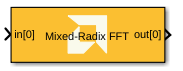
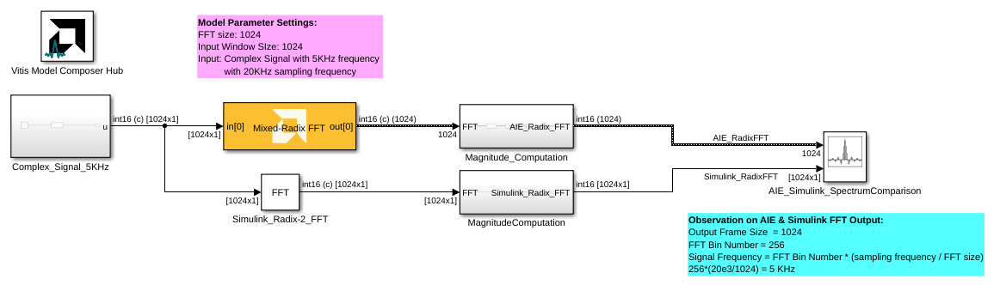
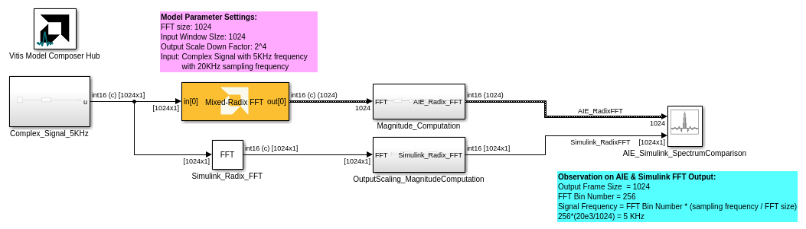

<!-- Library: aieDSP -->

# Mixed Radix FFT 
Mixed Radix FFT implementation targeted for AI Engines.
  
  

## Library

AI Engine/DSP/Buffer IO

## Description

Mixed Radix FFT implementation targeted for AI Engines. 

## Parameters

### Main  
#### Input/Output data type
Set the input/output data type.

#### Twiddle factor data type
Describes the data type of the twiddle factors of the transform. It must be one of `cint16`, `cint32`, or `cfloat` and must also satisfy the following rules:
* 32-bit twiddle factors are only supported when the input/output data type is also 32-bit.
* The twiddle factor data type must be an integer type if the input/output data type is an integer type.
* The twiddle factor data type must be `cfloat` if the input/output data type is a float type.

#### Point Size (FFT Size)
This is an unsigned integer which describes the point size of the transformation. This must be 2^N, where N is in the range 3 to 12 inclusive.

#### Input Window Size (Number of Samples)
Describes the total number of samples used as an input to the Mixed Radix FFT block. This parameter should be an integer multiple of the _Point Size_, in which case multiple FFT iterations will be performed on a given input window. This reduces the number of times the kernel needs to be triggered and as a result the overhead incurred due to triggering the kernel is reduced and overall throughput increases. This parameter must be in the range of 2^4 and 2^12, inclusive. 

#### Scale Output Down by 2^
Describes the power of 2 shift down applied before output. For _cfloat_ data type, the value for this parameter must be zero. 

#### Rounding mode

Describes the selection of rounding to be applied during the shift down stage of processing.

The following modes are available:
* **Floor:** Truncate LSB, always round down (towards negative infinity).
* **Ceiling:** Always round up (towards positive infinity).
* **Round to positive infinity:** Round halfway towards positive infinity.
* **Round to negative infinity:** Round halfway towards negative infinity.
* **Round symmetrical to infinity:** Round halfway towards infinity (away from zero).
* **Round symmetrical to zero:** Round halfway towards zero (away from infinity).
* **Round convergent to even:** Round halfway towards nearest even number.
* **Round convergent to odd:** Round halfway towards nearest odd number.

No rounding is performed on the **Floor** or **Ceiling** modes. Other modes round to the nearest integer. They differ only in how they round for values that are exactly between two integers.

#### Saturation mode

Describes the selection of saturation to be applied during the shift down stage of processing.

The following modes are available:
* **None:** No saturation is performed and the value is truncated on the MSB side.
* **Asymmetric:** Rounds an n-bit signed value in the range `-2^(n-1)` to `2^(n-1)-1`.
* **Symmetric:** Rounds an n-bit signed value in the range `-2^(n-1)-1` to `2^(n-1)-1`.

####  Number of Cascade Stages
This determines the number of kernels the Mixed Radix FFT will be divided over in series to improve throughput. For int data types, and FFT size of 2^N, the maximum cascade length is N/2 when N is even and (N+1)/2 when N is odd. For float data type, the maximum cascade length is N.

### Constraints
Click on the button given here to access the constraint manager and add or update constraints for each kernel. If you set the "Number of cascade stages" parameter to a value greater than one, multiple kernels will be used to process the input. You can use the constraint manager to optimize the performance of your design by setting specific constraints for each kernel (in this case, you need to first run your design). Adding constraints will not affect the functional simulation in Simulink. Constraints will only affect the generated graph code, cycle approximate AIE simulation (System C), and behavior in hardware.

If you are using non-default constraints for any of the kernels for the block, an asterisk (*) will be displayed next to the button.

## Examples

***Click on the images below to open each model.***

<!--
DESCRIPTION:
Model: Mixed_Radix_FFT_Ex1
Generated: 13-Jan-2026 15:37:26

Vitis Model Composer Configuration:
  Target Device: xcvc1902-vsva2197-1LP-e-S

Vitis Model Composer Blocks:
  - AIE: Mixed-Radix FFT

Model Annotations:
  p, li { white-space: pre-wrap; }
  Observation on AIE & Simulink FFT Output:
  Output Frame Size  = 1024
  FFT Bin Number = 256
  Signal Frequency = FFT Bin Number * (sampling frequency / FFT size)
  256*(20e3/1024) = 5 KHz

  p, li { white-space: pre-wrap; }
  Model Parameter Settings:
  FFT size: 1024
  Input Window SIze: 1024
  Input: Complex Signal with 5KHz frequency
  with 20KHz sampling frequency

Description:
This MATLAB script creates a Vitis Model Composer Simulink model that uses the AI Engine Mixed-Radix FFT block. A 5kHz complex input signal is provided to the block,  and results are compared against a Simulink reference implementation.

-->

<!--
MATLAB CREATION SCRIPT:

% Quick Start: Mixed_Radix_FFT_Ex1
% Essential setup focusing on critical parameters

modelName = 'Mixed_Radix_FFT_Ex1';
new_system(modelName); open_system(modelName);

% Hub Block - Configure target device
add_block('vmcUtilities/Vitis Model Composer Hub', [modelName '/Hub']);
hubBlk = xmcFindHubBlock(modelName);
vmchub_set_param(hubBlk, modelName, 'SelectHardware', 'xcvc1902-vsva2197-1LP-e-S');

% CRITICAL: Twiddle factor data type rules:
%   - Must be cint16/cint32/cfloat
%   - Must match input/output type (int→int, float→float)

% Mixed-Radix FFT
add_block('aieDSP/Mixed-Radix FFT', [modelName '/Mixed-Radix FFT']);
set_param([modelName '/Mixed-Radix FFT'], ...
    'data_type', 'cint16', ...
    'twiddle_type', 'cint16', ...
    'point_size', '1024', ...
    'input_window_size', '1024', ...
    'shift_val', '0');

-->

<!--
DESCRIPTION:
Model: Mixed_Radix_FFT_Ex2
Generated: 13-Jan-2026 15:37:26

Vitis Model Composer Configuration:
  Target Device: xcvc1902-vsva2197-1LP-e-S

Vitis Model Composer Blocks:
  - AIE: Mixed-Radix FFT

Model Annotations:
  p, li { white-space: pre-wrap; }
  Model Parameter Settings:
  FFT size: 1024
  Input Window SIze: 1024
  Output Scale Down Factor: 2^4
  Input: Complex Signal with 5KHz frequency
  with 20KHz sampling frequency

  p, li { white-space: pre-wrap; }
  Observation on AIE & Simulink FFT Output:
  Output Frame Size  = 1024
  FFT Bin Number = 256
  Signal Frequency = FFT Bin Number * (sampling frequency / FFT size)
  256*(20e3/1024) = 5 KHz

Description:
This MATLAB script creates a Vitis Model Composer Simulink model that uses the AI Engine Mixed-Radix FFT block. A 5kHz complex input signal is provided to the block,  and results are compared against a Simulink reference implementation.

-->

<!--
MATLAB CREATION SCRIPT:

% Quick Start: Mixed_Radix_FFT_Ex2
% Essential setup focusing on critical parameters

modelName = 'Mixed_Radix_FFT_Ex2';
new_system(modelName); open_system(modelName);

% Hub Block - Configure target device
add_block('vmcUtilities/Vitis Model Composer Hub', [modelName '/Hub']);
hubBlk = xmcFindHubBlock(modelName);
vmchub_set_param(hubBlk, modelName, 'SelectHardware', 'xcvc1902-vsva2197-1LP-e-S');

% CRITICAL: Twiddle factor data type rules:
%   - Must be cint16/cint32/cfloat
%   - Must match input/output type (int→int, float→float)

% Mixed-Radix FFT
add_block('aieDSP/Mixed-Radix FFT', [modelName '/Mixed-Radix FFT']);
set_param([modelName '/Mixed-Radix FFT'], ...
    'data_type', 'cint16', ...
    'twiddle_type', 'cint16', ...
    'point_size', '1024', ...
    'input_window_size', '1024', ...
    'shift_val', '4');

-->

## References
This block uses the Vitis DSP library implementation of Mixed-Radix FFT. For more details on this implementation please click [here](https://docs.xilinx.com/r/en-US/Vitis_Libraries/dsp/user_guide/L2/func-mixed_radix_fft.html).

--------------
Copyright (C) 2025 Advanced Micro Devices, Inc.
All rights reserved.

SPDX-License-Identifier: MIT
