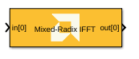
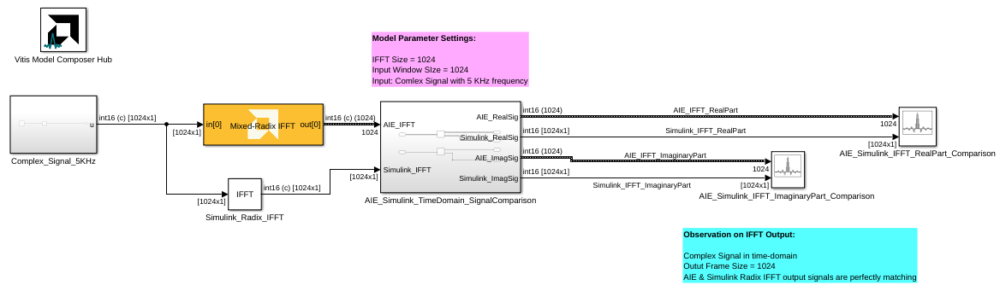
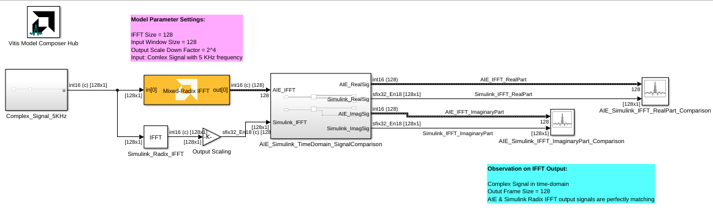

<!-- Library: aieDSP -->

# Mixed Radix IFFT 
Mixed Radix FFT implementation targeted for AI Engines.
  
  

## Library

AI Engine/DSP/Buffer IO

## Description

Mixed Radix IFFT implementation targeted for AI Engines. 

## Parameters

### Main  
#### Input/Output data type
Set the input/output data type.

#### Twiddle factor data type
Describes the data type of the twiddle factors of the transform. It must be one of `cint16`, `cint32`, or `cfloat` and must also satisfy the following rules:
* 32-bit twiddle factors are only supported when the input/output data type is also 32-bit.
* The twiddle factor data type must be an integer type if the input/output data type is an integer type.
* The twiddle factor data type must be `cfloat` if the input/output data type is a float type.

#### Point Size (IFFT Size)
This is an unsigned integer which describes the point size of the transformation. This must be 2^N, where N is in the range 3 to 12 inclusive.

#### Input Frame Size (Number of Samples)

Specifies the number of samples for a particular frame. The value must
  be in the range 16 to 4096 and the default value is 64. The IFFT
  operation will not begin until this number of samples has been input.

#### Scale Output Down by 2^
Describes the power of 2 shift down applied before output. For _cfloat_ data type, the value for this parameter must be zero. 

#### Rounding mode

Describes the selection of rounding to be applied during the shift down stage of processing.

The following modes are available:
* **Floor:** Truncate LSB, always round down (towards negative infinity).
* **Ceiling:** Always round up (towards positive infinity).
* **Round to positive infinity:** Round halfway towards positive infinity.
* **Round to negative infinity:** Round halfway towards negative infinity.
* **Round symmetrical to infinity:** Round halfway towards infinity (away from zero).
* **Round symmetrical to zero:** Round halfway towards zero (away from infinity).
* **Round convergent to even:** Round halfway towards nearest even number.
* **Round convergent to odd:** Round halfway towards nearest odd number.

No rounding is performed on the **Floor** or **Ceiling** modes. Other modes round to the nearest integer. They differ only in how they round for values that are exactly between two integers.

#### Saturation mode

Describes the selection of saturation to be applied during the shift down stage of processing.

The following modes are available:
* **None:** No saturation is performed and the value is truncated on the MSB side.
* **Asymmetric:** Rounds an n-bit signed value in the range `-2^(n-1)` to `2^(n-1)-1`.
* **Symmetric:** Rounds an n-bit signed value in the range `-2^(n-1)-1` to `2^(n-1)-1`.

####  Number of Cascade Stages
This determines the number of kernels the Mixed Radix IFFT will be divided over in series to improve throughput. For int data types, and IFFT size of 2^N, the maximum cascade length is N/2 when N is even and (N+1)/2 when N is odd. For float data type, the maximum cascade length is N.

### Constraints
Click on the button given here to access the constraint manager and add or update constraints for each kernel. If you set the "Number of cascade stages" parameter to a value greater than one, multiple kernels will be used to process the input. You can use the constraint manager to optimize the performance of your design by setting specific constraints for each kernel (in this case, you need to first run your design). Adding constraints will not affect the functional simulation in Simulink. Constraints will only affect the generated graph code, cycle approximate AIE simulation (System C), and behavior in hardware.

If you are using non-default constraints for any of the kernels for the block, an asterisk (*) will be displayed next to the button.

## Examples

***Click on the images below to open each model.***

<!--
DESCRIPTION:
Model: Mixed_Radix_IFFT_Ex1
Generated: 09-Jan-2026 13:47:00

Vitis Model Composer Configuration:
  Target Device: xcvc1902-vsva2197-1LP-e-S

Vitis Model Composer Blocks:
  - AIE: Mixed-Radix IFFT

Description:
This MATLAB script creates a Vitis Model Composer Simulink model that uses the AI Engine Mixed-Radix IFFT block. A 5kHz complex input signal is provided to the block,  and the block's output is compared to a Simulink golden reference.

-->

<!--
MATLAB CREATION SCRIPT:

% create_Mixed_Radix_IFFT_Ex1_model.m
% Auto-generated script to recreate the Mixed_Radix_IFFT_Ex1 Simulink model
% Generated on: 09-Jan-2026 13:47:00

%% Model Configuration
modelName = 'Mixed_Radix_IFFT_Ex1_recreated';

%% Create New Model
if bdIsLoaded(modelName)
    close_system(modelName, 0);
end

new_system(modelName);
open_system(modelName);
fprintf('Created new model: %s\n', modelName);

%% Add Vitis Model Composer Hub Block
hubBlockPath = [modelName '/Vitis Model Composer Hub'];
add_block('vmcUtilities/Vitis Model Composer Hub', hubBlockPath, ...
    'Position', [147 98 202 151]);

hubBlk = xmcFindHubBlock(modelName);
vmchub_set_param(hubBlk, modelName, 'SelectHardware', 'xcvc1902-vsva2197-1LP-e-S');

%% Add Top-Level Blocks
add_block('built-in/ArrayPlot', [modelName '/AIE_Simulink_IFFT_ImaginaryPart_Comparison '], ...
    'Position', [1035 273 1075 317]);
set_param([modelName '/AIE_Simulink_IFFT_ImaginaryPart_Comparison '], ...
    'NumInputPorts', '2', ...
    'OpenAtSimulationStart', 'on', ...
    'WindowPosition', '[134.000000,82.000000,1061.000000,557.000000,]', ...
    'XDataMode', 'Sample increment and X-offset', ...
    'SampleIncrement', '1', ...
    'XOffset', '0', ...
    'CustomXData', '[]', ...
    'XScale', 'Linear', ...
    'YScale', 'Linear', ...
    'PlotType', 'Line', ...
    'PlotBaseValue', '0', ...
    'AxesScaling', 'Manual', ...
    'AxesScalingNumUpdates', '100', ...
    'MaximizeAxes', 'Auto', ...
    'LayoutDimensions', '[1,1]', ...
    'ActiveDisplay', '1', ...
    'PlotAsMagnitudePhase', 'off', ...
    'YLabel', 'Amplitude', ...
    'YLimits', '[-1000,1000]', ...
    'ShowGrid', 'on', ...
    'ShowLegend', 'on', ...
    'ChannelNames', '[]');
add_block('built-in/ArrayPlot', [modelName '/AIE_Simulink_IFFT_RealPart_Comparison'], ...
    'Position', [1190 219 1235 266]);
set_param([modelName '/AIE_Simulink_IFFT_RealPart_Comparison'], ...
    'NumInputPorts', '2', ...
    'OpenAtSimulationStart', 'on', ...
    'WindowPosition', '[1.000000,37.000000,1280.000000,655.000000,]', ...
    'XDataMode', 'Sample increment and X-offset', ...
    'SampleIncrement', '1', ...
    'XOffset', '0', ...
    'CustomXData', '[]', ...
    'XScale', 'Linear', ...
    'YScale', 'Linear', ...
    'PlotType', 'Line', ...
    'PlotBaseValue', '0', ...
    'AxesScaling', 'OnceAtStop', ...
    'AxesScalingNumUpdates', '100', ...
    'MaximizeAxes', 'Auto', ...
    'LayoutDimensions', '[1,1]', ...
    'ActiveDisplay', '1', ...
    'PlotAsMagnitudePhase', 'off', ...
    'YLabel', 'Amplitude', ...
    'YLimits', '[-1280,1280]', ...
    'ShowGrid', 'on', ...
    'ShowLegend', 'on', ...
    'ChannelNames', '[]');
add_block('aieDSP/Mixed-Radix IFFT', [modelName '/Mixed-Radix IFFT'], ...
    'Position', [345 215 490 265]);
set_param([modelName '/Mixed-Radix IFFT'], ...
    'data_type', 'cint16', ...
    'twiddle_type', 'cint16', ...
    'point_size', '1024', ...
    'input_window_size', '1024', ...
    'dyn_pt_size', '0', ...
    'TP_FFT_NIFFT', '0', ...
    'casc_length', '1', ...
    'TP_API', '0', ...
    'shift_val', '0', ...
    'rnd_mode', 'Round symmetrical to infinity', ...
    'sat_mode', '0-None');
add_block('dspxfrm3/IFFT', [modelName '/Simulink_Radix_IFFT'], ...
    'Position', [375 306 415 344]);
set_param([modelName '/Simulink_Radix_IFFT'], ...
    'FFTImplementation', 'Radix-2', ...
    'CompMethod', 'Table lookup', ...
    'TableOpt', 'NEW', ...
    'TableOptActive', 'Speed', ...
    'BitRevOrder', 'off', ...
    'cs_in', 'off', ...
    'Normalize', 'off', ...
    'InheritFFTLength', 'on', ...
    'FFTLength', '64', ...
    'WrapInput', 'on', ...
    'mode', 'Complex', ...
    'outSamplingMode', 'Sample based', ...
    'roundingMode', 'Floor', ...
    'overflowMode', 'off', ...
    'firstCoeffMode', 'Same word length as input', ...
    'firstCoeffWordLength', '16', ...
    'firstCoeffFracLength', '15', ...
    'firstCoeffDataTypeStr', 'Inherit: Same word length as input', ...
    'firstCoeffLastDataTypeStr', 'Inherit: Same word length as input', ...
    'prodOutputMode', 'Binary point scaling', ...
    'prodOutputWordLength', '24', ...
    'prodOutputFracLength', '0', ...
    'prodOutputDataTypeStr', 'fixdt(1,24,0)', ...
    'prodOutputLastDataTypeStr', 'fixdt(1,24,0)', ...
    'accumMode', 'Inherit via internal rule', ...
    'accumWordLength', '32', ...
    'accumFracLength', '30', ...
    'accumDataTypeStr', 'Inherit: Inherit via internal rule', ...
    'accumLastDataTypeStr', 'Inherit: Inherit via internal rule', ...
    'outputMode', 'Binary point scaling', ...
    'outputWordLength', '16', ...
    'outputFracLength', '0', ...
    'outputDataTypeStr', 'fixdt(1,16,0)', ...
    'outputMin', '[]', ...
    'outputMax', '[]', ...
    'outputLastDataTypeStr', 'fixdt(1,16,0)', ...
    'LockScale', 'off');
add_block('vmcUtilities/Vitis Model Composer Hub', [modelName '/Vitis Model Composer Hub'], ...
    'Position', [147 98 202 151]);
set_param([modelName '/Vitis Model Composer Hub'], ...
    'CodeGeneration', 'off', ...
    'StartColumn', '1', ...
    'NumberOfColumns', '1', ...
    'TargetDirectory', './code', ...
    'exportDesign', 'off', ...
    'analyzeDesign', 'off', ...
    'validateDesignOnHw', 'off', ...
    'ExportType', 'AI Engines', ...
    'IpVendor', 'xilinx.com', ...
    'IpLibrary', 'hls', ...
    'IpVersion', '1.0', ...
    'IpHWLanguage', 'Verilog', ...
    'AieCompilerOptions', '{}', ...
    'CreateTestbench', 'off', ...
    'TestbenchStackSize', '10', ...
    'RunRtlSim', 'off', ...
    'RunCSim', 'off', ...
    'RunAieSim', 'off', ...
    'AieSimTimeout', '50000', ...
    'RunAieSimProfiling', 'off', ...
    'LaunchVitisAnalyzer', 'off', ...
    'PlotOutput', 'off', ...
    'GenHwImage', 'off', ...
    'GenLibadfXo', 'off', ...
    'GenHwValidationCode', 'off', ...
    'PlatformType', 'Not Specified', ...
    'HwSystemType', 'Baremetal', ...
    'HwValidationTarget', 'hw', ...
    'ProjDevice', 'xcvc1902-vsva2197-1LP-e-S', ...
    'SamplePeriod', '-1', ...
    'ClockFrequency', '200', ...
    'DataPathParallelism', '1', ...
    'xilinxfamily', 'versalaicore', ...
    'part', 'xcvc1902', ...
    'speed', '-1LP-e-S', ...
    'package', 'vsva2197', ...
    'directory', './netlist', ...
    'testbench', 'off', ...
    'incr_netlist', 'off', ...
    'synthesis_tool', 'Vivado', ...
    'clock_wrapper', 'Clock Enables', ...
    'dbl_ovrd', 'According to Block Masks', ...
    'dcm_input_clock_period', '10', ...
    'sysclk_period', '10', ...
    'simulink_period', '1', ...
    'eval_field', '0', ...
    'LogFileName', '''''', ...
    'NThreads', '4');

%% Create AIE_Simulink_TimeDomain_SignalComparison Subsystem
add_block('built-in/SubSystem', [modelName '/AIE_Simulink_TimeDomain_SignalComparison'], ...
    'Position', [560 212 730 323]);

% Remove default blocks
defaultBlocks = find_system([modelName '/AIE_Simulink_TimeDomain_SignalComparison'], 'SearchDepth', 1, 'Type', 'block');
for i = 1:length(defaultBlocks)
    if ~strcmp(defaultBlocks{i}, [modelName '/AIE_Simulink_TimeDomain_SignalComparison'])
        delete_block(defaultBlocks{i});
    end
end

add_block('built-in/Inport', [[modelName '/AIE_Simulink_TimeDomain_SignalComparison'] '/AIE_IFFT'], ...
    'Position', [80 168 110 182]);
set_param([[modelName '/AIE_Simulink_TimeDomain_SignalComparison'] '/AIE_IFFT'], ...
    'Port', '1', ...
    'IconDisplay', 'Port number', ...
    'OutputFunctionCall', 'off', ...
    'OutMin', '[]', ...
    'OutMax', '[]', ...
    'OutDataTypeStr', 'Inherit: auto', ...
    'LockScale', 'off', ...
    'BusOutputAsStruct', 'off', ...
    'BusVirtuality', 'inherit', ...
    'Unit', 'inherit', ...
    'PortDimensions', '-1', ...
    'VarSizeSig', 'Inherit', ...
    'SampleTime', '-1', ...
    'SignalType', 'auto', ...
    'LatchByDelayingOutsideSignal', 'off', ...
    'LatchInputForFeedbackSignals', 'off', ...
    'Interpolate', 'on', ...
    'DataMode', 'inherit', ...
    'MessageQueueUseDefaultAttributes', 'on', ...
    'MessageQueueCapacity', '1', ...
    'MessageQueueType', 'LIFO', ...
    'MessageQueueOverwriting', 'on');
add_block('built-in/Inport', [[modelName '/AIE_Simulink_TimeDomain_SignalComparison'] '/Simulink_IFFT'], ...
    'Position', [80 243 110 257]);
set_param([[modelName '/AIE_Simulink_TimeDomain_SignalComparison'] '/Simulink_IFFT'], ...
    'Port', '2', ...
    'IconDisplay', 'Port number', ...
    'OutputFunctionCall', 'off', ...
    'OutMin', '[]', ...
    'OutMax', '[]', ...
    'OutDataTypeStr', 'Inherit: auto', ...
    'LockScale', 'off', ...
    'BusOutputAsStruct', 'off', ...
    'BusVirtuality', 'inherit', ...
    'Unit', 'inherit', ...
    'PortDimensions', '-1', ...
    'VarSizeSig', 'Inherit', ...
    'SampleTime', '-1', ...
    'SignalType', 'auto', ...
    'LatchByDelayingOutsideSignal', 'off', ...
    'LatchInputForFeedbackSignals', 'off', ...
    'Interpolate', 'on', ...
    'DataMode', 'inherit', ...
    'MessageQueueUseDefaultAttributes', 'on', ...
    'MessageQueueCapacity', '1', ...
    'MessageQueueType', 'LIFO', ...
    'MessageQueueOverwriting', 'on');
add_block('built-in/ComplexToRealImag', [[modelName '/AIE_Simulink_TimeDomain_SignalComparison'] '/Complex to Real-Imag'], ...
    'Position', [245 158 275 187]);
set_param([[modelName '/AIE_Simulink_TimeDomain_SignalComparison'] '/Complex to Real-Imag'], ...
    'Output', 'Real and imag', ...
    'SampleTime', '-1');
add_block('built-in/ComplexToRealImag', [[modelName '/AIE_Simulink_TimeDomain_SignalComparison'] '/Complex to Real-Imag1'], ...
    'Position', [245 233 275 262]);
set_param([[modelName '/AIE_Simulink_TimeDomain_SignalComparison'] '/Complex to Real-Imag1'], ...
    'Output', 'Real and imag', ...
    'SampleTime', '-1');
add_block('built-in/Outport', [[modelName '/AIE_Simulink_TimeDomain_SignalComparison'] '/AIE_RealSig'], ...
    'Position', [485 158 515 172]);
set_param([[modelName '/AIE_Simulink_TimeDomain_SignalComparison'] '/AIE_RealSig'], ...
    'Port', '1', ...
    'StorageClass', 'Auto', ...
    'IconDisplay', 'Port number', ...
    'OutputFunctionCall', 'off', ...
    'OutMin', '[]', ...
    'OutMax', '[]', ...
    'OutDataTypeStr', 'Inherit: auto', ...
    'LockScale', 'off', ...
    'BusOutputAsStruct', 'off', ...
    'BusVirtuality', 'inherit', ...
    'DataMode', 'inherit', ...
    'Unit', 'inherit', ...
    'PortDimensions', '-1', ...
    'VarSizeSig', 'Inherit', ...
    'SampleTime', '-1', ...
    'SignalType', 'auto', ...
    'EnsureOutportIsVirtual', 'off', ...
    'OutputWhenDisabled', 'held', ...
    'InitialOutput', '[]', ...
    'MustResolveToSignalObject', 'off', ...
    'OutputWhenUnConnected', 'off', ...
    'OutputWhenUnconnectedValue', '0', ...
    'VectorParamsAs1DForOutWhenUnconnected', 'on');
add_block('built-in/Outport', [[modelName '/AIE_Simulink_TimeDomain_SignalComparison'] '/Simulink_RealSig'], ...
    'Position', [485 233 515 247]);
set_param([[modelName '/AIE_Simulink_TimeDomain_SignalComparison'] '/Simulink_RealSig'], ...
    'Port', '2', ...
    'StorageClass', 'Auto', ...
    'IconDisplay', 'Port number', ...
    'OutputFunctionCall', 'off', ...
    'OutMin', '[]', ...
    'OutMax', '[]', ...
    'OutDataTypeStr', 'Inherit: auto', ...
    'LockScale', 'off', ...
    'BusOutputAsStruct', 'off', ...
    'BusVirtuality', 'inherit', ...
    'DataMode', 'inherit', ...
    'Unit', 'inherit', ...
    'PortDimensions', '-1', ...
    'VarSizeSig', 'Inherit', ...
    'SampleTime', '-1', ...
    'SignalType', 'auto', ...
    'EnsureOutportIsVirtual', 'off', ...
    'OutputWhenDisabled', 'held', ...
    'InitialOutput', '[]', ...
    'MustResolveToSignalObject', 'off', ...
    'OutputWhenUnConnected', 'off', ...
    'OutputWhenUnconnectedValue', '0', ...
    'VectorParamsAs1DForOutWhenUnconnected', 'on');
add_block('built-in/Outport', [[modelName '/AIE_Simulink_TimeDomain_SignalComparison'] '/AIE_ImagSig'], ...
    'Position', [485 193 515 207]);
set_param([[modelName '/AIE_Simulink_TimeDomain_SignalComparison'] '/AIE_ImagSig'], ...
    'Port', '3', ...
    'StorageClass', 'Auto', ...
    'IconDisplay', 'Port number', ...
    'OutputFunctionCall', 'off', ...
    'OutMin', '[]', ...
    'OutMax', '[]', ...
    'OutDataTypeStr', 'Inherit: auto', ...
    'LockScale', 'off', ...
    'BusOutputAsStruct', 'off', ...
    'BusVirtuality', 'inherit', ...
    'DataMode', 'inherit', ...
    'Unit', 'inherit', ...
    'PortDimensions', '-1', ...
    'VarSizeSig', 'Inherit', ...
    'SampleTime', '-1', ...
    'SignalType', 'auto', ...
    'EnsureOutportIsVirtual', 'off', ...
    'OutputWhenDisabled', 'held', ...
    'InitialOutput', '[]', ...
    'MustResolveToSignalObject', 'off', ...
    'OutputWhenUnConnected', 'off', ...
    'OutputWhenUnconnectedValue', '0', ...
    'VectorParamsAs1DForOutWhenUnconnected', 'on');
add_block('built-in/Outport', [[modelName '/AIE_Simulink_TimeDomain_SignalComparison'] '/Simulink_ImagSig'], ...
    'Position', [485 278 515 292]);
set_param([[modelName '/AIE_Simulink_TimeDomain_SignalComparison'] '/Simulink_ImagSig'], ...
    'Port', '4', ...
    'StorageClass', 'Auto', ...
    'IconDisplay', 'Port number', ...
    'OutputFunctionCall', 'off', ...
    'OutMin', '[]', ...
    'OutMax', '[]', ...
    'OutDataTypeStr', 'Inherit: auto', ...
    'LockScale', 'off', ...
    'BusOutputAsStruct', 'off', ...
    'BusVirtuality', 'inherit', ...
    'DataMode', 'inherit', ...
    'Unit', 'inherit', ...
    'PortDimensions', '-1', ...
    'VarSizeSig', 'Inherit', ...
    'SampleTime', '-1', ...
    'SignalType', 'auto', ...
    'EnsureOutportIsVirtual', 'off', ...
    'OutputWhenDisabled', 'held', ...
    'InitialOutput', '[]', ...
    'MustResolveToSignalObject', 'off', ...
    'OutputWhenUnConnected', 'off', ...
    'OutputWhenUnconnectedValue', '0', ...
    'VectorParamsAs1DForOutWhenUnconnected', 'on');

% Connect blocks in AIE_Simulink_TimeDomain_SignalComparison
add_line([modelName '/AIE_Simulink_TimeDomain_SignalComparison'], 'Simulink_IFFT/2', 'Complex to Real-Imag1/2', 'autorouting', 'on');
add_line([modelName '/AIE_Simulink_TimeDomain_SignalComparison'], 'Complex to Real-Imag/3', 'AIE_ImagSig/2', 'autorouting', 'on');
add_line([modelName '/AIE_Simulink_TimeDomain_SignalComparison'], 'Complex to Real-Imag1/3', 'Simulink_ImagSig/2', 'autorouting', 'on');
add_line([modelName '/AIE_Simulink_TimeDomain_SignalComparison'], 'Complex to Real-Imag1/2', 'Simulink_RealSig/2', 'autorouting', 'on');
add_line([modelName '/AIE_Simulink_TimeDomain_SignalComparison'], 'Complex to Real-Imag/2', 'AIE_RealSig/2', 'autorouting', 'on');
add_line([modelName '/AIE_Simulink_TimeDomain_SignalComparison'], 'AIE_IFFT/2', 'Complex to Real-Imag/2', 'autorouting', 'on');

%% Create Complex_Signal_5KHz Subsystem
add_block('built-in/SubSystem', [modelName '/Complex_Signal_5KHz'], ...
    'Position', [110 205 215 275]);

% Remove default blocks
defaultBlocks = find_system([modelName '/Complex_Signal_5KHz'], 'SearchDepth', 1, 'Type', 'block');
for i = 1:length(defaultBlocks)
    if ~strcmp(defaultBlocks{i}, [modelName '/Complex_Signal_5KHz'])
        delete_block(defaultBlocks{i});
    end
end

add_block('dspxfrm3/FFT', [[modelName '/Complex_Signal_5KHz'] '/FFT'], ...
    'Position', [-100 26 -60 64]);
set_param([[modelName '/Complex_Signal_5KHz'] '/FFT'], ...
    'FFTImplementation', 'Radix-2', ...
    'CompMethod', 'Table lookup', ...
    'TableOpt', 'NEW', ...
    'TableOptActive', 'Speed', ...
    'BitRevOrder', 'off', ...
    'Normalize', 'off', ...
    'InheritFFTLength', 'on', ...
    'FFTLength', '64', ...
    'WrapInput', 'on', ...
    'roundingMode', 'Floor', ...
    'overflowMode', 'off', ...
    'firstCoeffMode', 'Same word length as input', ...
    'firstCoeffWordLength', '16', ...
    'firstCoeffFracLength', '15', ...
    'firstCoeffDataTypeStr', 'Inherit: Same word length as input', ...
    'firstCoeffLastDataTypeStr', 'Inherit: Same word length as input', ...
    'prodOutputMode', 'Inherit via internal rule', ...
    'prodOutputWordLength', '32', ...
    'prodOutputFracLength', '30', ...
    'prodOutputDataTypeStr', 'Inherit: Inherit via internal rule', ...
    'prodOutputLastDataTypeStr', 'Inherit: Inherit via internal rule', ...
    'accumMode', 'Inherit via internal rule', ...
    'accumWordLength', '32', ...
    'accumFracLength', '30', ...
    'accumDataTypeStr', 'Inherit: Inherit via internal rule', ...
    'accumLastDataTypeStr', 'Inherit: Inherit via internal rule', ...
    'outputMode', 'Binary point scaling', ...
    'outputWordLength', '16', ...
    'outputFracLength', '0', ...
    'outputDataTypeStr', 'fixdt(1,16,0)', ...
    'outputMin', '[]', ...
    'outputMax', '[]', ...
    'outputLastDataTypeStr', 'fixdt(1,16,0)', ...
    'LockScale', 'off');
add_block('dspsrcs4/Sine Wave', [[modelName '/Complex_Signal_5KHz'] '/Sine Wave'], ...
    'Position', [-315 23 -270 67]);
set_param([[modelName '/Complex_Signal_5KHz'] '/Sine Wave'], ...
    'Amplitude', '1', ...
    'Frequency', '5e3', ...
    'Phase', '0', ...
    'SampleMode', 'Discrete', ...
    'OutComplex', 'Complex', ...
    'CompMethod', 'Table lookup', ...
    'TableSize', 'Speed', ...
    'SampleTime', '1/20e3', ...
    'SamplesPerFrame', '1024', ...
    'ResetState', 'Restart at time zero', ...
    'OutputFrames', 'off', ...
    'additionalParams', 'off', ...
    'allowOverrides', 'on', ...
    'dataType', 'Fixed-point', ...
    'wordLen', '16', ...
    'udDataType', 'sfix(16)', ...
    'fracBitsMode', 'User-defined', ...
    'numFracBits', '14', ...
    'OutDataTypeStr', 'fixdt(1,16,14)', ...
    'LastOutDataTypeStr', 'fixdt(1,16,14)');
add_block('built-in/Outport', [[modelName '/Complex_Signal_5KHz'] '/u'], ...
    'Position', [300 38 330 52]);
set_param([[modelName '/Complex_Signal_5KHz'] '/u'], ...
    'Port', '1', ...
    'StorageClass', 'Auto', ...
    'IconDisplay', 'Port number', ...
    'OutputFunctionCall', 'off', ...
    'OutMin', '[]', ...
    'OutMax', '[]', ...
    'OutDataTypeStr', 'Inherit: auto', ...
    'LockScale', 'off', ...
    'BusOutputAsStruct', 'off', ...
    'BusVirtuality', 'inherit', ...
    'DataMode', 'inherit', ...
    'Unit', 'inherit', ...
    'PortDimensions', '-1', ...
    'VarSizeSig', 'Inherit', ...
    'SampleTime', '-1', ...
    'SignalType', 'auto', ...
    'EnsureOutportIsVirtual', 'off', ...
    'OutputWhenDisabled', 'held', ...
    'InitialOutput', '[]', ...
    'MustResolveToSignalObject', 'off', ...
    'OutputWhenUnConnected', 'off', ...
    'OutputWhenUnconnectedValue', '0', ...
    'VectorParamsAs1DForOutWhenUnconnected', 'on');

% Connect blocks in Complex_Signal_5KHz
add_line([modelName '/Complex_Signal_5KHz'], 'FFT/2', 'u/2', 'autorouting', 'on');
add_line([modelName '/Complex_Signal_5KHz'], 'Sine Wave/2', 'FFT/2', 'autorouting', 'on');

%% Connect Top-Level Blocks
add_line(modelName, 'AIE_Simulink_TimeDomain_SignalComparison/5', 'AIE_Simulink_IFFT_ImaginaryPart_Comparison /3', 'autorouting', 'on');
add_line(modelName, 'AIE_Simulink_TimeDomain_SignalComparison/4', 'AIE_Simulink_IFFT_ImaginaryPart_Comparison /2', 'autorouting', 'on');
add_line(modelName, 'AIE_Simulink_TimeDomain_SignalComparison/3', 'AIE_Simulink_IFFT_RealPart_Comparison/3', 'autorouting', 'on');
add_line(modelName, 'AIE_Simulink_TimeDomain_SignalComparison/2', 'AIE_Simulink_IFFT_RealPart_Comparison/2', 'autorouting', 'on');
add_line(modelName, 'Simulink_Radix_IFFT/2', 'AIE_Simulink_TimeDomain_SignalComparison/3', 'autorouting', 'on');
add_line(modelName, 'Mixed-Radix IFFT/2', 'AIE_Simulink_TimeDomain_SignalComparison/2', 'autorouting', 'on');
add_line(modelName, 'Complex_Signal_5KHz/2', 'Mixed-Radix IFFT/2', 'autorouting', 'on');
add_line(modelName, 'Complex_Signal_5KHz/2', 'Simulink_Radix_IFFT/2', 'autorouting', 'on');
add_line(modelName, 'Complex_Signal_5KHz/2', 'Simulink_Radix_IFFT/2', 'autorouting', 'on');

%% Save Model
save_system(modelName);
fprintf('\nModel saved: %s.slx\n', modelName);
-->

<!--
DESCRIPTION:
Model: Mixed_Radix_IFFT_Ex2
Generated: 09-Jan-2026 13:47:03

Vitis Model Composer Configuration:
  Target Device: xcvc1902-vsva2197-1LP-e-S

Vitis Model Composer Blocks:
  - AIE: Mixed-Radix IFFT

Description:
This MATLAB script creates a Vitis Model Composer Simulink model that uses the AI Engine Mixed-Radix IFFT block. A 5kHz complex input signal is provided to the block,  and the block's output is compared to a Simulink golden reference.

-->

<!--
MATLAB CREATION SCRIPT:

% create_Mixed_Radix_IFFT_Ex2_model.m
% Auto-generated script to recreate the Mixed_Radix_IFFT_Ex2 Simulink model
% Generated on: 09-Jan-2026 13:47:03

%% Model Configuration
modelName = 'Mixed_Radix_IFFT_Ex2_recreated';

%% Create New Model
if bdIsLoaded(modelName)
    close_system(modelName, 0);
end

new_system(modelName);
open_system(modelName);
fprintf('Created new model: %s\n', modelName);

%% Add Vitis Model Composer Hub Block
hubBlockPath = [modelName '/Vitis Model Composer Hub'];
add_block('vmcUtilities/Vitis Model Composer Hub', hubBlockPath, ...
    'Position', [17 13 72 66]);

hubBlk = xmcFindHubBlock(modelName);
vmchub_set_param(hubBlk, modelName, 'SelectHardware', 'xcvc1902-vsva2197-1LP-e-S');

%% Add Top-Level Blocks
add_block('built-in/ArrayPlot', [modelName '/AIE_Simulink_IFFT_ImaginaryPart_Comparison '], ...
    'Position', [905 188 945 232]);
set_param([modelName '/AIE_Simulink_IFFT_ImaginaryPart_Comparison '], ...
    'NumInputPorts', '2', ...
    'OpenAtSimulationStart', 'on', ...
    'WindowPosition', '[134.000000,82.000000,1061.000000,557.000000,]', ...
    'XDataMode', 'Sample increment and X-offset', ...
    'SampleIncrement', '1', ...
    'XOffset', '0', ...
    'CustomXData', '[]', ...
    'XScale', 'Linear', ...
    'YScale', 'Linear', ...
    'PlotType', 'Line', ...
    'PlotBaseValue', '0', ...
    'AxesScaling', 'Manual', ...
    'AxesScalingNumUpdates', '100', ...
    'MaximizeAxes', 'Auto', ...
    'LayoutDimensions', '[1,1]', ...
    'ActiveDisplay', '1', ...
    'PlotAsMagnitudePhase', 'off', ...
    'YLabel', 'Amplitude', ...
    'YLimits', '[-20,20]', ...
    'ShowGrid', 'on', ...
    'ShowLegend', 'on', ...
    'ChannelNames', '[]');
add_block('built-in/ArrayPlot', [modelName '/AIE_Simulink_IFFT_RealPart_Comparison'], ...
    'Position', [1060 134 1105 181]);
set_param([modelName '/AIE_Simulink_IFFT_RealPart_Comparison'], ...
    'NumInputPorts', '2', ...
    'OpenAtSimulationStart', 'on', ...
    'WindowPosition', '[5.000000,41.000000,1272.000000,651.000000,]', ...
    'XDataMode', 'Sample increment and X-offset', ...
    'SampleIncrement', '1', ...
    'XOffset', '0', ...
    'CustomXData', '[]', ...
    'XScale', 'Linear', ...
    'YScale', 'Linear', ...
    'PlotType', 'Line', ...
    'PlotBaseValue', '0', ...
    'AxesScaling', 'OnceAtStop', ...
    'AxesScalingNumUpdates', '100', ...
    'MaximizeAxes', 'Auto', ...
    'LayoutDimensions', '[1,1]', ...
    'ActiveDisplay', '1', ...
    'PlotAsMagnitudePhase', 'off', ...
    'YLabel', 'Amplitude', ...
    'YLimits', '[-10,10]', ...
    'ShowGrid', 'on', ...
    'ShowLegend', 'on', ...
    'ChannelNames', '[]');
add_block('aieDSP/Mixed-Radix IFFT', [modelName '/Mixed-Radix IFFT'], ...
    'Position', [215 130 360 180]);
set_param([modelName '/Mixed-Radix IFFT'], ...
    'data_type', 'cint16', ...
    'twiddle_type', 'cint16', ...
    'point_size', '128', ...
    'input_window_size', '128', ...
    'dyn_pt_size', '0', ...
    'TP_FFT_NIFFT', '0', ...
    'casc_length', '1', ...
    'TP_API', '0', ...
    'shift_val', '4', ...
    'rnd_mode', 'Round symmetrical to infinity', ...
    'sat_mode', '0-None');
add_block('built-in/Gain', [modelName '/Output Scaling'], ...
    'Position', [315 220 345 250]);
set_param([modelName '/Output Scaling'], ...
    'Gain', '1/(2^4)', ...
    'Multiplication', 'Element-wise(K.*u)', ...
    'ParamMin', '[]', ...
    'ParamMax', '[]', ...
    'ParamDataTypeStr', 'Inherit: Inherit via internal rule', ...
    'OutMin', '[]', ...
    'OutMax', '[]', ...
    'OutDataTypeStr', 'Inherit: Inherit via internal rule', ...
    'LockScale', 'off', ...
    'RndMeth', 'Floor', ...
    'SaturateOnIntegerOverflow', 'off', ...
    'SampleTime', '-1');
add_block('dspxfrm3/IFFT', [modelName '/Simulink_Radix_IFFT'], ...
    'Position', [215 216 255 254]);
set_param([modelName '/Simulink_Radix_IFFT'], ...
    'FFTImplementation', 'Radix-2', ...
    'CompMethod', 'Table lookup', ...
    'TableOpt', 'NEW', ...
    'TableOptActive', 'Speed', ...
    'BitRevOrder', 'off', ...
    'cs_in', 'off', ...
    'Normalize', 'off', ...
    'InheritFFTLength', 'on', ...
    'FFTLength', '64', ...
    'WrapInput', 'on', ...
    'mode', 'Complex', ...
    'outSamplingMode', 'Sample based', ...
    'roundingMode', 'Floor', ...
    'overflowMode', 'off', ...
    'firstCoeffMode', 'Same word length as input', ...
    'firstCoeffWordLength', '16', ...
    'firstCoeffFracLength', '15', ...
    'firstCoeffDataTypeStr', 'Inherit: Same word length as input', ...
    'firstCoeffLastDataTypeStr', 'Inherit: Same word length as input', ...
    'prodOutputMode', 'Binary point scaling', ...
    'prodOutputWordLength', '24', ...
    'prodOutputFracLength', '0', ...
    'prodOutputDataTypeStr', 'fixdt(1,24,0)', ...
    'prodOutputLastDataTypeStr', 'fixdt(1,24,0)', ...
    'accumMode', 'Inherit via internal rule', ...
    'accumWordLength', '32', ...
    'accumFracLength', '30', ...
    'accumDataTypeStr', 'Inherit: Inherit via internal rule', ...
    'accumLastDataTypeStr', 'Inherit: Inherit via internal rule', ...
    'outputMode', 'Binary point scaling', ...
    'outputWordLength', '16', ...
    'outputFracLength', '0', ...
    'outputDataTypeStr', 'fixdt(1,16,0)', ...
    'outputMin', '[]', ...
    'outputMax', '[]', ...
    'outputLastDataTypeStr', 'fixdt(1,16,0)', ...
    'LockScale', 'off');
add_block('vmcUtilities/Vitis Model Composer Hub', [modelName '/Vitis Model Composer Hub'], ...
    'Position', [17 13 72 66]);
set_param([modelName '/Vitis Model Composer Hub'], ...
    'CodeGeneration', 'off', ...
    'StartColumn', '1', ...
    'NumberOfColumns', '1', ...
    'TargetDirectory', './code', ...
    'exportDesign', 'off', ...
    'analyzeDesign', 'off', ...
    'validateDesignOnHw', 'off', ...
    'ExportType', 'AI Engines', ...
    'IpVendor', 'xilinx.com', ...
    'IpLibrary', 'hls', ...
    'IpVersion', '1.0', ...
    'IpHWLanguage', 'Verilog', ...
    'AieCompilerOptions', '{}', ...
    'CreateTestbench', 'off', ...
    'TestbenchStackSize', '10', ...
    'RunRtlSim', 'off', ...
    'RunCSim', 'off', ...
    'RunAieSim', 'off', ...
    'AieSimTimeout', '50000', ...
    'RunAieSimProfiling', 'off', ...
    'LaunchVitisAnalyzer', 'off', ...
    'PlotOutput', 'off', ...
    'GenHwImage', 'off', ...
    'GenLibadfXo', 'off', ...
    'GenHwValidationCode', 'off', ...
    'PlatformType', 'Not Specified', ...
    'HwSystemType', 'Baremetal', ...
    'HwValidationTarget', 'hw', ...
    'ProjDevice', 'xcvc1902-vsva2197-1LP-e-S', ...
    'SamplePeriod', '-1', ...
    'ClockFrequency', '200', ...
    'DataPathParallelism', '1', ...
    'xilinxfamily', 'versalaicore', ...
    'part', 'xcvc1902', ...
    'speed', '-1LP-e-S', ...
    'package', 'vsva2197', ...
    'directory', './netlist', ...
    'testbench', 'off', ...
    'incr_netlist', 'off', ...
    'synthesis_tool', 'Vivado', ...
    'clock_wrapper', 'Clock Enables', ...
    'dbl_ovrd', 'According to Block Masks', ...
    'dcm_input_clock_period', '10', ...
    'sysclk_period', '10', ...
    'simulink_period', '1', ...
    'eval_field', '0', ...
    'LogFileName', '''''', ...
    'NThreads', '4');

%% Create AIE_Simulink_TimeDomain_SignalComparison Subsystem
add_block('built-in/SubSystem', [modelName '/AIE_Simulink_TimeDomain_SignalComparison'], ...
    'Position', [430 127 600 238]);

% Remove default blocks
defaultBlocks = find_system([modelName '/AIE_Simulink_TimeDomain_SignalComparison'], 'SearchDepth', 1, 'Type', 'block');
for i = 1:length(defaultBlocks)
    if ~strcmp(defaultBlocks{i}, [modelName '/AIE_Simulink_TimeDomain_SignalComparison'])
        delete_block(defaultBlocks{i});
    end
end

add_block('built-in/Inport', [[modelName '/AIE_Simulink_TimeDomain_SignalComparison'] '/AIE_IFFT'], ...
    'Position', [80 168 110 182]);
set_param([[modelName '/AIE_Simulink_TimeDomain_SignalComparison'] '/AIE_IFFT'], ...
    'Port', '1', ...
    'IconDisplay', 'Port number', ...
    'OutputFunctionCall', 'off', ...
    'OutMin', '[]', ...
    'OutMax', '[]', ...
    'OutDataTypeStr', 'Inherit: auto', ...
    'LockScale', 'off', ...
    'BusOutputAsStruct', 'off', ...
    'BusVirtuality', 'inherit', ...
    'Unit', 'inherit', ...
    'PortDimensions', '-1', ...
    'VarSizeSig', 'Inherit', ...
    'SampleTime', '-1', ...
    'SignalType', 'auto', ...
    'LatchByDelayingOutsideSignal', 'off', ...
    'LatchInputForFeedbackSignals', 'off', ...
    'Interpolate', 'on', ...
    'DataMode', 'inherit', ...
    'MessageQueueUseDefaultAttributes', 'on', ...
    'MessageQueueCapacity', '1', ...
    'MessageQueueType', 'LIFO', ...
    'MessageQueueOverwriting', 'on');
add_block('built-in/Inport', [[modelName '/AIE_Simulink_TimeDomain_SignalComparison'] '/Simulink_IFFT'], ...
    'Position', [80 243 110 257]);
set_param([[modelName '/AIE_Simulink_TimeDomain_SignalComparison'] '/Simulink_IFFT'], ...
    'Port', '2', ...
    'IconDisplay', 'Port number', ...
    'OutputFunctionCall', 'off', ...
    'OutMin', '[]', ...
    'OutMax', '[]', ...
    'OutDataTypeStr', 'Inherit: auto', ...
    'LockScale', 'off', ...
    'BusOutputAsStruct', 'off', ...
    'BusVirtuality', 'inherit', ...
    'Unit', 'inherit', ...
    'PortDimensions', '-1', ...
    'VarSizeSig', 'Inherit', ...
    'SampleTime', '-1', ...
    'SignalType', 'auto', ...
    'LatchByDelayingOutsideSignal', 'off', ...
    'LatchInputForFeedbackSignals', 'off', ...
    'Interpolate', 'on', ...
    'DataMode', 'inherit', ...
    'MessageQueueUseDefaultAttributes', 'on', ...
    'MessageQueueCapacity', '1', ...
    'MessageQueueType', 'LIFO', ...
    'MessageQueueOverwriting', 'on');
add_block('built-in/ComplexToRealImag', [[modelName '/AIE_Simulink_TimeDomain_SignalComparison'] '/Complex to Real-Imag'], ...
    'Position', [245 158 275 187]);
set_param([[modelName '/AIE_Simulink_TimeDomain_SignalComparison'] '/Complex to Real-Imag'], ...
    'Output', 'Real and imag', ...
    'SampleTime', '-1');
add_block('built-in/ComplexToRealImag', [[modelName '/AIE_Simulink_TimeDomain_SignalComparison'] '/Complex to Real-Imag1'], ...
    'Position', [245 233 275 262]);
set_param([[modelName '/AIE_Simulink_TimeDomain_SignalComparison'] '/Complex to Real-Imag1'], ...
    'Output', 'Real and imag', ...
    'SampleTime', '-1');
add_block('built-in/Outport', [[modelName '/AIE_Simulink_TimeDomain_SignalComparison'] '/AIE_RealSig'], ...
    'Position', [485 158 515 172]);
set_param([[modelName '/AIE_Simulink_TimeDomain_SignalComparison'] '/AIE_RealSig'], ...
    'Port', '1', ...
    'StorageClass', 'Auto', ...
    'IconDisplay', 'Port number', ...
    'OutputFunctionCall', 'off', ...
    'OutMin', '[]', ...
    'OutMax', '[]', ...
    'OutDataTypeStr', 'Inherit: auto', ...
    'LockScale', 'off', ...
    'BusOutputAsStruct', 'off', ...
    'BusVirtuality', 'inherit', ...
    'DataMode', 'inherit', ...
    'Unit', 'inherit', ...
    'PortDimensions', '-1', ...
    'VarSizeSig', 'Inherit', ...
    'SampleTime', '-1', ...
    'SignalType', 'auto', ...
    'EnsureOutportIsVirtual', 'off', ...
    'OutputWhenDisabled', 'held', ...
    'InitialOutput', '[]', ...
    'MustResolveToSignalObject', 'off', ...
    'OutputWhenUnConnected', 'off', ...
    'OutputWhenUnconnectedValue', '0', ...
    'VectorParamsAs1DForOutWhenUnconnected', 'on');
add_block('built-in/Outport', [[modelName '/AIE_Simulink_TimeDomain_SignalComparison'] '/Simulink_RealSig'], ...
    'Position', [485 233 515 247]);
set_param([[modelName '/AIE_Simulink_TimeDomain_SignalComparison'] '/Simulink_RealSig'], ...
    'Port', '2', ...
    'StorageClass', 'Auto', ...
    'IconDisplay', 'Port number', ...
    'OutputFunctionCall', 'off', ...
    'OutMin', '[]', ...
    'OutMax', '[]', ...
    'OutDataTypeStr', 'Inherit: auto', ...
    'LockScale', 'off', ...
    'BusOutputAsStruct', 'off', ...
    'BusVirtuality', 'inherit', ...
    'DataMode', 'inherit', ...
    'Unit', 'inherit', ...
    'PortDimensions', '-1', ...
    'VarSizeSig', 'Inherit', ...
    'SampleTime', '-1', ...
    'SignalType', 'auto', ...
    'EnsureOutportIsVirtual', 'off', ...
    'OutputWhenDisabled', 'held', ...
    'InitialOutput', '[]', ...
    'MustResolveToSignalObject', 'off', ...
    'OutputWhenUnConnected', 'off', ...
    'OutputWhenUnconnectedValue', '0', ...
    'VectorParamsAs1DForOutWhenUnconnected', 'on');
add_block('built-in/Outport', [[modelName '/AIE_Simulink_TimeDomain_SignalComparison'] '/AIE_ImagSig'], ...
    'Position', [485 193 515 207]);
set_param([[modelName '/AIE_Simulink_TimeDomain_SignalComparison'] '/AIE_ImagSig'], ...
    'Port', '3', ...
    'StorageClass', 'Auto', ...
    'IconDisplay', 'Port number', ...
    'OutputFunctionCall', 'off', ...
    'OutMin', '[]', ...
    'OutMax', '[]', ...
    'OutDataTypeStr', 'Inherit: auto', ...
    'LockScale', 'off', ...
    'BusOutputAsStruct', 'off', ...
    'BusVirtuality', 'inherit', ...
    'DataMode', 'inherit', ...
    'Unit', 'inherit', ...
    'PortDimensions', '-1', ...
    'VarSizeSig', 'Inherit', ...
    'SampleTime', '-1', ...
    'SignalType', 'auto', ...
    'EnsureOutportIsVirtual', 'off', ...
    'OutputWhenDisabled', 'held', ...
    'InitialOutput', '[]', ...
    'MustResolveToSignalObject', 'off', ...
    'OutputWhenUnConnected', 'off', ...
    'OutputWhenUnconnectedValue', '0', ...
    'VectorParamsAs1DForOutWhenUnconnected', 'on');
add_block('built-in/Outport', [[modelName '/AIE_Simulink_TimeDomain_SignalComparison'] '/Simulink_ImagSig'], ...
    'Position', [485 278 515 292]);
set_param([[modelName '/AIE_Simulink_TimeDomain_SignalComparison'] '/Simulink_ImagSig'], ...
    'Port', '4', ...
    'StorageClass', 'Auto', ...
    'IconDisplay', 'Port number', ...
    'OutputFunctionCall', 'off', ...
    'OutMin', '[]', ...
    'OutMax', '[]', ...
    'OutDataTypeStr', 'Inherit: auto', ...
    'LockScale', 'off', ...
    'BusOutputAsStruct', 'off', ...
    'BusVirtuality', 'inherit', ...
    'DataMode', 'inherit', ...
    'Unit', 'inherit', ...
    'PortDimensions', '-1', ...
    'VarSizeSig', 'Inherit', ...
    'SampleTime', '-1', ...
    'SignalType', 'auto', ...
    'EnsureOutportIsVirtual', 'off', ...
    'OutputWhenDisabled', 'held', ...
    'InitialOutput', '[]', ...
    'MustResolveToSignalObject', 'off', ...
    'OutputWhenUnConnected', 'off', ...
    'OutputWhenUnconnectedValue', '0', ...
    'VectorParamsAs1DForOutWhenUnconnected', 'on');

% Connect blocks in AIE_Simulink_TimeDomain_SignalComparison
add_line([modelName '/AIE_Simulink_TimeDomain_SignalComparison'], 'Simulink_IFFT/2', 'Complex to Real-Imag1/2', 'autorouting', 'on');
add_line([modelName '/AIE_Simulink_TimeDomain_SignalComparison'], 'Complex to Real-Imag/3', 'AIE_ImagSig/2', 'autorouting', 'on');
add_line([modelName '/AIE_Simulink_TimeDomain_SignalComparison'], 'Complex to Real-Imag1/3', 'Simulink_ImagSig/2', 'autorouting', 'on');
add_line([modelName '/AIE_Simulink_TimeDomain_SignalComparison'], 'Complex to Real-Imag1/2', 'Simulink_RealSig/2', 'autorouting', 'on');
add_line([modelName '/AIE_Simulink_TimeDomain_SignalComparison'], 'Complex to Real-Imag/2', 'AIE_RealSig/2', 'autorouting', 'on');
add_line([modelName '/AIE_Simulink_TimeDomain_SignalComparison'], 'AIE_IFFT/2', 'Complex to Real-Imag/2', 'autorouting', 'on');

%% Create Complex_Signal_5KHz Subsystem
add_block('built-in/SubSystem', [modelName '/Complex_Signal_5KHz'], ...
    'Position', [-20 120 85 190]);

% Remove default blocks
defaultBlocks = find_system([modelName '/Complex_Signal_5KHz'], 'SearchDepth', 1, 'Type', 'block');
for i = 1:length(defaultBlocks)
    if ~strcmp(defaultBlocks{i}, [modelName '/Complex_Signal_5KHz'])
        delete_block(defaultBlocks{i});
    end
end

add_block('dspxfrm3/FFT', [[modelName '/Complex_Signal_5KHz'] '/FFT'], ...
    'Position', [-100 26 -60 64]);
set_param([[modelName '/Complex_Signal_5KHz'] '/FFT'], ...
    'FFTImplementation', 'Radix-2', ...
    'CompMethod', 'Table lookup', ...
    'TableOpt', 'NEW', ...
    'TableOptActive', 'Speed', ...
    'BitRevOrder', 'off', ...
    'Normalize', 'off', ...
    'InheritFFTLength', 'on', ...
    'FFTLength', '64', ...
    'WrapInput', 'on', ...
    'roundingMode', 'Floor', ...
    'overflowMode', 'off', ...
    'firstCoeffMode', 'Same word length as input', ...
    'firstCoeffWordLength', '16', ...
    'firstCoeffFracLength', '15', ...
    'firstCoeffDataTypeStr', 'Inherit: Same word length as input', ...
    'firstCoeffLastDataTypeStr', 'Inherit: Same word length as input', ...
    'prodOutputMode', 'Inherit via internal rule', ...
    'prodOutputWordLength', '32', ...
    'prodOutputFracLength', '30', ...
    'prodOutputDataTypeStr', 'Inherit: Inherit via internal rule', ...
    'prodOutputLastDataTypeStr', 'Inherit: Inherit via internal rule', ...
    'accumMode', 'Inherit via internal rule', ...
    'accumWordLength', '32', ...
    'accumFracLength', '30', ...
    'accumDataTypeStr', 'Inherit: Inherit via internal rule', ...
    'accumLastDataTypeStr', 'Inherit: Inherit via internal rule', ...
    'outputMode', 'Binary point scaling', ...
    'outputWordLength', '16', ...
    'outputFracLength', '0', ...
    'outputDataTypeStr', 'fixdt(1,16,0)', ...
    'outputMin', '[]', ...
    'outputMax', '[]', ...
    'outputLastDataTypeStr', 'fixdt(1,16,0)', ...
    'LockScale', 'off');
add_block('dspsrcs4/Sine Wave', [[modelName '/Complex_Signal_5KHz'] '/Sine Wave'], ...
    'Position', [-315 23 -270 67]);
set_param([[modelName '/Complex_Signal_5KHz'] '/Sine Wave'], ...
    'Amplitude', '1', ...
    'Frequency', '5e3', ...
    'Phase', '0', ...
    'SampleMode', 'Discrete', ...
    'OutComplex', 'Complex', ...
    'CompMethod', 'Table lookup', ...
    'TableSize', 'Speed', ...
    'SampleTime', '1/20e3', ...
    'SamplesPerFrame', '128', ...
    'ResetState', 'Restart at time zero', ...
    'OutputFrames', 'off', ...
    'additionalParams', 'off', ...
    'allowOverrides', 'on', ...
    'dataType', 'Fixed-point', ...
    'wordLen', '16', ...
    'udDataType', 'sfix(16)', ...
    'fracBitsMode', 'User-defined', ...
    'numFracBits', '14', ...
    'OutDataTypeStr', 'fixdt(1,16,14)', ...
    'LastOutDataTypeStr', 'fixdt(1,16,14)');
add_block('built-in/Outport', [[modelName '/Complex_Signal_5KHz'] '/u'], ...
    'Position', [300 38 330 52]);
set_param([[modelName '/Complex_Signal_5KHz'] '/u'], ...
    'Port', '1', ...
    'StorageClass', 'Auto', ...
    'IconDisplay', 'Port number', ...
    'OutputFunctionCall', 'off', ...
    'OutMin', '[]', ...
    'OutMax', '[]', ...
    'OutDataTypeStr', 'Inherit: auto', ...
    'LockScale', 'off', ...
    'BusOutputAsStruct', 'off', ...
    'BusVirtuality', 'inherit', ...
    'DataMode', 'inherit', ...
    'Unit', 'inherit', ...
    'PortDimensions', '-1', ...
    'VarSizeSig', 'Inherit', ...
    'SampleTime', '-1', ...
    'SignalType', 'auto', ...
    'EnsureOutportIsVirtual', 'off', ...
    'OutputWhenDisabled', 'held', ...
    'InitialOutput', '[]', ...
    'MustResolveToSignalObject', 'off', ...
    'OutputWhenUnConnected', 'off', ...
    'OutputWhenUnconnectedValue', '0', ...
    'VectorParamsAs1DForOutWhenUnconnected', 'on');

% Connect blocks in Complex_Signal_5KHz
add_line([modelName '/Complex_Signal_5KHz'], 'FFT/2', 'u/2', 'autorouting', 'on');
add_line([modelName '/Complex_Signal_5KHz'], 'Sine Wave/2', 'FFT/2', 'autorouting', 'on');

%% Connect Top-Level Blocks
add_line(modelName, 'Output Scaling/2', 'AIE_Simulink_TimeDomain_SignalComparison/3', 'autorouting', 'on');
add_line(modelName, 'Simulink_Radix_IFFT/2', 'Output Scaling/2', 'autorouting', 'on');
add_line(modelName, 'Mixed-Radix IFFT/2', 'AIE_Simulink_TimeDomain_SignalComparison/2', 'autorouting', 'on');
add_line(modelName, 'AIE_Simulink_TimeDomain_SignalComparison/4', 'AIE_Simulink_IFFT_ImaginaryPart_Comparison /2', 'autorouting', 'on');
add_line(modelName, 'Complex_Signal_5KHz/2', 'Mixed-Radix IFFT/2', 'autorouting', 'on');
add_line(modelName, 'Complex_Signal_5KHz/2', 'Simulink_Radix_IFFT/2', 'autorouting', 'on');
add_line(modelName, 'Complex_Signal_5KHz/2', 'Simulink_Radix_IFFT/2', 'autorouting', 'on');
add_line(modelName, 'AIE_Simulink_TimeDomain_SignalComparison/3', 'AIE_Simulink_IFFT_RealPart_Comparison/3', 'autorouting', 'on');
add_line(modelName, 'AIE_Simulink_TimeDomain_SignalComparison/2', 'AIE_Simulink_IFFT_RealPart_Comparison/2', 'autorouting', 'on');
add_line(modelName, 'AIE_Simulink_TimeDomain_SignalComparison/5', 'AIE_Simulink_IFFT_ImaginaryPart_Comparison /3', 'autorouting', 'on');

%% Save Model
save_system(modelName);
fprintf('\nModel saved: %s.slx\n', modelName);
-->

## References
This block uses the Vitis DSP library implementation of Mixed-Radix IFFT. For more details on this implementation please click [here](https://docs.xilinx.com/r/en-US/Vitis_Libraries/dsp/user_guide/L2/func-mixed_radix_fft.html).

--------------
Copyright (C) 2025 Advanced Micro Devices, Inc.
All rights reserved.

SPDX-License-Identifier: MIT
