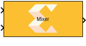
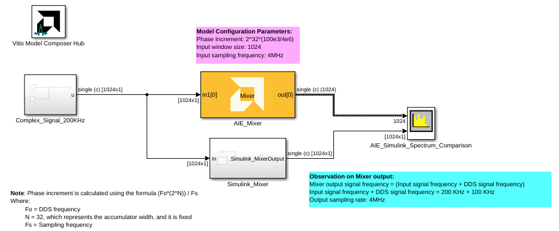
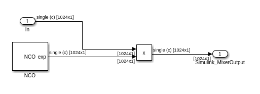
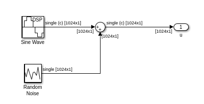
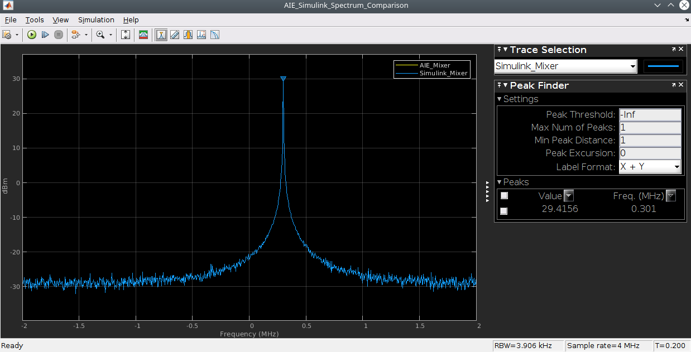

# Mixer

  
  

## Library

AI Engine/DSP/Window IO

## Description

This block implements the Mixer targeted for AI Engines.

## Parameters

#### Input/Output data type  
Describes the types of individual data samples input to and output from
the Mixer function. The supported data types are cint16, cint32, and
cfloat.

#### Input window size (Number of samples)  
Specifies the number of samples in the input window. The value must be
in the range 16 to 4096. Default value is 32.

#### Mixer mode  
This specifies the mixer operation modes. Two modes are supported by
Mixer function:

##### Single Input Mode
This is a DDS plus Mixer for a single data input port. Each data input
sample is complex multiplied with the corresponding DDS sample to create
a modulated signal that is written to the output window. This is the
default Mixer mode.

##### Dual Input Mode
This is a special configuration for symmetrical carriers and two data
input ports. Each data sample of the first input is complex multiplied
with the corresponding DDS sample to create a modulated signal. Each
data sample of the second data input is complex multiplied with the
conjugate (which is equivalent to a signal rotating in the opposite
direction) of the DDS sample to create a second modulated signal. These
two modulated signals are added together and written to the output
window.

#### Phase increment  
This specifies the phase increment between the samples. The value should
be in the range 0 to 2^31.

Phase increment is calculated using the formula (Fo\*(2^N ))/ Fs)

Where:
  - Fo = Output frequency
  - N = 32, which represents the accumulator width, and it is fixed
  - Fs = Sampling frequency

#### Number of cascade stages
This determines the number of kernels the Mixer will be divided over in series to improve throughput.

# Examples 
This example compares AI Engine Mixer block in Vitis Model Composer with the Simulink mixer block

 

**Simulink_Mixer Subsystem blocks:**

 

**Complex_Signal_200KHz Subsystem blocks:**

 

**AIE and Simulink Mixer output spectrum comparison:**

 
