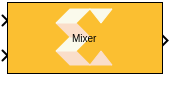
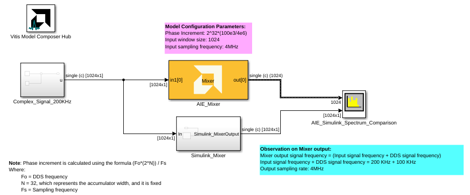

<!-- Library: aieDSP -->

# Mixer

  
  

## Library

AI Engine/DSP/Buffer IO

## Description

This block implements the Mixer targeted for AI Engines.

## Parameters

#### Input/Output data type  
Describes the types of individual data samples input to and output from
the Mixer function. The supported data types are cint16, cint32, and
cfloat.

#### Input window size (Number of samples)  
Specifies the number of samples in the input window. The value must be
in the range 16 to 4096. Default value is 32.

#### SSR
This parameter specifies the number of output ports. The number of AI Engine kernels used is equal to the value of SSR parameter.

#### Mixer mode  
This specifies the mixer operation modes. Two modes are supported by
the Mixer function:

* **Single Input Mode**: This is a DDS plus Mixer for a single data input port. Each data input
sample is complex multiplied with the corresponding DDS sample to create
a modulated signal that is written to the output window. This is the
default Mixer mode.

* **Dual Input Mode**: This is a special configuration for symmetrical carriers and two data
input ports. Each data sample of the first input is complex multiplied
with the corresponding DDS sample to create a modulated signal. Each
data sample of the second data input is complex multiplied with the
conjugate (which is equivalent to a signal rotating in the opposite
direction) of the DDS sample to create a second modulated signal. These
two modulated signals are added together and written to the output
window.

#### Initial Phase Offset
Specifies the initial value of the phase accumulator.

#### Reload initial phase via input port
Allows the initial phase to be reloaded during simulation via an input port. By default the reload port is a Real-Time Parameter (RTP) port that is non-blocking (async).

#### Use iobuffer port for phase offset reload
Reload the phase offset using an iobuffer port, instead of a Real-Time Parameter (RTP) port. The iobuffer port is a blocking (sync) port, whereas the RTP port is a non-blocking (async) port. 

#### Phase increment  
This specifies the phase increment between the samples. The value should
be in the range 0 to 2^31.

Phase increment is calculated using the formula `(Fo\*(2^N ))/ Fs)`.

Where:
  - Fo = Output frequency
  - N = 32, which represents the accumulator width, and it is fixed
  - Fs = Sampling frequency

#### Reload phase increment via input port
Allows the phase increment to be reloaded during simulation via an input port.

#### Rounding mode

Describes the selection of rounding to be applied during the shift down stage of processing.

The following modes are available:
* **Floor:** Truncate LSB, always round down (towards negative infinity).
* **Ceiling:** Always round up (towards positive infinity).
* **Round to positive infinity:** Round halfway towards positive infinity.
* **Round to negative infinity:** Round halfway towards negative infinity.
* **Round symmetrical to infinity:** Round halfway towards infinity (away from zero).
* **Round symmetrical to zero:** Round halfway towards zero (away from infinity).
* **Round convergent to even:** Round halfway towards nearest even number.
* **Round convergent to odd:** Round halfway towards nearest odd number.

No rounding is performed on the **Floor** or **Ceiling** modes. Other modes round to the nearest integer. They differ only in how they round for values that are exactly between two integers.

#### Saturation mode

Describes the selection of saturation to be applied during the shift down stage of processing.

The following modes are available:
* **None:** No saturation is performed and the value is truncated on the MSB side.
* **Asymmetric:** Rounds an n-bit signed value in the range `-2^(n-1)` to `2^(n-1)-1`.
* **Symmetric:** Rounds an n-bit signed value in the range `-2^(n-1)-1` to `2^(n-1)-1`.

## Examples

***Click on the images below to open each model.***

 

<!--
DESCRIPTION:
Model: Mixer_Ex1
Generated: 09-Jan-2026 13:47:30

Vitis Model Composer Configuration:
  Target Device: xcvc1902-vsva2197-1LP-e-S

Vitis Model Composer Blocks:
  - AIE: Mixer

Description:
This MATLAB script creates a Vitis Model Composer Simulink model that uses the AI Engine Mixer block. A 200kHz complex input signal is provided to the block, 

-->

<!--
MATLAB CREATION SCRIPT:

% create_Mixer_Ex1_model.m
% Auto-generated script to recreate the Mixer_Ex1 Simulink model
% Generated on: 09-Jan-2026 13:47:30

%% Model Configuration
modelName = 'Mixer_Ex1_recreated';

%% Create New Model
if bdIsLoaded(modelName)
    close_system(modelName, 0);
end

new_system(modelName);
open_system(modelName);
fprintf('Created new model: %s\n', modelName);

%% Add Vitis Model Composer Hub Block
hubBlockPath = [modelName '/Vitis Model Composer Hub'];
add_block('vmcUtilities/Vitis Model Composer Hub', hubBlockPath, ...
    'Position', [82 18 137 71]);

hubBlk = xmcFindHubBlock(modelName);
vmchub_set_param(hubBlk, modelName, 'SelectHardware', 'xcvc1902-vsva2197-1LP-e-S');

%% Add Top-Level Blocks
add_block('aieDSP/Mixer', [modelName '/AIE_Mixer'], ...
    'Position', [460 117 615 193]);
set_param([modelName '/AIE_Mixer'], ...
    'data_type', 'cfloat', ...
    'input_window_size', '1024', ...
    'ssr', '1', ...
    'rnd_mode', 'Round to positive infinity', ...
    'sat_mode', '0-None', ...
    'mixer_mode', 'Single Input Mode', ...
    'initialPhaseOffset', '0', ...
    'USE_PHASE_RELOAD', 'off', ...
    'PHASE_RELOAD_API', 'off', ...
    'phase_increment', '1.0737e+08', ...
    'phase_increment_reload', 'off', ...
    'TP_API', '0');
add_block('built-in/SpectrumAnalyzer', [modelName '/AIE_Simulink_Spectrum_Comparison'], ...
    'Position', [800 176 845 229]);
set_param([modelName '/AIE_Simulink_Spectrum_Comparison'], ...
    'NumInputPorts', '2', ...
    'OpenAtSimulationStart', 'on', ...
    'WindowPosition', '[878 430 800 500]', ...
    'InputDomain', 'Time', ...
    'SpectrumType', 'Power', ...
    'ViewType', 'Spectrum', ...
    'Method', 'Filter bank', ...
    'SampleRateSource', 'Inherited', ...
    'SampleRate', '10000', ...
    'PlotAsTwoSidedSpectrum', 'on', ...
    'FrequencyScale', 'Linear', ...
    'PlotType', 'Line', ...
    'AxesScaling', 'Auto', ...
    'AxesScalingNumUpdates', '100', ...
    'FrequencyResolutionMethod', 'RBW', ...
    'RBWSource', 'Auto', ...
    'RBW', '9.76', ...
    'WindowInvariantSamplesPerUpdate', 'off', ...
    'WindowLength', '1024', ...
    'FFTLengthSource', 'Auto', ...
    'FFTLength', '1024', ...
    'FilterSharpness', '0.3', ...
    'FrequencySpan', 'Full', ...
    'Span', '10000', ...
    'CenterFrequency', '0', ...
    'StartFrequency', '-5000', ...
    'StopFrequency', '5000', ...
    'InputUnits', 'dBm', ...
    'FrequencyVectorSource', 'Auto', ...
    'FrequencyVector', '[-5000,5000]', ...
    'Window', 'Hann', ...
    'CustomWindow', 'hann', ...
    'SidelobeAttenuation', '60', ...
    'OverlapPercent', '0', ...
    'AveragingMethod', 'Exponential', ...
    'SpectralAverages', '1', ...
    'ForgettingFactor', '0.9', ...
    'VBWSource', 'Auto', ...
    'VBW', '9.76', ...
    'SpectrumUnits', 'dBm', ...
    'FullScaleSource', 'Auto', ...
    'FullScale', '1', ...
    'ReferenceLoad', '1', ...
    'FrequencyOffset', '0', ...
    'SpectrogramChannel', '1', ...
    'TimeResolutionSource', 'Auto', ...
    'TimeResolution', '1e-3', ...
    'TimeSpanSource', 'Auto', ...
    'TimeSpan', '0.1', ...
    'MaximizeAxes', 'Auto', ...
    'PlotNormalTrace', 'on', ...
    'PlotMaxHoldTrace', 'off', ...
    'PlotMinHoldTrace', 'off', ...
    'YLimits', '[-80,20]', ...
    'ColorLimits', '[-80,20]', ...
    'Colormap', 'jet', ...
    'ShowGrid', 'on', ...
    'ShowLegend', 'on', ...
    'ShowColorbar', 'on', ...
    'ChannelNames', '[""]', ...
    'AxesLayout', 'Vertical');
add_block('vmcUtilities/Vitis Model Composer Hub', [modelName '/Vitis Model Composer Hub'], ...
    'Position', [82 18 137 71]);
set_param([modelName '/Vitis Model Composer Hub'], ...
    'CodeGeneration', 'off', ...
    'StartColumn', '1', ...
    'NumberOfColumns', '1', ...
    'TargetDirectory', './code', ...
    'exportDesign', 'off', ...
    'analyzeDesign', 'off', ...
    'validateDesignOnHw', 'off', ...
    'ExportType', 'AI Engines', ...
    'IpVendor', 'xilinx.com', ...
    'IpLibrary', 'hls', ...
    'IpVersion', '1.0', ...
    'IpHWLanguage', 'Verilog', ...
    'AieCompilerOptions', '{}', ...
    'CreateTestbench', 'off', ...
    'TestbenchStackSize', '10', ...
    'RunRtlSim', 'off', ...
    'RunCSim', 'off', ...
    'RunAieSim', 'off', ...
    'AieSimTimeout', '50000', ...
    'RunAieSimProfiling', 'off', ...
    'LaunchVitisAnalyzer', 'off', ...
    'PlotOutput', 'off', ...
    'GenHwImage', 'off', ...
    'GenLibadfXo', 'off', ...
    'GenHwValidationCode', 'off', ...
    'PlatformType', 'Not Specified', ...
    'HwSystemType', 'Baremetal', ...
    'HwValidationTarget', 'hw', ...
    'ProjDevice', 'xcvc1902-vsva2197-1LP-e-S', ...
    'SamplePeriod', '-1', ...
    'ClockFrequency', '200', ...
    'DataPathParallelism', '1', ...
    'xilinxfamily', 'versalaicore', ...
    'part', 'xcvc1902', ...
    'speed', '-1LP-e-S', ...
    'package', 'vsva2197', ...
    'directory', './netlist', ...
    'testbench', 'off', ...
    'incr_netlist', 'off', ...
    'synthesis_tool', 'Vivado', ...
    'clock_wrapper', 'Clock Enables', ...
    'dbl_ovrd', 'According to Block Masks', ...
    'dcm_input_clock_period', '10', ...
    'sysclk_period', '10', ...
    'simulink_period', '1', ...
    'eval_field', '0', ...
    'LogFileName', '''''', ...
    'NThreads', '4');

%% Create Complex_Signal_200KHz Subsystem
add_block('built-in/SubSystem', [modelName '/Complex_Signal_200KHz'], ...
    'Position', [225 122 310 188]);

% Remove default blocks
defaultBlocks = find_system([modelName '/Complex_Signal_200KHz'], 'SearchDepth', 1, 'Type', 'block');
for i = 1:length(defaultBlocks)
    if ~strcmp(defaultBlocks{i}, [modelName '/Complex_Signal_200KHz'])
        delete_block(defaultBlocks{i});
    end
end

add_block('dspobslib/Random Source', [[modelName '/Complex_Signal_200KHz'] '/Random Noise'], ...
    'Position', [-185 121 -150 159]);
set_param([[modelName '/Complex_Signal_200KHz'] '/Random Noise'], ...
    'SrcType', 'Gaussian', ...
    'NormMethod', 'Ziggurat', ...
    'CltLength', '12', ...
    'MinVal', '0', ...
    'MaxVal', '1', ...
    'MeanVal', '0', ...
    'VarVal', '1e-3', ...
    'RepMode', 'Not repeatable', ...
    'rawSeed', '1', ...
    'IsInherit', 'off', ...
    'SampMode', 'Discrete', ...
    'SampTime', '1/4e6', ...
    'SampFrame', '1024', ...
    'DataType', 'Single', ...
    'OutComplex', 'Real', ...
    'OutputFrames', 'off');
add_block('dspsrcs4/Sine Wave', [[modelName '/Complex_Signal_200KHz'] '/Sine Wave'], ...
    'Position', [-190 23 -145 67]);
set_param([[modelName '/Complex_Signal_200KHz'] '/Sine Wave'], ...
    'Amplitude', '1', ...
    'Frequency', '200e3', ...
    'Phase', '0', ...
    'SampleMode', 'Discrete', ...
    'OutComplex', 'Complex', ...
    'CompMethod', 'Trigonometric fcn', ...
    'TableSize', 'Speed', ...
    'SampleTime', '1/4e6', ...
    'SamplesPerFrame', '1024', ...
    'ResetState', 'Restart at time zero', ...
    'OutputFrames', 'off', ...
    'additionalParams', 'off', ...
    'allowOverrides', 'on', ...
    'dataType', 'single', ...
    'wordLen', '16', ...
    'udDataType', 'sfix(16)', ...
    'fracBitsMode', 'Best precision', ...
    'numFracBits', '15', ...
    'OutDataTypeStr', 'single', ...
    'LastOutDataTypeStr', 'single');
add_block('built-in/Sum', [[modelName '/Complex_Signal_200KHz'] '/Sum'], ...
    'Position', [-40 35 -20 55]);
set_param([[modelName '/Complex_Signal_200KHz'] '/Sum'], ...
    'IconShape', 'round', ...
    'Inputs', '|++', ...
    'CollapseMode', 'All dimensions', ...
    'CollapseDim', '1', ...
    'OutMin', '[]', ...
    'OutMax', '[]', ...
    'OutDataTypeStr', 'Inherit: Inherit via internal rule', ...
    'AccumDataTypeStr', 'Inherit: Inherit via internal rule', ...
    'InputSameDT', 'off', ...
    'LockScale', 'off', ...
    'RndMeth', 'Floor', ...
    'SaturateOnIntegerOverflow', 'off', ...
    'SampleTime', '-1');
add_block('built-in/Outport', [[modelName '/Complex_Signal_200KHz'] '/u'], ...
    'Position', [120 38 150 52]);
set_param([[modelName '/Complex_Signal_200KHz'] '/u'], ...
    'Port', '1', ...
    'StorageClass', 'Auto', ...
    'IconDisplay', 'Port number', ...
    'OutputFunctionCall', 'off', ...
    'OutMin', '[]', ...
    'OutMax', '[]', ...
    'OutDataTypeStr', 'Inherit: auto', ...
    'LockScale', 'off', ...
    'BusOutputAsStruct', 'off', ...
    'BusVirtuality', 'inherit', ...
    'DataMode', 'inherit', ...
    'Unit', 'inherit', ...
    'PortDimensions', '-1', ...
    'VarSizeSig', 'Inherit', ...
    'SampleTime', '-1', ...
    'SignalType', 'auto', ...
    'EnsureOutportIsVirtual', 'off', ...
    'OutputWhenDisabled', 'held', ...
    'InitialOutput', '[]', ...
    'MustResolveToSignalObject', 'off', ...
    'OutputWhenUnConnected', 'off', ...
    'OutputWhenUnconnectedValue', '0', ...
    'VectorParamsAs1DForOutWhenUnconnected', 'on');

% Connect blocks in Complex_Signal_200KHz
add_line([modelName '/Complex_Signal_200KHz'], 'Random Noise/2', 'Sum/3', 'autorouting', 'on');
add_line([modelName '/Complex_Signal_200KHz'], 'Sum/2', 'u/2', 'autorouting', 'on');
add_line([modelName '/Complex_Signal_200KHz'], 'Sine Wave/2', 'Sum/2', 'autorouting', 'on');

%% Create Simulink_Mixer Subsystem
add_block('built-in/SubSystem', [modelName '/Simulink_Mixer'], ...
    'Position', [475 227 600 293]);

% Remove default blocks
defaultBlocks = find_system([modelName '/Simulink_Mixer'], 'SearchDepth', 1, 'Type', 'block');
for i = 1:length(defaultBlocks)
    if ~strcmp(defaultBlocks{i}, [modelName '/Simulink_Mixer'])
        delete_block(defaultBlocks{i});
    end
end

add_block('built-in/Inport', [[modelName '/Simulink_Mixer'] '/In'], ...
    'Position', [40 43 70 57]);
set_param([[modelName '/Simulink_Mixer'] '/In'], ...
    'Port', '1', ...
    'IconDisplay', 'Port number', ...
    'OutputFunctionCall', 'off', ...
    'OutMin', '[]', ...
    'OutMax', '[]', ...
    'OutDataTypeStr', 'Inherit: auto', ...
    'LockScale', 'off', ...
    'BusOutputAsStruct', 'off', ...
    'BusVirtuality', 'inherit', ...
    'Unit', 'inherit', ...
    'PortDimensions', '-1', ...
    'VarSizeSig', 'Inherit', ...
    'SampleTime', '-1', ...
    'SignalType', 'auto', ...
    'LatchByDelayingOutsideSignal', 'off', ...
    'LatchInputForFeedbackSignals', 'off', ...
    'Interpolate', 'on', ...
    'DataMode', 'inherit', ...
    'MessageQueueUseDefaultAttributes', 'on', ...
    'MessageQueueCapacity', '1', ...
    'MessageQueueType', 'LIFO', ...
    'MessageQueueOverwriting', 'on');
add_block('dspsigops/NCO', [[modelName '/Simulink_Mixer'] '/NCO'], ...
    'Position', [20 92 90 148]);
set_param([[modelName '/Simulink_Mixer'] '/NCO'], ...
    'AccIncSrc', 'Specify via dialog', ...
    'AccInc', '1.0737e+08', ...
    'PhaseOffsetSrc', 'Specify via dialog', ...
    'PhaseOffset', '0', ...
    'AccumWL', '32', ...
    'HasDither', 'off', ...
    'DitherWL', '4', ...
    'PNgeneratorLength', '19', ...
    'HasPhaseQuantizer', 'on', ...
    'TableDepth', '16', ...
    'HasOutputPhaseError', 'off', ...
    'Formula', 'Complex exponential', ...
    'DataType', 'single', ...
    'OutputWL', '16', ...
    'OutputFL', '14', ...
    'CompMethod', 'Table lookup (no interpolation)', ...
    'SampleTime', '1/4e6', ...
    'SamplesPerFrame', '1024', ...
    'OutputFrames', 'off');
add_block('built-in/Product', [[modelName '/Simulink_Mixer'] '/Product'], ...
    'Position', [265 97 295 128]);
set_param([[modelName '/Simulink_Mixer'] '/Product'], ...
    'Inputs', '2', ...
    'Multiplication', 'Element-wise(.*)', ...
    'CollapseMode', 'All dimensions', ...
    'CollapseDim', '1', ...
    'InputSameDT', 'off', ...
    'OutMin', '[]', ...
    'OutMax', '[]', ...
    'OutDataTypeStr', 'Inherit: Inherit via internal rule', ...
    'LockScale', 'off', ...
    'RndMeth', 'Floor', ...
    'SaturateOnIntegerOverflow', 'off', ...
    'SampleTime', '-1');
add_block('built-in/Outport', [[modelName '/Simulink_Mixer'] '/Simulink_MixerOutput'], ...
    'Position', [405 108 435 122]);
set_param([[modelName '/Simulink_Mixer'] '/Simulink_MixerOutput'], ...
    'Port', '1', ...
    'StorageClass', 'Auto', ...
    'IconDisplay', 'Port number', ...
    'OutputFunctionCall', 'off', ...
    'OutMin', '[]', ...
    'OutMax', '[]', ...
    'OutDataTypeStr', 'Inherit: auto', ...
    'LockScale', 'off', ...
    'BusOutputAsStruct', 'off', ...
    'BusVirtuality', 'inherit', ...
    'DataMode', 'inherit', ...
    'Unit', 'inherit', ...
    'PortDimensions', '-1', ...
    'VarSizeSig', 'Inherit', ...
    'SampleTime', '-1', ...
    'SignalType', 'auto', ...
    'EnsureOutportIsVirtual', 'off', ...
    'OutputWhenDisabled', 'held', ...
    'InitialOutput', '[]', ...
    'MustResolveToSignalObject', 'off', ...
    'OutputWhenUnConnected', 'off', ...
    'OutputWhenUnconnectedValue', '0', ...
    'VectorParamsAs1DForOutWhenUnconnected', 'on');

% Connect blocks in Simulink_Mixer
add_line([modelName '/Simulink_Mixer'], 'Product/2', 'Simulink_MixerOutput/2', 'autorouting', 'on');
add_line([modelName '/Simulink_Mixer'], 'In/2', 'Product/2', 'autorouting', 'on');
add_line([modelName '/Simulink_Mixer'], 'NCO/2', 'Product/3', 'autorouting', 'on');

%% Connect Top-Level Blocks
add_line(modelName, 'Simulink_Mixer/2', 'AIE_Simulink_Spectrum_Comparison/3', 'autorouting', 'on');
add_line(modelName, 'AIE_Mixer/2', 'AIE_Simulink_Spectrum_Comparison/2', 'autorouting', 'on');
add_line(modelName, 'Complex_Signal_200KHz/2', 'Simulink_Mixer/2', 'autorouting', 'on');
add_line(modelName, 'Complex_Signal_200KHz/2', 'AIE_Mixer/2', 'autorouting', 'on');
add_line(modelName, 'Complex_Signal_200KHz/2', 'AIE_Mixer/2', 'autorouting', 'on');

%% Save Model
save_system(modelName);
fprintf('\nModel saved: %s.slx\n', modelName);
-->

## References
This block uses the Vitis DSP library implementation of Mixer. For more details on this implementation please click [here](https://docs.amd.com/r/en-US/Vitis_Libraries/dsp/user_guide/L2/func-dds_mixer_intrinsic.html).

--------------
Copyright (C) 2025 Advanced Micro Devices, Inc.
All rights reserved.

SPDX-License-Identifier: MIT
