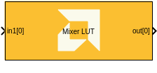
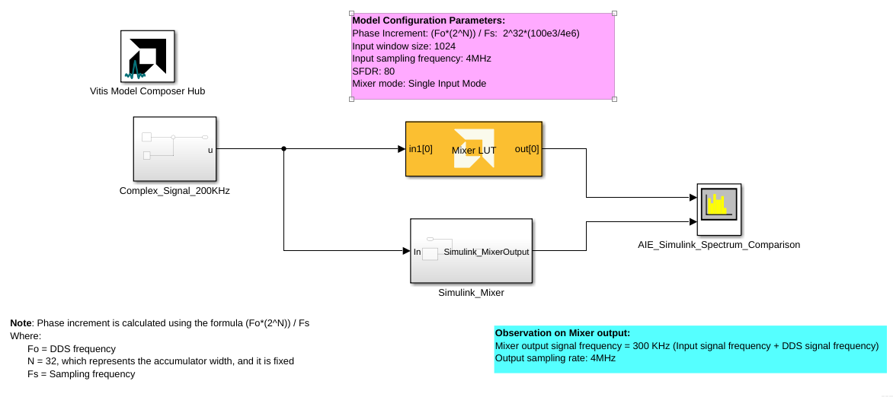
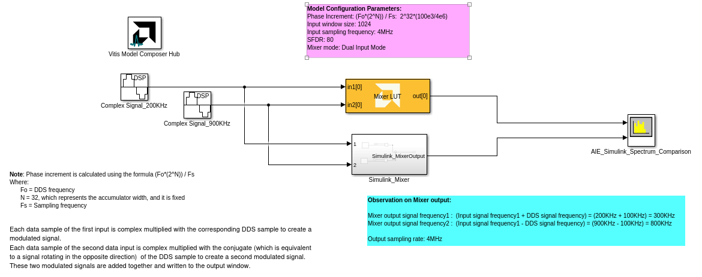
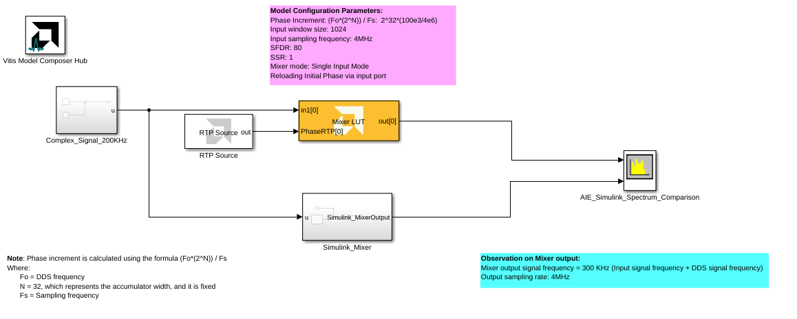

# Mixer LUT
  
  

## Library

AI Engine/DSP/Buffer IO

## Description

This block implements the Mixer targeted for AI Engines.

## Parameters

#### Output data type  
Describes the types of individual data samples input to and output from
the Mixer function. The supported data types are cint16, cint32, and
cfloat.

#### Mixer mode  
This specifies the mixer operation modes. Two modes are supported by
the Mixer function:

* **Single Input Mode**: This is a DDS plus Mixer for a single data input port. Each data input
sample is complex multiplied with the corresponding DDS sample to create
a modulated signal that is written to the output window. This is the
default Mixer mode.

* **Dual Input Mode**: This is a special configuration for symmetrical carriers and two data
input ports. Each data sample of the first input is complex multiplied
with the corresponding DDS sample to create a modulated signal. Each
data sample of the second data input is complex multiplied with the
conjugate (which is equivalent to a signal rotating in the opposite
direction) of the DDS sample to create a second modulated signal. These
two modulated signals are added together and written to the output
window.

#### SFDR
Specifies the Spurious Free Dynamic Range (in dB) of the output signal. The maximum theoretical SFDR is 96 dB for `cint16`, 180 dB for `cint32`, and 138 dB for `cfloat`.

#### Number of Parallel Outputs (SSR)

This parameter specifies the number of output ports. The number of AI Engine kernels used is equal to the value of SSR parameter.

#### Input frame size (Number of samples)  
Specifies the number of samples in the output frame. This must be a multiple of the number of samples output in each data loop, which varies based on the AIE architecture and data type:

|        | AIE | AIE-ML |
| ------ | --- | ------ |
| `cint16` | 64  | 256    |
| `cint32` | 16  | 64     |
| `cfloat` | 4   | N/A    |

#### Reload initial phase via input port
Allows the intial phase to be reloaded during simulation via an input port.

#### Phase increment  
This specifies the phase increment between the samples. The value should
be in the range 0 to 2^31.

Phase increment is calculated using the formula `(Fo*(2^N ))/ Fs)`.

Where:
  - Fo = Output frequency
  - N = 32, which represents the accumulator width, and it is fixed
  - Fs = Sampling frequency

#### Initial phase offset
Specifies the initial value of the phase accumulator.

#### Rounding mode
Describes the selection of rounding to be applied during the shift down stage of processing.

The following modes are available:
* **Floor:** Truncate LSB, always round down (towards negative infinity).
* **Ceiling:** Always round up (towards positive infinity).
* **Round to positive infinity:** Round halfway towards positive infinity.
* **Round to negative infinity:** Round halfway towards negative infinity.
* **Round symmetrical to infinity:** Round halfway towards infinity (away from zero).
* **Round symmetrical to zero:** Round halfway towards zero (away from infinity).
* **Round convergent to even:** Round halfway towards nearest even number.
* **Round convergent to odd:** Round halfway towards nearest odd number.

No rounding is performed on the **Floor** or **Ceiling** modes. Other modes round to the nearest integer. They differ only in how they round for values that are exactly between two integers.

#### Saturation mode
Describes the selection of saturation to be applied during the shift down stage of processing.

The following modes are available:
* **None:** No saturation is performed and the value is truncated on the MSB side.
* **Asymmetric:** Rounds an n-bit signed value in the range `-2^(n-1)` to `2^(n-1)-1`.
* **Symmetric:** Rounds an n-bit signed value in the range `-2^(n-1)-1` to `2^(n-1)-1`.

## Examples

***Click on the images below to open each model.***

## Related blocks
[Mixer](../Mixer/README.md)

## References
This block uses the Vitis DSP library implementation of Mixer. For more details on this implementation please click [here](https://docs.xilinx.com/r/en-US/Vitis_Libraries/dsp/user_guide/L2/func-dds.html).

--------------
Copyright (C) 2024 Advanced Micro Devices, Inc.
All rights reserved.

SPDX-License-Identifier: MIT
