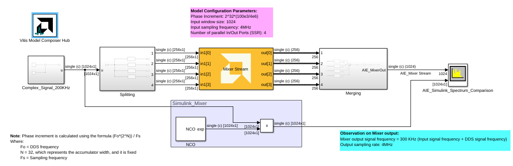
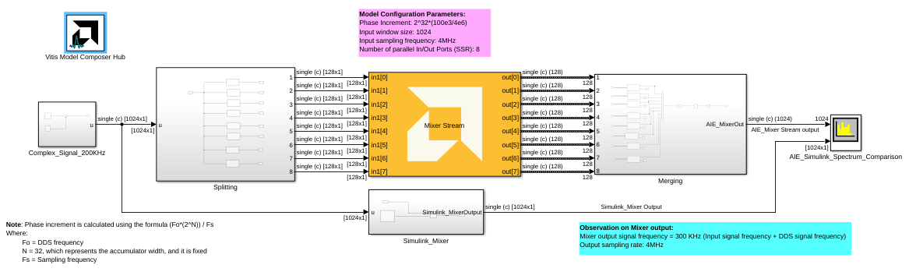

# Mixer Stream

  
  

## Library

AI Engine/DSP/Stream IO

## Description

This block implements the stream-based Mixer targeted for AI Engines.

## Parameters

### Main  
#### Input/Output Data Type
Describes the type of individual data samples output of the DDS
  function. It should be cint16, cint32, or cfloat.

#### Input Frame Size (Number of Samples)
Specifies the number of samples in the input frame. The value must be
  in the range 8 to 1024 and the default value is 32.

#### Mixer mode  
This specifies the mixer operation modes. Two modes are supported by
the Mixer function:

* **Single Input Mode**: This is a DDS plus Mixer for a single data input port. Each data input
sample is complex multiplied with the corresponding DDS sample to create
a modulated signal that is written to the output window. This is the
default Mixer mode.

* **Dual Input Mode**: This is a special configuration for symmetrical carriers and two data
input ports. Each data sample of the first input is complex multiplied
with the corresponding DDS sample to create a modulated signal. Each
data sample of the second data input is complex multiplied with the
conjugate (which is equivalent to a signal rotating in the opposite
direction) of the DDS sample to create a second modulated signal. These
two modulated signals are added together and written to the output
window.

#### Number of parallel input/output (SSR):
This parameter specifies the number of input (and output) ports of the Mixer block.
The number of AI Engine kernels used is equal to the value of SSR parameter.

#### Rounding mode

Describes the selection of rounding to be applied during the shift down stage of processing.

The following modes are available:
* **Floor:** Truncate LSB, always round down (towards negative infinity).
* **Ceiling:** Always round up (towards positive infinity).
* **Round to positive infinity:** Round halfway towards positive infinity.
* **Round to negative infinity:** Round halfway towards negative infinity.
* **Round symmetrical to infinity:** Round halfway towards infinity (away from zero).
* **Round symmetrical to zero:** Round halfway towards zero (away from infinity).
* **Round convergent to even:** Round halfway towards nearest even number.
* **Round convergent to odd:** Round halfway towards nearest odd number.

No rounding is performed on the **Floor** or **Ceiling** modes. Other modes round to the nearest integer. They differ only in how they round for values that are exactly between two integers.

#### Saturation mode

Describes the selection of saturation to be applied during the shift down stage of processing.

The following modes are available:
* **None:** No saturation is performed and the value is truncated on the MSB side.
* **Asymmetric:** Rounds an n-bit signed value in the range `-2^(n-1)` to `2^(n-1)-1`.
* **Symmetric:** Rounds an n-bit signed value in the range `-2^(n-1)-1` to `2^(n-1)-1`.

#### Phase Increment
Specifies the phase increment between samples. The value must be in
  the range 0 to 2^31 and the default value is 0. Input value
  2^31 corresponds to Pi (i.e., 180). Phase increment is calculated
  using the formula (Fo\*(2^N)) / Fs where:
  - Fo = Output frequency.
  - N = 32, which represents the accumulator width, and it is fixed.
  - Fs = Sampling frequency.

#### Reload initial phase via input port
Allows the intial phase to be reloaded during simulation via an input port.

#### Initial Phase Offset
Specifies the initial phase offset. The default value is 0.

## Examples

***Click on the images below to open each model.***

 

 
