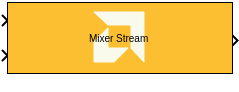

# Mixer Stream

  
  

## Library

AI Engine/DSP/Stream IO

## Description

This block implements the stream-based Mixer targeted for AI Engines.

## Parameters

### Main  
#### Input/Output Data Type
Describes the type of individual data samples output of the DDS
  function. It should be cint16, cint32, or cfloat.

#### Input Frame Size (Number of Samples)
Specifies the number of samples in the input frame. The value must be
  in the range 8 to 1024 and the default value is 32.

#### Mixer Mode
This specifies the mixer operation modes. Two modes are supported by
  Mixer function
##### Single Input Mode
  This is a DDS plus Mixer for a single data input port. Each data input
  sample is complex multiplied with the corresponding DDS sample to
  create a modulated signal that is written to the output window. This
  is the default Mixer mode.

##### Dual Input Mode
  This is a special configuration for symmetrical carriers and two data
  input ports. Each data sample of the first input is complex multiplied
  with the corresponding DDS sample to create a modulated signal. Each
  data sample of the second data input is complex multiplied with the
  conjugate (which is equivalent to a signal rotating in the opposite
  direction) of the DDS sample to create a second modulated signal.
  These two modulated signals are added together and written to the
  output window.

#### Number of parallel input/output (SSR):
This parameter specifies the number of input (or output) ports and
  must be of the form 2^N, where N is a non-negative integer.

#### Phase Increment
Specifies the phase increment between samples. The value must be in
  the range 0 to 2^31 and the default value is 0. Input value
  2^31 corresponds to Pi (i.e., 180). Phase increment is calculated
  using the formula (Fo\*(2^N)) / Fs where:
  - Fo = Output frequency.
  - N = 32, which represents the accumulator width, and it is fixed.
  - Fs = Sampling frequency.

#### Initial Phase Offset
Specifies the initial phase offset. The default value is 0.

### Advanced  
#### Target Output Throughput (MSPS)

Specifies the output sampling rate of the Mixer function in Mega
  Samples per Second (MSPS). The value must be in the range 1 to
  1000 and the default value is 200.
