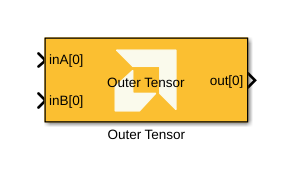
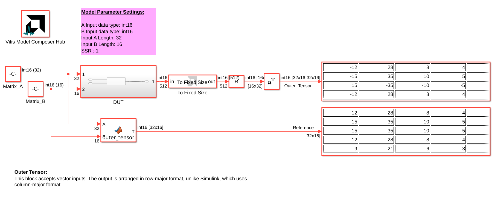
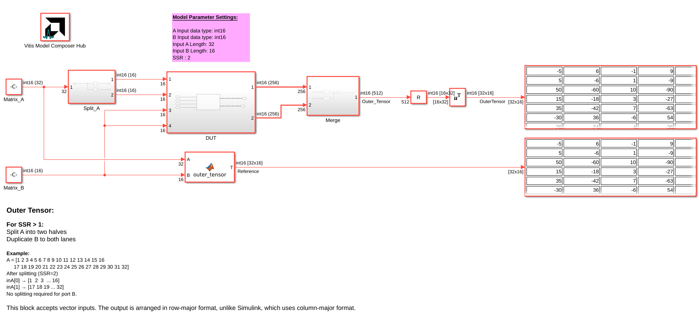

# Outer Tensor

Implements the Outer Tensor product targeted for AI Engines.

## Library

AI Engine/DSP/Buffer IO

## Description

This block accepts vector inputs and computes the outer tensor product. The output is arranged in row-major format, unlike Simulink, which uses column-major format.

## Parameters

### Main

#### A input data type
Specifies the data type for the A input port. Supported types include `int16`, `int32`, `cint16`, `cint32`, `float`, and `cfloat`.

#### B input data type
Specifies the data type for the B input port. Supported types include `int16`, `int32`, `cint16`, `cint32`, `float`, and `cfloat`.

#### A input length
Specifies the length of input vector A.

#### B input length
Specifies the length of input vector B.

#### Number of frames
Specifies the number of frames (sets of input matrices) processed per window.

#### Scale output down by 2^
Describes the power of 2 by which the output is scaled down (right-shifted) before output. For `float` and `cfloat` data types, this parameter must be zero.

#### SSR (Super Sample Rate)
Specifies the number of parallel data paths processed by the block. Increasing SSR allows for higher throughput by processing multiple samples in parallel.

**Splitting for SSR > 1:**

For SSR > 1, input A is split into equal-length segments across the SSR input ports. Input B is duplicated to all SSR lanes (no splitting required for B). The output is arranged in row-major format.

**Example (SSR = 2):**

A = [1 2 3 4 5 6 7 8 9 10 11 12 13 14 15 16 17 18 19 20 21 22 23 24 25 26 27 28 29 30 31 32]

After splitting (SSR=2):
 - inA[0] → [1 2 3 ... 16]
 - inA[1] → [17 18 19 ... 32]
Input B is not split; both SSR lanes receive the full B vector.

**Note:**

This block accepts vector inputs. The output is always arranged in row-major format, unlike Simulink, which uses column-major format.

#### Rounding mode
Describes the selection of rounding to be applied during the shift down stage of processing.

The following modes are available:
* **Floor:** Truncate LSB, always round down (towards negative infinity).
* **Ceiling:** Always round up (towards positive infinity).
* **Round to positive infinity:** Round halfway towards positive infinity.
* **Round to negative infinity:** Round halfway towards negative infinity.
* **Round symmetrical to infinity:** Round halfway towards infinity (away from zero).
* **Round symmetrical to zero:** Round halfway towards zero (away from infinity).
* **Round convergent to even:** Round halfway towards nearest even number.
* **Round convergent to odd:** Round halfway towards nearest odd number.

No rounding is performed on the **Floor** or **Ceiling** modes. Other modes round to the nearest integer. They differ only in how they round for values that are exactly between two integers.

#### Saturation mode
Describes the selection of saturation to be applied during the shift down stage of processing.

The following modes are available:
* **None:** No saturation is performed and the value is truncated on the MSB side.
* **Asymmetric:** Rounds an n-bit signed value in the range `-2^(n-1)` to `2^(n-1)-1`.
* **Symmetric:** Rounds an n-bit signed value in the range `-2^(n-1)-1` to `2^(n-1)-1`.

### Constraints
Click on the button given here to access the constraint manager and add or update constraints for each kernel. You can use the constraint manager to optimize the performance of your design by setting specific constraints for each kernel (in this case, you need to first run your design). Adding constraints will not affect the functional simulation in Simulink. Constraints will only affect the generated graph code, cycle approximate AIE simulation (System C), and behavior in hardware.

If you are using non-default constraints for any of the kernels for the block, an asterisk (*) will be displayed next to the button.

## Examples

***Click on the images below to open each model.***

--------------
Copyright (C) 2026 Advanced Micro Devices, Inc.
All rights reserved.

SPDX-License-Identifier: MIT
