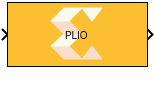

# PLIO
This block allows you to specify the Platform IO (PLIO) width.

  

## Library
AI Engine/Interfaces

## Description

This block allows you to specify the Platform IO (PLIO) width.
Specifying the PLIO width at the boundary of the AI Engine subsystem can
affect the throughput of data between the AI Engine domain and the
programmable logic (PL) domain. For example, assume your PL domain is
running at 500 MHz and your AI Engine is running at 1GHz and the datatype of
the input signal to the AI Engine kernel that is directly connecting to
PL is of type `int32`. For maximum throughput, you should set the PLIO
width to 64 and the PL design should create a 64-bit wide data. This way
for every 64-bit sample generated in the PL domain at 500 MHz, the AI
Engine kernel will receive two 32-bit wide samples at 1 GHz.

Note that this block does not affect the result of functional simulation in Simulink. However, it will affect the generated Graph code.

## Parameters
#### PLIO width (bits) 
* Specifies PLIO width in bits. This can be only 32, 64, or 128 as these are the only acceptable bit-widths between PL and AI Engine array. 

#### Specify PLIO frequency
* This is necessary to get accurate thorughput results from the Cycle Approximate AI Engine Simulator (SystemC) which you can trigger from the Vitis Model Composer Hub block, but it does not affect the design in hardware. The default frequency is a quarter of the AI Engine frequency and the maximum supported frequency is half of the AI Engine frequency.

  Note that you can also use the "--pl-freq=_value_" AI Engine Compiler option in the Vitis Model Composer Hub block to specify the interface frequency (in MHz) for all PLIOs in the design. The individual PLIO frequency settings will take precedence over the pl-freq value.

## Constraints
You can specify location constraints for PLIO blocks. This will be reflected in the generated Graph code.

