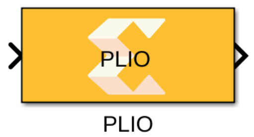

# PLIO

  
  

## Library

AI Engine/Interfaces

## Description

This block allows you to specify the Platform IO (PLIO) width.
Specifying the PLIO width at the boundary of the AI Engine subsystem can
affect the throughput of data between the AI Engine domain and the
programmable logic (PL) domain. For example, assume your PL domain is
running at 500 MHz and your AI Engine is running at 1GHz and datatype of
the input signal to the AI Engine kernel that is directly connecting to
PL is of type `int32`. For maximum throughput, you should set the PLIO
width to 64 and the PL design should create a 64-bit wide data. This way
for every 64-bit sample generated in the PL domain at 500 MHz, the AI
Engine kernel will receive two 32-bit wide samples at 1 GHz.

## Parameters

FIFO Depth (32-bit words)  
Should be a non-negative integer value and the default value is '0'.
