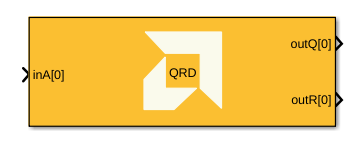
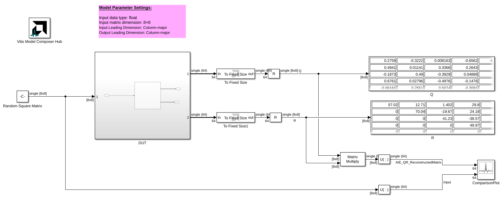
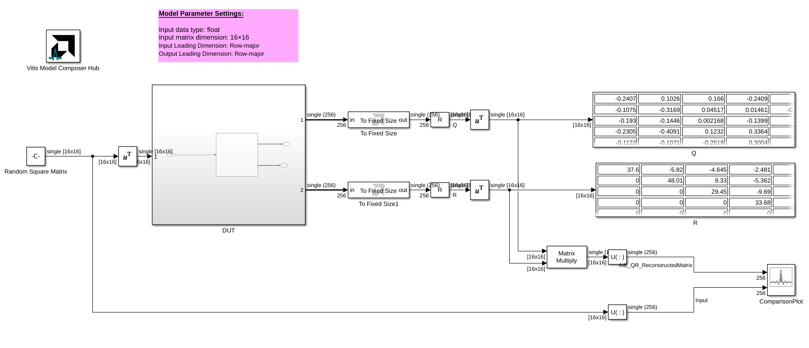
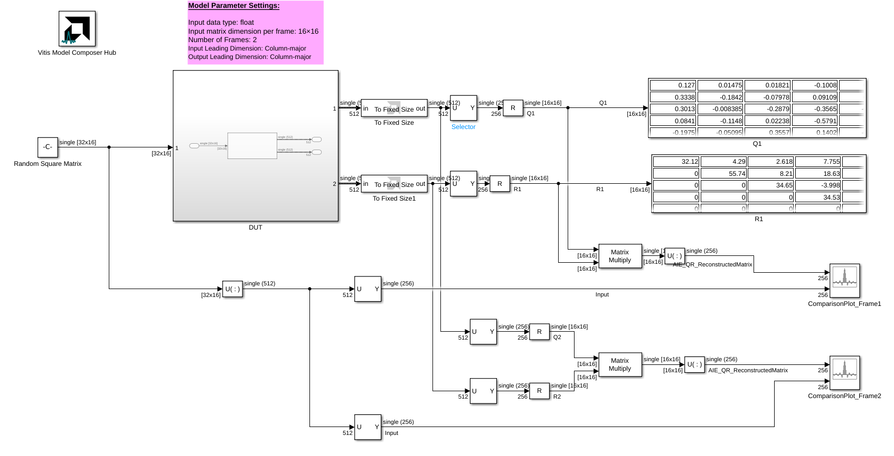

# QRD (QR Decomposition)

Implements QR decomposition targeted for AI Engines using the Modified Gram-Schmidt method.

## Library

AI Engine/Solver/Buffer IO

## Description

This block computes the QR decomposition of an input matrix `A`, producing an orthogonal matrix `Q` and an upper triangular matrix `R` such that `A = Q × R`. It uses the Modified Gram-Schmidt method. This implementation is supported on AIE, AIE-ML, and AIE-ML v2 devices. 

Input and output matrices are 2D signals. Use the matrix dimensions and leading-dimension settings to describe the input and output layouts. For matrix layout assumptions and supported parameter ranges, see *AI Engine Solver Blocks* in the Vitis Model Composer User Guide (UG1483).

## Parameters

### Main

#### Input data type
Specifies the data type of the input matrix elements.

#### Rows of matrix
Specifies the number of rows in the input matrix `A`.

#### Columns of matrix
Specifies the number of columns in the input matrix `A`.

#### Number of frames
Specifies the number of input matrices to decompose per kernel call.

#### Number of cascade stages
Specifies the number of kernels used to divide and cascade the computation.

#### A input leading dimension
Specifies the memory layout of input matrix `A`: **Column-major (0)** or **Row-major (1)**.

#### Q output leading dimension
Specifies the memory layout of output matrix `Q`: **Column-major (0)** or **Row-major (1)**.

#### R output leading dimension
Specifies the memory layout of output matrix `R`: **Column-major (0)** or **Row-major (1)**.

### Constraints
Use the constraint manager to set per-kernel constraints. When **Number of cascade stages** is greater than one, constraints can be set for each kernel; run the design before configuring them. Constraints affect generated graph code, cycle-approximate AIE simulation (System C), and hardware behavior, but not functional simulation in Simulink.

## QRD Block Examples

The following examples demonstrate the AI Engine QRD block. Click an image to open its model.

--------------
Copyright (C) 2026 Advanced Micro Devices, Inc.
All rights reserved.

SPDX-License-Identifier: MIT
