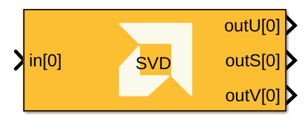
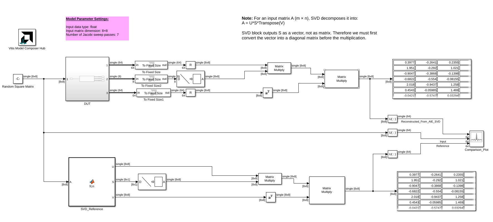
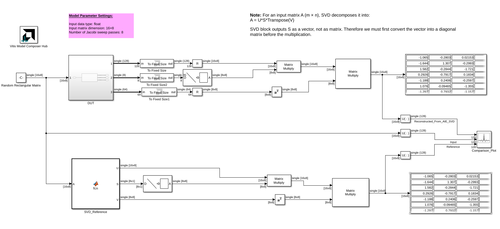
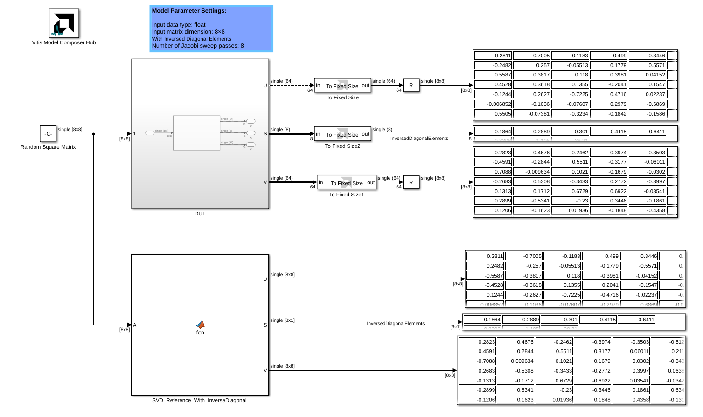

# SVD (Singular Value Decomposition)

Implements singular value decomposition targeted for AI Engines.

## Library

AI Engine/Solver/Buffer IO

## Description

This block computes the singular value decomposition of an input matrix `A`, expressing it as `A = U × diag(S) × V^T`. Here, `U` and `V` are orthogonal matrices, and `S` is a vector containing the singular values; `diag(S)` is the diagonal matrix formed from that vector. The implementation uses Jacobi sweep passes; increasing the number of passes can improve accuracy at the cost of additional processing cycles.

Input matrices are 2D signals. Set the matrix dimensions and Jacobi sweep parameters to match the input and the desired decomposition accuracy. For matrix layout assumptions and supported parameter ranges, see *AI Engine Solver Blocks* in the Vitis Model Composer User Guide (UG1483).

## Parameters

### Main

#### Input data type
Specifies the data type of the input matrix elements.

#### Rows of matrix
Specifies the number of rows in the input matrix `A`.

#### Columns of matrix
Specifies the number of columns in the input matrix `A`.

#### Number of cascade stages
Specifies the number of kernels used to divide and cascade the computation.

#### Number of Jacobi sweep passes
Specifies the number of Jacobi sweep passes to perform. More passes can improve accuracy but require additional processing cycles.

#### Number of Jacobi sweep passes ssr
Specifies the number of Jacobi sweep passes used for the SSR portion of the computation.

#### Provide diagonal elements inverse
When enabled, the block provides the inverse of the singular values in `S`. Disable this option when the downstream design requires the standard singular values.

### Constraints
Use the constraint manager to set per-kernel constraints. When **Number of cascade stages** is greater than one, constraints can be set for each kernel; run the design before configuring them. Constraints affect generated graph code, cycle-approximate AIE simulation (System C), and hardware behavior, but not functional simulation in Simulink.

## SVD Block Examples

The following examples demonstrate the AI Engine SVD block. Click an image to open its model.

--------------
Copyright (C) 2026 Advanced Micro Devices, Inc.
All rights reserved.

SPDX-License-Identifier: MIT
