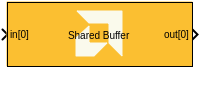
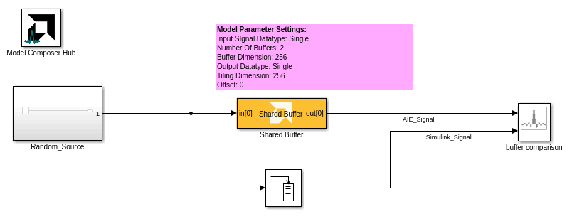

<!-- Library: aieBasic -->

# Shared Buffer
This block allows access to a shared buffer within the AIE-ML memory tile.
  
  

## Library

AI Engine/Interfaces

## Description

This block allows access to a shared buffer within the AIE-ML memory tile. Memory tiles are large memories that can be used to store intermediate results that would not fit in an AI Engine-ML data memory. Memory tiles can also be used to efficiently rearrange data.

The Shared Buffer block can be connected with other AI Engine kernels in your design to read to and write from the shared buffer.

<div class="noteBox">
This block requires an AIE-ML device to be selected in the Vitis Model Composer Hub block.
</div>

## Parameters

#### Data type

Data type contained in the shared buffer. The output of the **Shared Buffer** block will have this data type.

#### Number of buffers

Number of buffers instantiated in the memory tile. When **Number of buffers** is 2 a ping-pong mechanism will be used, increasing throughput. 

#### Buffer dimension

A vector of 1, 2, 3 or 4 elements defining the sizes over the various dimensions of the buffer. These sizes are defined in terms of samples.

For example, to create a 64x64x2 buffer, set **Buffer dimension** to `[64,64,2]`.

#### Number of input ports

The number of physical input ports that are used to write to the shared buffer. There are six ports that can be shared among all buffers located in a memory tile.

#### Number of output ports

The number of physical output ports that will be used to read from this buffer. There are six ports that can be shared among all buffers located in a memory tile.

#### Input tiling

A MATLAB structure containing the tiling parameters for each input port. See [Tiling Parameters](#tiling-parameters). You can define the tiling parameters as variables in the MATLAB workspace and specify the variable name in this field.

#### Output tiling

A MATLAB structure containing the tiling parameters for each output port. See [Tiling Parameters](#tiling-parameters). You can define the tiling parameters as variables in the MATLAB workspace and specify the variable name in this field.

## Tiling Parameters

Tiling parameters define the order in which data is transferred to or from the memory tile on each port. 

The tiling parameters should be specified in a MATLAB structure with the following fields. 
* **`tiling_dimension`**: A vector of 1, 2, 3 or 4 elements defining the sizes over the various dimensions of the tile. These sizes are defined in terms of samples.
* **`offset`**: Multidimensional offset with respect to the starting element in the buffer.
* **`tile_traversal`**: A vector of MATLAB structures defining the traversal parameters for each dimension of the buffer. Each structure has the following fields:
    * **`dimension`**: The buffer dimension on which this traversing loop applies. For AIE-ML memory tiles, it could be the 0th, 1st, 2nd or 3rd dimension. The stride and wrap members of this structure are applied in the dimension specified.
    * **`stride`**: Represents the distance in terms of buffer element data type between consecutive inter-tile traversal in this dimension.
    * **`wrap`**: Number of tiles to access in this dimension.
* **`packet_port_id`**: Multiple connections can go through a single port that are previously merged through a `pktmerge` block or split afterward with a `pktsplit` block. This member represents the output port ID of the connected `pktsplit` or the input port ID of the connected `pktmerge`. If this member is set to a specific id, the data transfer will only happen if the incoming or outgoing data block ID matches this ID.
* **`repetition`**: Number of repetitions of tiling traversal scheme.
* **`boundary_dimension`**: Real data boundary dimension for padding.

<div class="noteBox">
Not all fields are mandatory.

Within the tiling parameters structure, `tiling_dimension` and `offset` are the only mandatory fields. 

Within the `tile_traversal` structure, `dimension`, `stride`, and `wrap` are all mandatory fields.
</div>

The output size of each port can be determined from the tiling parameters as follows:

`output size = tiling_dimension * (total wraps in all dimensions) * repetition`

For a further description of the tiling parameters, see [Tiling Parameters and Buffer Descriptors](https://docs.xilinx.com/r/en-US/ug1603-ai-engine-ml-kernel-graph/Tiling-Parameters-and-Buffer-Descriptors).

### Tiling Parameter Examples

#### 16x16 Shared Buffer implementing a Matrix Transpose

Write full contents of the buffer in one write:
```
inputTilingParams = struct( ...
    'tiling_dimension', [16, 16], ...
    'offset', [0, 0] ...
)
```

Read full contents of buffer one sample at a time, transposed:
```
outputTilingParams = struct( ...
    'tiling_dimension', [1, 1], ...
    'offset', [0, 0], ...
    'tile_traversal', [struct('dimension', 1, 'stride', 1, 'wrap', 16), ...
                       struct('dimension', 0, 'stride', 1, 'wrap', 16)] ...
)
```

#### 64x64 Shared Buffer

Write full contents of the buffer in a row-wise fashion:
```
inputTilingParams = struct( ...
    'tiling_dimension', [64, 1], ... 
    'offset', [0, 0], ...
    'tile_traversal', [struct('dimension', 1, 'stride', 1, 'wrap', 64)] ...
)
```

Read full contents of the buffer in tiles of size 16x4:
```
outputTilingParams = struct( ...
    'tiling_dimension', [16, 4], ...
    'offset', [0, 0], ...
    'tile_traversal', [struct('dimension', 0, 'stride', 16, 'wrap', 4) ...
                       struct('dimension', 1, 'stride', 4, 'wrap', 16)] ...
)
```
## Examples

***Click on the images below to open each model.***

[](https://github.com/Xilinx/Vitis_Model_Composer/tree/2025.2/Examples/Block_Help/AIE/Shared_Buffer_Ex1)


<!--
DESCRIPTION:
Model: SharedBuffer_Ex1
Generated: 09-Jan-2026 13:49:59

Vitis Model Composer Configuration:
  Target Device: xcvc2602-nsvh1369-1LHP-i-L

Vitis Model Composer Blocks:
  - AIE: Shared Buffer

Description:
This MATLAB script creates a Vitis Model Composer Simulink model that uses the AI Engine Shared Buffer block.  and the output is visualized for analysis.

-->

<!--
MATLAB CREATION SCRIPT:

% create_SharedBuffer_Ex1_model.m
% Auto-generated script to recreate the SharedBuffer_Ex1 Simulink model
% Generated on: 09-Jan-2026 13:49:59

%% Model Configuration
modelName = 'SharedBuffer_Ex1_recreated';

%% Create New Model
if bdIsLoaded(modelName)
    close_system(modelName, 0);
end

new_system(modelName);
open_system(modelName);
fprintf('Created new model: %s\n', modelName);

%% Add Vitis Model Composer Hub Block
hubBlockPath = [modelName '/Vitis Model Composer Hub'];
add_block('vmcUtilities/Vitis Model Composer Hub', hubBlockPath, ...
    'Position', [207 33 262 86]);

hubBlk = xmcFindHubBlock(modelName);
vmchub_set_param(hubBlk, modelName, 'SelectHardware', 'xcvc2602-nsvh1369-1LHP-i-L');

%% Add Top-Level Blocks
add_block('built-in/Buffer', [modelName '/Buffer'], ...
    'Position', [550 259 600 311]);
set_param([modelName '/Buffer'], ...
    'N', '256', ...
    'V', '0', ...
    'ic', '0', ...
    'OverlapPercent', '0');
add_block('vmcUtilities/Vitis Model Composer Hub', [modelName '/Model Composer Hub'], ...
    'Position', [207 33 262 86]);
set_param([modelName '/Model Composer Hub'], ...
    'CodeGeneration', 'off', ...
    'CompilationType', 'HDLCompilation', ...
    'ExportTypeV2', 'IP Catalog', ...
    'StartColumn', '1', ...
    'NumberOfColumns', '1', ...
    'TargetDirectory', './netlist', ...
    'exportDesign', 'off', ...
    'analyzeDesign', 'off', ...
    'validateDesignOnHw', 'off', ...
    'ExportType', 'AI Engines', ...
    'IpVendor', 'xilinx.com', ...
    'IpLibrary', 'hls', ...
    'IpVersion', '1.0', ...
    'IpHWLanguage', 'Verilog', ...
    'AieCompilerOptions', '{}', ...
    'CreateTestbench', 'on', ...
    'TestbenchStackSize', '10', ...
    'RunRtlSim', 'off', ...
    'RunCSim', 'off', ...
    'RunAieSim', 'on', ...
    'AieSimTimeout', '50000', ...
    'RunAieSimProfiling', 'off', ...
    'LaunchVitisAnalyzer', 'off', ...
    'PlotOutput', 'off', ...
    'GenHwImage', 'off', ...
    'GenLibadfXo', 'off', ...
    'GenHwValidationCode', 'off', ...
    'PlatformType', 'Not Specified', ...
    'HwSystemType', 'Baremetal', ...
    'HwValidationTarget', 'hw', ...
    'ProjDevice', 'xcvc2602-nsvh1369-1LHP-i-L', ...
    'SamplePeriod', '-1', ...
    'ClockFrequency', '200', ...
    'DataPathParallelism', '1', ...
    'xilinxfamily', 'Kintex7', ...
    'part', 'xc7k325t', ...
    'speed', '-3', ...
    'package', 'fbg676', ...
    'directory', './netlist', ...
    'testbench', 'off', ...
    'incr_netlist', 'off', ...
    'synthesis_tool', 'Vivado', ...
    'clock_wrapper', 'Clock Enables', ...
    'dbl_ovrd', 'According to Block Masks', ...
    'dcm_input_clock_period', '10', ...
    'sysclk_period', '10', ...
    'simulink_period', '1', ...
    'eval_field', '0', ...
    'LogFileName', '/proj/xcoswmktg/robg/git/vmc_examples/gitent/Examples/AIENGINE/DSPlib/Dynamic_FFT/code/model_composer.log', ...
    'NThreads', '4');
add_block('aieBasic/Shared Buffer', [modelName '/Shared Buffer'], ...
    'Position', [510 159 635 201]);
set_param([modelName '/Shared Buffer'], ...
    'DataType', 'float', ...
    'NumBuffer', '2', ...
    'BufferDim', '256', ...
    'NumInput', '1', ...
    'NumOutput', '1', ...
    'RepetitionCount', '0', ...
    'Input0Tiling', 'struct(''tiling_dimension'', 256, ''offset'', 0)', ...
    'Input1Tiling', '[]', ...
    'Input2Tiling', '[]', ...
    'Input3Tiling', '[]', ...
    'Input4Tiling', '[]', ...
    'Input5Tiling', '[]', ...
    'Output0Tiling', 'struct(''tiling_dimension'', 256, ''offset'', 0)', ...
    'Output1Tiling', '[]', ...
    'Output2Tiling', '[]', ...
    'Output3Tiling', '[]', ...
    'Output4Tiling', '[]', ...
    'Output5Tiling', '[]', ...
    'InBuffDims', '{256}', ...
    'InTilingDims', '{256}', ...
    'InOffsets', '{0}', ...
    'InTileTraveseDims', '{}', ...
    'InTileTraveseStrides', '{}', ...
    'InTileTraveseWraps', '{}', ...
    'InPacketPortIDs', '{}', ...
    'InRepetitions', '{}', ...
    'InBoundaryDims', '{}', ...
    'OutBuffDims', '{256}', ...
    'OutTilingDims', '{256}', ...
    'OutOffsets', '{0}', ...
    'OutTileTraveseDims', '{}', ...
    'OutTileTraveseStrides', '{}', ...
    'OutTileTraveseWraps', '{}', ...
    'OutPacketPortIDs', '{}', ...
    'OutRepetitions', '{}', ...
    'OutBoundaryDims', '{}', ...
    'BufferDimStr', '{256}');
add_block('built-in/ArrayPlot', [modelName '/buffer comparison'], ...
    'Position', [905 166 950 219]);
set_param([modelName '/buffer comparison'], ...
    'NumInputPorts', '2', ...
    'OpenAtSimulationStart', 'on', ...
    'WindowPosition', '[4.000000,6.000000,1274.000000,655.000000,]', ...
    'XDataMode', 'Sample increment and X-offset', ...
    'SampleIncrement', '1', ...
    'XOffset', '0', ...
    'CustomXData', '[]', ...
    'XScale', 'Linear', ...
    'YScale', 'Linear', ...
    'PlotType', 'Line', ...
    'PlotBaseValue', '0', ...
    'AxesScaling', 'OnceAtStop', ...
    'AxesScalingNumUpdates', '100', ...
    'MaximizeAxes', 'Auto', ...
    'LayoutDimensions', '[1,1]', ...
    'ActiveDisplay', '1', ...
    'PlotAsMagnitudePhase', 'off', ...
    'YLabel', 'Amplitude', ...
    'YLimits', '[-0.0933,0.0949]', ...
    'ShowGrid', 'on', ...
    'ShowLegend', 'on', ...
    'ChannelNames', '[]');

%% Create Random_Source Subsystem
add_block('built-in/SubSystem', [modelName '/Random_Source'], ...
    'Position', [195 142 320 218]);

% Remove default blocks
defaultBlocks = find_system([modelName '/Random_Source'], 'SearchDepth', 1, 'Type', 'block');
for i = 1:length(defaultBlocks)
    if ~strcmp(defaultBlocks{i}, [modelName '/Random_Source'])
        delete_block(defaultBlocks{i});
    end
end

add_block('dspobslib/Random Source', [[modelName '/Random_Source'] '/Random Source'], ...
    'Position', [20 -44 55 -6]);
set_param([[modelName '/Random_Source'] '/Random Source'], ...
    'SrcType', 'Gaussian', ...
    'NormMethod', 'Ziggurat', ...
    'CltLength', '12', ...
    'MinVal', '0', ...
    'MaxVal', '1', ...
    'MeanVal', '0', ...
    'VarVal', '0.001', ...
    'RepMode', 'Not repeatable', ...
    'rawSeed', '1', ...
    'IsInherit', 'off', ...
    'SampMode', 'Discrete', ...
    'SampTime', '1/2e6', ...
    'SampFrame', '256', ...
    'DataType', 'Single', ...
    'OutComplex', 'Real', ...
    'OutputFrames', 'off');
add_block('built-in/Outport', [[modelName '/Random_Source'] '/Out1'], ...
    'Position', [365 -32 395 -18]);
set_param([[modelName '/Random_Source'] '/Out1'], ...
    'Port', '1', ...
    'StorageClass', 'Auto', ...
    'IconDisplay', 'Port number', ...
    'OutputFunctionCall', 'off', ...
    'OutMin', '[]', ...
    'OutMax', '[]', ...
    'OutDataTypeStr', 'Inherit: auto', ...
    'LockScale', 'off', ...
    'BusOutputAsStruct', 'off', ...
    'BusVirtuality', 'inherit', ...
    'DataMode', 'inherit', ...
    'Unit', 'inherit', ...
    'PortDimensions', '-1', ...
    'VarSizeSig', 'Inherit', ...
    'SampleTime', '-1', ...
    'SignalType', 'auto', ...
    'EnsureOutportIsVirtual', 'off', ...
    'OutputWhenDisabled', 'held', ...
    'InitialOutput', '[]', ...
    'MustResolveToSignalObject', 'off', ...
    'OutputWhenUnConnected', 'off', ...
    'OutputWhenUnconnectedValue', '0', ...
    'VectorParamsAs1DForOutWhenUnconnected', 'on');

% Connect blocks in Random_Source
add_line([modelName '/Random_Source'], 'Random Source/2', 'Out1/2', 'autorouting', 'on');

%% Connect Top-Level Blocks
add_line(modelName, 'Shared Buffer/2', 'buffer comparison/2', 'autorouting', 'on');
add_line(modelName, 'Buffer/2', 'buffer comparison/3', 'autorouting', 'on');
add_line(modelName, 'Random_Source/2', 'Shared Buffer/2', 'autorouting', 'on');
add_line(modelName, 'Random_Source/2', 'Buffer/2', 'autorouting', 'on');
add_line(modelName, 'Random_Source/2', 'Buffer/2', 'autorouting', 'on');

%% Save Model
save_system(modelName);
fprintf('\nModel saved: %s.slx\n', modelName);
-->

## References
To learn more about Shared Buffers, refer to [AI Engine-ML Kernel and Graph Programming Guide (UG1603)](https://docs.xilinx.com/r/en-US/ug1603-ai-engine-ml-kernel-graph/AI-Engine-ML-Memory-Tile-Access).

--------------
Copyright (C) 2025 Advanced Micro Devices, Inc.
All rights reserved.

SPDX-License-Identifier: MIT
