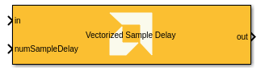
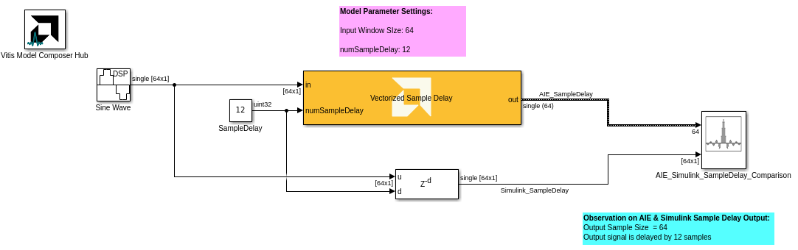
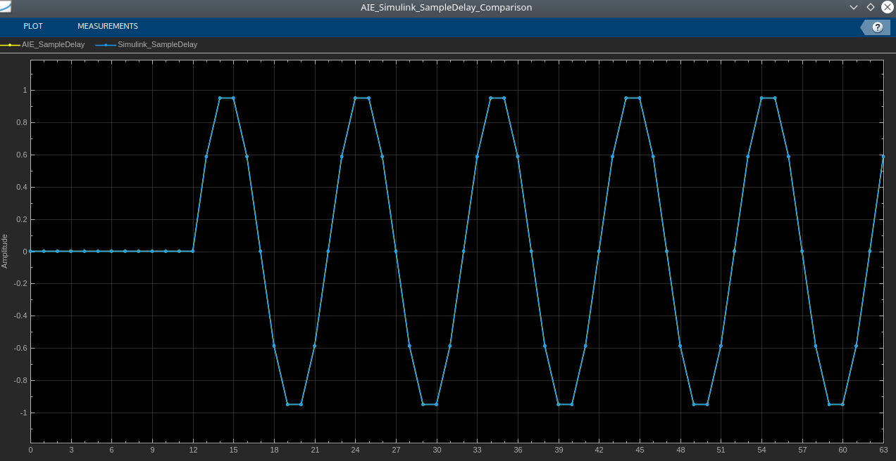
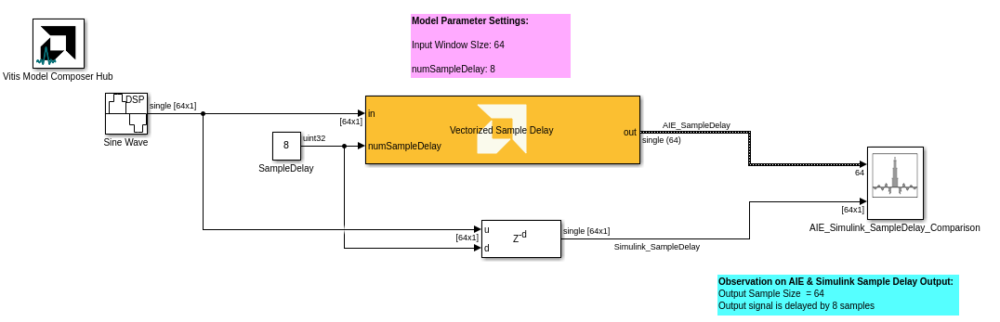
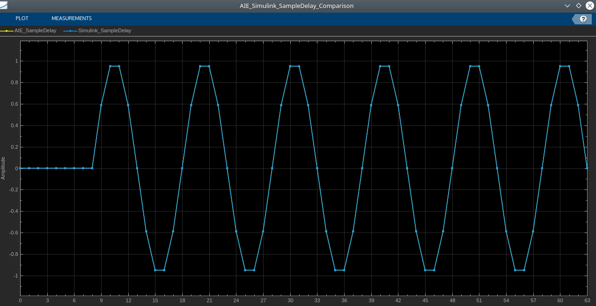

# Vectorized Sample Delay
  
  

## Library

AI Engine/DSP/Buffer IO

## Description

The delay block produces an output signal by delaying the input signal by the number of samples specified in the block dialog box. If the latency of the block is N, then the N-1 first output samples are always 0, and the N-th output sample is the first input sample.

## Parameters

### Main  
#### Input/Output data type  
Set the input/output data type.

#### Input Window Size(Number of Samples)  
Describes the number of samples used as an input to the Vectorized Sample Delay. This parameter must be in the range of 2^0 and 2^32-1, inclusive.

#### Maximum Sample Delay  
Describes the maximum number of sample delay can be applied to the input signal.This parameter must be in the range of 2^0 and 2^32-1, inclusive.  

**Vectorized Sample Delay Block Example1:**

 

**AIE Vectorized Sample Delay and Simulink Sample Delay Block Ouput Comparison:**

 

**Vectorized Sample Delay Block Example2:**

 

**AIE Vectorized Sample Delay and Simulink Sample Delay Block Output Comparison:**

