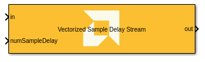
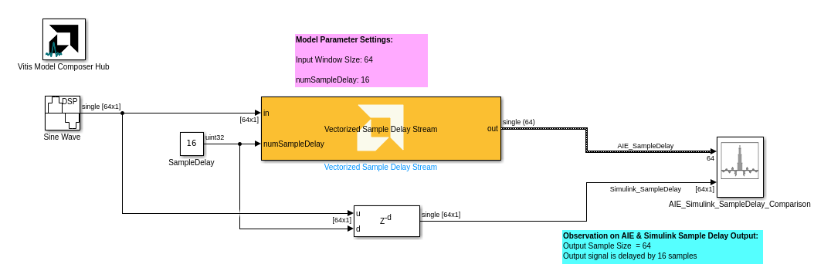

<!-- Library: aieDSP -->

# Vectorized Sample Delay Stream
  
  

## Library

AI Engine/DSP/Stream IO

## Description

This stream-based delay block produces an output signal by delaying the input signal by the number of samples specified in the block dialog box. If the latency of the block is N, then the N-1 first output samples are always 0, and the N-th output sample is the first input sample.

## Parameters

### Main  
#### Input/Output data type  
Set the input/output data type.

#### Input Window Size(Number of Samples)  
Describes the number of samples used as an input to the Vectorized Sample Delay Stream. This parameter must be in the range of 2^0 and 2^32-1, inclusive.

#### Maximum Sample Delay  
Describes the maximum number of sample delay can be applied to the input signal.This parameter must be in the range of 2^0 and 2^32-1, inclusive.  

## Examples

***Click on the images below to open each model.***

<!--
DESCRIPTION:
Model: Vectorized_SampleDelay_Stream_Ex1
Generated: 13-Jan-2026 15:37:37

Vitis Model Composer Configuration:
  Target Device: xcvc1902-vsva2197-1LP-e-S

Vitis Model Composer Blocks:
  - AIE: Vectorized Sample Delay Stream

Model Annotations:
  p, li { white-space: pre-wrap; }
  Model Parameter Settings:
  Input Window SIze: 64
  numSampleDelay: 16

  p, li { white-space: pre-wrap; }
  Observation on AIE & Simulink Sample Delay Output:
  Output Sample Size  = 64
  Output signal is delayed by 16 samples

Description:
This MATLAB script creates a Vitis Model Composer Simulink model that uses the AI Engine Vectorized Sample Delay Stream block. A 10Hz real input signal is provided to the block,  and the output is visualized for analysis.

-->

<!--
MATLAB CREATION SCRIPT:

% Quick Start: Vectorized_SampleDelay_Stream_Ex1
% Essential setup focusing on critical parameters

modelName = 'Vectorized_SampleDelay_Stream_Ex1';
new_system(modelName); open_system(modelName);

% Hub Block - Configure target device
add_block('vmcUtilities/Vitis Model Composer Hub', [modelName '/Hub']);
hubBlk = xmcFindHubBlock(modelName);
vmchub_set_param(hubBlk, modelName, 'SelectHardware', 'xcvc1902-vsva2197-1LP-e-S');

% NOTE: Stream blocks use SSR (Super Sample Rate) for parallelism
% Input data is split into SSR parallel streams

% Vectorized Sample Delay Stream
add_block('aieDSP/Vectorized Sample Delay Stream', [modelName '/Vectorized Sample Delay Stream']);
set_param([modelName '/Vectorized Sample Delay Stream'], ...
    'data_type', 'float', ...
    'input_window_size', '64');

% Test signal and connections setup omitted for brevity
% Add input sources, displays, and connect blocks as needed
-->

## References
This block uses the Vitis DSP library implementation of Vectorized Sample Delay. For more details on this implementation please click [here](https://docs.xilinx.com/r/en-US/Vitis_Libraries/dsp/user_guide/L2/func-sample_delay.html).

--------------
Copyright (C) 2025 Advanced Micro Devices, Inc.
All rights reserved.

SPDX-License-Identifier: MIT
