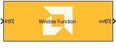
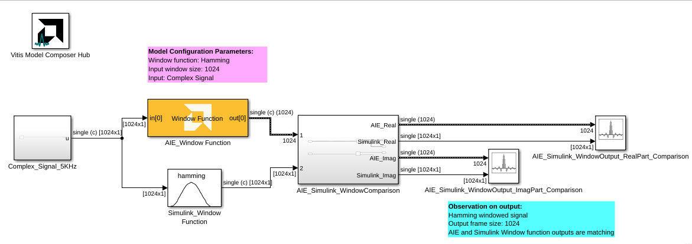

<!-- Library: aieDSP -->

# Window Function
Window function implementation targeted for AI Engines.

## Library

AI Engine/DSP/Buffer IO

## Description

Window function implementation targeted for AI Engines. This block is
applies a windowing function such as Hamming to a
frame of input data samples. It is usually used in conjunction with an FFT block.

## Parameters

#### Input/Output data type

Describes the type of individual data samples input/output of the
  FFT. It can be cint16, cint32, or cfloat types.

#### Function coefficient data type

Describes the type of individual coefficients of the filter taps. It
  should be one of int16, int32, or float and must also satisfy the
  following rules:
  - Complex types are only supported when the Input/Output data type is
    also complex.
  - 32-bit types are only supported when the Input/Output data type is
    also a 32-bit type.
  - Filter coefficients data type must be an integer type if the
    Input/Output data type is an integer type.
  - Filter coefficients data type must be a float type if the
    Input/Output data type is a float type.

#### Function coefficients
Specifies the filter coefficients as a vector of (N+1)/4+1 elements,
  where 'N' is a positive integer that represents the filter length and
  must be in the range 4 to 240 inclusive.

#### FFT/IFFT point size
Specifies the maximum FFT/IFFT size that is supported by the FFT block.
  You can perform different lengths of FFT/IFFT on different input data
  frames. It must be a power of 2 with a minimum value of 16. The
  maximum value supported by this block is 65536.

#### Use dynamic point size
This option is primarily checked when the block is used with the [Dynamic point FFT block](../FFT_Dynamic_Point/README.md). When unchecked, each input frame will be of the size _Window size_ though the _Input size_ can be an integer multiple of the _Window size_ indicating the procesing of multiple frames together. When this option is checked, each window must be preceeded by a 256bit header to describe the run-time parameters of that window. Note that the _Window size_ parameter does not include this header. The format of the header is described in the table below. When checked, the _Windows size_ parameter describes the maximum window size which may be input.

Field name	Location (TT_DATA sample)	Description
Direction	0 (real part)	0 (inverse FFT) 1 (forward FFT)
Point size (radix2 stages)	1 (real part)	Point size described as a power of 2. E.g. 5 described a point size of 32.
Reserved	2 OR 6 for TT_DATA=cint16	reserved
Status (output only)	3 (real part) OR 7 for TT_DATA=cint16	0 = legal point size, 1 = illegal point size
The locations are set to suit TT_DATA type. That is, for TT_DATA=cint16, direction is described in the first cint16 (real part) of the 256 bit header and point size is described in the real part of the second cint16 value. Similarly, for TT_DATA=cint32, the real part of the first cint32 value in the header holds the direction field and the second cint32 value’s real part holds the Point size (radix2) field.

Note that for TT_DATA=cfloat, the values in the header are expected as cfloat and are value-cast (not reinterpret-cast) to integers internally. The output window also has a header. This is copied from the input header except for the status field, which is inserted. The status field is ignored on input. If an illegal point size is entered, the output header will have this field set to a non-zero value and the remainder of the output window is undefined.

When this option is checked, the window will operate on frames of _Window size_ or (_Window size_)/2^N down to 16. Since the window values cannot be faithfully determined by sampling or interpolating from the provided parent array, it is necessary when in this mode to provide an array holding the window values for each window size. Since this is a full array of (_Window size_)*(1+ 1/2 + 1/4 + …) the overall table size provided must be (_Window size_) * 2. For example, for (_Window size_)=64, the values of the window coefficients for a window size of 64 will occupy array indices 0 to 63. The coefficients for window size of 32 will occupy indices 64 thru 95, and those for windows size of 16 will occupy 96 thru 111.

#### Input frame size (Number of Samples)

Specifies the number of samples in the input frame excluding the
  header. The value must be in the range 16 to 65536 and the default
  value is 64.

#### Scale output down by 2^

Describes the power of 2 shift down applied before output.

## Examples 

***Click on the images below to open each model.***

<!--
DESCRIPTION:
Model: WindowFunction_Ex1
Generated: 09-Jan-2026 13:51:24

Vitis Model Composer Configuration:
  Target Device: xcvc1902-vsva2197-1LP-e-S

Vitis Model Composer Blocks:
  - AIE: Window Function

Description:
This MATLAB script creates a Vitis Model Composer Simulink model that uses the AI Engine Window Function block. A 6kHz complex input signal is provided to the block,  and the output is visualized for analysis.

-->

<!--
MATLAB CREATION SCRIPT:

% create_WindowFunction_Ex1_model.m
% Auto-generated script to recreate the WindowFunction_Ex1 Simulink model
% Generated on: 09-Jan-2026 13:51:24

%% Model Configuration
modelName = 'WindowFunction_Ex1_recreated';

%% Create New Model
if bdIsLoaded(modelName)
    close_system(modelName, 0);
end

new_system(modelName);
open_system(modelName);
fprintf('Created new model: %s\n', modelName);

%% Add Vitis Model Composer Hub Block
hubBlockPath = [modelName '/Vitis Model Composer Hub'];
add_block('vmcUtilities/Vitis Model Composer Hub', hubBlockPath, ...
    'Position', [92 -2 147 51]);

hubBlk = xmcFindHubBlock(modelName);
vmchub_set_param(hubBlk, modelName, 'SelectHardware', 'xcvc1902-vsva2197-1LP-e-S');

%% Add Top-Level Blocks
add_block('built-in/ArrayPlot', [modelName '/AIE_Simulink_ImagPart_Comparison'], ...
    'Position', [910 152 955 203]);
set_param([modelName '/AIE_Simulink_ImagPart_Comparison'], ...
    'NumInputPorts', '2', ...
    'OpenAtSimulationStart', 'on', ...
    'WindowPosition', '[5.000000,269.000000,845.000000,423.000000,]', ...
    'XDataMode', 'Sample increment and X-offset', ...
    'SampleIncrement', '1', ...
    'XOffset', '0', ...
    'CustomXData', '[]', ...
    'XScale', 'Linear', ...
    'YScale', 'Linear', ...
    'PlotType', 'Line', ...
    'PlotBaseValue', '0', ...
    'AxesScaling', 'Manual', ...
    'AxesScalingNumUpdates', '100', ...
    'MaximizeAxes', 'Auto', ...
    'LayoutDimensions', '[1,1]', ...
    'ActiveDisplay', '1', ...
    'PlotAsMagnitudePhase', 'off', ...
    'YLabel', 'Amplitude', ...
    'YLimits', '[-0.000003,0.000003]', ...
    'ShowGrid', 'on', ...
    'ShowLegend', 'on', ...
    'ChannelNames', '[]');
add_block('built-in/ArrayPlot', [modelName '/AIE_Simulink_RealPart_Comparison'], ...
    'Position', [1030 102 1075 153]);
set_param([modelName '/AIE_Simulink_RealPart_Comparison'], ...
    'NumInputPorts', '2', ...
    'OpenAtSimulationStart', 'on', ...
    'WindowPosition', '[5.000000,41.000000,1272.000000,651.000000,]', ...
    'XDataMode', 'Sample increment and X-offset', ...
    'SampleIncrement', '1', ...
    'XOffset', '0', ...
    'CustomXData', '[]', ...
    'XScale', 'Linear', ...
    'YScale', 'Linear', ...
    'PlotType', 'Line', ...
    'PlotBaseValue', '0', ...
    'AxesScaling', 'Manual', ...
    'AxesScalingNumUpdates', '100', ...
    'MaximizeAxes', 'Auto', ...
    'LayoutDimensions', '[1,1]', ...
    'ActiveDisplay', '1', ...
    'PlotAsMagnitudePhase', 'off', ...
    'YLabel', 'Amplitude', ...
    'YLimits', '[-7,7]', ...
    'ShowGrid', 'on', ...
    'ShowLegend', 'on', ...
    'ChannelNames', '[]');
add_block('aieDSP/Window Function', [modelName '/AIE_Window Function'], ...
    'Position', [405 72 555 128]);
set_param([modelName '/AIE_Window Function'], ...
    'data_type', 'cfloat', ...
    'coeff_type', 'float', ...
    'coeff', 'hamming(128)', ...
    'point_size', '128', ...
    'is_dyn_pt_size', 'off', ...
    'input_window_size', '128', ...
    'shift_val', '0', ...
    'ssr', '1', ...
    'rnd_mode', 'Floor', ...
    'sat_mode', '0-None', ...
    'TP_API', '0');
add_block('dspsigops/Window Function', [modelName '/Simulink_Window Function'], ...
    'Position', [430 227 510 283]);
set_param([modelName '/Simulink_Window Function'], ...
    'winmode', 'Apply window to input', ...
    'wintype', 'Hamming', ...
    'sampmode', 'Discrete', ...
    'samptime', '1', ...
    'N', '64', ...
    'Rs', '50', ...
    'beta', '10', ...
    'winsamp', 'Periodic', ...
    'UserWindow', 'hamming', ...
    'OptParams', 'off', ...
    'UserParams', '{''symmetric''}', ...
    'additionalParams', 'off', ...
    'allowOverrides', 'on', ...
    'dataType', 'double', ...
    'isSigned', 'on', ...
    'wordLen', '16', ...
    'udDataType', 'sfix(16)', ...
    'fracBitsMode', 'Best precision', ...
    'numFracBits', '15', ...
    'firstCoeffMode', 'Same word length as input', ...
    'firstCoeffWordLength', '16', ...
    'firstCoeffFracLength', '15', ...
    'prodOutputMode', 'Inherit via internal rule', ...
    'prodOutputWordLength', '16', ...
    'prodOutputFracLength', '15', ...
    'outputMode', 'Same as product output', ...
    'outputWordLength', '16', ...
    'outputFracLength', '15', ...
    'roundingMode', 'Round', ...
    'overflowMode', 'off', ...
    'LockScale', 'off', ...
    'numSidelobes', '4', ...
    'sidelobeLevel', '-30');
add_block('vmcUtilities/Vitis Model Composer Hub', [modelName '/Vitis Model Composer Hub'], ...
    'Position', [92 -2 147 51]);
set_param([modelName '/Vitis Model Composer Hub'], ...
    'CodeGeneration', 'off', ...
    'StartColumn', '1', ...
    'NumberOfColumns', '1', ...
    'TargetDirectory', './code', ...
    'exportDesign', 'off', ...
    'analyzeDesign', 'off', ...
    'validateDesignOnHw', 'off', ...
    'ExportType', 'AI Engines', ...
    'IpVendor', 'xilinx.com', ...
    'IpLibrary', 'hls', ...
    'IpVersion', '1.0', ...
    'IpHWLanguage', 'Verilog', ...
    'AieCompilerOptions', '{}', ...
    'CreateTestbench', 'off', ...
    'TestbenchStackSize', '10', ...
    'RunRtlSim', 'off', ...
    'RunCSim', 'off', ...
    'RunAieSim', 'off', ...
    'AieSimTimeout', '50000', ...
    'RunAieSimProfiling', 'off', ...
    'LaunchVitisAnalyzer', 'off', ...
    'PlotOutput', 'off', ...
    'GenHwImage', 'off', ...
    'GenLibadfXo', 'off', ...
    'GenHwValidationCode', 'off', ...
    'PlatformType', 'Not Specified', ...
    'HwSystemType', 'Baremetal', ...
    'HwValidationTarget', 'hw', ...
    'ProjDevice', 'xcvc1902-vsva2197-1LP-e-S', ...
    'SamplePeriod', '-1', ...
    'ClockFrequency', '200', ...
    'DataPathParallelism', '1', ...
    'xilinxfamily', 'versalaicore', ...
    'part', 'xcvc1902', ...
    'speed', '-1LP-e-S', ...
    'package', 'vsva2197', ...
    'directory', './netlist', ...
    'testbench', 'off', ...
    'incr_netlist', 'off', ...
    'synthesis_tool', 'Vivado', ...
    'clock_wrapper', 'Clock Enables', ...
    'dbl_ovrd', 'According to Block Masks', ...
    'dcm_input_clock_period', '10', ...
    'sysclk_period', '10', ...
    'simulink_period', '1', ...
    'eval_field', '0', ...
    'LogFileName', '''''', ...
    'NThreads', '4');

%% Create AIE_Simulink_WindowComparison Subsystem
add_block('built-in/SubSystem', [modelName '/AIE_Simulink_WindowComparison'], ...
    'Position', [655 101 805 204]);

% Remove default blocks
defaultBlocks = find_system([modelName '/AIE_Simulink_WindowComparison'], 'SearchDepth', 1, 'Type', 'block');
for i = 1:length(defaultBlocks)
    if ~strcmp(defaultBlocks{i}, [modelName '/AIE_Simulink_WindowComparison'])
        delete_block(defaultBlocks{i});
    end
end

add_block('built-in/Inport', [[modelName '/AIE_Simulink_WindowComparison'] '/In1'], ...
    'Position', [25 23 55 37]);
set_param([[modelName '/AIE_Simulink_WindowComparison'] '/In1'], ...
    'Port', '1', ...
    'IconDisplay', 'Port number', ...
    'OutputFunctionCall', 'off', ...
    'OutMin', '[]', ...
    'OutMax', '[]', ...
    'OutDataTypeStr', 'Inherit: auto', ...
    'LockScale', 'off', ...
    'BusOutputAsStruct', 'off', ...
    'BusVirtuality', 'inherit', ...
    'Unit', 'inherit', ...
    'PortDimensions', '-1', ...
    'VarSizeSig', 'Inherit', ...
    'SampleTime', '-1', ...
    'SignalType', 'auto', ...
    'LatchByDelayingOutsideSignal', 'off', ...
    'LatchInputForFeedbackSignals', 'off', ...
    'Interpolate', 'on', ...
    'DataMode', 'inherit', ...
    'MessageQueueUseDefaultAttributes', 'on', ...
    'MessageQueueCapacity', '1', ...
    'MessageQueueType', 'LIFO', ...
    'MessageQueueOverwriting', 'on');
add_block('built-in/Inport', [[modelName '/AIE_Simulink_WindowComparison'] '/In2'], ...
    'Position', [20 98 50 112]);
set_param([[modelName '/AIE_Simulink_WindowComparison'] '/In2'], ...
    'Port', '2', ...
    'IconDisplay', 'Port number', ...
    'OutputFunctionCall', 'off', ...
    'OutMin', '[]', ...
    'OutMax', '[]', ...
    'OutDataTypeStr', 'Inherit: auto', ...
    'LockScale', 'off', ...
    'BusOutputAsStruct', 'off', ...
    'BusVirtuality', 'inherit', ...
    'Unit', 'inherit', ...
    'PortDimensions', '-1', ...
    'VarSizeSig', 'Inherit', ...
    'SampleTime', '-1', ...
    'SignalType', 'auto', ...
    'LatchByDelayingOutsideSignal', 'off', ...
    'LatchInputForFeedbackSignals', 'off', ...
    'Interpolate', 'on', ...
    'DataMode', 'inherit', ...
    'MessageQueueUseDefaultAttributes', 'on', ...
    'MessageQueueCapacity', '1', ...
    'MessageQueueType', 'LIFO', ...
    'MessageQueueOverwriting', 'on');
add_block('built-in/ComplexToRealImag', [[modelName '/AIE_Simulink_WindowComparison'] '/Complex to Real-Imag'], ...
    'Position', [390 13 420 42]);
set_param([[modelName '/AIE_Simulink_WindowComparison'] '/Complex to Real-Imag'], ...
    'Output', 'Real and imag', ...
    'SampleTime', '-1');
add_block('built-in/ComplexToRealImag', [[modelName '/AIE_Simulink_WindowComparison'] '/Complex to Real-Imag1'], ...
    'Position', [385 108 415 137]);
set_param([[modelName '/AIE_Simulink_WindowComparison'] '/Complex to Real-Imag1'], ...
    'Output', 'Real and imag', ...
    'SampleTime', '-1');
add_block('built-in/Outport', [[modelName '/AIE_Simulink_WindowComparison'] '/AIE_Real'], ...
    'Position', [580 13 610 27]);
set_param([[modelName '/AIE_Simulink_WindowComparison'] '/AIE_Real'], ...
    'Port', '1', ...
    'StorageClass', 'Auto', ...
    'IconDisplay', 'Port number', ...
    'OutputFunctionCall', 'off', ...
    'OutMin', '[]', ...
    'OutMax', '[]', ...
    'OutDataTypeStr', 'Inherit: auto', ...
    'LockScale', 'off', ...
    'BusOutputAsStruct', 'off', ...
    'BusVirtuality', 'inherit', ...
    'DataMode', 'inherit', ...
    'Unit', 'inherit', ...
    'PortDimensions', '-1', ...
    'VarSizeSig', 'Inherit', ...
    'SampleTime', '-1', ...
    'SignalType', 'auto', ...
    'EnsureOutportIsVirtual', 'off', ...
    'OutputWhenDisabled', 'held', ...
    'InitialOutput', '[]', ...
    'MustResolveToSignalObject', 'off', ...
    'OutputWhenUnConnected', 'off', ...
    'OutputWhenUnconnectedValue', '0', ...
    'VectorParamsAs1DForOutWhenUnconnected', 'on');
add_block('built-in/Outport', [[modelName '/AIE_Simulink_WindowComparison'] '/Simulink_Real'], ...
    'Position', [580 108 610 122]);
set_param([[modelName '/AIE_Simulink_WindowComparison'] '/Simulink_Real'], ...
    'Port', '2', ...
    'StorageClass', 'Auto', ...
    'IconDisplay', 'Port number', ...
    'OutputFunctionCall', 'off', ...
    'OutMin', '[]', ...
    'OutMax', '[]', ...
    'OutDataTypeStr', 'Inherit: auto', ...
    'LockScale', 'off', ...
    'BusOutputAsStruct', 'off', ...
    'BusVirtuality', 'inherit', ...
    'DataMode', 'inherit', ...
    'Unit', 'inherit', ...
    'PortDimensions', '-1', ...
    'VarSizeSig', 'Inherit', ...
    'SampleTime', '-1', ...
    'SignalType', 'auto', ...
    'EnsureOutportIsVirtual', 'off', ...
    'OutputWhenDisabled', 'held', ...
    'InitialOutput', '[]', ...
    'MustResolveToSignalObject', 'off', ...
    'OutputWhenUnConnected', 'off', ...
    'OutputWhenUnconnectedValue', '0', ...
    'VectorParamsAs1DForOutWhenUnconnected', 'on');
add_block('built-in/Outport', [[modelName '/AIE_Simulink_WindowComparison'] '/AIE_Imag'], ...
    'Position', [580 63 610 77]);
set_param([[modelName '/AIE_Simulink_WindowComparison'] '/AIE_Imag'], ...
    'Port', '3', ...
    'StorageClass', 'Auto', ...
    'IconDisplay', 'Port number', ...
    'OutputFunctionCall', 'off', ...
    'OutMin', '[]', ...
    'OutMax', '[]', ...
    'OutDataTypeStr', 'Inherit: auto', ...
    'LockScale', 'off', ...
    'BusOutputAsStruct', 'off', ...
    'BusVirtuality', 'inherit', ...
    'DataMode', 'inherit', ...
    'Unit', 'inherit', ...
    'PortDimensions', '-1', ...
    'VarSizeSig', 'Inherit', ...
    'SampleTime', '-1', ...
    'SignalType', 'auto', ...
    'EnsureOutportIsVirtual', 'off', ...
    'OutputWhenDisabled', 'held', ...
    'InitialOutput', '[]', ...
    'MustResolveToSignalObject', 'off', ...
    'OutputWhenUnConnected', 'off', ...
    'OutputWhenUnconnectedValue', '0', ...
    'VectorParamsAs1DForOutWhenUnconnected', 'on');
add_block('built-in/Outport', [[modelName '/AIE_Simulink_WindowComparison'] '/Simulink_Imag'], ...
    'Position', [580 153 610 167]);
set_param([[modelName '/AIE_Simulink_WindowComparison'] '/Simulink_Imag'], ...
    'Port', '4', ...
    'StorageClass', 'Auto', ...
    'IconDisplay', 'Port number', ...
    'OutputFunctionCall', 'off', ...
    'OutMin', '[]', ...
    'OutMax', '[]', ...
    'OutDataTypeStr', 'Inherit: auto', ...
    'LockScale', 'off', ...
    'BusOutputAsStruct', 'off', ...
    'BusVirtuality', 'inherit', ...
    'DataMode', 'inherit', ...
    'Unit', 'inherit', ...
    'PortDimensions', '-1', ...
    'VarSizeSig', 'Inherit', ...
    'SampleTime', '-1', ...
    'SignalType', 'auto', ...
    'EnsureOutportIsVirtual', 'off', ...
    'OutputWhenDisabled', 'held', ...
    'InitialOutput', '[]', ...
    'MustResolveToSignalObject', 'off', ...
    'OutputWhenUnConnected', 'off', ...
    'OutputWhenUnconnectedValue', '0', ...
    'VectorParamsAs1DForOutWhenUnconnected', 'on');

% Connect blocks in AIE_Simulink_WindowComparison
add_line([modelName '/AIE_Simulink_WindowComparison'], 'Complex to Real-Imag/3', 'AIE_Imag/2', 'autorouting', 'on');
add_line([modelName '/AIE_Simulink_WindowComparison'], 'Complex to Real-Imag/2', 'AIE_Real/2', 'autorouting', 'on');
add_line([modelName '/AIE_Simulink_WindowComparison'], 'In2/2', 'Complex to Real-Imag1/2', 'autorouting', 'on');
add_line([modelName '/AIE_Simulink_WindowComparison'], 'In1/2', 'Complex to Real-Imag/2', 'autorouting', 'on');
add_line([modelName '/AIE_Simulink_WindowComparison'], 'Complex to Real-Imag1/2', 'Simulink_Real/2', 'autorouting', 'on');
add_line([modelName '/AIE_Simulink_WindowComparison'], 'Complex to Real-Imag1/3', 'Simulink_Imag/2', 'autorouting', 'on');

%% Create Complex_Signal_6KHz Subsystem
add_block('built-in/SubSystem', [modelName '/Complex_Signal_6KHz'], ...
    'Position', [195 157 280 223]);

% Remove default blocks
defaultBlocks = find_system([modelName '/Complex_Signal_6KHz'], 'SearchDepth', 1, 'Type', 'block');
for i = 1:length(defaultBlocks)
    if ~strcmp(defaultBlocks{i}, [modelName '/Complex_Signal_6KHz'])
        delete_block(defaultBlocks{i});
    end
end

add_block('dspobslib/Random Source', [[modelName '/Complex_Signal_6KHz'] '/Random Noise'], ...
    'Position', [-185 121 -150 159]);
set_param([[modelName '/Complex_Signal_6KHz'] '/Random Noise'], ...
    'SrcType', 'Gaussian', ...
    'NormMethod', 'Ziggurat', ...
    'CltLength', '12', ...
    'MinVal', '0', ...
    'MaxVal', '1', ...
    'MeanVal', '0', ...
    'VarVal', '1e-3', ...
    'RepMode', 'Not repeatable', ...
    'rawSeed', '1', ...
    'IsInherit', 'off', ...
    'SampMode', 'Discrete', ...
    'SampTime', '1/12e3', ...
    'SampFrame', '128', ...
    'DataType', 'Single', ...
    'OutComplex', 'Real', ...
    'OutputFrames', 'off');
add_block('dspsrcs4/Sine Wave', [[modelName '/Complex_Signal_6KHz'] '/Sine Wave'], ...
    'Position', [-190 23 -145 67]);
set_param([[modelName '/Complex_Signal_6KHz'] '/Sine Wave'], ...
    'Amplitude', '2', ...
    'Frequency', '6e3', ...
    'Phase', '0', ...
    'SampleMode', 'Discrete', ...
    'OutComplex', 'Complex', ...
    'CompMethod', 'Trigonometric fcn', ...
    'TableSize', 'Speed', ...
    'SampleTime', '1/12e3', ...
    'SamplesPerFrame', '128', ...
    'ResetState', 'Restart at time zero', ...
    'OutputFrames', 'off', ...
    'additionalParams', 'off', ...
    'allowOverrides', 'on', ...
    'dataType', 'single', ...
    'wordLen', '16', ...
    'udDataType', 'sfix(16)', ...
    'fracBitsMode', 'Best precision', ...
    'numFracBits', '15', ...
    'OutDataTypeStr', 'single', ...
    'LastOutDataTypeStr', 'single');
add_block('built-in/Sum', [[modelName '/Complex_Signal_6KHz'] '/Sum'], ...
    'Position', [-40 35 -20 55]);
set_param([[modelName '/Complex_Signal_6KHz'] '/Sum'], ...
    'IconShape', 'round', ...
    'Inputs', '|++', ...
    'CollapseMode', 'All dimensions', ...
    'CollapseDim', '1', ...
    'OutMin', '[]', ...
    'OutMax', '[]', ...
    'OutDataTypeStr', 'Inherit: Inherit via internal rule', ...
    'AccumDataTypeStr', 'Inherit: Inherit via internal rule', ...
    'InputSameDT', 'off', ...
    'LockScale', 'off', ...
    'RndMeth', 'Floor', ...
    'SaturateOnIntegerOverflow', 'off', ...
    'SampleTime', '-1');
add_block('built-in/Outport', [[modelName '/Complex_Signal_6KHz'] '/u'], ...
    'Position', [120 38 150 52]);
set_param([[modelName '/Complex_Signal_6KHz'] '/u'], ...
    'Port', '1', ...
    'StorageClass', 'Auto', ...
    'IconDisplay', 'Port number', ...
    'OutputFunctionCall', 'off', ...
    'OutMin', '[]', ...
    'OutMax', '[]', ...
    'OutDataTypeStr', 'Inherit: auto', ...
    'LockScale', 'off', ...
    'BusOutputAsStruct', 'off', ...
    'BusVirtuality', 'inherit', ...
    'DataMode', 'inherit', ...
    'Unit', 'inherit', ...
    'PortDimensions', '-1', ...
    'VarSizeSig', 'Inherit', ...
    'SampleTime', '-1', ...
    'SignalType', 'auto', ...
    'EnsureOutportIsVirtual', 'off', ...
    'OutputWhenDisabled', 'held', ...
    'InitialOutput', '[]', ...
    'MustResolveToSignalObject', 'off', ...
    'OutputWhenUnConnected', 'off', ...
    'OutputWhenUnconnectedValue', '0', ...
    'VectorParamsAs1DForOutWhenUnconnected', 'on');

% Connect blocks in Complex_Signal_6KHz
add_line([modelName '/Complex_Signal_6KHz'], 'Random Noise/2', 'Sum/3', 'autorouting', 'on');
add_line([modelName '/Complex_Signal_6KHz'], 'Sum/2', 'u/2', 'autorouting', 'on');
add_line([modelName '/Complex_Signal_6KHz'], 'Sine Wave/2', 'Sum/2', 'autorouting', 'on');

%% Connect Top-Level Blocks
add_line(modelName, 'AIE_Simulink_WindowComparison/5', 'AIE_Simulink_ImagPart_Comparison/3', 'autorouting', 'on');
add_line(modelName, 'AIE_Simulink_WindowComparison/4', 'AIE_Simulink_ImagPart_Comparison/2', 'autorouting', 'on');
add_line(modelName, 'AIE_Simulink_WindowComparison/3', 'AIE_Simulink_RealPart_Comparison/3', 'autorouting', 'on');
add_line(modelName, 'AIE_Simulink_WindowComparison/2', 'AIE_Simulink_RealPart_Comparison/2', 'autorouting', 'on');
add_line(modelName, 'Simulink_Window Function/2', 'AIE_Simulink_WindowComparison/3', 'autorouting', 'on');
add_line(modelName, 'AIE_Window Function/2', 'AIE_Simulink_WindowComparison/2', 'autorouting', 'on');
add_line(modelName, 'Complex_Signal_6KHz/2', 'Simulink_Window Function/2', 'autorouting', 'on');
add_line(modelName, 'Complex_Signal_6KHz/2', 'AIE_Window Function/2', 'autorouting', 'on');
add_line(modelName, 'Complex_Signal_6KHz/2', 'AIE_Window Function/2', 'autorouting', 'on');

%% Save Model
save_system(modelName);
fprintf('\nModel saved: %s.slx\n', modelName);
-->
  
### References
This block uses the Vitis DSP library implementation of a FFT window function. For more details on this implementation please click [here](https://docs.amd.com/r/en-US/Vitis_Libraries/dsp/user_guide/L2/func-fft_window.html).
 

--------------
Copyright (C) 2025 Advanced Micro Devices, Inc.
All rights reserved.

SPDX-License-Identifier: MIT
