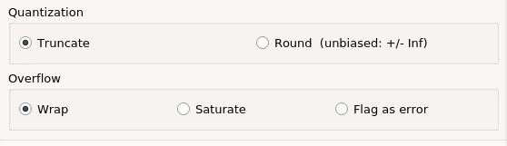

# Common Options in Block Parameter Dialog Boxes

Each Xilinx® block has several controls and configurable parameters,
seen in its Block Parameters dialog box. This dialog box can be accessed
by double-clicking on the block. Many of these parameters are specific
to the block. Block-specific parameters are described in the
documentation for the block.

The remaining controls and parameters are common to most blocks. These
common controls and parameters are described below.

Each dialog box contains four buttons: OK, Cancel, Help, and Apply.
Apply applies configuration changes to the block, leaving the box open
on the screen. Help displays HTML help for the block. Cancel closes the
box without saving changes. OK applies changes and closes the box.

## Precision

The fundamental computational mode in the Xilinx blockset is arbitrary
precision fixed-point arithmetic. Most blocks give you the option of
choosing the precision, for example, the number of bits and binary point
position.

By default, the output of Xilinx blocks is full precision; that is,
sufficient precision to represent the result without error. Most blocks
have a User-Defined precision option that fixes the number of total and
fractional bits.

## Arithmetic type

In the Arithmetic Type field of the Block Parameters dialog box, you can
choose unsigned or signed (two's complement) as the data type of the
output signal.

## Number of bits

Fixed-point numbers are stored in data types characterized by their word
size as specified by Number of bits, Binary point, and Arithmetic type
parameters. The maximum number of bits supported is 4096.

## Binary point

The binary point is the means by which fixed-point numbers are scaled.
The Binary point parameter indicates the number of bits to the right of
the binary point (for example, the size of the fraction) for the output
port. The binary point position must be between zero and the specified
number of bits.

## Overflow and Quantization

When user-defined precision is selected, errors can result from overflow
or quantization. Overflow errors occur when a value lies outside the
representable range. Quantization errors occur when the number of
fractional bits is insufficient to represent the fractional portion of a
value.

The Xilinx fixed-point data type supports several options for
user-defined precision. For overflow the options are to Saturate to the
largest positive/smallest negative value, to Wrap (for example, to
discard bits to the left of the most significant representable bit), or
to Flag as error (an overflow as a Simulink® error) during simulation.
Flag as error is a simulation only feature. The hardware generated is
the same as when Wrap is selected.

For quantization, the options are to Round to the nearest representable
value (or to the value furthest from zero if there are two equidistant
nearest representable values), or to Truncate (for example, to discard
bits to the right of the least significant representable bit).

The following is an image showing the Quantization and Overflow options.

Figure: Quantization and Overflow Options

  
  

Round (unbiased: +/- inf) also known as "Symmetric Round (towards +/-
inf)" or "Symmetric Round (away from zero)". This is similar to the
MATLAB® `round()` function. This method rounds the value to the nearest
desired bit away from zero and when there is a value at the midpoint
between two possible rounded values, the one with the larger magnitude
is selected. For example, to round 01.0110 to a Fix_4_2, this yields
01.10, because 01.0110 is exactly between 01.01 and 01.10 and the latter
is further from zero.

Round (unbiased: even values) also known as "Convergent Round (toward
even)" or "Unbiased Rounding". Symmetric rounding is biased because it
rounds all ambiguous midpoints away from zero which means the average
magnitude of the rounded results is larger than the average magnitude of
the raw results. Convergent rounding removes this by alternating between
a symmetric round toward zero and symmetric round away from zero. That
is, midpoints are rounded toward the nearest even number. For example,
to round 01.0110 to a Fix_4_2, this yields 01.10, because 01.0110 is
exactly between 01.01 and 01.10 and the latter is even. To round 01.1010
to a Fix_4_2, this yields 01.10, because 01.1010 is exactly between
01.10 and 01.11 and the former is even.

It is important to realize that whatever option is selected, the
generated HDL model and Simulink model behave identically.

## Latency

Many elements in the Xilinx blockset have a latency option. This defines
the number of sample periods by which the block's output is delayed. One
sample period might correspond to multiple clock cycles in the
corresponding FPGA implementation (for example, when the hardware is
over-clocked with respect to the Simulink model). Model Composer does
not perform extensive pipelining; additional latency is usually
implemented as a shift register on the output of the block.

## Provide Synchronous Reset Port

Selecting the Provide Synchronous Reset Port option activates an
optional reset (rst) pin on the block.

When the reset signal is asserted the block goes back to its initial
state. Reset signal has precedence over the optional enable signal
available on the block. The reset signal has to run at a multiple of the
block's sample rate. The signal driving the reset port must be Boolean.

## Provide Enable Port

Selecting the Provide Enable Port option activates an optional enable
(en) pin on the block. When the enable signal is not asserted the block
holds its current state until the enable signal is asserted again or the
reset signal is asserted. Reset signal has precedence over the enable
signal. The enable signal has to run at a multiple of the block 's
sample rate. The signal driving the enable port must be Boolean.

## Sample Period

Data streams are processed at a specific sample rate as they flow
through Simulink. Typically, each block detects the input sample rate
and produces the correct sample rate on its output. Xilinx blocks Up
Sample and Down Sample provide a means to increase or decrease sample
rates.

Specify Explicit Sample Period

If you select Specify explicit sample period rather than the default,
you can set the sample period required for all the block outputs. This
is useful when implementing features such as feedback loops in your
design. In a feedback loop, it is not possible for Model Composer to
determine a default sample rate, because the loop makes an input sample
rate depend on a yet-to-be-determined output sample rate. Model Composer
under these circumstances requires you to supply a hint to establish
sample periods throughout a loop.

## Use Behavioral HDL (otherwise use core)

When this checkbox is checked, the behavioral HDL generated by the
M-code simulation is used instead of the structural HDL from the cores.

The M-code simulation creates the C simulation and this C simulation
creates behavioral HDL. When this option is selected, it is this
behavioral HDL that is used for further synthesis. When this option is
not selected, the structural HDL generated from the cores and HDL
templates (corresponding to each of the blocks in the model) is used
instead for synthesis. Cores are generated for each block in a design
once and cached for future netlisting. This capability ensures the
fastest possible netlist generation while guaranteeing that the cores
are available for downstream synthesis and place and route tools.

## Use XtremeDSP Slice

This field specifies that if possible, use the XtremeDSP slice (DSP48
type element) in the target device. Otherwise, CLB logic are used for
the multipliers.

## Display shortened port names

AXI4-Stream signal names have been shortened (by default) to improve
readability on the block. Name shortening is purely cosmetic and when
netlisting occurs, the AXI4-Stream name is used. For example, a
shortened master signal on an AXI4-Stream interface might be
data_tvalid. When you uncheck Display shortened port names, the name
becomes m_axis_data_tvalid.

--------------
Copyright (C) 2024 Advanced Micro Devices, Inc.
All rights reserved.
