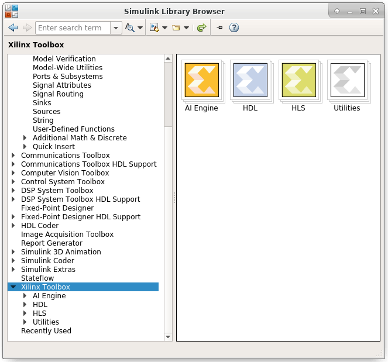

# Vitis Model Composer

Vitis™ Model Composer is a model-based design tool that enables rapid
design exploration within the Simulink environment and accelerates the
path to production on Xilinx devices through automatic code generation.
This provides a library of performance-optimized blocks for design and
implementation of algorithms on Xilinx devices using HDL, HLS and AI
Engine blocks.

Figure: Simulink Library Browser

You can focus on expressing algorithms using blocks from the HLS library
as well as custom user-imported blocks without worrying about
implementation specifics, and leverage all the capabilities of
Simulink’s graphical environment for algorithm design, simulation, and
verification.

The AI Engine library in the Vitis Model Composer includes:

- Blocks that support connection between the AI Engine and the HDL
  blockset.
- A block to import HLS kernels which can be targeted to the PL portion
  of Versal ACAP devices.
- Blocks to import kernels and graphs which can be targeted to the AI
  Engine portion of Versal® ACAP devices.
- Configurable AI Engine functions such as FIR, FFT etc.

The HDL library in Vitis Model Composer contains DSP building blocks.
These blocks include the common DSP building blocks such as adders,
multipliers and registers. Also included are a set of complex DSP
building blocks such as forward error correction blocks, FFTs, filters
and memories. These blocks leverage the Xilinx IP core generators to
deliver optimized results for the selected device.

The HLS library in Vitis Model Composer contains predefined blocks,
including Image Processing and functional blocks for Math, Linear
Algebra, Logic, and Bit-wise operations. The tool transforms your
algorithmic specifications to production-quality implementations through
automatic optimizations that extend the Xilinx High Level Synthesis
technology.

Refer to the following sources for information about Vitis Model
Composer:

- Vitis Model Composer User Guide
  ([UG1483](https://docs.xilinx.com/access/sources/dita/map?Doc_Version=2021.2%20English&url=ug1483-model-composer-sys-gen-user-guide))
- [Vitis Model Composer Tutorial](https://github.com/Xilinx/Vitis_Model_Composer/blob/2023.2/Tutorials/README.md)
- [Vitis Model Composer Product
  Page](https://www.xilinx.com/products/design-tools/vitis/vitis-model-composer.html)

--------------
Copyright (C) 2023 Advanced Micro Devices, Inc. All rights reserved.
SPDX-License-Identifier: MIT
