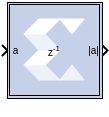

# Vector Absolute

The Vector Absolute block outputs the absolute value of the input of
vector type.

## Description

This block enables 1-D vector support for the primary block operation.

## Parameters

Double-click the icon in your Simulink® model to open the Block
Parameters dialog box.

Basic tab  
Precision  
This parameter allows you to specify the output precision for
fixed-point arithmetic. Floating-point arithmetic output will always be
Full precision.

Full  
The block uses sufficient precision to represent the result without
error.

User Defined  
If you do not need full precision, this option allows you to specify a
reduced number of total bits and/or fractional bits.

Fixed-point Output Type  
Arithmetic type:

Signed (2’s comp)  
The output is a Signed (2’s complement) number.

Unsigned  
The output is an Unsigned number.

Fixed-point Precision  
Number of bits  
Specifies the bit location of the binary point of the output number,
where bit zero is the least significant bit.

Binary point  
Position of the binary point. in the fixed-point output.

Quantization  
Refer to the section [Overflow and
Quantization](common-options-in-block-parameter-dialog-boxes-aa1032308.html#val1538085362909__aa1032322).

Overflow  
Refer to the section [Overflow and
Quantization](common-options-in-block-parameter-dialog-boxes-aa1032308.html#val1538085362909__aa1032322).

Other parameters used by this block are explained in the topic [Common
Options in Block Parameter Dialog
Boxes](common-options-in-block-parameter-dialog-boxes-aa1032308.html).

## LogiCORE™ Documentation

[LogiCORE IP Floating-Point Operator
v7.1](https://www.xilinx.com/support/documentation/ip_documentation/floating_point/v7_1/pg060-floating-point.pdf)
