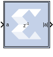

# Vector Absolute

The Vector Absolute block outputs the absolute value of the input of
vector type.

## Description

This block enables 1-D vector support for the primary block operation.

## Parameters

### Basic tab  
#### Precision  
This parameter allows you to specify the output precision for
fixed-point arithmetic. Floating-point arithmetic output will always be
Full precision:

##### Full  
The block uses sufficient precision to represent the result without
error.

##### User Defined:  
If you do not need full precision, this option allows you to specify a
reduced number of total bits and/or fractional bits.

#### Arithmetic type:

##### Signed (2’s comp)  
The output is a Signed (2’s complement) number.

##### Unsigned  
The output is an Unsigned number.

#### Fixed-point Precision  
#####  Number of bits  
Specifies the bit location of the binary point of the output number,
where bit zero is the least significant bit.

##### Binary point  
Position of the binary point. in the fixed-point output.

#### Quantization  
Refer to the section [Overflow and Quantization](../../GEN/common-options/README.md).

#### Overflow  
Refer to the section [Overflow and Quantization](../../GEN/common-options/README.md).

Other parameters used by this block are explained in the topic [Common
Options in Block Parameter Dialog
Boxes](../../GEN/common-options/README.md).

<!--
#### Provide enable port
Selecting the Provide Enable Port option activates an optional enable (en) pin on the block. When the enable signal is not asserted the block holds its current state until the enable signal is asserted again or the reset signal is asserted. Reset signal has precedence over the enable signal. The enable signal has to run at a multiple of the block 's sample rate. The signal driving the enable port must be Boolean.
-->

<!--
#### Latency
Many elements in the Xilinx blockset have a latency option. This defines the number of sample periods by which the block's output is delayed. One sample period might correspond to multiple clock cycles in the corresponding FPGA implementation (for example, when the hardware is over-clocked with respect to the Simulink model). Model Composer does not perform extensive pipelining; additional latency is usually implemented as a shift register on the output of the block.
-->

<!--
#### SSR
This parameter specifies the number of output ports. The number of AI Engine kernels used is equal to the value of SSR parameter.
-->

## LogiCORE™ Documentation

[LogiCORE IP Floating-Point Operator
v7.1](https://docs.xilinx.com/access/sources/ud/document?isLatest=true&url=pg060-floating-point&ft:locale=en-US)

--------------
Copyright (C) 2026 Advanced Micro Devices, Inc.
All rights reserved.

SPDX-License-Identifier: MIT
