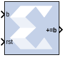
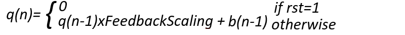

# Accumulator

## Description

The Accumulator block implements an adder or subtractor-based
scaling accumulator. The block's current input is accumulated with a scaled current stored
value. The scale factor is a block parameter.

## Block Interface

The block has an input b and an output q. The output must have the same
width as the input data. The output will have the same arithmetic type
and binary point position as the input. The output q is calculated as
follows:

  

A subtractor-based accumulator replaces addition of the current input
b(n) with subtraction.

## Parameters

### Basic tab  
Parameters specific to the Basic tab are as follows:

#### Operation  
This determines whether the block is adder- or subtractor-based.

#### Fixed-Point Output Precision  
##### Number of bits  
Specifies the bit location of the binary point of the output number,
where bit zero is the least significant bit.

##### Overflow  
Refer to the section [Overflow and
Quantization](matlab:helpview(vmcHelp('name','common-options'))).

#### Feedback scaling  
Specifies the feedback scale factor to be one of the following:

  1, 1/2, 1/4, 1/8, 1/16, 1/32, 1/64, 1/128, or 1/256.

#### Optional Ports  
##### Provide synchronous reset port  
Activates an optional reset (rst) pin on the block. When the reset
signal is asserted, the block goes back to its initial state. However,
when a floating point accumulator is used, the output will be NAN during
reset. The reset signal has precedence over the optional enable signal
available on the block. The reset signal must run at a multiple of the
block's sample rate. The signal driving the reset port must be Boolean.

#### Bypass Option on Reset  
##### Reinitialize with input 'b'  
When selected, the output of the accumulator is reset to the data on
input port b. When not selected, the output of the accumulator is
reset to zero. This option is available only when the block has a reset
port. Using this option has clock speed implications if the accumulator
is in a multirate system. In this case the accumulator is forced to run
at the system rate because the clock enable (CE) signal driving the
accumulator runs at the system rate, and the reset to input operation is
a function of the CE signal.

### Internal Precision tab  
Parameters specific to the Internal Precision tab are as follows:

#### Floating Point Precision  
##### Input MSB Max  
The Most Significant Bit of the largest number that can be accepted.

##### Output MSB Max  
The MSB of the largest result. It can be up to 54 bits greater than the
Input MSB.

##### Output LSB Min  
The Least Significant Bit of the smallest number that can be accepted.
It is also the LSB of the accumulated result.

### Implementation tab  
Parameters specific to the Implementation tab are as follows:

#### Use behavioral HDL (otherwise use core)  
The block is implemented using behavioral HDL. This gives the downstream
logic synthesis tool maximum freedom to optimize for performance or
area.

#### Implement using  
Core logic can be implemented in Fabric or in a DSP48, if a DSP48 is
available in the target device. The default is Fabric.

Other parameters used by this block are explained in the topic [Common
Options in Block Parameter Dialog
Boxes](matlab:helpview(vmcHelp('name','common-options'))).

The Accumulator block always has a latency of 1.

## LogiCORE™ Documentation

Accumulator LogiCORE IP Product Guide
([PG119](https://docs.xilinx.com/access/sources/ud/document?isLatest=true&url=pg119-c-accum&ft:locale=en-US))
