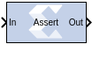
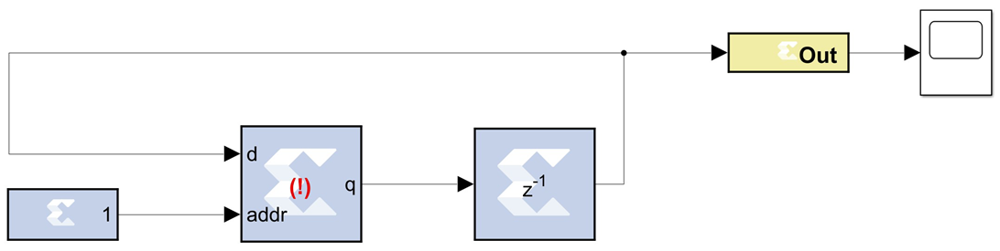
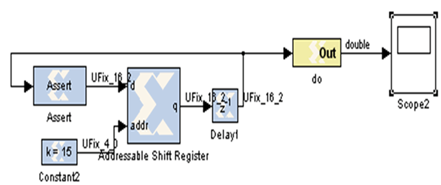

# Assert



## Description

The Assert block is used to assert a rate and/or a type on a
signal. This block has no cost in hardware and can be used to resolve
rates and/or types in situations where designer intervention is
required.

## Parameters

Parameters specific to this block are as follows:

### Type  
#### Assert type  
Specifies whether or not the block will assert that the type at its
input is the same as the type specified. If the types are not the same,
an error message is reported. This block is listed in the following Blockset libraries: Floating-Point and Index.

#### Specify type  
Specifies whether or not the type to assert is provided from a signal
connected to an input port named type or whether it is specified
explicitly from parameters in the Assert block dialog box.

#### Output Type  
Specifies the data type of the output. Can be Boolean, Fixed-point, or
Floating-point.

#### Arithmetic Type  
If the Output Type is specified as Fixed-point, you can select Signed
(2’s comp) or Unsigned as the Arithmetic Type.

#### Fixed-point Precision  
##### Number of bits
Specifies the bit location of the binary point of the output number,
where bit zero is the least significant bit.

##### Binary point
Position of the binary point in the fixed-point output.

#### Floating-point Precision  
##### Single
Specifies single precision (32 bits).

##### Double 
Specifies double precision (64 bits).

##### Custom
Activates the field below so you can specify the Exponent width and the Fraction width.

#### Exponent width
Specify the exponent width.

#### Fraction width
Specify the fraction width.

### Rate
#### Assert rate  
Specifies whether or not the block will assert that the rate at its
input is the same as the rate specified. If the rates are not the same,
an error message is reported.

#### Specify rate  
Specifies whether or not the initial rate to assert is provided from a
signal connected to an input port named rate, or whether it is
specified Explicitly from the Sample rate parameter in the Assert block
dialog box.


#### Provide output port  
Specifies whether or not the block will feature an output port. The type
and/or rate of the signal presented on the output port is the type
and/or rate specified for assertion.

Other parameters used by this block are explained in the topic [Common
Options in Block Parameter Dialog
Boxes](../../GEN/common-options/README.md).

The Output type parameter in this block uses the same description as the
Arithmetic Type described in the topic [Common Options in Block
Parameter Dialog
Boxes](../../GEN/common-options/README.md).

The Assert block does not use a LogiCORE™™ and does not use
resources when implemented in hardware.

## Using the Assert Block to Resolve Rates and Types

In cases where the simulation engine cannot resolve rates or types, the
Assert block can be used to force a particular type or rate. In general
this might be necessary when using components that use feedback and act
as a signal source. For example, the circuit below requires an Assert
block to force the rate and type of an SRL16. In this case, you can use
an Assert block to 'seed' the rate which is then propagated back to the
SRL16 input through the SRL16 and back to the Assert block. The design
below fails with the following message when the Assert block is not
used.

``` pre
The data types could not be established for the feedback paths through this block. You might need to add Assert blocks to instruct the system how to resolve types.
```



To resolve this error, an Assert block is introduced in the feedback
path as shown below:


In the example, the Assert block is required to resolve the type, but
the rate could have been determined by assigning a rate to the Constant
clock. The decision whether to use Constant blocks or Assert blocks to
force rates is arbitrary and can be determined on a case by case basis.

Vitis Model Composer now resolves rates and types deterministically, however
in some cases, the use of Assert blocks might be necessary for some
Model Composer HDL components, even if they are resolvable. These blocks
might include Black Box components and certain IP blocks.
