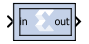

# Vector Assert

The Vector Assert block asserts a user-defined sample rate and/or type
on Vector inputs.

Hardware notes: In hardware this blocks costs nothing.

## Description

Super Sample Rate (SSR): Use this configurable GUI parameter to control
processing of multiple data samples on every sample period. This block
enables 1-D vector data support for the primary block operation.

## Block Parameters

The block parameters dialog box can be invoked by double-clicking the
icon in your Simulink® model.

Parameters specific to this block are as follows:

Type  
Assert type  
Specifies whether or not the block will assert that the type at its
input is the same as the type specified. If the types are not the same,
an error message is reported.

Specify type  
Specifies whether or not the type to assert is provided from a signal
connected to an input port named type or whether it is specified
Explicitly from parameters in the Assert block dialog box.

Output Type  
Specifies the data type of the output. Can be Boolean, Fixed-point, or
Floating-point.

Arithmetic Type  
If the Output Type is specified as Fixed-point, you can select Signed
(2’s comp) or Unsigned as the Arithmetic Type.

Fixed-point Precision  
Number of bits  
Specifies the bit location of the binary point of the output number,
where bit zero is the least significant bit.

Binary point  
Position of the binary point in the fixed-point output.

Floating-point Precision  
Single  
Specifies single precision (32 bits).

Double  
Specifies double precision (64 bits).

Custom  
This block is listed in the following: Activates the field below so you
can specify the Exponent width and the Fraction width.

Exponent width  
Specify the exponent width.

Fraction width  
Specify the fraction width.

&nbsp;

Rate  
Assert rate  
specifies whether or not the block will assert that the rate at its
input is the same as the rate specified. If the rates are not the same,
an error message is reported.

Specify rate  
Specifies whether or not the initial rate to assert is provided from a
signal connected to an input port named `rate`, or whether it is
specified Explicitly from the Sample rate parameter in the Assert block
dialog box.

&nbsp;

Provide output port  
Specifies whether or not the block will feature an output port. The type
and/or rate of the signal presented on the output port is the type
and/or rate specified for assertion.

Other parameters used by this block are explained in the topic [Common
Options in Block Parameter Dialog
Boxes](common-options-in-block-parameter-dialog-boxes-aa1032308.html).

The Output type parameter in this block uses the same description as the
Arithmetic Type described in the topic [Common Options in Block
Parameter Dialog
Boxes](common-options-in-block-parameter-dialog-boxes-aa1032308.html).

The Vector Assert block does not use a Xilinx LogiCORE™™ and does not
use resources when implemented in hardware.
