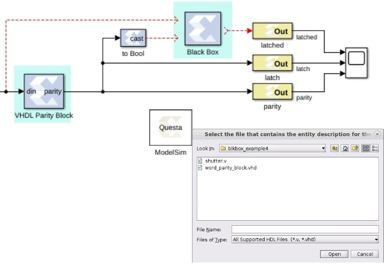

# Black Box

The Vitis Model Composer Black Box block provides a way to incorporate
hardware description language (HDL) models into Model Composer.


## Description

The block is used to specify both the simulation behavior in Simulink
and the implementation files to be used during code generation with
Model Composer. A black box's ports produce and consume the same sorts
of signals as other HDL blocks. When a black box is translated into
hardware, the associated HDL entity is automatically incorporated and
wired to other blocks in the resulting design.

The black box can be used to incorporate either VHDL or Verilog into a
Simulink model. Black box HDL can be co-simulated with Simulink using
the Model Composer interface to the Vivado® simulator.

In addition to incorporating HDL into a Model Composer model, the black
box can be used to define the implementation associated with an external
simulation model.

### Requirements on HDL for Black Boxes

Every HDL component associated with a black box must adhere to the
following Model Composer requirements and conventions:

- The entity name must not collide with any entity name that is reserved
  by Model Composer (e.g., xlfir, xlregister).
- Bi-directional ports are supported in HDL black boxes; however they
  will not be displayed in the Model Composer as ports, they will only
  appear in the generated HDL after netlisting.
- For a Verilog Black Box, the module and port names must be lower case,
  and follow standard Verilog naming conventions.
- For a VHDL Black Box, the supported port data types are std_logic,
  std_logic_vector, signed, unsigned, boolean, sfixed, ufixed, float32
  and float64.
- Top level ports should be ordered most significant bit down to least
  significant bit, as in std_logic_vector(7 downto 0), and not
  std_logic_vector(0 to 7).
- Top level ports with signed binary types in Verilog RTL are not
  supported (for example, `18'sb1010`). Only unsigned binary types are
  supported.
- Clock and clock enable ports must be named according to the
  conventions described below.
  - Any port that is a clock or clock enable must be of type std_logic.
    For Verilog black boxes, such ports must be non-vector inputs, e.g.,
    input clk.
  - Clock and clock enable ports on a black box are not treated like
    other ports. When a black box is translated into hardware, Model
    Composer drives the clock and clock enable ports with signals whose
    rates can be specified according to the block's configuration and
    the sample rates that drive it in Simulink.
  - Falling-edge triggered output data cannot be used.

**IMPORTANT**: Model Composer does not import .dcp files as an IP for
blackbox flows.

To understand how clocks work for black boxes, it helps to understand
how Model Composer handles Timing and Clocking. In general, to produce
multiple rates in hardware, Model Composer uses a single clock along
with multiple clock enables, one enable for each rate. The enables
activate different portions of hardware at the appropriate times. Each
clock enable rate is related to a corresponding sample period in
Simulink. Every HDL block that requires a clock has at least one clock
and clock enable port in its HDL counterpart. Blocks having multiple
rates have additional clock and clock enable ports.

Clocks for black boxes work like those for other HDL blocks. The black
box HDL must have a separate clock and clock enable port for each
associated sample rate in Simulink. Clock and clock enable ports in
black box HDL should be expressed as follows:

- Clock and clock enables must appear as pairs (for every clock, there
  is a corresponding clock enable, and vice-versa). Although a black box
  can have more than one clock port, a single clock source is used to
  drive each clock port. Only the clock enable rates differ.
- Each clock name (respectively, clock enable name) must contain the
  substring clk (resp., ce).
- The name of a clock enable must be the same as that for the
  corresponding clock, but with ce substituted for clk. For example, if
  the clock is named src_clk_1, then the clock enable must be named
  src_ce_1.

Clock and clock enable ports are not visible on the black box block
icon. A work around is required to make the top-level HDL clock enable
port visible in Model Composer; the work around is to add a separate
enable port to the top-level HDL and AND this signal with the actual
clock enable signal.

### The Black Box Configuration Wizard

The Back Box Configuration Wizard is a tool that makes it easy to
associate a Verilog or VHDL component to a black box. The Black Box
Configuration Wizard is invoked whenever a black box is added to a
model.

**IMPORTANT**: To use the wizard, copy the .v or .vhd file that defines the
HDL component for a black box into the directory that contains the
model.

When a new black box is added to a model, the Configuration Wizard opens
automatically. An example is shown in the figure below.




From this wizard choose the HDL file that should be associated to the
black box, then press the Open button. The wizard generates a
configuration M-function (described below) for the black box, and
associates the function with the block. The configuration M-function
produced by the wizard can usually be used without change, but
occasionally the function must be tailored by hand. Whether the
configuration M-function needs to be modified depends on how complex the
HDL is.

### The Black Box Configuration M-Function

A black box must describe its interface (e.g., ports and generics) and
its implementation to Model Composer. It does this through the
definition of a MATLAB M-function (or p-function) called the block's
configuration. The name of this function must be specified in the block
parameter dialog box under the Block Configuration parameter.

The configuration M-function does the following:

- It specifies the top-level entity name of the HDL component that
  should be associated with the black box.
- It selects the language (for example, VHDL or Verilog).
- It describes ports, including type, direction, bit width, binary point
  position, name, and sample rate. Ports can be static or dynamic.
  Static ports do not change; dynamic ports change in response to
  changes in the design. For example, a dynamic port might vary its
  width and type to suit the signal that drives it.
- It defines any necessary port type and data rate checking.
- It defines any generics required by the black box HDL.
- It specifies the black box HDL and other files (e.g., EDIF) that are
  associated with the block.
- It defines the clocks and clock enables for the block (see the
  following topic on clock conventions).
- It declares whether the HDL has any combinational feed-through paths.

Model Composer provides an object-based interface for configuring black
boxes consisting of two types of objects: BlockDescriptors, used to
define entity characteristics, and PortDescriptors, used to define port
characteristics. This interface is used to provide Model Composer
information in the configuration M-function for black box about the
block's interface, simulation model, and implementation.

If the HDL for a black box has at least one combinational path (for
example, a direct feed-through from an input to an output port), the
block must be tagged as combinational in its configuration M-function
using the tagAsCombinational method. A black box can be a mixture (for
example, some paths can be combinational while others are not).

IMPORTANT: It is essential that a block containing a combinational path
be tagged as such. Doing so allows Model Composer to identify such
blocks to the Simulink simulator. If this is not done, simulation
results are incorrect.

The configuration M-function for a black box is invoked several times
when a model is compiled. The function typically includes code that
depends on the block's input ports. For example, sometimes it is
necessary to set the data type and/or rate of an output port based on
the attributes on an input port. It is sometimes also necessary to check
the type and rate on an input port. At certain times when the function
is invoked, Simulink might not yet know enough for such code to be
executed.

To avoid the problems that arise when information is not yet known (in
particular, exceptions), BlockDescriptor members `inputTypesKnown` and
`inputRatesKnown` can be used. These are used to determine if Simulink
is able, at the moment, to provide information about the input port
types and rates respectively. The following code illustrates this point.

``` pre
if (this_block.inputTypesKnown) 
% set dynamic output port types 
  % set generics that depend on input port types 
  % check types of input ports 
end
```

If all input rates are known, this code sets types for dynamic output
ports, sets generics that depend on input port types, and verifies input
port types are appropriate. Avoid the mistake of including code in these
conditional blocks (e.g., a variable definition) that is needed by code
outside of the conditional block.

Note that the code shown above uses an object named this_block. Every
black box configuration M-function automatically makes this_block
available through an input argument. In MATLAB, this_block is the object
that represents the black box, and is used inside the configuration
M-function to test and configure the black box. Every this_block object
is an instance of the `SysgenBlockDescriptor` MATLAB class. The methods
that can be applied to this_block are specified in Appendix A. A good
way to generate example configuration M-function is to run the
Configuration Wizard (described below) on simple VHDL entities.

### Sample Periods

The output ports, clocks, and clock enables on a black box must be
assigned sample periods in the configuration M-function. If these
periods are dynamic, or the black box needs to check rates, then the
function must obtain the input port sample periods. Sample periods in
the black box are expressed as integer multiples of the system rate as
specified by the Simulink system period field on the HDL Clock Settings
tab of the Model Composer Hub block. For example, if the Simulink System
Period is 1/8, and a black box input port runs at the system rate (for
example, at 1/8), then the configuration M-function sees 1 reported as
the port's rate. Likewise, if the Simulink System Period is specified as
pi, and an output port should run four times as fast as the system rate
(for example, at 4\*pi), then the configuration M-function should set
the rate on the output port to 4. The appropriate rate for constant
ports is Inf.

As an example of how to set the output rate on each output port,
consider the following code segment:

``` pre
block.outport(1).setRate(theInputRate); 
block.outport(2).setRate(theInputRate*5); 
block.outport(3).setRate(theInputRate*5);
```

The first line sets the first output port to the same rate as the input
port. The next two lines set the output rate to 5 times the rate of the
input.

## Block Parameters

### Basic tab  
Parameters specific to the Basic tab are as follows.

#### Block Configuration M-Function  
* Specifies the name of the configuration M-function that is associated to
the black box. Ordinarily the file containing the function is stored in
the directory containing the model, but it can be stored anywhere on the
MATLAB path. Note that MATLAB limits all function names (including those
for configuration M-functions) to 63 characters. Do not include the file
extension (".m" or ".p") in the edit box.

#### Simulation Mode  
* Tells the mode (Inactive, Vivado Simulator, or External co-simulator) to
use for simulation. When the mode is Inactive, the black box ignores all
input data and writes zeroes to its output ports. Usually for this mode
the black box should be coupled using a Variant Subsystem. For more
information, see Variant Subsystems and Model Composer in the Vitis
Model Composer User Guide
([UG1483](https://docs.xilinx.com/access/sources/dita/map?Doc_Version=2022.2%20English&url=ug1483-model-composer-sys-gen-user-guide)).

Model Composer supports the Questa simulator from Mentor Graphics®, Inc.
for HDL co-simulation. For co-simulation of Verilog black boxes, a mixed
mode license is required. This is necessary because the portion of the
design that Model Composer writes is VHDL.

**Note**: When you use the Questa simulator, the Default Radix used is
Binary.

Usually the co-simulator block for a black box is stored in the same
Subsystem that contains the black box, but it is possible to store the
block elsewhere. The path to a co-simulation block can be absolute, or
can be relative to the Subsystem containing the black box (e.g.,
"../Questa"). When simulating, each co-simulator block uses one license.
To avoid running out of licenses, several black boxes can share the same
co-simulation block. Model Composer automatically generates and uses the
additional VHDL needed to allow multiple blocks to be combined into a
single Questa simulation.

## Data Type Translation for HDL Co-Simulation

During co-simulation, ports in Model Composer drive ports in the HDL
simulator, and vice-versa. Types of signals in the tools are not
identical, and must be translated. The rules used for translation are
the following.

- A signal in Model Composer can be Boolean, unsigned or signed fixed
  point. Fixed-point signals can have indeterminate values, but Boolean
  signals cannot. If the signal's value is indeterminate in Model
  Composer, then all bits of the HDL signal become 'X', otherwise the
  bits become 0's and 1's that represent the signal's value.
- To bring HDL signals back into Model Composer, standard logic types
  are translated into Booleans and fixed-point values as instructed by
  the black box configuration M-function. When there is a width
  mismatch, an error is reported. Indeterminate signals of all varieties
  (weak high, weak low, etc.) are translated to Model Composer
  indeterminates. Any signal that is partially indeterminate in HDL
  simulation (e.g., a bit vector in which only the topmost bit is
  indeterminate) becomes entirely indeterminate in Model Composer.
- HDL to Model Composer translations can be tailored by adding a custom
  simulation-only top-level wrapper to the VHDL component. Such a
  wrapper might, for example, translate every weak low signal to 0 or
  every indeterminate signal to 0 or 1 before it is returned to Model
  Composer.

## Example

The following is an example VHDL entity that can be associated to a HDL
black box.

``` pre
library IEEE; 
use IEEE.std_logic_1164.all; 
use IEEE.numeric_std.all; 
entity word_parity_block is 
  generic (width : integer := 8); 
port (din : in std_logic_vector(width-1 downto 0); 
  parity : out std_logic); 
end word_parity_block; 
architecture behavior of word_parity_block is 
begin 
  WORD_PARITY_Process : process (din) 
  variable partial_parity : std_logic := '0'; 
  begin 
  partial_parity := '0'; 
  XOR_BIT_LOOP: for N in din'range loop 
  partial_parity := partial_parity xor din(N); 
  end loop; -- N 
  parity <= partial_parity after 1 ns ; 
  end process WORD_PARITY_Process; 
end behavior;
```

The following is an example configuration M-function. It makes the VHDL
shown above available inside a HDL black box.

``` pre
function word_parity_block_config(this_block)
this_block.setTopLevelLanguage('VHDL'); 
  this_block.setEntityName('word_parity_block'); 
  this_block.tagAsCombinational; 
  this_block.addSimulinkInport('din'); 
  this_block.addSimulinkOutport('parity'); 
  parity = this_block.port('parity'); 
  parity.setWidth(1); 
  parity.useHDLVector(false);
  % ----------------------------- 
  if (this_block.inputTypesKnown) 
  this_block.addGeneric('width', 
  this_block.port('din').width); 
  end  % if(inputTypesKnown) 
  % ----------------------------- 
  % ----------------------------- 
  if (this_block.inputRatesKnown) 
  din = this_block.port('din'); 
  parity.setRate(din.rate); 
  end  % if(inputRatesKnown) 
  % ----------------------------- 
  this_block.addFile('word_parity_block.vhd');
  return;
```
