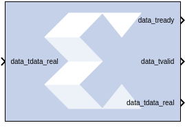

# CIC Compiler 4.0

The CIC Compiler provides the ability to design and implement
AXI4-Stream-compliant Cascaded Integrator-Comb (CIC) filters for a
variety of FPGA devices.

## Description

CIC filters, also known as Hogenauer filters, are multi-rate filters
often used for implementing large sample rate changes in digital
systems. They are typically employed in applications that have a large
excess sample rate. That is, the system sample rate is much larger than
the bandwidth occupied by the processed signal as in digital down
converters (DDCs) and digital up converters (DUCs). Implementations of
CIC filters have structures that use only adders, subtractors, and delay
elements. These structures make CIC filters appealing for their
hardware-efficient implementations of multi-rate filtering.

### Sample Rates and the CIC Compiler Block

The CIC Compiler block must always run at the system rate because the
CIC Compiler block has a programmable rate change option and Simulink®
cannot inherently support it. You should use the "ready" output signal
to indicate to downstream blocks when a new sample is available at the
output of the CIC Compiler block.

The CIC will downsample the data, but the sample rate will remain at the
clock rate. If you look at the output of the CIC Compiler block, you
will see each output data repeated R times for a rate change of R while
the data_tvalid signal pulses once every R cycles. The downstream
blocks can be clocked at lower-than-system rates without any problems as
long as the clock is never slower than the rate change R.

There are several different ways this can be handled. You can leave the
entire design running at the system rate then use registers with
enables, or enables on other blocks to capture data at the correct time.
Or alternatively, you can use a downsample block corresponding to the
lowest rate change R, then again use enable signals to handle the cases
when there are larger rate changes.

If there are not many required rate changes, you can use MUX blocks and
use a different downsample block for each different rate change. This
might be the case if the downstream blocks are different depending on
the rate change, basically creating different paths for each rate. Using
enables as described above will probably be the most efficient method.

If you are not using the CIC Compiler block in a programmable mode, you
can place an up/down sample block after the CIC Compiler to correctly
pass on the sample rate to downstream blocks that will inherit the rate
and build the proper CE circuitry to automatically enable those
downstream blocks at the new rate.

## Parameters

### Filter Specification tab  
Parameters specific to the Filter Specification tab are as follows.

#### Filter Specification  
##### Filter Type  
The CIC core supports both interpolation and decimation architectures.
When the filter type is selected as decimator the input sample stream is
down-sampled by the factor R. When an interpolator is selected the input
sample is up-sampled by R.

##### Number of Stages  
Number of integrator and comb stages. If N stages are specified, there
are N integrators and N comb stages in the filter. The valid range for
this parameter is 3 to 6.

##### Differential Delay  
Number of unit delays employed in each comb filter in the comb section
of either a decimator or interpolator. The valid range of this parameter
is 1 or 2.

##### Number of Channels  
Number of channels to support in implementation. The valid range of this
parameter is 1 to 16.

#### Sample Rate Change Specification  
##### Sample Rate Changes  
Option to select between Fixed or Programmable.

##### Fixed or Initial Rate(ir)  
Specifies initial or fixed sample rate change value for the CIC. The
valid range for this parameter is 4 to 8192.

##### Minimum Rate  
The minimum rate change value for programmable rate change. The valid
range for this parameter is 4 to fixed rate (ir).

##### Maximum Rate  
The maximum rate change value for programmable rate change. The valid
range for this parameter is fixed rate (ir) to 8192.

#### Hardware Oversampling Specification  
##### Select format  
Choose Maximum_Possible, Sample_Period, or Hardware Oversampling Rate.
Selects which method is used to specify the hardware oversampling rate.
This value directly affects the level of parallelism of the block
implementation and resources used. When “Maximum Possible” is selected,
the block uses the maximum oversampling given the sample period of the
signal connected to the Data field of the s_axis_data_tdata port. When
you select “Hardware Oversampling Rate”, you can specify the
oversampling rate. When “Sample Period” is selected, the block clock is
connected to the system clock and the value specified for the Sample
Period parameter sets the input sample rate the block supports. The
Sample Period parameter also determines the hardware oversampling rate
of the block. When “Sample Period” is selected, the block is forced to
use the s_axis_data_tvalid control port.

##### Sample period  
Integer number of clock cycles between input samples. When the multiple
channels have been specified, this value should be the integer number of
clock cycles between the time division multiplexed input sample data
stream.

##### Hardware Oversampling Rate  
Enter the hardware oversampling rate if you select
Hardware_Oversampling_Rate as the format.

### Implementation tab  
#### Numerical Precision  
##### Quantization  
Can be specified as Full_Precision or Truncation.

**Note**: Truncation occurs at the output stage only.

##### Output Data Width  
Can be specified up to 48 bits for the Truncation option above.

#### Optional  
##### Use Xtreme DSP slice  
This field specifies that if possible, use the XtremeDSP slice (DSP48
type element) in the target device.

##### Use Streaming Interface  
Specifies whether or not to use a streaming interface for multiple
channel implementations.

#### Control Options  
##### ACLKEN  
Specifies if the block has a clock enable port (the equivalent of
selecting the Has ACLKEN option in the CORE Generator GUI).

##### ARESERTn  
Specifies that the block has a reset port. Active-Low synchronous clear.
A minimum ARESETn pulse of two cycles is required.

##### Has TREADY  
Specifies if the block has a TREADY port for the Data Output Channel
(the equivalent of selecting the Has_DOUT_TREADY option in the CORE
Generator GUI).

Other parameters used by this block are explained in the topic [Common
Options in Block Parameter Dialog
Boxes](../../GEN/common-options/README.md).

## LogiCORE™ Documentation

CIC Compiler LogiCORE IP Product Guide
([PG140](https://docs.xilinx.com/access/sources/ud/document?isLatest=true&url=pg140-cic-compiler&ft:locale=en-US))

--------------
Copyright (C) 2024 Advanced Micro Devices, Inc.
All rights reserved.
