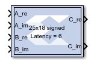

# Vector Complex Mult

The Vector Complex Multiplier block supports multiplication of two
complex input vectors.

## Description

Super Sample Rate (SSR): This configurable GUI parameter is primarily
used to control processing of multiple data samples on every sample
period. This blocks enable 1-D vector support for the primary block
operation.

## Data Type Support

- Supports fixed and floating-point data type inputs on both port A and
  B.
- The number of bits on Input port A should be greater than or equal to
  26.
- The number of bits on Input port B should be greater than or equal to
  17.
