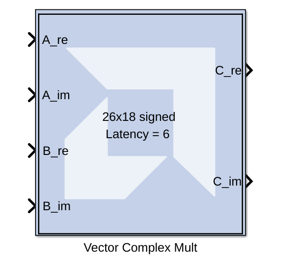
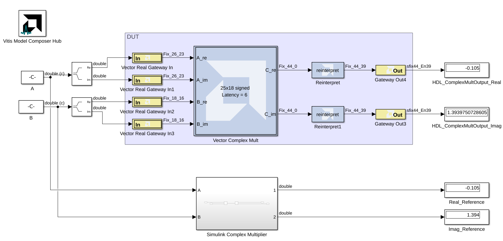

# Vector Complex Mult

## Description

The Vector Complex Multiplier block supports multiplication of two
complex input vectors.

## Parameters
#### Super Sample Rate (SSR) 
This configurable GUI parameter is primarily
used to control processing of multiple data samples on every sample
period. This blocks enable 1-D vector support for the primary block
operation.

## Data Type Support

- Supports fixed and floating-point data type inputs on both port A and B.
- The number of bits on Input port A should be greater than or equal to 26.
- The number of bits on Input port B should be greater than or equal to 18.

## Output Data Type Interpretation

- The output data type is always set to signed fixed-point with a word length of 44 bits and and no fractional component (i.e., a fractional length of 0 bits).
- The user is responsible for correctly reinterpreting the output data type based on the input binary points.
- For example, if the input data types for Port A and Port B are Fix_26_23 (word length = 26, fractional length = 23) and Fix_18_16 respectively, then the expected fractional length of the output will be 39 (23 + 16).
  
**Note**: Use the Reinterpret block to convert the output data type as needed.

## Examples

***Click on the images below to open each model.***

--------------
Copyright (C) 2025 Advanced Micro Devices, Inc.
All rights reserved.

SPDX-License-Identifier: MIT
