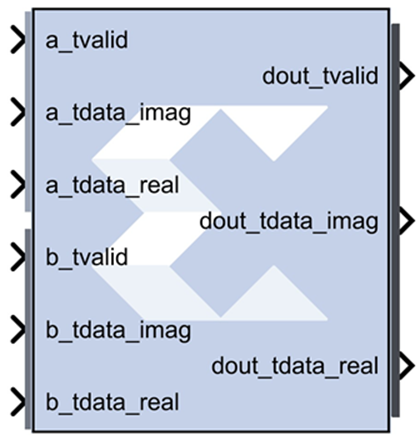

# Complex Multiplier 6.0

The Complex Multiplier block implements AXI4-Stream compliant,
high-performance, optimized complex multipliers for devices based on
user-specified options.

The two multiplicand inputs and optional rounding bit are input on
independent AXI4-Stream channels as slave interfaces and the resulting
product output using an AXI4-Stream master interface.

Within each channel, operands, and the results are represented in signed
two’s complement format. The operand widths. and the result width are
parameterizable.

## Block Parameters

Basic tab  
Parameters specific to the Basic tab are:
Channel A Options  
Has TLAST  
Adds a tlast input port to the A channel of the block.

Has TUSER  
Adds a tuser input port to the A channel of the block.

TUSER Width  
User defined, maximum Limit range (1, 256).

Channel B Options  
Has TLAST  
Adds a tlast input port to the B channel of the block.

Has TUSER  
Adds a tuser input port to the B channel of the block.

TUSER Width  
User defined. maximum Limit range (1, 256).

Multiplier Construction Options  
Use_Mults  
Use embedded multipliers/XtremeDSP slices.

Use_LUTs  
Use LUTs in the fabric to construct multipliers.

Optimization Goal  
Only available if Use_Mults is selected.

Resources  
Uses the 3-real-multiplier structure. However, a 4-real-multiplier
structure is used when the 3- l- multiplier structure uses more
multiplier resources.

Performance  
Always uses the 4-real multiplier structure to allow the best frequency
performance to be achieved.

Flow Control Options  
Blocking  
Selects “Blocking” mode. In this mode, the lack of data on one input
channel does block the execution of an operation if data is received on
another input channel.

NonBlocking  
Selects “Non-Blocking” mode. In this mode, the lack of data on one input
channel does not block the execution of an operation if data is received
on another input channel.

&nbsp;

Page 2 tab  
Output Product Range  
Select the output bit width. The values are automatically set to provide
the full-precision product when the A and B operand widths are set. The
output is sign-extended if required.

The natural output width for complex multiplication is (APortWidth +
BPortWidth + 1). When the Output Width is set to be less than this, the
most significant bits of the result are those output; the remaining bits
will either be truncated or rounded according to Output Rounding option
selected. That is to say, the output MSB is now fixed at (APortWidth +
BPortWidth). For details please refer to the document [LogiCORE IP
Complex Multiplier
v6.0](https://www.xilinx.com/support/documentation/ip_documentation/cmpy/v6_0/pg104-cmpy.pdf)
Product Guide.

Output Rounding  
If rounding is required, the Output LSB must be greater than zero.

Truncate  
Truncate the output.

Random_Rounding  
When this option is selected, a ctrl_tvalid and ctrl_tdata input port is
added to the block. Bit 0 of ctrl_tdata input determines the particular
type if rounding for the operation. For details, refer to the Rounding
section of the Complex Multiplier LogiCORE IP Product Guide
([PG104](https://www.xilinx.com/cgi-bin/docs/ipdoc?c=cmpy;v=latest;d=pg104-cmpy.pdf)).

Channel CTRL Options  
The following options are activated when Random Rounding is selected.

Has TLAST  
Adds a ctrl_tlast input port to the block.

Has TUSER  
Adds a ctrl_user input port to the block.

TUSER Width  
Specifies the bit width of the ctrl_tuser input port.

Output TLAST Behavior  
Determines the behavior of the dout_tlast output port.

Null  
Output is null.

Pass_A_TLAST  
Pass the value of the a_tlast input port to the dout_tlast output port.

Pass B_TLAST  
Pass the value of the b_tlast input port to the dout_tlast output port.

Pass CTRL_TLAST  
Pass the value of the ctrl_tlast input port to the dout_tlast output
port.

OR_all_TLASTS  
Pass the logical OR of all the present TLAST input ports.

AND_all_TLASTS  
Pass the logical AND of all the present TLAST input ports.

Core Latency  
Latency Configuration  
Automatic  
Block latency is automatically determined by Model Composer by
pipelining the underlying LogiCORE™ for maximum performance.

Manual  
You can adjust the block latency specifying the minimum block latency.

Minimum Latency  
Entry field for manually specifying the minimum block latency.

Control Signals  
ACLKEN  
Enables the clock enable (aclken) pin on the core. All registers in the
core are enabled by this control signal.

ARESETn  
Active-Low synchronous clear input that always takes priority over
ACLKEN. A minimum ARESETn active pulse of two cycles is required, since
the signal is internally registered for performance. A pulse of one
cycle resets the core, but the response to the pulse is not in the cycle
immediately following.

&nbsp;

Advanced tab  
Block Icon Display

Display shortened port names  
On by default. For example, when unchecked, dout_tvalid becomes
m_axis_dout_tvalid.

## LogiCORE™ Documentation

Complex Multiplier LogiCORE IP Product Guide
([PG104](https://www.xilinx.com/cgi-bin/docs/ipdoc?c=cmpy;v=latest;d=pg104-cmpy.pdf))
