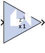

# CMult

## Description
The CMult block implements a gain operator, with output equal to
the product of its input by a constant value. This value can be a
MATLAB® expression that evaluates to a constant.

## Parameters

### Basic tab  
Parameters specific to the Basic tab are as follows:

#### Constant Type  

##### Fixed-point  
Use fixed-point data type.

##### Floating-point  
Use floating-point data type. Can be a constant or an expression. If the
constant cannot be expressed exactly in the specified fixed-point type,
its value is rounded and saturated as needed.

#### Number of bits  
Specifies the bit location of the binary point of the constant, where
bit zero is the least significant bit.

#### Binary point  
Position of the binary point.

#### Floating-point Precision  
##### Single  
Specifies single precision (32 bits)

##### Double  
Specifies double precision (64 bits)

##### Custom  
Activates the field below so you can specify the Exponent width and the
Fraction width.

#### Exponent width  
Specify the exponent width.

#### Fraction width  
Specify the fraction width.

### Output tab  

#### Precision  
This parameter allows you to specify the output precision for
fixed-point arithmetic. Floating point arithmetic output will always be
Full precision.

##### Full  
The block uses sufficient precision to represent the result without
error.

##### User Defined  
If you do not need full precision, this option allows you to specify a
reduced number of total bits and/or fractional bits.
 
#### Arithmetic type  
##### Signed (2’s comp)  
The output is a Signed (2’s complement) number.

##### Unsigned  
The output is an Unsigned number.

#### Fixed-point Precision  
##### Number of bits  
Specifies the bit location of the binary point of the output number,
where bit zero is the least significant bit.

##### Binary point  
Position of the binary point in the fixed-point output.

##### Quantization  
Refer to the section [Overflow and
Quantization](matlab:helpview(vmcHelp('name','common-options'))).

##### Overflow  
  Refer to the section [Overflow and
Quantization](matlab:helpview(vmcHelp('name','common-options'))).

### Implementation tab  
Parameters specific to the Implementation tab are as follows.

#### Use behavioral HDL description (otherwise use core)  
When selected, Model Composer uses behavioral HDL, otherwise it uses the LogiCORE™ Multiplier. When this option is not selected (false)
Model Composer internally uses the behavioral HDL model for simulation
if any of the following conditions are true:

- The constant value is 0 (or is truncated to 0).
- The constant value is less than 0 and its bit width is 1.
- The bit width of the constant or the input is less than 1 or is
  greater than 64.
- The bit width of the input data is 1 and its data type is xlFix.
 
#### Implement using  
Specifies whether to use distributed RAM or block RAM.

#### Test for optimum pipelining  
Checks if the Latency provided is at least equal to the optimum pipeline
length supported for the given configuration of the block. Latency
values that pass this test imply that the core produced is optimized for
speed.

Other parameters used by this block are explained in the topic [Common
Options in Block Parameter Dialog
Boxes](../../GEN/common-options/README.md).

## LogiCORE™ Documentation

LogiCORE IP Multiplier
v12.0 [(PG108)](https://docs.xilinx.com/access/sources/ud/document?isLatest=true&url=pg108-mult-gen&ft:locale=en-US)

LogiCORE IP Floating-Point Operator
v7.1 [(PG060)](https://docs.xilinx.com/access/sources/ud/document?isLatest=true&url=pg060-floating-point&ft:locale=en-US)

--------------
Copyright (C) 2024 Advanced Micro Devices, Inc.
All rights reserved.

SPDX-License-Identifier: MIT
