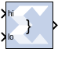

# Concat

## Description

The Concat block performs a concatenation of n bit vectors
represented by unsigned integer numbers, for example, n unsigned numbers
with binary points at position zero.
The [Reinterpret](../../HDL/reinterpret/README.md) block provides capabilities
that can extend the functionality of the Concat block.

## Block Interface

The block has n input ports, where n is some value between 2 and 1024,
inclusively, and one output port. The first and last input ports are
labeled hi and low, respectively. Input ports between these two ports
are not labeled. The input to the hi port will occupy the most
significant bits of the output and the input to the lo port will occupy
the least significant bits of the output.

## Parameters

Parameters specific to this block are as follows:

#### Number of Inputs: 
Specifies number of inputs, between 2 and 1024,
  inclusively, to concatenate together.

Other parameters used by this block are explained in the topic [Common
Options in Block Parameter Dialog
Boxes](matlab:helpview(vmcHelp('name','common-options'))).

The Concat block does not use a LogiCORE™.
