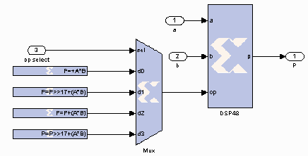

# Constant

## Description

The Constant block generates a constant that can be a fixed-point
value, or a Boolean value. This block is similar to the Simulink®
constant block, but can be used to directly drive the inputs on HDL
blocks.

### DSP48 Instruction Mode

The constant block, when set to create a DSP48 instruction, is useful
for generating DSP48 control sequences. The following figure shows an
example. The example implements a 35x35-bit multiplier using a sequence
of four instructions in a DSP48 block. The constant blocks supply the
desired instructions to a multiplexer that selects each instruction in
the desired sequence.

  

## Parameters

### Basic tab  
Parameters specific to the Basic tab are as follows:

#### Constant Value  
Specifies the value of the constant. When changed, the new value appears
on the block icon. If the constant data type is specified as fixed-point
and cannot be expressed exactly in the specified fixed-point type, its
value is rounded and saturated as needed. A positive value is
implemented as an unsigned number, a negative value as signed.

#### Output Type  
Specifies the data type of the output. Can be Boolean, Fixed-point, or
Floating-point.

#### Arithmetic Type  
If the Output Type is specified as Fixed-point, you can select Signed
(2’s comp), Unsigned, or DSP48 instruction as the Arithmetic Type.

##### Number of bits  
Specifies the bit location of the binary point of the output number,
where bit zero is the least significant bit.

##### Binary point  
Position of the binary point in the fixed-point output.

#### Floating-point Precision  
###### Single  
Specifies single precision (32 bits).

###### Double  
Specifies double precision (64 bits)

###### Custom  
Activates the field below so you can specify the Exponent width and the
Fraction width.

#### Exponent width  
Specifies the exponent width.

#### Fraction width  
Specifies the fraction width.
 
###### Sampled Constant  
Allows a sample period to be associated with the constant output and
inherited by blocks that the constant block drives. (This is useful
mainly because the blocks eventually target hardware and the Simulink
sample periods are used to establish hardware clock periods.)

### DSP48 tab  
#### DSP48 Instruction  
The use of this block for DSP48 instructions is deprecated. Please use
the Opmode block.

Other parameters used by this block are explained in the topic [Common
Options in Block Parameter Dialog
Boxes](../../GEN/common-options/README.md).

--------------
Copyright (C) 2023 Advanced Micro Devices, Inc. All rights reserved.
SPDX-License-Identifier: MIT
