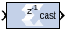

# Convert

## Description

The Convert block converts each input sample to a number of a
desired arithmetic type. For example, a number can be converted to a
signed (two's complement) or unsigned value.

## Parameters

### Basic tab  
Parameters specific to the Basic Tab are as follows.

#### Output Type  
Specify the output data type.
  - Boolean
  - Fixed-point
  - Floating-point

#### Arithmetic Type  
If the Output Type is specified as Fixed-point, you can select Signed
(2’s comp) or Unsigned.

#### Fixed-point Precision
##### Number of bits  
Specifies the bit location of the binary point, where bit zero is the
least significant bit.

##### Binary point  
Specifies the bit location of the binary point.

#### Floating-point Precision  
##### Single  
Specifies single precision (32 bits).

##### Double  
Specifies double precision (64 bits).

##### Custom  
Activates the field below so you can specify the Exponent width and the
Fraction width.

##### Exponent width  
Specify the exponent width.

##### Fraction width  
  Specify the fraction width.

#### Quantization  
Quantization errors occur when the number of fractional bits is
insufficient to represent the fractional portion of a value. The options
are to Truncate (for example, to discard bits to the right of the least
significant representable bit), or to Round (unbiased: +/- inf) or Round
(unbiased: even values).

Round (unbiased: +/- inf) also known as "Symmetric Round (towards +/-
inf)" or "Symmetric Round (away from zero)". This is similar to the
MATLAB round() function. This method rounds the value to the nearest
desired bit away from zero and when there is a value at the midpoint
between two possible rounded values, the one with the larger magnitude
is selected. For example, to round 01.0110 to a Fix_4_2, this yields
01.10, since 01.0110 is exactly between 01.01 and 01.10 and the latter
is further from zero.

Round (unbiased: even values) also known as "Convergent Round (toward
even)" or "Unbiased Rounding". Symmetric rounding is biased because it
rounds all ambiguous midpoints away from zero which means the average
magnitude of the rounded results is larger than the average magnitude of
the raw results. Convergent rounding removes this by alternating between
a symmetric round toward zero and symmetric round away from zero. That
is, midpoints are rounded toward the nearest even number. For example,
to round 01.0110 to a Fix_4_2, this yields 01.10, since 01.0110 is
exactly between 01.01 and 01.10 and the latter is even. To round 01.1010
to a Fix_4_2, this yields 01.10, since 01.1010 is exactly between 01.10
and 01.11 and the former is even.

#### Overflow  
Overflow errors occur when a value lies outside the representable range.
For overflow the options are to Saturate to the largest
positive/smallest negative value, to Wrap (for example, to discard bits
to the left of the most significant representable bit), or to Flag as
error (an overflow as a Simulink error) during simulation. Flag as error
is a simulation only feature. The hardware generated is the same as when
Wrap is selected.

#### Optional Ports  
Provide enable port activates an optional enable (en) pin on the block.
When the enable signal is not asserted the block holds its current state
until the enable signal is asserted again or the reset signal is
asserted.

#### Latency  
The Latency value defines the number of sample periods by which the
block's output is delayed. One sample period might correspond to
multiple clock cycles in the corresponding FPGA implementation (for
example, when the hardware is over-clocked with respect to the Simulink®
model). Model Composer will not perform extensive pipelining unless you
select the Pipeline for maximum performance option (described below);
additional latency is usually implemented as a shift register on the
output of the block.

### Implementation tab  
Parameters specific to the Implementation tab are as follows.

#### Performance Parameters  
Pipeline for maximum performance: The XILINX LogiCORE can be internally
pipelined to optimize for speed instead of area. Selecting this option
puts all user defined latency into the core until the maximum allowable
latency is reached. If the Pipeline for maximum performance option is
not selected and latency is greater than zero, a single output register
is put in the core and additional latency is added on the output of the
core.

The Pipeline for maximum performance option adds the pipeline registers
throughout the block, so that the latency is distributed, instead of
adding it only at the end. This helps to meet tight timing constraints
in the design.

Other parameters used by this block are explained in the topic [Common
Options in Block Parameter Dialog
Boxes](../../GEN/common-options/README.md).

## LogiCORE™ Documentation

Floating-Point Operator LogiCORE IP Product Guide
([PG060](https://docs.xilinx.com/access/sources/ud/document?isLatest=true&url=pg060-floating-point&ft:locale=en-US))
