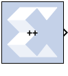
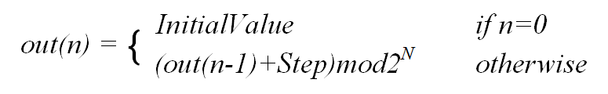
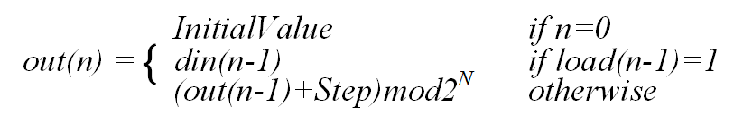
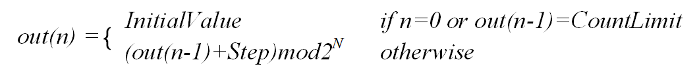

# Counter

The Counter block implements a free-running or count-limited type
of an up, down, or up/down counter. The counter output can be specified
as a signed or unsigned fixed-point number.

## Description

Free-running counters are the least expensive in FPGA hardware. The
free-running up, down, or up/down counter can also be configured to load
the output of the counter with a value on the input din port by
selecting the Provide Load Pin option in the Block Parameters dialog
box.

  

  

The output for a free-running up counter is calculated as follows:

  

  

Here N denotes the number of bits in the counter. The free-running down
counter calculations replace addition with subtraction.

For the free-running up/down counter, the counter performs addition when
input up port is 1 or subtraction when the input up port is 0.

A count-limited counter is implemented by combining a free-running
counter with a comparator. Count limited counters are limited to only 64
bits of output precision. Count limited types of a counter can be
configured to step between the initial and ending values, provided the
step value evenly divides the difference between the initial and ending
values.

The output for a count limited up counter is calculated as follows:

  

  

The count-limited down counter calculation replaces addition with
subtraction. For the count limited up/down counter, the counter performs
addition when input up port is 1 or subtraction when input up port is 0.

The output for a free-running up counter with load capability is
calculated as follows:

  

  

Here N denotes the number of bits in the counter. The down counter
calculations replace addition by subtraction.

## Parameters

### Basic tab  
Parameters specific to the Basic tab are as follows:

#### Counter type  
* Specifies the counter to be a count-limited or free-running counter.

#### Count to value  
* Specifies the ending value, the number at which the count-limited
counter resets. A value of `Inf` denotes the largest representable
output in the specified precision. This cannot be the same as the
initial value.

#### Count direction  
* Specifies the direction of the count (up or down) or provides an
optional input port up (when up/down is selected) for specifying the
direction of the counter.

#### Initial value  
* Specifies the initial value to be the output of the counter.

#### Step  
* Specifies the increment or decrement value.

#### Output type  
* Specifies the block output to be either Signed or Unsigned.

#### Number of bits  
* Specifies the number of bits in the block output.

#### Binary point  
* Specifies the location of the binary point in the block output.

#### Provide load port  
* When checked, the block operates as a free-running load counter with
explicit load and din port. The load capability is available only for
the free-running counter.

#### Provide Synchronous reset port  
* Activates an optional reset (rst) pin on the block. When the reset
signal is asserted the block goes back to its initial state. Reset
signal has precedence over the optional enable signal available on the
block. The reset signal has to run at a multiple of the block's sample
rate. The signal driving the reset port must be Boolean.

### Implementation tab  
Parameters specific to the Implementation tab are as follows.
#### Implementation Details  
* #### Use behavioral HDL (otherwise use core)  
  The block is implemented using behavioral HDL. This gives the downstream
logic synthesis tool maximum freedom to optimize for performance or
area.

#### Core Parameters  
* #### Implement using  
  Core logic can be implemented in Fabric or in a DSP48, if a DSP48 is
available in the target device. The default is Fabric.

Other parameters used by this block are explained in the topic [Common
Options in Block Parameter Dialog
Boxes](common-options-in-block-parameter-dialog-boxes-aa1032308.html).

## LogiCORE™ Documentation

Binary Counter LogiCORE IP Product Guide
([PG121](https://www.xilinx.com/cgi-bin/docs/ipdoc?c=c_counter_binary;v=latest;d=pg121-c-counter-binary.pdf))
