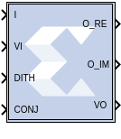
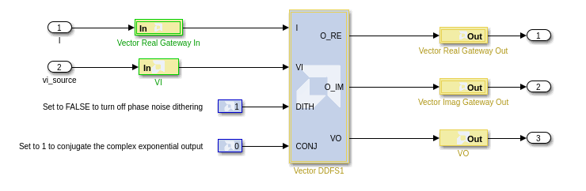

<!-- Library: hdlSSR -->

# Vector DDFS

The Vector DDFS block generates Real and Imaginary vector output signals
of desired frequency.

## Description

The input port I is used for providing the desired output frequency
value as a vector type.

The input port I value should be equal to:

*(desired output Frequency \* Sampling time \*2^(Frequency Resolution))*

The VI input port and VO output are used for synchronization purposes
with the other blocks in the design. The VO is just a delayed version of
VI based on the block latency. The DITH input port is used to turn
on/off the phase noise dithering feature. The CONJ input port is set to
'1' to conjugate the complex exponential output. The output ports, O_RE
and O_IM, generate Real and Imaginary components of the desired vector
output frequency signal.

### Data Type Support

- The input port I should be a signed fixed-point data type.
- The input port VI, DITH, and CONJ should be Boolean data types.

## Parameters

#### Super Sample Rate (SSR)  
This configurable GUI parameter is primarily used to control the
processing of multiple data samples on every sample period. This block
enables 1-D vector support for the primary block operation.

#### Frequency Resolution (bits)  
Defines the smallest incremental step in frequency that the block can
output. This should be an integer value.

#### Sin/Cos Table Depth  
Defines the depth of the Sin/Cos Table and should be an integer value.

#### Sin/Cos Table Width  
Defines the width of the Sin/Cos Table and should be an integer value.

## Examples

***Click on the images below to open the model.***

<!--
DESCRIPTION:
Model: Vector_DDFS_Ex1
Generated: 09-Jan-2026 13:53:12

Vitis Model Composer Configuration:
  Target Device: xc7vx485tffg1157-1

Vitis Model Composer Blocks:
  - HDL: Constant
  - HDL: Gateway In
  - HDL: Gateway Out
  - HDL: Vector DDFS
  - HDL: Vector Real Gateway In
  - HDL: Vector Real Gateway Out

Description:
This MATLAB script creates a Vitis Model Composer Simulink model that uses the AI Engine Constant, Gateway In, Gateway Out, Vector DDFS, Vector Real Gateway In and Vector Real Gateway Out blocks.  and the output is visualized for analysis.

-->

<!--
MATLAB CREATION SCRIPT:

% create_Vector_DDFS_Ex1_model.m
% Auto-generated script to recreate the Vector_DDFS_Ex1 Simulink model
% Generated on: 09-Jan-2026 13:53:12

%% Model Configuration
modelName = 'Vector_DDFS_Ex1_recreated';

%% Create New Model
if bdIsLoaded(modelName)
    close_system(modelName, 0);
end

new_system(modelName);
open_system(modelName);
fprintf('Created new model: %s\n', modelName);

%% Add Vitis Model Composer Hub Block
hubBlockPath = [modelName '/Vitis Model Composer Hub'];
add_block('vmcUtilities/Vitis Model Composer Hub', hubBlockPath, ...
    'Position', [-153 27 -103 77]);

hubBlk = xmcFindHubBlock(modelName);
vmchub_set_param(hubBlk, modelName, 'SelectHardware', 'xc7vx485tffg1157-1');

%% Add Top-Level Blocks
add_block('built-in/Sum', [modelName '/Add'], ...
    'Position', [345 235 375 265]);
set_param([modelName '/Add'], ...
    'IconShape', 'round', ...
    'Inputs', '++|', ...
    'CollapseMode', 'All dimensions', ...
    'CollapseDim', '1', ...
    'OutMin', '[]', ...
    'OutMax', '[]', ...
    'OutDataTypeStr', 'fixdt(1,Fbits0,0)', ...
    'AccumDataTypeStr', 'Inherit: Inherit via internal rule', ...
    'InputSameDT', 'off', ...
    'LockScale', 'off', ...
    'RndMeth', 'Floor', ...
    'SaturateOnIntegerOverflow', 'off', ...
    'SampleTime', '-1');
add_block('built-in/Buffer', [modelName '/Buffer'], ...
    'Position', [-20 334 30 386]);
set_param([modelName '/Buffer'], ...
    'N', 'SSR', ...
    'V', '0', ...
    'ic', '0', ...
    'OverlapPercent', '0');
add_block('built-in/Constant', [modelName '/Constant2'], ...
    'Position', [-30 80 5 100]);
set_param([modelName '/Constant2'], ...
    'Value', 'Fbits0', ...
    'VectorParams1D', 'on', ...
    'OutMin', '[]', ...
    'OutMax', '[]', ...
    'OutDataTypeStr', 'int32', ...
    'LockScale', 'off', ...
    'SampleTime', '-1', ...
    'FramePeriod', 'inf');
add_block('built-in/Constant', [modelName '/Constant4'], ...
    'Position', [-100 345 -70 375]);
set_param([modelName '/Constant4'], ...
    'Value', '123E6*Ts*2^Fbits0', ...
    'VectorParams1D', 'on', ...
    'OutMin', '[]', ...
    'OutMax', '[]', ...
    'OutDataTypeStr', 'fixdt(1,Fbits0,0)', ...
    'LockScale', 'off', ...
    'SampleTime', '-1', ...
    'FramePeriod', 'inf');
add_block('built-in/Constant', [modelName '/Constant5'], ...
    'Position', [-30 105 5 125]);
set_param([modelName '/Constant5'], ...
    'Value', 'Abits0', ...
    'VectorParams1D', 'on', ...
    'OutMin', '[]', ...
    'OutMax', '[]', ...
    'OutDataTypeStr', 'int32', ...
    'LockScale', 'off', ...
    'SampleTime', '-1', ...
    'FramePeriod', 'inf');
add_block('built-in/Constant', [modelName '/Constant6'], ...
    'Position', [-30 130 5 150]);
set_param([modelName '/Constant6'], ...
    'Value', 'Dbits0', ...
    'VectorParams1D', 'on', ...
    'OutMin', '[]', ...
    'OutMax', '[]', ...
    'OutDataTypeStr', 'int32', ...
    'LockScale', 'off', ...
    'SampleTime', '-1', ...
    'FramePeriod', 'inf');
add_block('built-in/Constant', [modelName '/Constant7'], ...
    'Position', [-30 55 5 75]);
set_param([modelName '/Constant7'], ...
    'Value', 'SSR', ...
    'VectorParams1D', 'on', ...
    'OutMin', '[]', ...
    'OutMax', '[]', ...
    'OutDataTypeStr', 'int32', ...
    'LockScale', 'off', ...
    'SampleTime', '-1', ...
    'FramePeriod', 'inf');
add_block('built-in/Constant', [modelName '/Constant8'], ...
    'Position', [-30 30 5 50]);
set_param([modelName '/Constant8'], ...
    'Value', 'Tclk', ...
    'VectorParams1D', 'on', ...
    'OutMin', '[]', ...
    'OutMax', '[]', ...
    'OutDataTypeStr', 'double', ...
    'LockScale', 'off', ...
    'SampleTime', '-1', ...
    'FramePeriod', 'inf');
add_block('built-in/Reshape', [modelName '/Convert 2-D to 1-D'], ...
    'Position', [90 339 150 381]);
set_param([modelName '/Convert 2-D to 1-D'], ...
    'OutputDimensionality', '1-D array', ...
    'OutputDimensions', '[1,1]');
add_block('built-in/Delay', [modelName '/Delay'], ...
    'Position', [425 233 460 267]);
set_param([modelName '/Delay'], ...
    'DelayLengthSource', 'Dialog', ...
    'DelayLength', '1', ...
    'DelayLengthUpperLimit', '100', ...
    'InitialConditionSource', 'Dialog', ...
    'InitialCondition', '0.0', ...
    'ExternalReset', 'None', ...
    'ShowEnablePort', 'off', ...
    'PreventDirectFeedthrough', 'off', ...
    'DiagnosticForDelayLength', 'None', ...
    'RemoveDelayLengthCheckInGeneratedCode', 'off', ...
    'InputProcessing', 'Elements as channels (sample based)', ...
    'UseCircularBuffer', 'off', ...
    'SampleTime', '-1', ...
    'StateMustResolveToSignalObject', 'off', ...
    'StateStorageClass', 'Auto');
add_block('built-in/Delay', [modelName '/Delay1'], ...
    'Position', [785 233 860 267]);
set_param([modelName '/Delay1'], ...
    'DelayLengthSource', 'Dialog', ...
    'DelayLength', '5*SSR', ...
    'DelayLengthUpperLimit', '100', ...
    'InitialConditionSource', 'Dialog', ...
    'InitialCondition', '0.0', ...
    'ExternalReset', 'None', ...
    'ShowEnablePort', 'off', ...
    'PreventDirectFeedthrough', 'off', ...
    'DiagnosticForDelayLength', 'None', ...
    'RemoveDelayLengthCheckInGeneratedCode', 'off', ...
    'InputProcessing', 'Elements as channels (sample based)', ...
    'UseCircularBuffer', 'off', ...
    'SampleTime', '-1', ...
    'StateMustResolveToSignalObject', 'off', ...
    'StateStorageClass', 'Auto');
add_block('built-in/Delay', [modelName '/Delay2'], ...
    'Position', [195 233 270 267]);
set_param([modelName '/Delay2'], ...
    'DelayLengthSource', 'Dialog', ...
    'DelayLength', '2*SSR*SSR', ...
    'DelayLengthUpperLimit', '100', ...
    'InitialConditionSource', 'Dialog', ...
    'InitialCondition', '0.0', ...
    'ExternalReset', 'None', ...
    'ShowEnablePort', 'off', ...
    'PreventDirectFeedthrough', 'off', ...
    'DiagnosticForDelayLength', 'None', ...
    'RemoveDelayLengthCheckInGeneratedCode', 'off', ...
    'InputProcessing', 'Elements as channels (sample based)', ...
    'UseCircularBuffer', 'off', ...
    'SampleTime', '-1', ...
    'StateMustResolveToSignalObject', 'off', ...
    'StateStorageClass', 'Auto');
add_block('built-in/Display', [modelName '/Display'], ...
    'Position', [40 80 115 100]);
set_param([modelName '/Display'], ...
    'Format', 'short', ...
    'Decimation', '1', ...
    'Floating', 'off');
add_block('built-in/Display', [modelName '/Display1'], ...
    'Position', [40 105 115 125]);
set_param([modelName '/Display1'], ...
    'Format', 'short', ...
    'Decimation', '1', ...
    'Floating', 'off');
add_block('built-in/Display', [modelName '/Display2'], ...
    'Position', [845 432 935 458]);
set_param([modelName '/Display2'], ...
    'Format', 'short', ...
    'Decimation', '1', ...
    'Floating', 'off');
add_block('built-in/Display', [modelName '/Display3'], ...
    'Position', [40 130 115 150]);
set_param([modelName '/Display3'], ...
    'Format', 'short', ...
    'Decimation', '1', ...
    'Floating', 'off');
add_block('built-in/Display', [modelName '/Display4'], ...
    'Position', [40 55 115 75]);
set_param([modelName '/Display4'], ...
    'Format', 'short', ...
    'Decimation', '1', ...
    'Floating', 'off');
add_block('built-in/Display', [modelName '/Display5'], ...
    'Position', [40 30 115 50]);
set_param([modelName '/Display5'], ...
    'Format', 'short', ...
    'Decimation', '1', ...
    'Floating', 'off');
add_block('built-in/Probe', [modelName '/Probe'], ...
    'Position', [45 282 110 308]);
set_param([modelName '/Probe'], ...
    'ProbeWidth', 'off', ...
    'ProbeSampleTime', 'on', ...
    'ProbeComplexSignal', 'off', ...
    'ProbeSignalDimensions', 'off', ...
    'ProbeWidthDataType', 'double', ...
    'ProbeSampleTimeDataType', 'double', ...
    'ProbeComplexityDataType', 'double', ...
    'ProbeDimensionsDataType', 'double');
add_block('built-in/Probe', [modelName '/Probe1'], ...
    'Position', [885 292 950 318]);
set_param([modelName '/Probe1'], ...
    'ProbeWidth', 'off', ...
    'ProbeSampleTime', 'on', ...
    'ProbeComplexSignal', 'off', ...
    'ProbeSignalDimensions', 'off', ...
    'ProbeWidthDataType', 'double', ...
    'ProbeSampleTimeDataType', 'double', ...
    'ProbeComplexityDataType', 'double', ...
    'ProbeDimensionsDataType', 'double');
add_block('built-in/RealImagToComplex', [modelName '/Real-Imag to Complex'], ...
    'Position', [560 320 585 420]);
set_param([modelName '/Real-Imag to Complex'], ...
    'Input', 'Real and imag', ...
    'ConstantPart', '0', ...
    'SampleTime', '-1');
add_block('built-in/Scope', [modelName '/Scope'], ...
    'Position', [1210 450 1245 550]);
set_param([modelName '/Scope'], ...
    'OpenAtSimulationStart', 'off', ...
    'DisplayFullPath', 'off', ...
    'NumInputPorts', '1', ...
    'LayoutDimensionsString', '[4 1]', ...
    'SampleTime', '-1', ...
    'FrameBasedProcessingString', 'Elements as channels (sample based)', ...
    'MaximizeAxes', 'Off', ...
    'AxesScaling', 'Manual', ...
    'AxesScalingNumUpdates', '10', ...
    'TimeSpan', 'Auto', ...
    'TimeSpanOverrunAction', 'Wrap', ...
    'TimeUnits', 'None', ...
    'TimeDisplayOffset', '0', ...
    'TimeAxisLabels', 'Bottom displays only', ...
    'ShowTimeAxisLabel', 'off', ...
    'ActiveDisplayString', '1', ...
    'Title', '%<SignalLabel>', ...
    'ShowLegend', 'off', ...
    'ShowGrid', 'on', ...
    'PlotAsMagnitudePhase', 'off', ...
    'ActiveDisplayYMinimum', '-1.25', ...
    'ActiveDisplayYMaximum', '1.25', ...
    'DataLoggingLimitDataPoints', 'off', ...
    'DataLoggingMaxPoints', '5000', ...
    'DataLoggingDecimateData', 'off', ...
    'DataLoggingDecimation', '2', ...
    'DataLogging', 'off', ...
    'DataLoggingVariableName', 'ScopeData2', ...
    'DataLoggingSaveFormat', 'Dataset');
add_block('built-in/Step', [modelName '/Step'], ...
    'Position', [-110 420 -80 450]);
set_param([modelName '/Step'], ...
    'Time', 'Ts', ...
    'Before', '0', ...
    'After', '1', ...
    'OutDataTypeStr', 'double', ...
    'SampleTime', '-1', ...
    'VectorParams1D', 'on', ...
    'ZeroCross', 'on');
add_block('built-in/Terminator', [modelName '/Terminator'], ...
    'Position', [165 285 185 305]);
add_block('built-in/Terminator', [modelName '/Terminator1'], ...
    'Position', [980 295 1000 315]);
add_block('built-in/Unbuffer', [modelName '/Unbuffer'], ...
    'Position', [910 365 960 415]);
set_param([modelName '/Unbuffer'], ...
    'ic', '0');
add_block('vmcUtilities/Vitis Model Composer Hub', [modelName '/Vitis Model Composer Hub'], ...
    'Position', [-153 27 -103 77]);
set_param([modelName '/Vitis Model Composer Hub'], ...
    'CodeGeneration', 'off', ...
    'SubsystemName', 'DDS012', ...
    'StartColumn', '1', ...
    'NumberOfColumns', '1', ...
    'TargetDirectory', './code', ...
    'exportDesign', 'off', ...
    'analyzeDesign', 'off', ...
    'validateDesignOnHw', 'off', ...
    'ExportType', 'System Generator', ...
    'IpVendor', 'xilinx.com', ...
    'IpLibrary', 'hls', ...
    'IpVersion', '1.0', ...
    'IpHWLanguage', 'Verilog', ...
    'AieCompilerOptions', '{}', ...
    'CreateTestbench', 'off', ...
    'TestbenchStackSize', '10', ...
    'RunRtlSim', 'off', ...
    'RunCSim', 'off', ...
    'RunAieSim', 'off', ...
    'AieSimTimeout', '50000', ...
    'RunAieSimProfiling', 'off', ...
    'LaunchVitisAnalyzer', 'off', ...
    'PlotOutput', 'off', ...
    'GenHwImage', 'off', ...
    'GenLibadfXo', 'off', ...
    'GenHwValidationCode', 'off', ...
    'PlatformType', 'Not Specified', ...
    'HwSystemType', 'Baremetal', ...
    'HwValidationTarget', 'hw', ...
    'ProjDevice', 'xc7vx485tffg1157-1', ...
    'SamplePeriod', '-1', ...
    'ClockFrequency', '200', ...
    'DataPathParallelism', '1', ...
    'xilinxfamily', 'kintexuplus', ...
    'part', 'xcku9p', ...
    'speed', '-1-e', ...
    'package', 'ffve900', ...
    'directory', './netlist', ...
    'testbench', 'off', ...
    'incr_netlist', 'off', ...
    'synthesis_tool', 'Vivado', ...
    'clock_wrapper', 'Clock Enables', ...
    'dbl_ovrd', 'According to Block Masks', ...
    'dcm_input_clock_period', '10', ...
    'sysclk_period', '(1e+9)/clk', ...
    'simulink_period', '1/clk', ...
    'eval_field', '0', ...
    'LogFileName', '''''', ...
    'NThreads', '4');

%% Create ErrorCheck Subsystem
add_block('built-in/SubSystem', [modelName '/ErrorCheck'], ...
    'Position', [1065 469 1165 531]);

% Remove default blocks
defaultBlocks = find_system([modelName '/ErrorCheck'], 'SearchDepth', 1, 'Type', 'block');
for i = 1:length(defaultBlocks)
    if ~strcmp(defaultBlocks{i}, [modelName '/ErrorCheck'])
        delete_block(defaultBlocks{i});
    end
end

add_block('built-in/Inport', [[modelName '/ErrorCheck'] '/GoldenData'], ...
    'Position', [100 645 130 660]);
set_param([[modelName '/ErrorCheck'] '/GoldenData'], ...
    'Port', '1', ...
    'IconDisplay', 'Port number', ...
    'OutputFunctionCall', 'off', ...
    'OutMin', '[]', ...
    'OutMax', '[]', ...
    'OutDataTypeStr', 'Inherit: auto', ...
    'LockScale', 'off', ...
    'BusOutputAsStruct', 'off', ...
    'BusVirtuality', 'inherit', ...
    'Unit', 'inherit', ...
    'PortDimensions', '-1', ...
    'VarSizeSig', 'Inherit', ...
    'SampleTime', '-1', ...
    'SignalType', 'auto', ...
    'LatchByDelayingOutsideSignal', 'off', ...
    'LatchInputForFeedbackSignals', 'off', ...
    'Interpolate', 'on', ...
    'DataMode', 'inherit', ...
    'MessageQueueUseDefaultAttributes', 'on', ...
    'MessageQueueCapacity', '1', ...
    'MessageQueueType', 'LIFO', ...
    'MessageQueueOverwriting', 'on');
add_block('built-in/Inport', [[modelName '/ErrorCheck'] '/SysGenData'], ...
    'Position', [195 168 225 182]);
set_param([[modelName '/ErrorCheck'] '/SysGenData'], ...
    'Port', '2', ...
    'IconDisplay', 'Port number', ...
    'OutputFunctionCall', 'off', ...
    'OutMin', '[]', ...
    'OutMax', '[]', ...
    'OutDataTypeStr', 'Inherit: auto', ...
    'LockScale', 'off', ...
    'BusOutputAsStruct', 'off', ...
    'BusVirtuality', 'inherit', ...
    'Unit', 'inherit', ...
    'PortDimensions', '-1', ...
    'VarSizeSig', 'Inherit', ...
    'SampleTime', '-1', ...
    'SignalType', 'auto', ...
    'LatchByDelayingOutsideSignal', 'off', ...
    'LatchInputForFeedbackSignals', 'off', ...
    'Interpolate', 'on', ...
    'DataMode', 'inherit', ...
    'MessageQueueUseDefaultAttributes', 'on', ...
    'MessageQueueCapacity', '1', ...
    'MessageQueueType', 'LIFO', ...
    'MessageQueueOverwriting', 'on');
add_block('built-in/Inport', [[modelName '/ErrorCheck'] '/VI'], ...
    'Position', [90 790 120 805]);
set_param([[modelName '/ErrorCheck'] '/VI'], ...
    'Port', '3', ...
    'IconDisplay', 'Port number', ...
    'OutputFunctionCall', 'off', ...
    'OutMin', '[]', ...
    'OutMax', '[]', ...
    'OutDataTypeStr', 'Inherit: auto', ...
    'LockScale', 'off', ...
    'BusOutputAsStruct', 'off', ...
    'BusVirtuality', 'inherit', ...
    'Unit', 'inherit', ...
    'PortDimensions', '-1', ...
    'VarSizeSig', 'Inherit', ...
    'SampleTime', '-1', ...
    'SignalType', 'auto', ...
    'LatchByDelayingOutsideSignal', 'off', ...
    'LatchInputForFeedbackSignals', 'off', ...
    'Interpolate', 'on', ...
    'DataMode', 'inherit', ...
    'MessageQueueUseDefaultAttributes', 'on', ...
    'MessageQueueCapacity', '1', ...
    'MessageQueueType', 'LIFO', ...
    'MessageQueueOverwriting', 'on');
add_block('simulink/Logic and Bit Operations/Compare To Constant', [[modelName '/ErrorCheck'] '/Compare To Constant'], ...
    'Position', [890 442 980 498]);
set_param([[modelName '/ErrorCheck'] '/Compare To Constant'], ...
    'relop', '>', ...
    'const', '0.01', ...
    'OutDataTypeStr', 'boolean', ...
    'ZeroCross', 'on');
add_block('simulink/Logic and Bit Operations/Compare To Constant', [[modelName '/ErrorCheck'] '/Compare To Constant1'], ...
    'Position', [890 552 980 608]);
set_param([[modelName '/ErrorCheck'] '/Compare To Constant1'], ...
    'relop', '>', ...
    'const', '0.01', ...
    'OutDataTypeStr', 'boolean', ...
    'ZeroCross', 'on');
add_block('built-in/ComplexToRealImag', [[modelName '/ErrorCheck'] '/Complex to Real-Imag'], ...
    'Position', [275 228 305 257]);
set_param([[modelName '/ErrorCheck'] '/Complex to Real-Imag'], ...
    'Output', 'Real and imag', ...
    'SampleTime', '-1');
add_block('built-in/ComplexToRealImag', [[modelName '/ErrorCheck'] '/Complex to Real-Imag1'], ...
    'Position', [205 288 235 317]);
set_param([[modelName '/ErrorCheck'] '/Complex to Real-Imag1'], ...
    'Output', 'Real and imag', ...
    'SampleTime', '-1');
add_block('built-in/SpectrumAnalyzer', [[modelName '/ErrorCheck'] '/Golden Spectrum'], ...
    'Position', [430 604 475 656]);
set_param([[modelName '/ErrorCheck'] '/Golden Spectrum'], ...
    'NumInputPorts', '1', ...
    'OpenAtSimulationStart', 'on', ...
    'WindowPosition', '[878 430 800 500]', ...
    'InputDomain', 'Time', ...
    'SpectrumType', 'Power', ...
    'ViewType', 'Spectrum', ...
    'Method', 'Welch', ...
    'SampleRateSource', 'Inherited', ...
    'SampleRate', '10000', ...
    'PlotAsTwoSidedSpectrum', 'on', ...
    'FrequencyScale', 'Linear', ...
    'PlotType', 'Line', ...
    'AxesScaling', 'Manual', ...
    'AxesScalingNumUpdates', '100', ...
    'FrequencyResolutionMethod', 'RBW', ...
    'RBWSource', 'Auto', ...
    'RBW', '9.76', ...
    'WindowInvariantSamplesPerUpdate', 'off', ...
    'WindowLength', '10000', ...
    'FFTLengthSource', 'Auto', ...
    'FFTLength', '1024', ...
    'FilterSharpness', '0.3', ...
    'FrequencySpan', 'Full', ...
    'Span', '10000', ...
    'CenterFrequency', '0', ...
    'StartFrequency', '-5000', ...
    'StopFrequency', '5000', ...
    'InputUnits', 'dBm', ...
    'FrequencyVectorSource', 'Auto', ...
    'FrequencyVector', '[-5000,5000]', ...
    'Window', 'Hann', ...
    'CustomWindow', 'hann', ...
    'SidelobeAttenuation', '60', ...
    'OverlapPercent', '0', ...
    'AveragingMethod', 'Exponential', ...
    'SpectralAverages', '1', ...
    'ForgettingFactor', '0.9', ...
    'VBWSource', 'Auto', ...
    'VBW', '9.76', ...
    'SpectrumUnits', 'dBm', ...
    'FullScaleSource', 'Auto', ...
    'FullScale', '1', ...
    'ReferenceLoad', '1', ...
    'FrequencyOffset', '0', ...
    'SpectrogramChannel', '1', ...
    'TimeResolutionSource', 'Auto', ...
    'TimeResolution', '1e-3', ...
    'TimeSpanSource', 'Auto', ...
    'TimeSpan', '0.1', ...
    'MaximizeAxes', 'Auto', ...
    'PlotNormalTrace', 'on', ...
    'PlotMaxHoldTrace', 'off', ...
    'PlotMinHoldTrace', 'off', ...
    'YLimits', '[-80,20]', ...
    'ColorLimits', '[-80,20]', ...
    'Colormap', 'jet', ...
    'ShowGrid', 'on', ...
    'ShowLegend', 'off', ...
    'ShowColorbar', 'on', ...
    'ChannelNames', '[""]', ...
    'AxesLayout', 'Vertical');
add_block('built-in/Logic', [[modelName '/ErrorCheck'] '/Logical Operator'], ...
    'Position', [1110 482 1140 513]);
set_param([[modelName '/ErrorCheck'] '/Logical Operator'], ...
    'Operator', 'OR', ...
    'Inputs', '2', ...
    'IconShape', 'rectangular', ...
    'AllPortsSameDT', 'off', ...
    'OutDataTypeStr', 'boolean', ...
    'SampleTime', '-1');
add_block('built-in/Logic', [[modelName '/ErrorCheck'] '/Logical Operator1'], ...
    'Position', [1180 642 1210 673]);
set_param([[modelName '/ErrorCheck'] '/Logical Operator1'], ...
    'Operator', 'AND', ...
    'Inputs', '2', ...
    'IconShape', 'rectangular', ...
    'AllPortsSameDT', 'off', ...
    'OutDataTypeStr', 'boolean', ...
    'SampleTime', '-1');
add_block('built-in/Product', [[modelName '/ErrorCheck'] '/Product'], ...
    'Position', [655 452 685 483]);
set_param([[modelName '/ErrorCheck'] '/Product'], ...
    'Inputs', '2', ...
    'Multiplication', 'Element-wise(.*)', ...
    'CollapseMode', 'All dimensions', ...
    'CollapseDim', '1', ...
    'InputSameDT', 'off', ...
    'OutMin', '[]', ...
    'OutMax', '[]', ...
    'OutDataTypeStr', 'Inherit: Inherit via internal rule', ...
    'LockScale', 'off', ...
    'RndMeth', 'Floor', ...
    'SaturateOnIntegerOverflow', 'off', ...
    'SampleTime', '-1');
add_block('built-in/Product', [[modelName '/ErrorCheck'] '/Product1'], ...
    'Position', [640 562 670 593]);
set_param([[modelName '/ErrorCheck'] '/Product1'], ...
    'Inputs', '2', ...
    'Multiplication', 'Element-wise(.*)', ...
    'CollapseMode', 'All dimensions', ...
    'CollapseDim', '1', ...
    'InputSameDT', 'off', ...
    'OutMin', '[]', ...
    'OutMax', '[]', ...
    'OutDataTypeStr', 'Inherit: Inherit via internal rule', ...
    'LockScale', 'off', ...
    'RndMeth', 'Floor', ...
    'SaturateOnIntegerOverflow', 'off', ...
    'SampleTime', '-1');
add_block('built-in/Scope', [[modelName '/ErrorCheck'] '/Scope'], ...
    'Position', [875 223 910 322]);
set_param([[modelName '/ErrorCheck'] '/Scope'], ...
    'OpenAtSimulationStart', 'off', ...
    'DisplayFullPath', 'off', ...
    'NumInputPorts', '4', ...
    'LayoutDimensionsString', '[4 1]', ...
    'SampleTime', '-1', ...
    'FrameBasedProcessingString', 'Elements as channels (sample based)', ...
    'MaximizeAxes', 'Off', ...
    'AxesScaling', 'Manual', ...
    'AxesScalingNumUpdates', '10', ...
    'TimeSpan', 'Auto', ...
    'TimeSpanOverrunAction', 'Wrap', ...
    'TimeUnits', 'None', ...
    'TimeDisplayOffset', '0', ...
    'TimeAxisLabels', 'Bottom displays only', ...
    'ShowTimeAxisLabel', 'off', ...
    'ActiveDisplayString', '1', ...
    'Title', '%<SignalLabel>', ...
    'ShowLegend', 'off', ...
    'ShowGrid', 'on', ...
    'PlotAsMagnitudePhase', 'off', ...
    'ActiveDisplayYMinimum', '-1.2494', ...
    'ActiveDisplayYMaximum', '1.2447', ...
    'DataLoggingLimitDataPoints', 'off', ...
    'DataLoggingMaxPoints', '5000', ...
    'DataLoggingDecimateData', 'off', ...
    'DataLoggingDecimation', '2', ...
    'DataLogging', 'off', ...
    'DataLoggingVariableName', 'ScopeData', ...
    'DataLoggingSaveFormat', 'Dataset');
add_block('built-in/Scope', [[modelName '/ErrorCheck'] '/Scope1'], ...
    'Position', [1175 803 1210 902]);
set_param([[modelName '/ErrorCheck'] '/Scope1'], ...
    'OpenAtSimulationStart', 'off', ...
    'DisplayFullPath', 'off', ...
    'NumInputPorts', '4', ...
    'LayoutDimensionsString', '[4 1]', ...
    'SampleTime', '-1', ...
    'FrameBasedProcessingString', 'Elements as channels (sample based)', ...
    'MaximizeAxes', 'Off', ...
    'AxesScaling', 'Manual', ...
    'AxesScalingNumUpdates', '10', ...
    'TimeSpan', 'Auto', ...
    'TimeSpanOverrunAction', 'Wrap', ...
    'TimeUnits', 'None', ...
    'TimeDisplayOffset', '0', ...
    'TimeAxisLabels', 'Bottom displays only', ...
    'ShowTimeAxisLabel', 'off', ...
    'ActiveDisplayString', '1', ...
    'Title', '%<SignalLabel>', ...
    'ShowLegend', 'off', ...
    'ShowGrid', 'on', ...
    'PlotAsMagnitudePhase', 'off', ...
    'ActiveDisplayYMinimum', '-0.125', ...
    'ActiveDisplayYMaximum', '1.125', ...
    'DataLoggingLimitDataPoints', 'off', ...
    'DataLoggingMaxPoints', '5000', ...
    'DataLoggingDecimateData', 'off', ...
    'DataLoggingDecimation', '2', ...
    'DataLogging', 'off', ...
    'DataLoggingVariableName', 'ScopeData1', ...
    'DataLoggingSaveFormat', 'Dataset');
add_block('built-in/SpectrumAnalyzer', [[modelName '/ErrorCheck'] '/Spectrum'], ...
    'Position', [420 149 465 201]);
set_param([[modelName '/ErrorCheck'] '/Spectrum'], ...
    'NumInputPorts', '1', ...
    'OpenAtSimulationStart', 'on', ...
    'WindowPosition', '[878 430 800 500]', ...
    'InputDomain', 'Time', ...
    'SpectrumType', 'Power', ...
    'ViewType', 'Spectrum', ...
    'Method', 'Welch', ...
    'SampleRateSource', 'Inherited', ...
    'SampleRate', '10000', ...
    'PlotAsTwoSidedSpectrum', 'on', ...
    'FrequencyScale', 'Linear', ...
    'PlotType', 'Line', ...
    'AxesScaling', 'Manual', ...
    'AxesScalingNumUpdates', '100', ...
    'FrequencyResolutionMethod', 'RBW', ...
    'RBWSource', 'Auto', ...
    'RBW', '9.76', ...
    'WindowInvariantSamplesPerUpdate', 'off', ...
    'WindowLength', '10000', ...
    'FFTLengthSource', 'Auto', ...
    'FFTLength', '1024', ...
    'FilterSharpness', '0.3', ...
    'FrequencySpan', 'Full', ...
    'Span', '10000', ...
    'CenterFrequency', '0', ...
    'StartFrequency', '-5000', ...
    'StopFrequency', '5000', ...
    'InputUnits', 'dBm', ...
    'FrequencyVectorSource', 'Auto', ...
    'FrequencyVector', '[-5000,5000]', ...
    'Window', 'Hann', ...
    'CustomWindow', 'hann', ...
    'SidelobeAttenuation', '60', ...
    'OverlapPercent', '0', ...
    'AveragingMethod', 'Exponential', ...
    'SpectralAverages', '1', ...
    'ForgettingFactor', '0.9', ...
    'VBWSource', 'Auto', ...
    'VBW', '9.76', ...
    'SpectrumUnits', 'dBm', ...
    'FullScaleSource', 'Auto', ...
    'FullScale', '1', ...
    'ReferenceLoad', '1', ...
    'FrequencyOffset', '0', ...
    'SpectrogramChannel', '1', ...
    'TimeResolutionSource', 'Auto', ...
    'TimeResolution', '1e-3', ...
    'TimeSpanSource', 'Auto', ...
    'TimeSpan', '0.1', ...
    'MaximizeAxes', 'Auto', ...
    'PlotNormalTrace', 'on', ...
    'PlotMaxHoldTrace', 'off', ...
    'PlotMinHoldTrace', 'off', ...
    'YLimits', '[-80,20]', ...
    'ColorLimits', '[-80,20]', ...
    'Colormap', 'jet', ...
    'ShowGrid', 'on', ...
    'ShowLegend', 'off', ...
    'ShowColorbar', 'on', ...
    'ChannelNames', '[""]', ...
    'AxesLayout', 'Vertical');
add_block('built-in/Sqrt', [[modelName '/ErrorCheck'] '/Sqrt'], ...
    'Position', [770 455 800 485]);
set_param([[modelName '/ErrorCheck'] '/Sqrt'], ...
    'Operator', 'sqrt', ...
    'OutputSignalType', 'auto', ...
    'SampleTime', '-1', ...
    'OutMin', '[]', ...
    'OutMax', '[]', ...
    'OutDataTypeStr', 'Inherit: Same as first input', ...
    'LockScale', 'off', ...
    'RndMeth', 'Floor', ...
    'SaturateOnIntegerOverflow', 'on', ...
    'IntermediateResultsDataTypeStr', 'Inherit: Inherit via internal rule', ...
    'AlgorithmType', 'Exact', ...
    'Iterations', '3');
add_block('built-in/Sqrt', [[modelName '/ErrorCheck'] '/Sqrt1'], ...
    'Position', [770 565 800 595]);
set_param([[modelName '/ErrorCheck'] '/Sqrt1'], ...
    'Operator', 'sqrt', ...
    'OutputSignalType', 'auto', ...
    'SampleTime', '-1', ...
    'OutMin', '[]', ...
    'OutMax', '[]', ...
    'OutDataTypeStr', 'Inherit: Same as first input', ...
    'LockScale', 'off', ...
    'RndMeth', 'Floor', ...
    'SaturateOnIntegerOverflow', 'on', ...
    'IntermediateResultsDataTypeStr', 'Inherit: Inherit via internal rule', ...
    'AlgorithmType', 'Exact', ...
    'Iterations', '3');
add_block('built-in/Sum', [[modelName '/ErrorCheck'] '/Subtract'], ...
    'Position', [310 452 340 483]);
set_param([[modelName '/ErrorCheck'] '/Subtract'], ...
    'IconShape', 'rectangular', ...
    'Inputs', '+-', ...
    'CollapseMode', 'All dimensions', ...
    'CollapseDim', '1', ...
    'OutMin', '[]', ...
    'OutMax', '[]', ...
    'OutDataTypeStr', 'Inherit: Inherit via internal rule', ...
    'AccumDataTypeStr', 'Inherit: Inherit via internal rule', ...
    'InputSameDT', 'off', ...
    'LockScale', 'off', ...
    'RndMeth', 'Floor', ...
    'SaturateOnIntegerOverflow', 'off', ...
    'SampleTime', '-1');
add_block('built-in/Sum', [[modelName '/ErrorCheck'] '/Subtract1'], ...
    'Position', [315 552 345 583]);
set_param([[modelName '/ErrorCheck'] '/Subtract1'], ...
    'IconShape', 'rectangular', ...
    'Inputs', '+-', ...
    'CollapseMode', 'All dimensions', ...
    'CollapseDim', '1', ...
    'OutMin', '[]', ...
    'OutMax', '[]', ...
    'OutDataTypeStr', 'Inherit: Inherit via internal rule', ...
    'AccumDataTypeStr', 'Inherit: Inherit via internal rule', ...
    'InputSameDT', 'off', ...
    'LockScale', 'off', ...
    'RndMeth', 'Floor', ...
    'SaturateOnIntegerOverflow', 'off', ...
    'SampleTime', '-1');
add_block('built-in/Outport', [[modelName '/ErrorCheck'] '/ERROR'], ...
    'Position', [1320 653 1350 667]);
set_param([[modelName '/ErrorCheck'] '/ERROR'], ...
    'Port', '1', ...
    'StorageClass', 'Auto', ...
    'IconDisplay', 'Port number', ...
    'OutputFunctionCall', 'off', ...
    'OutMin', '[]', ...
    'OutMax', '[]', ...
    'OutDataTypeStr', 'Inherit: auto', ...
    'LockScale', 'off', ...
    'BusOutputAsStruct', 'off', ...
    'BusVirtuality', 'inherit', ...
    'DataMode', 'inherit', ...
    'Unit', 'inherit', ...
    'PortDimensions', '-1', ...
    'VarSizeSig', 'Inherit', ...
    'SampleTime', '-1', ...
    'SignalType', 'auto', ...
    'EnsureOutportIsVirtual', 'off', ...
    'OutputWhenDisabled', 'held', ...
    'InitialOutput', '[]', ...
    'MustResolveToSignalObject', 'off', ...
    'OutputWhenUnConnected', 'off', ...
    'OutputWhenUnconnectedValue', '0', ...
    'VectorParamsAs1DForOutWhenUnconnected', 'on');

% Connect blocks in ErrorCheck
add_line([modelName '/ErrorCheck'], 'Compare To Constant1/2', 'Logical Operator/3', 'autorouting', 'on');
add_line([modelName '/ErrorCheck'], 'Compare To Constant1/2', 'Scope1/3', 'autorouting', 'on');
add_line([modelName '/ErrorCheck'], 'Compare To Constant1/2', 'Scope1/3', 'autorouting', 'on');
add_line([modelName '/ErrorCheck'], 'VI/2', 'Logical Operator1/3', 'autorouting', 'on');
add_line([modelName '/ErrorCheck'], 'VI/2', 'Scope1/4', 'autorouting', 'on');
add_line([modelName '/ErrorCheck'], 'VI/2', 'Scope1/4', 'autorouting', 'on');
add_line([modelName '/ErrorCheck'], 'Logical Operator1/2', 'ERROR/2', 'autorouting', 'on');
add_line([modelName '/ErrorCheck'], 'Logical Operator1/2', 'Scope1/5', 'autorouting', 'on');
add_line([modelName '/ErrorCheck'], 'Logical Operator1/2', 'Scope1/5', 'autorouting', 'on');
add_line([modelName '/ErrorCheck'], 'Complex to Real-Imag1/3', 'Subtract1/3', 'autorouting', 'on');
add_line([modelName '/ErrorCheck'], 'Complex to Real-Imag/3', 'Subtract1/2', 'autorouting', 'on');
add_line([modelName '/ErrorCheck'], 'Sqrt1/2', 'Compare To Constant1/2', 'autorouting', 'on');
add_line([modelName '/ErrorCheck'], 'Product1/2', 'Sqrt1/2', 'autorouting', 'on');
add_line([modelName '/ErrorCheck'], 'Subtract1/2', 'Product1/2', 'autorouting', 'on');
add_line([modelName '/ErrorCheck'], 'Subtract1/2', 'Product1/3', 'autorouting', 'on');
add_line([modelName '/ErrorCheck'], 'Subtract1/2', 'Product1/3', 'autorouting', 'on');
add_line([modelName '/ErrorCheck'], 'Compare To Constant/2', 'Logical Operator/2', 'autorouting', 'on');
add_line([modelName '/ErrorCheck'], 'Compare To Constant/2', 'Scope1/2', 'autorouting', 'on');
add_line([modelName '/ErrorCheck'], 'Compare To Constant/2', 'Scope1/2', 'autorouting', 'on');
add_line([modelName '/ErrorCheck'], 'Compare To Constant/2', 'Scope/5', 'autorouting', 'on');
add_line([modelName '/ErrorCheck'], 'Compare To Constant/2', 'Scope/5', 'autorouting', 'on');
add_line([modelName '/ErrorCheck'], 'Logical Operator/2', 'Logical Operator1/2', 'autorouting', 'on');
add_line([modelName '/ErrorCheck'], 'Sqrt/2', 'Compare To Constant/2', 'autorouting', 'on');
add_line([modelName '/ErrorCheck'], 'Product/2', 'Sqrt/2', 'autorouting', 'on');
add_line([modelName '/ErrorCheck'], 'SysGenData/2', 'Spectrum/2', 'autorouting', 'on');
add_line([modelName '/ErrorCheck'], 'SysGenData/2', 'Complex to Real-Imag/2', 'autorouting', 'on');
add_line([modelName '/ErrorCheck'], 'SysGenData/2', 'Complex to Real-Imag/2', 'autorouting', 'on');
add_line([modelName '/ErrorCheck'], 'GoldenData/2', 'Complex to Real-Imag1/2', 'autorouting', 'on');
add_line([modelName '/ErrorCheck'], 'GoldenData/2', 'Golden Spectrum/2', 'autorouting', 'on');
add_line([modelName '/ErrorCheck'], 'GoldenData/2', 'Golden Spectrum/2', 'autorouting', 'on');
add_line([modelName '/ErrorCheck'], 'Subtract/2', 'Product/2', 'autorouting', 'on');
add_line([modelName '/ErrorCheck'], 'Subtract/2', 'Product/3', 'autorouting', 'on');
add_line([modelName '/ErrorCheck'], 'Subtract/2', 'Product/3', 'autorouting', 'on');
add_line([modelName '/ErrorCheck'], 'Subtract/2', 'Scope/4', 'autorouting', 'on');
add_line([modelName '/ErrorCheck'], 'Subtract/2', 'Scope/4', 'autorouting', 'on');
add_line([modelName '/ErrorCheck'], 'Complex to Real-Imag1/2', 'Subtract/3', 'autorouting', 'on');
add_line([modelName '/ErrorCheck'], 'Complex to Real-Imag1/2', 'Scope/3', 'autorouting', 'on');
add_line([modelName '/ErrorCheck'], 'Complex to Real-Imag1/2', 'Scope/3', 'autorouting', 'on');
add_line([modelName '/ErrorCheck'], 'Complex to Real-Imag/2', 'Scope/2', 'autorouting', 'on');
add_line([modelName '/ErrorCheck'], 'Complex to Real-Imag/2', 'Subtract/2', 'autorouting', 'on');
add_line([modelName '/ErrorCheck'], 'Complex to Real-Imag/2', 'Subtract/2', 'autorouting', 'on');

%% Create HDL_DDFS Subsystem
add_block('built-in/SubSystem', [modelName '/HDL_DDFS'], ...
    'Position', [365 318 520 472]);

% Remove default blocks
defaultBlocks = find_system([modelName '/HDL_DDFS'], 'SearchDepth', 1, 'Type', 'block');
for i = 1:length(defaultBlocks)
    if ~strcmp(defaultBlocks{i}, [modelName '/HDL_DDFS'])
        delete_block(defaultBlocks{i});
    end
end

add_block('built-in/Inport', [[modelName '/HDL_DDFS'] '/I'], ...
    'Position', [405 23 435 37]);
set_param([[modelName '/HDL_DDFS'] '/I'], ...
    'Port', '1', ...
    'IconDisplay', 'Port number', ...
    'OutputFunctionCall', 'off', ...
    'OutMin', '[]', ...
    'OutMax', '[]', ...
    'OutDataTypeStr', 'Inherit: auto', ...
    'LockScale', 'off', ...
    'BusOutputAsStruct', 'off', ...
    'BusVirtuality', 'inherit', ...
    'Unit', 'inherit', ...
    'PortDimensions', '-1', ...
    'VarSizeSig', 'Inherit', ...
    'SampleTime', '-1', ...
    'SignalType', 'auto', ...
    'LatchByDelayingOutsideSignal', 'off', ...
    'LatchInputForFeedbackSignals', 'off', ...
    'Interpolate', 'on', ...
    'DataMode', 'inherit', ...
    'MessageQueueUseDefaultAttributes', 'on', ...
    'MessageQueueCapacity', '1', ...
    'MessageQueueType', 'LIFO', ...
    'MessageQueueOverwriting', 'on');
add_block('built-in/Inport', [[modelName '/HDL_DDFS'] '/vi_source'], ...
    'Position', [405 73 435 87]);
set_param([[modelName '/HDL_DDFS'] '/vi_source'], ...
    'Port', '2', ...
    'IconDisplay', 'Port number', ...
    'OutputFunctionCall', 'off', ...
    'OutMin', '[]', ...
    'OutMax', '[]', ...
    'OutDataTypeStr', 'Inherit: auto', ...
    'LockScale', 'off', ...
    'BusOutputAsStruct', 'off', ...
    'BusVirtuality', 'inherit', ...
    'Unit', 'inherit', ...
    'PortDimensions', '-1', ...
    'VarSizeSig', 'Inherit', ...
    'SampleTime', '-1', ...
    'SignalType', 'auto', ...
    'LatchByDelayingOutsideSignal', 'off', ...
    'LatchInputForFeedbackSignals', 'off', ...
    'Interpolate', 'on', ...
    'DataMode', 'inherit', ...
    'MessageQueueUseDefaultAttributes', 'on', ...
    'MessageQueueCapacity', '1', ...
    'MessageQueueType', 'LIFO', ...
    'MessageQueueOverwriting', 'on');
add_block('hdlBasic/Constant', [[modelName '/HDL_DDFS'] '/Constant1'], ...
    'Position', [620 172 650 188]);
set_param([[modelName '/HDL_DDFS'] '/Constant1'], ...
    'const', '0', ...
    'gui_display_data_type', 'Fixed-point', ...
    'arith_type', 'Unsigned', ...
    'n_bits', '1', ...
    'bin_pt', '0', ...
    'preci_type', 'Single', ...
    'exp_width', '8', ...
    'frac_width', '24', ...
    'explicit_period', 'on', ...
    'period', 'Tclk');
add_block('hdlBasic/Constant', [[modelName '/HDL_DDFS'] '/Constant3'], ...
    'Position', [620 122 650 138]);
set_param([[modelName '/HDL_DDFS'] '/Constant3'], ...
    'const', '1', ...
    'gui_display_data_type', 'Boolean', ...
    'arith_type', 'Boolean', ...
    'n_bits', '1', ...
    'bin_pt', '0', ...
    'preci_type', 'Single', ...
    'exp_width', '8', ...
    'frac_width', '24', ...
    'explicit_period', 'on', ...
    'period', 'Tclk');
add_block('hdlBasic/Gateway In', [[modelName '/HDL_DDFS'] '/VI'], ...
    'Position', [520 70 570 90]);
set_param([[modelName '/HDL_DDFS'] '/VI'], ...
    'gui_display_data_type', 'Boolean', ...
    'arith_type', 'Boolean', ...
    'n_bits', '48', ...
    'bin_pt', '0', ...
    'preci_type', 'Single', ...
    'exp_width', '8', ...
    'frac_width', '24', ...
    'rows', '1', ...
    'columns', '1', ...
    'quantization', 'Round  (unbiased: +/- Inf)', ...
    'overflow', 'Saturate', ...
    'period', 'Tclk', ...
    'UseAsADC', 'off', ...
    'ADCChannel', '''1''', ...
    'interface', 'None', ...
    'automatic_assignment', 'on', ...
    'address_offset', 'hex2dec(''00'')', ...
    'intf_name', '''''', ...
    'intf_description', '''''', ...
    'default_value', '0', ...
    'timing_constraint', 'None', ...
    'locs_specified', 'off', ...
    'LOCs', '{}', ...
    'io_standard', '{}', ...
    'inherit_from_input', 'off');
add_block('hdlBasic/Gateway Out', [[modelName '/HDL_DDFS'] '/VO'], ...
    'Position', [900 160 960 180]);
set_param([[modelName '/HDL_DDFS'] '/VO'], ...
    'inherit_from_input', 'off', ...
    'bool_to_boolean', 'off', ...
    'hdl_port', 'on', ...
    'rows', '1', ...
    'columns', '1', ...
    'UseAsDAC', 'off', ...
    'DACChannel', '''1''', ...
    'interface', 'None', ...
    'automatic_assignment', 'on', ...
    'address_offset', 'hex2dec(''00'')', ...
    'intf_name', '''''', ...
    'intf_description', '''''', ...
    'timing_constraint', 'None', ...
    'locs_specified', 'off', ...
    'LOCs', '{}', ...
    'io_standard', '{}');
add_block('hdlSSR/Vector DDFS', [[modelName '/HDL_DDFS'] '/Vector DDFS1'], ...
    'Position', [710 8 785 202]);
set_param([[modelName '/HDL_DDFS'] '/Vector DDFS1'], ...
    'sg_ssr', 'SSR', ...
    'Fbits', 'Fbits0', ...
    'Abits', 'Abits0', ...
    'Dbits', 'Dbits0');
add_block('hdlSSR/Vector Real Gateway Out', [[modelName '/HDL_DDFS'] '/Vector Imag Gateway Out'], ...
    'Position', [900 95 960 115]);
set_param([[modelName '/HDL_DDFS'] '/Vector Imag Gateway Out'], ...
    'inherit_from_input', 'off', ...
    'hdl_port', 'on', ...
    'sg_ssr', 'SSR', ...
    'rows', '1', ...
    'columns', '1', ...
    'UseAsDAC', 'off', ...
    'DACChannel', '''1''', ...
    'interface', 'None', ...
    'automatic_assignment', 'on', ...
    'address_offset', 'hex2dec(''00'')', ...
    'intf_name', '''''', ...
    'intf_description', '''''', ...
    'timing_constraint', 'None', ...
    'locs_specified', 'off', ...
    'LOCs', '{}', ...
    'io_standard', '{}');
add_block('hdlSSR/Vector Real Gateway In', [[modelName '/HDL_DDFS'] '/Vector Real Gateway In'], ...
    'Position', [515 20 575 40]);
set_param([[modelName '/HDL_DDFS'] '/Vector Real Gateway In'], ...
    'gui_display_data_type', 'Fixed-point', ...
    'arith_type', 'Signed (2''s comp)', ...
    'n_bits', 'Fbits0', ...
    'bin_pt', '0', ...
    'preci_type', 'Single', ...
    'exp_width', '8', ...
    'frac_width', '24', ...
    'quantization', 'Truncate', ...
    'overflow', 'Wrap', ...
    'period', 'Tclk', ...
    'sg_ssr', 'SSR', ...
    'UseAsADC', 'off', ...
    'ADCChannel', '''1''', ...
    'interface', 'None', ...
    'automatic_assignment', 'on', ...
    'address_offset', 'hex2dec(''00'')', ...
    'intf_name', '''''', ...
    'intf_description', '''''', ...
    'default_value', '0', ...
    'timing_constraint', 'None', ...
    'locs_specified', 'off', ...
    'LOCs', '{}', ...
    'io_standard', '{}', ...
    'inherit_from_input', 'off');
add_block('hdlSSR/Vector Real Gateway Out', [[modelName '/HDL_DDFS'] '/Vector Real Gateway Out'], ...
    'Position', [900 30 960 50]);
set_param([[modelName '/HDL_DDFS'] '/Vector Real Gateway Out'], ...
    'inherit_from_input', 'off', ...
    'hdl_port', 'on', ...
    'sg_ssr', 'SSR', ...
    'rows', '1', ...
    'columns', '1', ...
    'UseAsDAC', 'off', ...
    'DACChannel', '''1''', ...
    'interface', 'None', ...
    'automatic_assignment', 'on', ...
    'address_offset', 'hex2dec(''00'')', ...
    'intf_name', '''''', ...
    'intf_description', '''''', ...
    'timing_constraint', 'None', ...
    'locs_specified', 'off', ...
    'LOCs', '{}', ...
    'io_standard', '{}');
add_block('built-in/Outport', [[modelName '/HDL_DDFS'] '/Out1'], ...
    'Position', [1010 33 1040 47]);
set_param([[modelName '/HDL_DDFS'] '/Out1'], ...
    'Port', '1', ...
    'StorageClass', 'Auto', ...
    'IconDisplay', 'Port number', ...
    'OutputFunctionCall', 'off', ...
    'OutMin', '[]', ...
    'OutMax', '[]', ...
    'OutDataTypeStr', 'Inherit: auto', ...
    'LockScale', 'off', ...
    'BusOutputAsStruct', 'off', ...
    'BusVirtuality', 'inherit', ...
    'DataMode', 'inherit', ...
    'Unit', 'inherit', ...
    'PortDimensions', '-1', ...
    'VarSizeSig', 'Inherit', ...
    'SampleTime', '-1', ...
    'SignalType', 'auto', ...
    'EnsureOutportIsVirtual', 'off', ...
    'OutputWhenDisabled', 'held', ...
    'InitialOutput', '[]', ...
    'MustResolveToSignalObject', 'off', ...
    'OutputWhenUnConnected', 'off', ...
    'OutputWhenUnconnectedValue', '0', ...
    'VectorParamsAs1DForOutWhenUnconnected', 'on');
add_block('built-in/Outport', [[modelName '/HDL_DDFS'] '/Out2'], ...
    'Position', [1010 98 1040 112]);
set_param([[modelName '/HDL_DDFS'] '/Out2'], ...
    'Port', '2', ...
    'StorageClass', 'Auto', ...
    'IconDisplay', 'Port number', ...
    'OutputFunctionCall', 'off', ...
    'OutMin', '[]', ...
    'OutMax', '[]', ...
    'OutDataTypeStr', 'Inherit: auto', ...
    'LockScale', 'off', ...
    'BusOutputAsStruct', 'off', ...
    'BusVirtuality', 'inherit', ...
    'DataMode', 'inherit', ...
    'Unit', 'inherit', ...
    'PortDimensions', '-1', ...
    'VarSizeSig', 'Inherit', ...
    'SampleTime', '-1', ...
    'SignalType', 'auto', ...
    'EnsureOutportIsVirtual', 'off', ...
    'OutputWhenDisabled', 'held', ...
    'InitialOutput', '[]', ...
    'MustResolveToSignalObject', 'off', ...
    'OutputWhenUnConnected', 'off', ...
    'OutputWhenUnconnectedValue', '0', ...
    'VectorParamsAs1DForOutWhenUnconnected', 'on');
add_block('built-in/Outport', [[modelName '/HDL_DDFS'] '/Out3'], ...
    'Position', [1010 163 1040 177]);
set_param([[modelName '/HDL_DDFS'] '/Out3'], ...
    'Port', '3', ...
    'StorageClass', 'Auto', ...
    'IconDisplay', 'Port number', ...
    'OutputFunctionCall', 'off', ...
    'OutMin', '[]', ...
    'OutMax', '[]', ...
    'OutDataTypeStr', 'Inherit: auto', ...
    'LockScale', 'off', ...
    'BusOutputAsStruct', 'off', ...
    'BusVirtuality', 'inherit', ...
    'DataMode', 'inherit', ...
    'Unit', 'inherit', ...
    'PortDimensions', '-1', ...
    'VarSizeSig', 'Inherit', ...
    'SampleTime', '-1', ...
    'SignalType', 'auto', ...
    'EnsureOutportIsVirtual', 'off', ...
    'OutputWhenDisabled', 'held', ...
    'InitialOutput', '[]', ...
    'MustResolveToSignalObject', 'off', ...
    'OutputWhenUnConnected', 'off', ...
    'OutputWhenUnconnectedValue', '0', ...
    'VectorParamsAs1DForOutWhenUnconnected', 'on');

% Connect blocks in HDL_DDFS
add_line([modelName '/HDL_DDFS'], 'Vector Imag Gateway Out/2', 'Out2/2', 'autorouting', 'on');
add_line([modelName '/HDL_DDFS'], 'I/2', 'Vector Real Gateway In/2', 'autorouting', 'on');
add_line([modelName '/HDL_DDFS'], 'Constant1/2', 'Vector DDFS1/5', 'autorouting', 'on');
add_line([modelName '/HDL_DDFS'], 'Constant3/2', 'Vector DDFS1/4', 'autorouting', 'on');
add_line([modelName '/HDL_DDFS'], 'Vector Real Gateway Out/2', 'Out1/2', 'autorouting', 'on');
add_line([modelName '/HDL_DDFS'], 'Vector DDFS1/3', 'Vector Imag Gateway Out/2', 'autorouting', 'on');
add_line([modelName '/HDL_DDFS'], 'vi_source/2', 'VI/2', 'autorouting', 'on');
add_line([modelName '/HDL_DDFS'], 'Vector Real Gateway In/2', 'Vector DDFS1/2', 'autorouting', 'on');
add_line([modelName '/HDL_DDFS'], 'VO/2', 'Out3/2', 'autorouting', 'on');
add_line([modelName '/HDL_DDFS'], 'Vector DDFS1/4', 'VO/2', 'autorouting', 'on');
add_line([modelName '/HDL_DDFS'], 'VI/2', 'Vector DDFS1/3', 'autorouting', 'on');
add_line([modelName '/HDL_DDFS'], 'Vector DDFS1/2', 'Vector Real Gateway Out/2', 'autorouting', 'on');

%% Create Sin/Cos Table Subsystem
add_block('built-in/SubSystem', [modelName '/Sin/Cos Table'], ...
    'Position', [560 220 685 280]);

% Remove default blocks
defaultBlocks = find_system([modelName '/Sin/Cos Table'], 'SearchDepth', 1, 'Type', 'block');
for i = 1:length(defaultBlocks)
    if ~strcmp(defaultBlocks{i}, [modelName '/Sin/Cos Table'])
        delete_block(defaultBlocks{i});
    end
end

add_block('built-in/Inport', [[modelName '/Sin/Cos Table'] '/I'], ...
    'Position', [20 53 50 67]);
set_param([[modelName '/Sin/Cos Table'] '/I'], ...
    'Port', '1', ...
    'IconDisplay', 'Port number', ...
    'OutputFunctionCall', 'off', ...
    'OutMin', '[]', ...
    'OutMax', '[]', ...
    'OutDataTypeStr', 'Inherit: auto', ...
    'LockScale', 'off', ...
    'BusOutputAsStruct', 'off', ...
    'BusVirtuality', 'inherit', ...
    'Unit', 'inherit', ...
    'PortDimensions', '-1', ...
    'VarSizeSig', 'Inherit', ...
    'SampleTime', '-1', ...
    'SignalType', 'auto', ...
    'LatchByDelayingOutsideSignal', 'off', ...
    'LatchInputForFeedbackSignals', 'off', ...
    'Interpolate', 'on', ...
    'DataMode', 'inherit', ...
    'MessageQueueUseDefaultAttributes', 'on', ...
    'MessageQueueCapacity', '1', ...
    'MessageQueueType', 'LIFO', ...
    'MessageQueueOverwriting', 'on');
add_block('built-in/Gain', [[modelName '/Sin/Cos Table'] '/Gain1'], ...
    'Position', [185 42 225 78]);
set_param([[modelName '/Sin/Cos Table'] '/Gain1'], ...
    'Gain', '2*pi*i', ...
    'Multiplication', 'Element-wise(K.*u)', ...
    'ParamMin', '[]', ...
    'ParamMax', '[]', ...
    'ParamDataTypeStr', 'Inherit: Inherit via internal rule', ...
    'OutMin', '[]', ...
    'OutMax', '[]', ...
    'OutDataTypeStr', 'double', ...
    'LockScale', 'off', ...
    'RndMeth', 'Floor', ...
    'SaturateOnIntegerOverflow', 'off', ...
    'SampleTime', '-1');
add_block('built-in/Math', [[modelName '/Sin/Cos Table'] '/Math Function'], ...
    'Position', [285 45 315 75]);
set_param([[modelName '/Sin/Cos Table'] '/Math Function'], ...
    'Operator', 'exp', ...
    'AlgorithmMethod', 'Exact', ...
    'SignedPower', 'on', ...
    'OutputSignalType', 'auto', ...
    'SampleTime', '-1', ...
    'OutMin', '[]', ...
    'OutMax', '[]', ...
    'OutDataTypeStr', 'Inherit: Same as first input', ...
    'LockScale', 'off', ...
    'RndMeth', 'Floor', ...
    'SaturateOnIntegerOverflow', 'on', ...
    'IntermediateResultsDataTypeStr', 'Inherit: Inherit via internal rule', ...
    'AlgorithmType', 'Newton-Raphson', ...
    'Iterations', '3');
add_block('built-in/Gain', [[modelName '/Sin/Cos Table'] '/Slice'], ...
    'Position', [90 45 120 75]);
set_param([[modelName '/Sin/Cos Table'] '/Slice'], ...
    'Gain', '1/2^Fbits0', ...
    'Multiplication', 'Element-wise(K.*u)', ...
    'ParamMin', '[]', ...
    'ParamMax', '[]', ...
    'ParamDataTypeStr', 'Inherit: Inherit via internal rule', ...
    'OutMin', '[]', ...
    'OutMax', '[]', ...
    'OutDataTypeStr', 'fixdt(1,Abits0,Abits0)', ...
    'LockScale', 'off', ...
    'RndMeth', 'Floor', ...
    'SaturateOnIntegerOverflow', 'off', ...
    'SampleTime', '-1');
add_block('built-in/Gain', [[modelName '/Sin/Cos Table'] '/Slice1'], ...
    'Position', [505 45 535 75]);
set_param([[modelName '/Sin/Cos Table'] '/Slice1'], ...
    'Gain', '-1', ...
    'Multiplication', 'Element-wise(K.*u)', ...
    'ParamMin', '[]', ...
    'ParamMax', '[]', ...
    'ParamDataTypeStr', 'Inherit: Inherit via internal rule', ...
    'OutMin', '[]', ...
    'OutMax', '[]', ...
    'OutDataTypeStr', 'fixdt(1,Dbits0+2,Dbits0)', ...
    'LockScale', 'off', ...
    'RndMeth', 'Floor', ...
    'SaturateOnIntegerOverflow', 'off', ...
    'SampleTime', '-1');
add_block('built-in/Outport', [[modelName '/Sin/Cos Table'] '/O'], ...
    'Position', [640 53 670 67]);
set_param([[modelName '/Sin/Cos Table'] '/O'], ...
    'Port', '1', ...
    'StorageClass', 'Auto', ...
    'IconDisplay', 'Port number', ...
    'OutputFunctionCall', 'off', ...
    'OutMin', '[]', ...
    'OutMax', '[]', ...
    'OutDataTypeStr', 'Inherit: auto', ...
    'LockScale', 'off', ...
    'BusOutputAsStruct', 'off', ...
    'BusVirtuality', 'inherit', ...
    'DataMode', 'inherit', ...
    'Unit', 'inherit', ...
    'PortDimensions', '-1', ...
    'VarSizeSig', 'Inherit', ...
    'SampleTime', '-1', ...
    'SignalType', 'auto', ...
    'EnsureOutportIsVirtual', 'off', ...
    'OutputWhenDisabled', 'held', ...
    'InitialOutput', '[]', ...
    'MustResolveToSignalObject', 'off', ...
    'OutputWhenUnConnected', 'off', ...
    'OutputWhenUnconnectedValue', '0', ...
    'VectorParamsAs1DForOutWhenUnconnected', 'on');

% Connect blocks in Sin/Cos Table
add_line([modelName '/Sin/Cos Table'], 'Slice1/2', 'O/2', 'autorouting', 'on');
add_line([modelName '/Sin/Cos Table'], 'I/2', 'Slice/2', 'autorouting', 'on');
add_line([modelName '/Sin/Cos Table'], 'Math Function/2', 'Slice1/2', 'autorouting', 'on');
add_line([modelName '/Sin/Cos Table'], 'Gain1/2', 'Math Function/2', 'autorouting', 'on');
add_line([modelName '/Sin/Cos Table'], 'Slice/2', 'Gain1/2', 'autorouting', 'on');

%% Connect Top-Level Blocks
add_line(modelName, 'HDL_DDFS/3', 'Real-Imag to Complex/3', 'autorouting', 'on');
add_line(modelName, 'HDL_DDFS/2', 'Real-Imag to Complex/2', 'autorouting', 'on');
add_line(modelName, 'Step/2', 'HDL_DDFS/3', 'autorouting', 'on');
add_line(modelName, 'Convert 2-D to 1-D/2', 'HDL_DDFS/2', 'autorouting', 'on');
add_line(modelName, 'HDL_DDFS/4', 'Display2/2', 'autorouting', 'on');
add_line(modelName, 'HDL_DDFS/4', 'ErrorCheck/4', 'autorouting', 'on');
add_line(modelName, 'HDL_DDFS/4', 'ErrorCheck/4', 'autorouting', 'on');
add_line(modelName, 'Delay2/2', 'Add/3', 'autorouting', 'on');
add_line(modelName, 'Delay/2', 'Add/2', 'autorouting', 'on');
add_line(modelName, 'Delay/2', 'Sin/Cos Table/2', 'autorouting', 'on');
add_line(modelName, 'Delay/2', 'Sin/Cos Table/2', 'autorouting', 'on');
add_line(modelName, 'Delay1/2', 'ErrorCheck/2', 'autorouting', 'on');
add_line(modelName, 'ErrorCheck/2', 'Scope/2', 'autorouting', 'on');
add_line(modelName, 'Unbuffer/2', 'ErrorCheck/3', 'autorouting', 'on');
add_line(modelName, 'Real-Imag to Complex/2', 'Probe1/2', 'autorouting', 'on');
add_line(modelName, 'Real-Imag to Complex/2', 'Unbuffer/2', 'autorouting', 'on');
add_line(modelName, 'Real-Imag to Complex/2', 'Unbuffer/2', 'autorouting', 'on');
add_line(modelName, 'Sin/Cos Table/2', 'Delay1/2', 'autorouting', 'on');
add_line(modelName, 'Constant8/2', 'Display5/2', 'autorouting', 'on');
add_line(modelName, 'Probe1/2', 'Terminator1/2', 'autorouting', 'on');
add_line(modelName, 'Constant7/2', 'Display4/2', 'autorouting', 'on');
add_line(modelName, 'Probe/2', 'Terminator/2', 'autorouting', 'on');
add_line(modelName, 'Constant6/2', 'Display3/2', 'autorouting', 'on');
add_line(modelName, 'Constant5/2', 'Display1/2', 'autorouting', 'on');
add_line(modelName, 'Constant2/2', 'Display/2', 'autorouting', 'on');
add_line(modelName, 'Add/2', 'Delay/2', 'autorouting', 'on');
add_line(modelName, 'Buffer/2', 'Convert 2-D to 1-D/2', 'autorouting', 'on');
add_line(modelName, 'Constant4/2', 'Probe/2', 'autorouting', 'on');
add_line(modelName, 'Constant4/2', 'Delay2/2', 'autorouting', 'on');
add_line(modelName, 'Constant4/2', 'Delay2/2', 'autorouting', 'on');
add_line(modelName, 'Constant4/2', 'Buffer/2', 'autorouting', 'on');
add_line(modelName, 'Constant4/2', 'Buffer/2', 'autorouting', 'on');

%% Save Model
save_system(modelName);
fprintf('\nModel saved: %s.slx\n', modelName);
-->

--------------
Copyright (C) 2025 Advanced Micro Devices, Inc.
All rights reserved.

SPDX-License-Identifier: MIT
