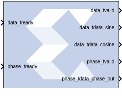
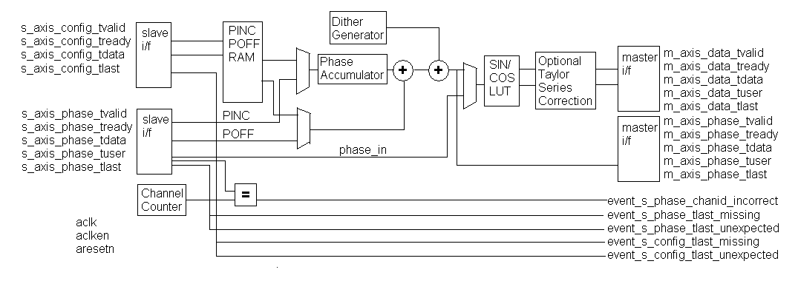
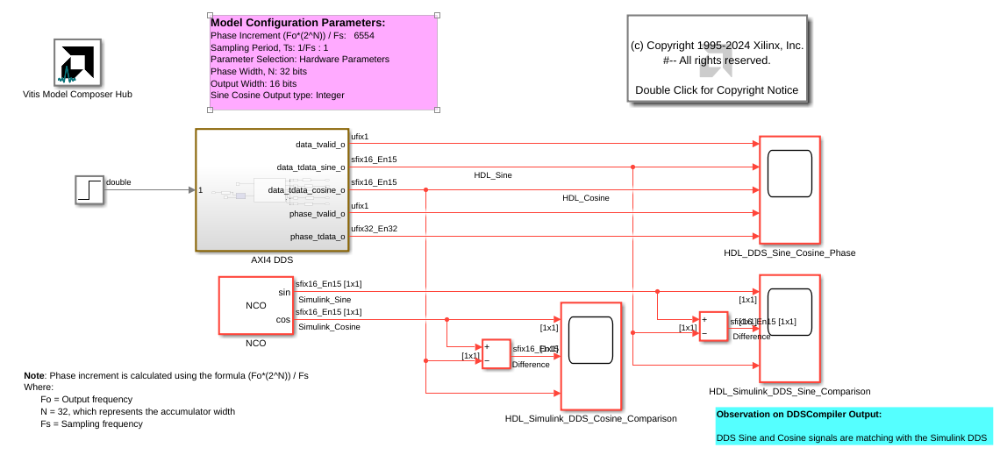
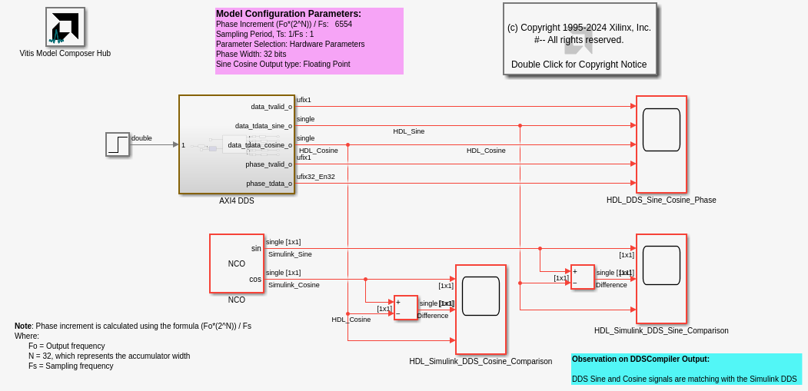

# DDS Compiler 6.0

The DDS (Direct Digital Synthesizer) Compiler block implements
high performance, optimized Phase Generation and Phase to Sinusoid
circuits with AXI4-Stream compliant interfaces for supported devices.

## Description

The core sources sinusoidal waveforms for use in many applications. A
DDS consists of a Phase Generator and a SIN/COS Lookup Table (phase to
sinusoid conversion). These parts are available individually or combined
using this core.

### Architecture Overview

To understand the DDS Compiler, it is necessary to know how the block is
implemented in FPGA hardware. The following is a block diagram of the
DDS Compiler core. The core consist of two main parts, a Phase Generator
part and a SIN/COS LUT part. These parts can be used independently or
together with an optional dither generator to create a DDS capability. A
time-division multi-channel capability is supported with independently
configurable phase increment and offset parameters.

  

#### Phase Generator

The Phase Generator consists of an accumulator followed by an optional
adder to provide addition of phase offset. When the core is customized
the phase increment and offset can be independently configured to be
either Fixed, Programmable (using the CONFIG channel) or Streaming
(using the input PHASE channel).

When set to fixed the DDS output frequency is set when the core is
customized and cannot be adjusted once the core is embedded in a design.

When set to programmable, the CONFIG channel TDATA field will have a
subfield for the input in question (PINC or POFF) or both if both have
been selected to be programmable. If neither PINC nor POFF is set to
programmable, there is no CONFIG channel.

When set to streaming, the input PHASE channel TDATA port
(s_axis_phase_tdata) will have a subfield for the input in question
(PINC or POFF) or both if both have been selected to be streaming. If
neither PINC nor POFF is set to streaming, and the DDS is configured to
have a Phase Generator then there is no input PHASE channel. Note that
when the DDS is configured to be a SIN/COS Lookup only, the PHASE_IN
field is input using the input PHASE channel TDATA port.

#### SIN/COS LUT

When configured as a SIN/COS Lookup only, the Phase Generator is not
implemented, and the PHASE_IN signal is input using the input PHASE
channel, and transformed into the SINE and COSINE outputs using a
look-up table.

Efficient memory usage is achieved by exploiting the symmetry of
sinusoid waveforms. The core can be configured for SINE only output,
COSINE only output or both (quadrature) output. Each output can be
configured independently to be negated. Precision can be increased using
optional Taylor Series Correction. This exploits XtremeDSP slices on
FPGA families that support them to achieve high SFDR with high speed
operation.

### AXI Ports that are Unique to this Block

Depending on the Configuration Options and Phase Increment
Programmability/Phase Offset Programmability options selected, different
subfield-ports for the PHASE channel or the CONFIG channel (or both
channels) are available on the block, as described in the table below.

<table cellpadding="4" cellspacing="0" summary="" id="rha1538085363416__aa1033756" class="table" frame="border" border="1" rules="all"><colgroup><col style="width:20%" /><col style="width:20%" /><col style="width:20%" /><col style="width:20%" /><col style="width:20%" /></colgroup><thead class="thead" style="text-align:left;">
<tr class="row">
<th class="entry cellrowborder" rowspan="2" style="vertical-align:top;" id="d54787e129">Configuration Options</th>

<th class="entry cellrowborder" colspan="2" style="vertical-align:top;" id="d54787e133">Phase Increment
                           Programmability</th>

<th class="entry cellrowborder" colspan="2" style="vertical-align:top;" id="d54787e137">Phase Offset
                           Programmability</th>

</tr>

<tr class="row">
<th class="entry cellrowborder" style="vertical-align:top;" id="d54787e144">Option Selected</th>

<th class="entry cellrowborder" style="vertical-align:top;" id="d54787e147">Available Port</th>

<th class="entry cellrowborder" style="vertical-align:top;" id="d54787e150">Option Selected</th>

<th class="entry cellrowborder" style="vertical-align:top;" id="d54787e153">Available Port</th>

</tr>

</thead>
<tbody class="tbody">
<tr class="row">
<td class="entry cellrowborder" rowspan="4" style="vertical-align:top;" headers="d54787e129 d54787e144 ">
Phase_Generator_only

Phase_Generator_and_SIN_COS_LUT

</td>

<td class="entry cellrowborder" style="vertical-align:top;" headers="d54787e133 d54787e147 ">Programmable</td>

<td class="entry cellrowborder" style="vertical-align:top;" headers="d54787e133 d54787e150 ">s_axis_config_tdata_pinc</td>

<td class="entry cellrowborder" style="vertical-align:top;" headers="d54787e137 d54787e153 ">Programmable</td>

<td class="entry cellrowborder" style="vertical-align:top;" headers="d54787e137 ">s_axis_config_tdata_poff</td>

</tr>

<tr class="row">
<td class="entry cellrowborder" style="vertical-align:top;" headers="d54787e133 d54787e147 ">Streaming</td>

<td class="entry cellrowborder" style="vertical-align:top;" headers="d54787e133 d54787e150 ">s_axis_phase_tdata_pinc</td>

<td class="entry cellrowborder" style="vertical-align:top;" headers="d54787e137 d54787e153 ">Streaming</td>

<td class="entry cellrowborder" style="vertical-align:top;" headers="d54787e137 ">s_axis_phase_tdata_poff</td>

</tr>

<tr class="row">
<td class="entry cellrowborder" rowspan="2" style="vertical-align:top;" headers="d54787e133 d54787e147 ">Fixed</td>

<td class="entry cellrowborder" rowspan="2" style="vertical-align:top;" headers="d54787e133 d54787e150 ">NA</td>

<td class="entry cellrowborder" style="vertical-align:top;" headers="d54787e137 d54787e153 ">Fixed</td>

<td class="entry cellrowborder" style="vertical-align:top;" headers="d54787e137 ">NA</td>

</tr>

<tr class="row">
<td class="entry cellrowborder" style="vertical-align:top;" headers="d54787e137 d54787e153 ">None</td>

<td class="entry cellrowborder" style="vertical-align:top;" headers="d54787e137 ">NA</td>

</tr>

<tr class="row">
<td class="entry cellrowborder" style="vertical-align:top;" headers="d54787e129 d54787e144 ">SIN_COS_LUT_only</td>

<td class="entry cellrowborder" colspan="4" style="vertical-align:top;" headers="d54787e133 d54787e137 d54787e147 d54787e150 d54787e153 ">In this configuration, input port s_axis_phase_tdata_phase_in are available</td>

</tr>

</tbody>
</table>

## Parameters

### Basic tab  
Parameters specific to the Basic tab are as follows.
#### Configuration Options  
This parameter allows for two parts of the DDS to be instantiated
separately or instantiated together. Select one of the following.

  - Phase_Generator_and_SIN_COS_LUT
  - Phase_Generator_only
  - SIN_COS_LUT_only
 
#### System Clock (MHz)  
Specifies the frequency at which the block is clocked for the purposes
of making architectural decisions and calculating phase increment from
the specified output frequency. This is a fixed ratio off the System
Clock.

#### Number of Channels  
The channels are time-multiplexed in the DDS which affects the effective
clock per channel. The DDS can support 1 to 16 time-multiplexed
channels.

#### Mode of Operation  
##### Standard  
The output frequency of the DDS waveform is a function of the system
clock frequency, the phase width in the phase accumulator and the phase
increment value.

##### Rasterized  
The DDS does not truncate the accumulated phase. Rasterized operation is
intended for configurations where the desired frequency is a rational
fraction of the system clock (output frequency = system frequency \*
N/M, where 0 \< N \< M). Values of M from 9 to 16384 are supported.

**Note**: Refer to the document DDS Compiler LogiCORE IP Product Guide
([PG141](https://docs.xilinx.com/access/sources/ud/document?isLatest=true&url=pg141-dds-compiler&ft:locale=en-US))
for a detailed explanation of these modes.

#### SIN COS Output Type
##### Integer
When Interger is selected for SIN COS Output type, then the fixed-point data type is displayed using format Fix_<Output_width> _ <Binary_Point_Width>. 
For example, if output width is 16 bits then Fix_16_15 is displayed as output data type.

##### Floating_Point  
When floating-point is selected for SIN COS Output type, then XFloat_8_24 is displayed as output data type. 

**Note**
A floating-point data type is displayed using the format: XFloat_<exponent_bit_width> _ <fraction_bit_width>. 
Single precision data type is displayed using the string "XFloat_8_24"

#### Parameter Selection  
Select System_Parameters or Hardware_Parameters

#### Spurious Free Dynamic Range (dB)  
The targeted purity of the tone produced by the DDS. This sets the
output width as well as internal bus widths and various implementation
decisions.

#### Frequency Resolution (Hz)  
This sets the precision of the PINC and POFF values. Very precise values
will require larger accumulators. Less precise values will cost less in
hardware resource.

#### Noise Shaping  
Select one: None, Phase_Dithering, Taylor_Series_Corrected, or Auto.

If the Configuration Options selection is SIN_COS_LUT_only, then None
and Taylor_Series_Corrected are the only valid options for Noise
Shaping. If Phase_Generator_Only is selected, then None is the only
valid choice for Noise Shaping.

#### Phase Width  
Equivalent to frequency resolution, this sets the width of the internal
phase calculations.

#### Output Width  
Broadly equivalent to SFDR, this sets the output precision and the
minimum Phase Width allowable. However, the output accuracy is also
affected by the choice of Noise Shaping.

#### Output Selection  
##### Sine_and_Cosine  
Place both a Sine and Cosine output port on the block.

##### Sine  
Place only a Sine output port on the block.

##### Cosine  
Place only a Cosine output port on the block.

#### Polarity  
##### Negative Sine  
Negates the sine output.

##### Negative Cosine  
Negates the cosine output.

#### Amplitude Mode  
##### Full_Range  
Selects the maximum possible amplitude.

#### Unit_Circle  
Selects an exact power-of-two amplitude, which is about one half the
Full_Range amplitude.

### Implementation tab  
 
#### Memory Type  
Select between Auto, Distributed_ROM, or Block_ROM.

#### Optimization Goal  
Select between Auto, Area, or Speed.

#### DSP48 Use  
Select between Minimal, or Maximal. When set to Maximal, XtremeDSP
slices are used to achieve to maximum performance.

#### Latency Options  
##### Auto  
The DDS is fully pipelined for optimal performance.

##### Configurable  
Allows you to select less pipeline stages in the Latency pulldown menu
below. This generally results in less resources consumed.

#### Control Signals  
##### Has phase out  
When checked the DDS will have the phase_output port. This is an
output of the Phase_Generator half of the DDS, so it precedes the sine
and cosine outputs by the latency of the sine/cosine lookup table.

##### ACLKEN  
Enables the clock enable (aclken) pin on the core. All registers in the
core are enabled by this control signal.

##### ARESETn  
Active-low synchronous clear input that always takes priority over
ACLKEN. A minimum ARESETn active pulse of two cycles is required, since
the signal is internally registered for performance. A pulse of one
cycle resets the core, but the response to the pulse is not in the cycle
immediately following.

#### Use explicit period  
When checked, the DDS Compiler block uses the explicit sample period
that is specified in the dialog entry box below.

### AXI Channel Options tab  

#### TLAST  
Enabled when there is more than one DDS channel (as opposed to AXI
channel), as TLAST is used to denote the transfer of the last
time-division multiplied channel of the DDS. Options are as follows.

###### Not_Required  
In this mode, no TLAST appears on the input PHASE channel nor on the
output channels.

###### Vector_Framing  
In this mode, TLAST on the input PHASE channel and output channels
denotes the last.

###### Packet_Framing  
In this mode, TLAST is conveyed from the input PHASE channel to the
output channels with the same latency as TDATA. The DDS does not use or
interpret the TLAST signal in this mode.This mode is intended as a
service to ease system design for cases where signals must accompany the
datastream, but which have no application in the DDS.

###### Config_Triggered  
This is an enhanced variant of the Vector Framing option. In this
option, the TLAST on the input PHASE channel can trigger the adoption of
new configuration data from the CONFIG channel when there is new
configuration data available. This allows the re-configuration to be
synchronized with the cycle of time-division-multiplexed DDS channels.

##### Output TREADY  
When selected, the output channels will have a TREADY and hence support
the full AXI handshake protocol with inherent back-pressure. If there is
an input PHASE channel, its TREADY is also determined by this control,
so that the datapath from input PHASE channel to output channels as a
whole supports backpressure or not.

#### TUSER Options  
Select one of the following options for the Input, DATA Output, and
PHASE Output.

###### Not_Required  
Neither of the above uses is required; the channel in question will not
have a TUSER field.

###### Chan_ID_Field  
In this mode, the TUSER field identifies the time-division-multiplexed
channel for the transfer.

###### User_Field  
In this mode, the block ignores the content of the TUSER field, but
passes the content untouched from the input PHASE channel to the output
channels.

###### User and Chan_ID_Field  
In this mode, the TUSER field has both a user field and a chan_id
field, with the chan_id field in the least significant bits. The
minimal number of bits required to describe the channel will determine
the width of the chan_id field. For example, 7 channels will require 3
bits.

###### User Field Width  
This field determines the width of the bit field which is conveyed from
input to output untouched by the DDS.

#### Synchronization Mode  
##### On_Vector:  
In this mode, the re-configuration data is applied when the channel
starts a new cycle of time-division-multiplexed channels.

##### On_Packet:  
In this mode, available when TLAST is set to Packet Framing, the TLAST
channel will trigger the re-configuration. This mode is targeted at the
case where it is to be associated with the packets implied by the input
TLAST indicator.

### Output Frequency tab  
#### Phase Increment Programmability  
Specifies the phase increment to be Fixed, Programmable or Streaming.
The choice of Programmable adds channel, data, and we input ports to the
block.

The following fields are activated when Phase_Generator_and_SIN_COS_LUT
is selected as the Configuration Options field on the Basic tab, the
Parameter Selection on the Basic tab is set to Hardware Parameters and
Phase Increment Programmability field on the Phase Offset Angles tab is
set to Fixed or Programmable.

#### Output frequencies (MHz)  
For each channel, an independent frequency can be entered into an array.
This field is activated when Parameter Selection on the Basic tab is set
to System Parameters and Phase Increment Programmability is Fixed or
Programmable.

#### Phase Angle Increment Values  
This field is activated when Phase_Generator_and_SIN_COS_LUT is selected
as the Configuration Options field on the Basic tab, the Parameter
Selection on the Basic tab is set to Hardware Parameters and Phase
Increment Programmability field on the Phase Offset Angles tab is set to
Fixed or Programmable. Values must be entered in binary. The range is 0
to the weight of the accumulator, for example, 2Phase_Width-1.

### Phase Offset Angles tab  
#### Phase Offset Programmability  
Specifies the phase offset to be None, Fixed, Programmable or Streaming.
The choice of Fixed or Programmable adds the channel, data, and we input
ports to the block.

#### Phase Offset Angles (x2pi radians)  
For each channel, an independent offset can be entered into an array.
The entered values are multiplied by 2π radians. This field is activated
when Parameter Selection on the Basic tab is set to System Parameters
and Phase Increment Programmability is Fixed or Programmable.

#### Phase Angle Offset Values  
For each channel, an independent offset can be entered into an array.
The entered values are multiplied by 2π radians. This field is activated
when Parameter Selection on the Basic tab is set to Hardware Parameters
and Phase Increment Programmability is Fixed or Programmable.

### Advanced tab  

#### Block Icon Display

##### Display shortened port names  
This option is ON by default. When unselected, the full AXI name of each
port is displayed on the block.

Other parameters used by this block are explained in the topic [Common
Options in Block Parameter Dialog
Boxes](../../GEN/common-options/README.md).

## Examples

DDS Compiler examples with integer and floating point output datatype are shown below:

***Click on the images below to open each model.***

--------------

## LogiCORE™ Documentation

DDS Compiler LogiCORE IP Product Guide
([PG141](https://docs.xilinx.com/access/sources/ud/document?isLatest=true&url=pg141-dds-compiler&ft:locale=en-US))

--------------
Copyright (C) 2024 Advanced Micro Devices, Inc.
All rights reserved.

SPDX-License-Identifier: MIT
