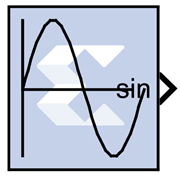
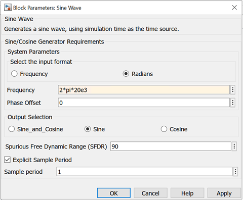
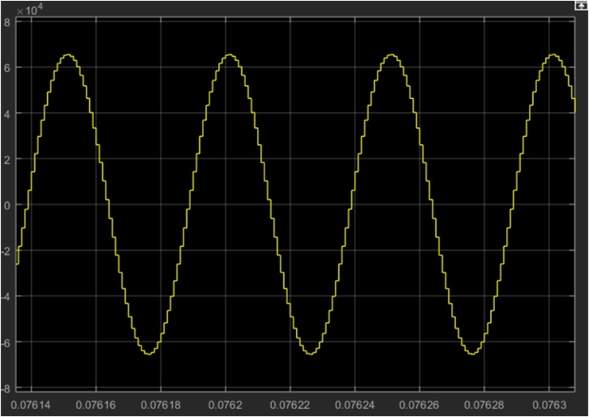
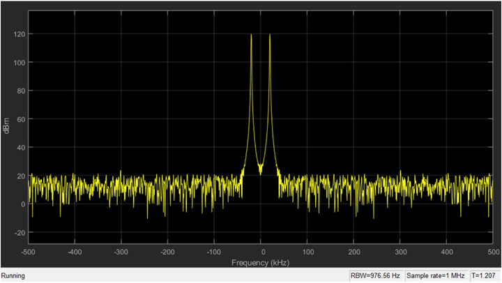

# Sine Wave

The Xilinx Sine Wave block generates a sine wave, using simulation time
as the time source.

The Xilinx Sine Wave block outputs a sinusoidal waveform. Outputs from
the block can be a sine wave, a cosine wave, or both. When implemented
in a Xilinx FPGA or SoC, the Sine Wave block optimizes the block
parameters for your target device.

The output of the Sine Wave block is determined by this equation:

y = sin (2π(k+o)/p)

where

p = number of time samples per sine wave period

k = repeating integer value that ranges from 0 to p-1

o = offset (phase shift) of the signal

In this block, Model Composer sets k equal to 0 at the first time step
and computes the block output, using the formula above. At the next time
step, Simulink increments k and re-computes the output of the block.
When k reaches p, Simulink resets k to 0 before computing the block
output. This process continues until the end of the simulation.

The output characteristic of the Sine Wave block is determined by:

Samples per period = 2π / (Frequency \* Sample Time)

Number of offset samples = Phase Offset \* Samples per period / 2π

The Sine Wave block is ideal for generating simple sine and cosine
waves. If your sine wave implementation will use more complicated
features such as a phase generator, multiple channel support, or AXI4
ports, use the Xilinx [DDS Compiler 6.0](ddscompiler60.html) block in
your design instead of the Sine Wave block.

In the Vivado design flow, the Sine Wave block is inferred as "LogicCore
IP DDS Compiler v6.0" for code generation.

## Block Parameters

The block parameters dialog box can be invoked by double-clicking the
icon in your Simulink® model.

Parameters specific to the block are as follows:

System Parameters  
Select the input format  
Specifies whether the frequency and phase offset inputs are entered as a
Frequency (Hz) or an angular velocity (Radians) value.

Frequency  
Specifies the frequency, either in Hertz or radians. The default is 1.

Phase Offset  
Specifies the phase shift, either in Hertz or radians. The default is 0.

Output Selection  
Sine_and_Cosine  
Places both a sine and cosine output port on the block.

Sine  
Places only a sine output port on the block.

Cosine  
Places only a cosine output port on the block.

&nbsp;

Spurious Free Dynamic Range (SFDR)  
Specifies the precision of the output produced by the Sine Wave block.
This sets the output width as well as internal bus widths, and controls
various implementation decisions.

Explicit Sample Period  
If checked, the Sine Wave block uses the explicit sample time specified
in the Sample Period box below. If not checked, the Model Composer base
period will be used as block sample time.

Sample Period  
If Explicit Sample Period

## Example

A simple use case of generating sinusoidal signal using Sine Wave block
is shown below.

To generate a 20 KHz sine wave with π/2 phase offset in a system running
at sample period of (1/1e6) or 1 MHz, use the following specification on
the Sine Wave block.

Figure: Sine Wave Specifications

These settings generate this sine wave:

Figure: Generated Sine Wave

Wavelength of sine wave = Simulink Sample Period / Frequency is
selected, specifies the sample time for the block. =\> 1MHz/20KHz = 0.5
\* 10⁻⁴

The spectrum view of the sine wave is:

Figure: Sine Wave Output

Also:

Number of Samples per period = (2π/(1/1e6 \* 20e3))

= 50 (Total number of samples in a single cycle)

Number of offset samples = (π/2) \* (50/2π) = 50/4

## LogiCORE™ Documentation

[LogiCORE IP DDS Compiler v6.0 Product
Guide](https://www.xilinx.com/support/documentation/ip_documentation/dds_compiler/v6_0/pg141-dds-compiler.pdf)
