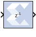
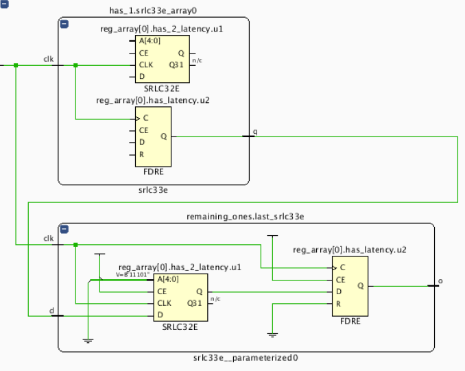
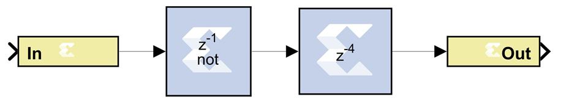
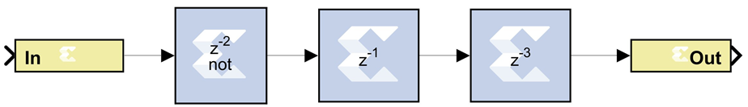
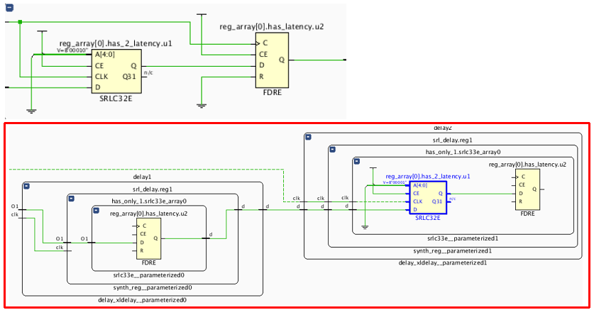
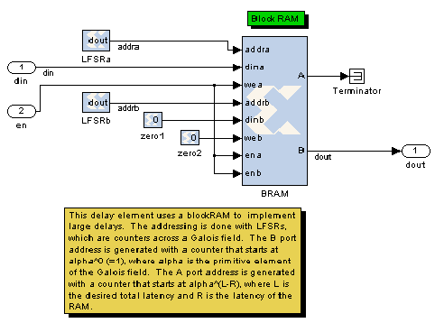

# Delay

The Xilinx Delay block implements a fixed delay of L cycles.

## Description

The delay value is displayed on the block in the form z^(-L), which is
the Z-transform of the block’s transfer function. Any data provided to
the input of the block will appear at the output after L cycles. The
rate and type of the data of the output is inherited from the input.
This block is used mainly for matching pipeline delays in other portions
of the circuit. The delay block differs from the register block in that
the register allows a latency of only 1 cycle and contains an initial
value parameter. The delay block supports a specified latency but no
initial value other than zeros. The following figure shows the Delay
block behavior when L=4 and Period=1s.

  
  

For delays that need to be adjusted during run-time, you should use the
Addressable Shift Register block. Delays that are not an integer number
of clock cycles are not supported and such delays should not be used in
synchronous design (with a few rare exceptions).

## Parameters

### Basic tab  
Parameters specific to the Basic tab are as follows:

#### Provide synchronous reset port  
* This option activates an optional reset (rst) pin on the block. When the
reset signal is asserted the block goes back to its initial state. Reset
signal has precedence over the optional enable signal available on the
block. The reset signal has to run at a multiple of the block's sample
rate. The signal driving the reset port must be Boolean.

#### Provide enable port 
* This option activates an optional enable (en) pin on the block. When the
enable signal is not asserted the block holds its current state until
the enable signal is asserted again or the reset signal is asserted.
Reset signal has precedence over the enable signal. The enable signal
has to run at a multiple of the block 's sample rate. The signal driving
the enable port must be Boolean.

#### Latency  
* Latency is the number of cycles of delay. The latency can be zero,
provided that the Provide enable port checkbox is not checked. The
latency must be a non-negative integer. If the latency is zero, the
delay block collapses to a wire during logic synthesis. If the latency
is set to L=1, the block will generally be synthesized as a flip-flop
(or multiple flip-flops if the data width is greater than 1).

### Implementation tab  
Parameters specific to the Implementation tab are as follows:

#### Implement using behavioral HDL  
* Uses behavioral HDL as the implementation. This allows the downstream
logic synthesis tool to choose the best implementation.

Other parameters used by this block are explained in the topic [Common
Options in Block Parameter Dialog
Boxes](common-options-in-block-parameter-dialog-boxes-aa1032308.html).

## Logic Synthesis using Behavioral HDL

This setting is recommended if you are using Synplify Pro as the
downstream logic synthesis tool. The logic synthesis tool will implement
the delay as it desires, performing optimizations such as moving parts
of the delay line back or forward into blockRAMs, DSP48s, or embedded
IOB flip-flops; employing the dedicated SRL cascade outputs for long
delay lines based on the architecture selected; and using flip-flops to
terminate either or both ends of the delay line based on path delays.
Using this setting also allows the logic synthesis tool, if
sophisticated enough, to perform retiming by moving portions of the
delay line back into combinational logic clouds.

## Logic Synthesis using Structural HDL

If you do not check the box Implement using behavioral HDL, then
structural HDL is used. This is the default setting and results in a
known, but less-flexible, implementation which is often better for use
with Vivado synthesis. In general, this setting produces structural HDL
comprising an SRL (Shift-Register LUT) delay of (L-1) cycles followed by
a flip-flop, with the SRL and the flip-flop getting packed into the same
slice. For a latency greater than L=33, multiple SRL/flip-flop sets are
cascaded, albeit without using the dedicated cascade routes. For
example, the following is the synthesis result for a 1-bit wide delay
block with a latency of L=64:

  

The first SRL provides a delay of 32 cycles and the associated flip-flop
adds another cycle of delay. The second SRL provides a delay of 30
cycles; this is evident because the address is set to
{A4,A3,A2,A1,A0}=11101 (binary) = 29, and the latency through an SRL is
the value of the address plus one. The last flip-flop adds a cycle of
delay, making the grand total L=32+1+30+1=64 cycles.

The SRL is an efficient way of implementing delays in the Xilinx
architecture. An SRL and its associated flip-flop that comprise a single
logic cell can implement 33 cycles of delay whereas a delay line
consisting only of flip-flops can implement only one cycle of delay per
logic cell.

The SRL has a setup time that is longer than that of a flip-flop.
Therefore, for very fast designs with a combinational path preceding the
delay block, it can be advantageous, when using the structural HDL
setting, to precede the delay block with an additional delay block with
a latency of L=1. This ensures that the critical path is not burdened
with the long setup time of the SRL. An example is shown below.

 

In the example, the two designs are logically equivalent, but the bottom
one will have a faster hardware implementation. The bottom design will
have the combinational path formed by Inverter1 terminated by a
flip-flop, which has a shorter setup time than an SRL.

The synthesis results of both designs are shown below, with the faster
design highlighted in red:

  
  

Note that an equivalent to the faster design results from setting the
latency of Inverter1 to 1 and eliminating Delay1. This, however, is not
equivalent to setting the latency of Inverter1 to 4 and eliminating the
delay blocks; this would yield a synthesis equivalent to the upper
(slower) design.

## Implementing Long Delays

For very long delays, of, say, greater than 128 cycles, especially when
coupled with larger bus widths, it might be better to use a
block-RAM-based delay block. The delay block is implemented using SRLs,
which are part of the general fabric in the Xilinx. Very long delays
should be implemented in the embedded block RAMs to save fabric. Such a
delay exploits the dual-port nature of the blockRAM and can be
implemented with a fixed or run-time-variable delay. Such a block is
basically a block RAM with some associated address counters. The model
below shows a novel way of implementing a long delay using LFSRs (linear
feedback shift registers) for the address counters in order to make the
design faster, but conventional counters can be used as well. The
difference in value between the counters (minus the RAM latency) is the
latency L of the delay line.

  
  

## Re-settable Delays and Initial Values

If a delay line absolutely must be re-settable to zero, this can be done
by using a string of L register blocks to implement the delay or by
creating a circuit that forces the output to be zero while the delay
line is “flushed”.

The delay block does not support initial values, but the Addressable
Shift Register block does. This block, when used with a fixed address,
is generally equivalent to the delay block and will synthesize to an
SRL-based delay line. The initial values pertain to initialization only
and not to a reset. If using the addressable shift register in
“structural HDL mode” (e.g., the Use behavioral HDL checkbox is not
selected) then the delay line will not be terminated with a flip-flop,
making it significantly slower. This can be remedied by using behavioral
mode or by putting a Register or Delay block after the addressable shift
register.
