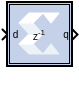

# Vector Delay Delta

The Vector Delay Delta Block delays each vector element differently
based on the given latency and delay latency values.

Hardware notes: A delay line is a chain, each link of which is an SRL16
followed by a flip-flop.

## Description

The delta latency parameter is used to generate each parallel path with
different latency (for example, \[Latency + Delta Latency \* (i-1)\],
where i represents the channel number in a range from 1 to the SSR
value).

The delta latency should be an integer and greater than or equal to
-Latency/(SSR-1).

For example when SSR is set to '4', Latency is set to '1', and Delta
Latency is set to '3' then the four channels from 1 to 4 are delayed by
1,4,7, and 10 sample times respectively.

Note: In the Vector Delay Delta block, all the parallel channels are
delayed by an equal number of sample times provided by Latency
parameter.

The Vector Delay Delta block implements a fixed delay of L cycles.

## Parameters

#### Super Sample Rate (SSR)
This configurable GUI parameter is primarily
used to control processing of multiple data samples on every sample
period. This blocks enable 1-D vector and/or complex data support for
the primary block operation.

See the [Vector Delay](../../HDL/delay_ssr/README.md) block for further
information on using this block.

--------------
Copyright (C) 2024 Advanced Micro Devices, Inc.
All rights reserved.
