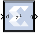

# Vector Delay Delta

The Vector Delay Delta Block delays each vector element differently
based on the given latency and delay latency values.

Hardware notes: A delay line is a chain, each link of which is an SRL16
followed by a flip-flop.

## Description

The delta latency parameter is used to generate each parallel path with
different latency (for example, \[Latency + Delta Latency \* (i-1)\],
where i represents the channel number in a range from 1 to the SSR
value).

The delta latency should be an integer and greater than or equal to
-Latency/(SSR-1).

For example when SSR is set to '4', Latency is set to '1', and Delta
Latency is set to '3' then the four channels from 1 to 4 are delayed by
1,4,7, and 10 sample times respectively.

Note: In the Vector Delay Delta block, all the parallel channels are
delayed by an equal number of sample times provided by Latency
parameter.

The Vector Delay Delta block implements a fixed delay of L cycles.

## Parameters

<!--
#### Provide synchronous reset port
Selecting the Provide Synchronous Reset Port option activates an optional reset (rst) pin on the block.
-->

<!--
#### Provide enable port
Selecting the Provide Enable Port option activates an optional enable (en) pin on the block. When the enable signal is not asserted the block holds its current state until the enable signal is asserted again or the reset signal is asserted. Reset signal has precedence over the enable signal. The enable signal has to run at a multiple of the block 's sample rate. The signal driving the enable port must be Boolean.
-->

<!--
#### Latency
Many elements in the Xilinx blockset have a latency option. This defines the number of sample periods by which the block's output is delayed. One sample period might correspond to multiple clock cycles in the corresponding FPGA implementation (for example, when the hardware is over-clocked with respect to the Simulink model). Model Composer does not perform extensive pipelining; additional latency is usually implemented as a shift register on the output of the block.
-->

<!--
#### Delta Latency
-->

<!--
#### SSR
This parameter specifies the number of output ports. The number of AI Engine kernels used is equal to the value of SSR parameter.
-->

<!--
#### Implement using behavioral HDL
Uses behavioral HDL as the implementation. This allows the downstream logic synthesis tool to choose the best implementation.
-->

#### Super Sample Rate (SSR)
This configurable GUI parameter is primarily
used to control processing of multiple data samples on every sample
period. This blocks enable 1-D vector and/or complex data support for
the primary block operation.

See the [Vector Delay](../../HDL/delay_ssr/README.md) block for further
information on using this block.

--------------
Copyright (C) 2026 Advanced Micro Devices, Inc.
All rights reserved.

SPDX-License-Identifier: MIT
