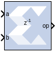

# Divide

The Xilinx Divide block performs both fixed-point and floating-point
division with the a input being the dividend and the b input the
divisor. Both inputs must be of the same data type.

## Block Parameters

Basic tab  
Parameters specific to the Basic tab are as follows

AXI Interface  
Flow Control  
Blocking  
Selects “Blocking” mode. In this mode, the lack of data on one input
channel does block the execution of an operation if data is received on
another input channel.

NonBlocking  
Selects “Non-Blocking” mode. In this mode, the lack of data on one input
channel does not block the execution of an operation if data is received
on another input channel.

Fixed-point Options  
Algorithm Type  
Radix2  
This is non-restoring integer division using integer operands and allows
a remainder to be generated. This option is recommended for operand
widths less than 16 bits. This option supports both unsigned (two's
complement) and signed divisor and dividend inputs.

High_Radix  
This option is recommended for operand widths greater than 16 bits,
though the implementation requires the use of DSP48 (or variant)
primitives. This option only supports signed (two's complement) divisor
and dividend inputs.

LutMult  
A simple lookup estimate of the reciprocal of the divisor followed by a
multiplier. Only remainder output type is supported because of the bias
required in the reciprocal estimate. This bias would introduce an offset
(error) if used to create a fractional output. This is recommended for
operand widths less than or equal to 12 bits. This implementation uses
DSP slices, block RAM, and a small number of FPGA logic primitives
(registers and LUTs). For operand widths where either Radix2 or the
LUTMult options are possible, the LUTMult solution offers a solution
using fewer FPGA logic resources because of the use of DSP and block RAM
primitives. Supports unsigned or two's complement signed numbers.

Output Fractional width  
For Fixed-point division, this entry determines the number of bits in
the fractional part of the output.

Optional Ports  
Dividend Channel Ports  
Has TLAST  
Adds a TLAST port to the Input channel.

Has TUSER  
Adds a TUSER port to the Input channel.

Divisor Channel Ports  
Has TLAST  
Adds a TLAST port to the Input channel.

Has TUSER  
Adds a TUSER port to the Input channel.

Control Options  
Provide enable port  
Adds an enable port to the block interface.

Has Result TREADY  
Adds a TREADY port to the Result channel.

Output TLAST behavior  
Determines the behavior of the result_tlast output port.

Pass_A_TLAST  
Pass the value of the a_tlast input port to the dout_tlast output port.

Pass B_TLAST  
Pass the value of the b_tlast input port to the dout_tlast output port.

OR_all_TLASTS  
Pass the logical OR of all the present TLAST input ports.

AND_all_TLASTS  
Pass the logical AND of all the present TLAST input ports.

Exception Signals  
UNDERFLOW  
Adds an output port that serves as an underflow flag.

OVERFLOW  
Adds an output port that serves as an overflow flag.

INVALID_OP  
Adds an output port that serves as an invalid operation flag.

DIVIDE_BY_ZERO  
Adds an output port that serves as a divide-by-zero flag.

Other parameters used by this block are explained in the topic [Common
Options in Block Parameter Dialog
Boxes](common-options-in-block-parameter-dialog-boxes-aa1032308.html).

## LogiCORE™ Documentation

Floating-Point Operator LogiCORE IP Product Guide
([PG060](https://www.xilinx.com/cgi-bin/docs/ipdoc?c=floating_point;v=latest;d=pg060-floating-point.pdf))
