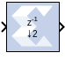
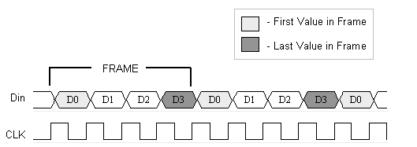

# Down Sample

The Down Sample block reduces the sample rate at the point where
the block is placed in your design.

## Description

The input signal is sampled at even intervals, at either the beginning
(first value), or end (last value) of a frame. The sampled value is
presented on the output port and held until the next sample is taken.

A Down Sample frame consists of l input samples, where l is sampling
rate. An example frame for a Down Sample block configured with a
sampling rate of 4 is shown below.

  
  

The Down Sample block is realized in hardware using one of three
possible implementations that vary in terms of implementation
efficiency. The block receives two clock enable signals in hardware,
Src_CE, and Dest_CE. Src_CE is the faster clock enable signal and
corresponds to the input data stream rate. Dest_CE is the slower clock
enable, corresponding to the output stream rate, for example, down
sampled data. These enable signals control the register sampling in
hardware.

### Zero Latency Down Sample

The zero latency Down Sample block must be configured to sample the
first value of the frame. The first sample in the input frame passes
through the mux to the output port. A register samples this value during
the first sample duration and the mux switches to the register output at
the start of the second sample of the frame. The result is that the
first sample in a frame is present on the output port for the entire
frame duration. This is the least efficient hardware implementation as
the mux introduces a combinational path from Din to Dout. A single bit
register adjusts the timing of the destination clock enable, so that it
is asserted at the start of the sample period, instead of the end. The
hardware implementation is shown below:

  

### Down Sample with Latency

If the Down Sample block is configured with latency greater than zero, a
more efficient implementation is used. One of two implementations is
selected depending on whether the Down Sample block is set to sample the
first or last value in a frame.

If the block samples the first value in a frame, two registers are
required to correctly sample the input stream. The first register is
enabled by the adjusted clock enable signal so that it samples the input
at the start of the input frame. The second register samples the
contents of the first register at the end of the sample period to ensure
output data is aligned correctly.

  
  

If the block samples the last value in a frame, a register samples the
data input data at the end of the frame. The sampled value is presented
for the duration of the next frame. The most efficient implementation is
when the Down Sample block is configured to sample the last value of the
frame.
  
  

## Block Parameters

### Basic tab  
#### Sampling Rate (number of input samples per output sample)  
Must be an integer greater or equal to 2. This is the ratio of the
output sample period to the input, and is essentially a sample rate
divider. For example, a ratio of 2 indicates a 2:1 division of the input
sample rate. If a non-integer ratio is desired, the Up Sample block can
be used in combination with the Down Sample block.

#### Sample  
The Down Sample block can sample either the first or last value of a
frame. This parameter will determine which of these two values is
sampled.

Other parameters used by this block are explained in the topic [Common
Options in Block Parameter Dialog
Boxes](../../GEN/common-options/README.md).

## LogiCORE

The Down Sample block does not use a LogiCORE™.

--------------
Copyright (C) 2023 Advanced Micro Devices, Inc. All rights reserved.
SPDX-License-Identifier: MIT
