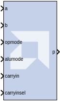
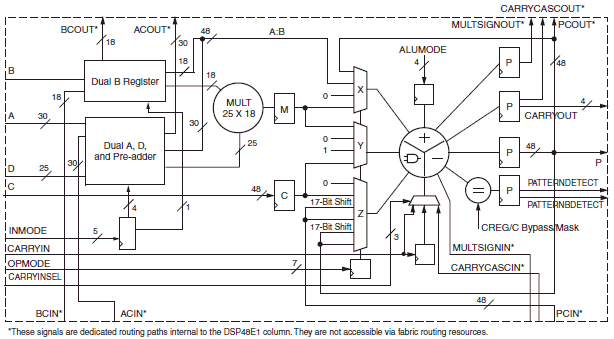

# DSP48E1

The DSP48E1 block is an efficient building block for DSP
applications that use Virtex®-7 series devices. Enhancements to
the DSP48E1 slice provide improved flexibility and utilization, improved
efficiency of applications, reduced overall power consumption, and
increased maximum frequency. The high performance allows designers to
implement multiple slower operations in a single DSP48E1 slice using
time-multiplexing methods.

## Description

The DSP48E1 slice supports many independent functions. These functions
include multiply, multiply accumulate (MACC), multiply add, three-input
add, barrel shift, wide-bus multiplexing, magnitude comparator, bit-wise
logic functions, pattern detect, and wide counter. The architecture also
supports cascading multiple DSP48E1 slices to form wide math functions,
DSP filters, and complex arithmetic without the use of general FPGA.

  

## Parameters

### Basic tab  
Parameters specific to the Basic tab are as follows.

#### Input configuration  
##### A or ACIN input  
Specifies if the A input should be taken directly from the a port or
from the cascaded acin port. The acin port can only be connected to
another DSP48 block.

##### B or BCIN input  
Specifies if the B input should be taken directly from the b port or
from the cascaded bcin port. The bcin port can only be connected to
another DSP48 block.

**Note**: If the input to the block is NaN, you will see a behavioral
simulation mismatch.

#### DSP48E1 data-path configuration  
##### SIMD Mode of Adder/Subtractor/Accumulator  
This mode can be used to implement small add-subtract functions at high
speed and lower power with less logic utilization. The adder and
subtractor in the adder/subtracter/logic unit can also be split into two
24-bit units or four 12-bit units.

##### Do not use multiplier  
When selected, the block is optimized in hardware for maximum
performance without using the multiplier. If an instruction using the
multiplier is encountered in simulation, an error is reported.

##### Use dynamic multiplier mode  
When selected, it instructs the block to use the dynamic multiplier
mode. This indicates that the block is switching between A\*B and A:B
operations on the fly and therefore needs to get the worst-case timing
of the two paths.

##### Use Preadder  
Use the 25-bit D data input to the pre-adder or alternative input to the
multiplier. The pre-adder implements D + A as determined by the INMODE3
signal.

#### Pattern Detection  
##### Reset p register on pattern detection  
If selected and the pattern is detected, reset the p register on the
next cycle

#### Pattern Input  
##### Pattern Input from c port  
When selected, the pattern used in pattern detection is read from the c
port.

###### Pattern Input  
* Pattern Input from c port:  
When selected, the pattern used in pattern detection is read from the c
port.

* Using Pattern Attribute (48bit hex value):  
Value is used in pattern detection logic which is best described as an
equality check on the output of the adder/subtracter/logic unit

* Pattern attribute:  
A 48-bit value that is used in the pattern detector.

###### Mask Input:  
* Mask input from c port  
When selected, the mask used in pattern detection is read from the c
port.

* Using Mask Attribute (48 bit hex value):  
Enter a 48-bit value used to mask out certain bits during pattern
detection.

* MODE1:  
Selects rounding_mode 1.

* MODE2:  
Selects rounding_mode 2.
 

### Optional Ports tab  
Parameters specific to the Optional Ports tab are:

#### Input Ports  
##### Consolidate control port  
When selected, combines the opmode, alumode, carry_in,
carry_in_sel, and inmode ports into one 20-bit port. Bits 0 to 6 are
the opmode, bits 7 to 10 are the alumode port, bit 11 is the
carry_in port, bits 12 to 14 are the carry_in_sel port, and bits
15-19 are the inmode bits. This option should be used when the Opmode
block is used to generate a DSP48 instruction.

##### Provide c port  
When selected, the c port is made available. Otherwise, the c port is
tied to '0'.

##### Provide global reset port  
When selected, the port rst is made available. This port is connected to
all available reset ports based on the pipeline selections.

##### Provide global enable port  
When selected, the optional en port is made available. This port is
connected to all available enable ports based on the pipeline
selections.

##### Provide pcin port  
When selected, the pcin port is exposed. The pcin port must be
connected to the pcout port of another DSP48 block.

##### Provide carry cascade in port  
When selected, the carry cascade in port is exposed. This port can only
be connected to a carry cascade out port on another DSP48E block.

##### Provide multiplier sign cascade in port  
When selected, the multiplier sign cascade in port (multsigncascin) is
exposed. This port can only be connected to a multiplier sign cascade
out port of another DSP48E block.

##### Provide carryout port  
When selected, the carryout output port is made available. When the
mode of operation for the adder/subtractor is set to one 48-bit adder,
the carryout port is 1-bit wide. When the mode of operation is set to
two 24 bit adders, the carryout port is 2 bits wide. The MSB
corresponds to the second adder's carryout and the LSB corresponds to
the first adder's carryout. When the mode of operation is set to four 12
bit adders, the carryout port is 4 bits wide with the bits
corresponding to the addition of the 48 bit input split into 4 12-bit
sections.

##### Provide pattern detect port  
When selected, the pattern detection output port is provided. When the
pattern, either from the mask or the c register, is matched the pattern
detection port is set to '1'.

##### Provide pattern bar detect port  
When selected, the pattern bar detection (patternbdetect) output port is
provided. When the inverse of the pattern, either from the mask or the c
register, is matched the pattern bar detection port is set to '1'.

##### Provide overflow port  
When selected, the overflow output port is provided. This port indicates
when the operation in the DSP48E has overflowed beyond the bit P\[N\]
where N is between 1 and 46. N is determined by the number of 1s in the
mask whether set by the GUI mask field or the c port input.

##### Provide underflow port  
When selected, the underflow output port is provided. This port
indicates when the operation in the DSP48E has underflowed. Underflow
occurs when the number goes below –P\[N\] where N is determined by the
number of 1s in the mask whether set by the GUI mask field or the c port
input.

##### Provide acout port  
When selected, the acout output port is made available. The acout
port must be connected to the acin port of another DSP48E block.

##### Provide bcout port  
When selected, the bcout output port is made available. The bcout
port must be connected to the bcin port of another DSP48E block.

##### Provide pcout port  
When selected, the pcout output port is made available. The pcout
port must be connected to the pcin port of another DSP48 block.

##### Provide multiplier sign cascade out port  
When selected, the multiplier sign cascade out port (multsigncascout) is
made available. This port can only be connected to the multiplier sign
cascade in port of another DSP48E block and is used to support 96-bit
accumulators/adders and subtracters which are built from two DSP48Es.

##### Provide carry cascade out port  
When selected, the carry cascade out port (carrycascout) is made
available. This port can only be connected to the carry cascade in port
of another DSP48E block.

### Pipelining tab  
Parameters specific to the Pipelining tab are as follows:
#### Length of a/acin pipeline  
Specifies the length of the pipeline on input register A. A pipeline of
length 0 removes the register on the input.

#### Length of b/bcin pipeline  
Specifies the length of the pipeline for the b input whether it is read
from b or bcin.

#### Length of acout pipeline  
Specifies the length of the pipeline between the a/acin input and the
acout output port. A pipeline of length 0 removes the register from
the acout pipeline length. Must be less than or equal to the length of
the a/acin pipeline.

#### Length of bcout pipeline  
Specifies the length of the pipeline between the b/bcin input and the
bcout output port. A pipeline of length 0 removes the register from the
bcout pipeline length. Must be less than or equal to the length of the
b/bcin pipeline.

#### Pipeline c  
Indicates whether the input from the c port should be registered.

#### Pipeline p  
Indicates whether the outputs p and pcout should be registered.

#### Pipeline multiplier  
Indicates whether the internal multiplier should register its output.

#### Pipeline opmode  
Indicates whether the opmode port should be registered.

#### Pipeline alumode  
Indicates whether the alumode port should be registered.

#### Pipeline carry in  
Indicates whether the carry in port should be registered.

#### Pipeline carry in select  
Indicates whether the carry in select port should be registered.

#### Pipeline preadder input register d  
Indicates to add a pipeline register to the d input.

#### Pipeline preadder output register ad  
Indicates to add a pipeline register to the ad output.

#### Pipeline INMODE register  
Indicates to add a pipeline register to the INMODE input.

### Reset/Enable Ports tab  
Parameters specific to the Reset/Enable tab are as follows.

#### Provide Reset Ports  
##### Reset port for a/acin  
When selected, a port rst_a is made available. This resets the pipeline
register for port a when set to '1'.

##### Reset port for b/bcin  
When selected, a port rst_b is made available. This resets the pipeline
register for port b when set to '1'.

##### Reset port for c  
When selected, a port rst_c is made available. This resets the pipeline
register for port c when set to '1'.

##### Reset port for multiplier  
When selected, a port rst_m is made available. This resets the pipeline
register for the internal multiplier when set to '1'.

##### Reset port for P  
When selected, a port rst_p is made available. This resets the output
register when set to '1'.

##### Reset port for carry in  
When selected, a port rst_carryin is made available. This resets the
pipeline register for carry in when set to '1'.

##### Reset port for alumode  
When selected, a port rst_alumode is made available. This resets the
pipeline register for the alumode port when set to '1'.

##### Reset port for controls (opmode and carry_in_sel)  
When selected, a port rst_ctrl is made available. This resets the
pipeline register for the opmode register (if available) and the
carry_in_sel register (if available) when set to '1'.

##### Reset port for d and ad  

##### Reset port for INMODE  

### Provide Enable Ports  
#### Enable port for first a/acin register  
When selected, an enable port ce_a1 for the first a pipeline register is
made available.

#### Enable port for second a/acin register  
When selected, an enable port ce_a2 for the second a pipeline register
is made available.

#### Enable port for first b/bcin register  
When selected, an enable port ce_b1 for the first b pipeline register is
made available.

#### Enable port for second b/bcin register  
When selected, an enable port ce_b2 for the second b pipeline register
is made available.

#### Enable port for c  
When selected, an enable port ce_c for the port C register is made
available.

#### Enable port for multiplier  
When selected, an enable port ce_m for the multiplier register is made
available.

#### Enable port for p  
When selected, an enable port ce_p for the port P output register is
made available.

#### Enable port for carry in  
When selected, an enable port ce_carry_in for the carry in register is
made available.

#### Enable port for alumode  
When selected, an enable port ce_alumode for the alumode register is
made available.

#### Enable port for multiplier carry in  
When selected, an enable port mult_carry_in for the multiplier register
is made available.

#### Enable port for controls (opmode and carry_in_sel)  
When selected, the enable port ce_ctrl is made available. The port
ce_ctrl controls the opmode and carry in select registers.

#### Enable port for d  
When selected, an enable port is added input register d.

Enable port for ad  
When selected, an enable port is add for the preadder output register
ad.

#### Enable port for INMODE  
When selected, an enable port is added for the INMODE register.

### Implementation tab  
Parameters specific to the Implementation tab are as follows.
#### Use synthesizable model  
When selected, the DSP48E is implemented from an RTL description which
might not map directly to the DSP48E hardware. This is useful if a
design using the DSP48E block is targeted at device families that do not
contain DSP48E hardware primitives.

Other parameters used by this block are explained in the topic [Common
Options in Block Parameter Dialog
Boxes](../../GEN/common-options/README.md).

--------------
Copyright (C) 2023 Advanced Micro Devices, Inc. All rights reserved.
SPDX-License-Identifier: MIT
