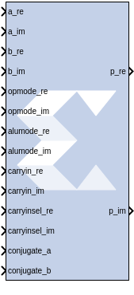
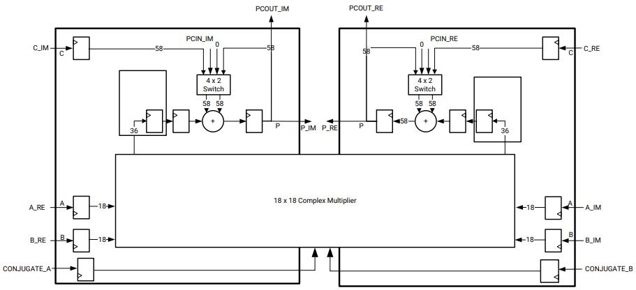

# DSPCPLX

The Xilinx DSPCPLX block is one of the advanced features provided by
Versal® architecture DSP, which is the optimized solution to deal with
18x18 complex multiplication followed by 58 + 58 accumulation operation.

Versal architecture DSP supports an 18-bit complex multiplier with two
back-to-back DSP58s in the same tile pair together. The two DSP58s with
their DSP_MODE attributes set to CINT18 form one complex arithmetic
unit. The right DSP58 computes the real result P_RE and left computes
the imaginary result P_IM. The following figure shows the unisim DSPCPLX
primitive which is used to develop this feature.

Figure: Unisim DSPCPLX Primitive

## Block Parameters

The block parameters dialog box can be invoked by double-clicking the
icon in your Simulink model.

Basic tab  
Parameters specific to the Basic tab are as follows:

Input Configuration  
A or ACIN input  
Specifies if the A input should be taken directly from the a_re, a_im
ports or from the cascaded acin_re, acin_im ports. The acin_re and
acin_im ports can only be connected to another DSPCPLX block.

B or BCIN input  
Specifies if the B input should be taken directly from the b_re, b_im
ports or from the cascaded bcin_re, bcin_im ports. The bcin_re and
bcin_im ports can only be connected to another DSPCPLX block.

Pattern Detection on Real Output  
Reset p_re register on pattern detection  
If selected and the pattern_re is detected, reset the p_re register on
the next cycle

AUTO RESET PRIORITY RE  
When enabled by selecting the option above, select RESET (the default)
or CEP (clock enabled for the P_RE (output) resister).

Pattern Input RE  
Pattern Input from c_re port  
When selected, the pattern_re used in pattern detection on Real Output
is read from the c_re port.

Using Pattern Attribute RE (58-bit hex value)  
Value is used in pattern detection logic which is best described as an
equality check on the output of the adder/subtractor/logic unit.

Using Pattern Attribute RE (58-bit hex value)  
Enter a 58-bit value that is used in the pattern detector.

Mask Input RE  
Mask input from c_re port  
When selected, the mask_re used in pattern detection is read from the
c_re port.

Using Mask Attribute RE (58-bit hex value)  
Enter a 58-bit value used to mask out certain bits during pattern
detection on Real Output.

MODE1  
Selects rounding_mode 1 (C_RE-bar left shifted by 1).

MODE2  
Selects rounding_mode 2 (C_RE-bar left shifted by 2).

Pattern Detection on Imaginary Output  
Reset p_im register on pattern detection  
If selected and the pattern_im is detected, reset the p_im register on
the next cycle.

AUTO RESET PRIORITY IM  
When enabled by selecting the option above, select RESET (the default)
or CEP (clock enabled for the P_IM (output) resister).

Mask Input IM  
Mask input from c_im port  
When selected, the mask_im used in pattern detection on Imaginary Output
is read from the c_im port.

Using Mask Attribute RE (58-bit hex value)  
Enter a 58-bit value used to mask out certain bits during pattern
detection on Imaginary Output.

MODE1  
Selects rounding_mode 1 (C_IM-bar left shifted by 1).

MODE2  
Selects rounding_mode 2 (C_IM-bar left shifted by 2).

&nbsp;

Optional Ports tab  
Parameters specific to the Optional Ports tab are as follows:

Input Ports  
Consolidate control port  
When selected, combines the opmode, alumode, carry_in, carry_in_sel,
inmode and conjugate ports into one 18-bit port. Bits 0 to 8 are the
opmode, bits 9 to 12 are the alumode port, bit 13 is the carry_in port,
bits 14 to 16 are the carry_in_sel port, bit 17 is the Conjugate_A input
port and bit 18 is the Conjugate_B port. This option should be used when
the Opmode block is used to generate a DSPCPLX instruction.

Note: Enabling this option will drive both the left and right DSP58
tiles with the same configuration.

Provide c port  
When selected, the c_re and c_im ports are made available. Otherwise,
the c_re and c_im ports are tied to '0'.

Provide global reset port  
When selected, the port rst_all is made available. This port is
connected to all available reset ports based on the pipeline selections.

Provide global enable port  
When selected, the optional en_all port is made available. This port is
connected to all available enable ports based on the pipeline
selections.

Cascadable Ports  
Provide pcin port  
When selected, the pcin_re and pcin_im ports are exposed. The pcin_re
and pcin_im ports must be connected to the pcout_re and pcout_im ports
of another DSPCPLX block respectively.

Provide carry cascade in port  
When selected, the carrycascin_re and carrycascin_im ports are exposed.
These ports can only be connected to a carry cascade out ports of
another DSPCPLX block.

Provide multiplier sign cascade in port  
When selected, the multsignin_re and multsignin_im ports are exposed.
These ports can only be connected to a multiplier sign cascade out ports
of another DSPCPLX block.

Output Ports  
Provide carryout port  
When selected, the carryout_re and carryout_im output ports are made
available.

Provide pattern detect port  
When selected, the patterndetect_re and patterndetect_out ports are
provided. When the pattern_re/pattern_im, either from the
mask_re/mask_im or the c_re/c_im register is matched, the respective
patterndetect_re/patterndetect_im port is set to '1'.

Provide pattern bar detect port  
When selected, the patternbdetect_re and patternbdetect_im ports are
provided. When the inverse of the pattern_re/pattern_im, either from the
mask_re/mask_im or the c_re/c_im register is matched, the
patternbdetect_re/patternbdetect_im port is set to '1'.

Provide overflow port  
When selected, the overflow_re and overflow_im ports are provided. These
ports indicate when the operation in the DSPCPLX has overflowed beyond
the bit P_RE\[N\]/P_IM\[N\] where N is between 0 and 56. N is determined
by the number of 1s in the mask_re/mask_im whether set by the GUI mask
field or the c_re/c_im port input.

Provide underflow port  
When selected, the underflow_re and underflow_im ports are provided.
These ports indicate when the operation in the DSPCPLX has underflowed.
Underflow occurs when the number goes below -P_RE\[N\]/P_IM\[N\], where
N is determined by the number of 1s in the mask_re/mask_im whether set
by the GUI mask field or the c_re/c_im port input.

Cascadable Ports  
Provide acout port  
When selected, the acout_re and acout_im output ports are made
available. The acout_re/acout_im port must be connected to the
acin_re/acin_im port of another DSPCPLX block.

Provide bcout port  
When selected, the bcout_re and bcout_im output ports are made
available. The bcout_re/bcout_im port must be connected to the
bcin_re/bcin_im port of another DSPCPLX block.

Provide pcout port  
When selected, the pcout_re and pcout_im output ports are made
available. The pcout_re/pcout_im port must be connected to the
pcin_re/pcin_im port of another DSPCPLX block.

Provide multiplier sign cascade out port  
When selected, the multsignout_re and multsignout_im ports are made
available. These ports can only be connected to the multsignin_re and
multsignin_im ports of another DSPCPLX block respectively and is used to
support 116-bit accumulators/adders and subtracters which are built from
two DSPCPLXs.

Provide carry cascade out port  
When selected, the carrycascout_re and carrycascout_im ports are made
available. These ports can only be connected to the carrycascin_re and
carrycascin_im ports of another DSPCPLX block respectively.

&nbsp;

Pipelining tab  
Parameters specific to the Pipelining tab are as follows:

Length of a_re/acin_re pipeline  
Specifies the length of the pipeline on input register A_RE. The
pipeline of length 0 removes the register on the input.

Length of a_im/acin_im pipeline  
Specifies the length of the pipeline on input register A_IM. The
pipeline of length 0 removes the register on the input.

Length of b_re/bcin_re pipeline  
Specifies the length of the pipeline for the b_re input and whether it
is read from b_re or bcin_re.

Length of b_im/bcin_im pipeline  
Specifies the length of the pipeline for the b_im input and whether it
is read from b_im or bcin_im.

Length of acout_re pipeline  
Specifies the length of the pipeline between the a_re/acin_re input and
the acout_re output port. The pipeline of length 0 removes the register
from the acout_re pipeline length. Must be less than or equal to the
length of the a_re/acin_re pipeline.

Length of acout_im pipeline  
Specifies the length of the pipeline between the a_im/acin_im input and
the acout_im output port. The pipeline of length 0 removes the register
from the acout_im pipeline length. Must be less than or equal to the
length of the a_im/acin_im pipeline.

Length of bcout_re pipeline  
Specifies the length of the pipeline between the b_re/bcin_re input and
the bcout_re output port. The pipeline of length 0 removes the register
from the bcout_re pipeline length. Must be less than or equal to the
length of the b_re/bcin_re pipeline.

Length of bcout_im pipeline  
Specifies the length of the pipeline between the b_im/bcin_im input and
the bcout_im output port. The pipeline of length 0 removes the register
from the bcout_im pipeline length. Must be less than or equal to the
length of the b_im/bcin_im pipeline.

Pipeline c_re  
Indicates whether the input from the c_re port should be registered.

Pipeline c_im  
Indicates whether the input from the c_im port should be registered.

Pipeline p_re  
Indicates whether the outputs p_re and pcout_re should be registered.

Pipeline p_im  
Indicates whether the outputs p_im and pcout_im should be registered.

Pipeline multiplier_re  
Indicates whether the internal multiplier_re should register its output.

Pipeline multiplier_im  
Indicates whether the internal multiplier_im should register its output.

Pipeline opmode_re  
Indicates whether the opmode_re port should be registered.

Pipeline opmode_im  
Indicates whether the opmode_im port should be registered.

Pipeline alumode_re  
Indicates whether the alumode_re port should be registered.

Pipeline alumode_im  
Indicates whether the alumode_im port should be registered.

Pipeline carry in Re  
Indicates whether the carryin_re port should be registered.

Pipeline carry in Im  
Indicates whether the carryin_im port should be registered.

Pipeline carry in select Re  
Indicates whether the carryinsel_re port should be registered.

Pipeline carry in select Im  
Indicates whether the carryinsel_im port should be registered.

Pipeline preadder output register ad  
Indicates to add a pipeline register to the ad output.

Pipeline Conjugate register A  
Indicates to add a pipeline register to the Conjugate_A input.

Pipeline Conjugate register B  
Indicates to add a pipeline register to the Conjugate_B input.

&nbsp;

Reset/Enable Ports tab  
Parameters specific to the Reset/Enable tab are as follows:

Provide Reset Ports  
Reset port for a/acin  
When selected, rsta_re and rsta_im ports are made available. This resets
the pipeline registers for port a_re, a_im when set to '1'.

Reset port for b/bcin  
When selected, rstb_re and rstb_im are made available. This resets the
pipeline registers for port b_re, b_im when set to '1'.

Reset port for c  
When selected, rstc_re and rstc_im are made available. This resets the
pipeline registers for port c_re, c_im when set to '1'.

Reset port for multiplier  
When selected, rstm_re and rstm_im are made available. This resets the
pipeline registers for internal multiplier respectively when set to '1'.

Reset port for P  
When selected, rstp_re and rstp_im are made available. This resets the
output p_re and p_im registers when set to '1'.

Reset port for carry in  
When selected, rstallcarryin_re and rstallcarryin_im are made available.
This resets the pipeline registers for carryin_re and carryin_im port
when set to '1'.

Reset port for alumode  
When selected, rstalumode_re and rstalumode_im are made available. This
resets the pipeline register for the alumode_re and alumode_im port when
set to '1'.

Reset port for controls (opmode and carry_in_sel)  
When selected, a port rstctrl_re and rstctrl_im are made available. This
resets the pipeline register for the opmode_re/opmode_im register (if
available) and the carryinsel_re/carryinsel_im register (if available)
when set to '1'.

Reset port for ad  
When selected, port rstad is made available. This resets the pipeline ad
register for ports when set to '1'.

Reset port for Conjugate_a  
When selected, port rstconjugate_a is made available. This resets the
pipeline register for the Conjugate_a port when set to '1'.

Reset port for Conjugate_b  
When selected, port rstconjugate_b is made available. This resets the
pipeline register for the Conjugate_b port when set to '1'.

Provide Enable Ports  
Enable port for first a/acin register  
When selected, enable ports cea1_re and cea1_im for the first a_re and
a_im pipeline register are made available.

Enable port for second a/acin register  
When selected, enable ports cea2_re and cea2_im for the second a_re and
a_im pipeline registers are made available.

Enable port for first b/bcin register  
When selected, enable ports ceb1_re and ceb1_im for the first b_re and
b_im pipeline registers are made available.

Enable port for second b/bcin register  
When selected, enable ports ceb2_re and ceb2_im for the second b_re and
b_im pipeline registers are made available.

Enable port for c  
When selected, enable ports cec_re and cec_im for the port C_re and C_im
registers are made available.

Enable port for multiplier  
When selected, enable ports cem_re and cem_im for the Real and Imaginary
multiplier registers are made available.

Enable port for p  
When selected, enable ports cep_re and cep_im for the port P_re and P_im
output registers are made available.

Enable port for carry in  
When selected, enable ports cecarryin_re and cecarryin_im for the Real
and Imaginary carry in registers are made available.

Enable port for alumode  
When selected, enable ports cealumode_re and cealumode_im for the Real
and Imaginary alumode registers are made available.

Enable port for controls (opmode and carry_in_sel)  
When selected, enable ports cectrl_re and cectrl_im are made available.
The ports cectrl_re and cectrl_im controls the Real and Imaginary opmode
and carry in select registers.

Enable port for ad  
When selected, an enable port is created for the preadder output
register ad.

Enable port for Conjugate_a  
When selected, an enable port conjugate_a is added for the Conjugate_A
register.

Enable port for Conjugate_b  
When selected, an enable port conjugate_b is added for the Conjugate_B
register.

Inversion Options tab  
When the checkbox is selected on this tab, the specified signal is
inverted.

Implementation tab  
Parameters specific to the Implementation tab are as follows.

Use synthesizable model  
When selected, the DSPCPLX is implemented from an RTL description which
might not map directly to the DSP58 hardware. This is useful if a design
using the DSPCPLX block is targeted at device families that do not
contain DSP58 hardware primitives.

Other parameters used by this block are explained in the topic [Common
Options in Block Parameter Dialog
Boxes](common-options-in-block-parameter-dialog-boxes-aa1032308.html).
