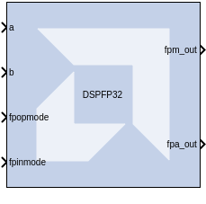
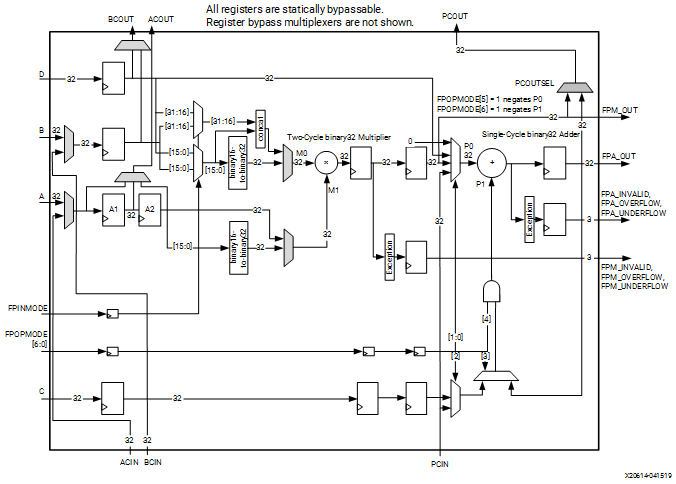

# DSPFP32

The DSPFP32 block is an efficient building block for Floating Point DSP applications for Versal™ devices.

## Description
The DSPFP32 block is an efficient building block for Floating Point DSP applications for Versal™ devices. 
The DSPFP32 consists of a floating point multiplier and a floating point adder with separate outputs in binary 32 format going into the internal logic. 
Each floating point multiplier input can be in either the IEEE binary32 (FP32 or single-precision) or binary16 (FP16 or half-precision) format, 
whereas the floating point adder only accepts binary32 inputs. Outputs are always in FP32 or single-precision format.

The following figure represents the DSPFP32 Floating Point Multiplier and Adder:

## Parameters

### Basic

Parameters specific to the Basic tab are as follows.

####  A or ACIN input
Specifies if the A input should be taken directly from the a port or from the cascaded acin port. The acin port can only be connected to another DSPFP32 block.

#### B or BCIN input
Specifies if the B input should be taken directly from the b port or from the cascaded bcin port. The bcin port can only be connected to another DSPFP32 block.

#### A_FPTYPE Selects Floating Point Type for A
Selects floating-point data type for A. B16 is for binary16 (half-precision) and B32 is for binary32 (single-precision).

#### B_D_FPTYPE Selects Floating Point Type for B and D
Selects floating-point data type for B and D for multiplication. B16 is for binary16 (half-precision) and B32 is for binary32 (single-precision).

**Note**: When set to B16, D cannot be sent directly to P1 for binary32 addition. It can be first multiplied by A = 1 and then sent to P0 as FPM for binary32 addition.

#### Do not use multiplier

Selects usage of the multiplier. Enable this to save power when using only the Adder/Logic Unit.

#### Use dynamic multiplier mode

Selects the multiplier mode between dynamic or multiply.

### Optional Ports

Parameters specific to the Optional Ports tab are as follows.

#### Provide c port

When selected, the c port is made available. Otherwise, the c port is tied to '0'.

#### Provide d port

When selected, the d port is made available. Otherwise, the d port is tied to '0'.

#### Provide global reset port

When selected, the rst port is made available. This port is connected to all available reset ports based on the pipeline selections.

#### Provide global enable port

When selected, the optional en port is made available. This port is connected to all available enable ports based on the pipeline selections.

#### Provide pcin port

When selected, the pcin port is exposed. The pcin port must be connected to the pcout port of another DSPFP32 block.

#### Provide FPA_INVALID port

When selected, the fpa_invalid port is provided. This port indicates when the Addition operation is invalid i.e., If Any operation with one or more signaling NaN inputs or Addition of  infinities with opposite signs.

#### Provide FPA_OVERFLOW port

When selected, the fpa_overflow output port is provided. This port indicates when the overflow condition is detected on Addition operation i.e., overflow can occur during the addition of two finite normal numbers when results exceed the maximum normalized value (32’h7F7FFFFF or 32’hFF7FFFFF).

#### Provide FPA_UNDERFLOW port

When selected, the fpa_underflow output port is provided. This port indicates when the underflow condition is detected on Addition operation i.e., anything resulting in a non-zero number less than the minimum normalized value triggers an underflow.

#### Provide FPM_INVALID port

When selected, the fpm_invalid port is provided. This port indicates when the Multiplication operation is invalid i.e., If Any operation with one or more signaling NaN inputs or Multiplication of zero and infinity.

#### Provide FPM_OVERFLOW port

When selected, the fpm_overflow output port is provided. This port indicates when the overflow condition is detected on Multiplication operation i.e., overflow can occur during the multiplication of two finite normal numbers when results exceed the maximum normalized value (32’h7F7FFFFF or 32’hFF7FFFFF).

#### Provide FPM_UNDERFLOW port

When selected, the fpm_underflow output port is provided. This port indicates when the underflow condition is detected on Multiplication operation i.e., anything resulting in a non-zero number less than the minimum normalized value triggers an underflow.

#### Provide acout port

When selected, the acout output port is made available. The acout port must be connected to the acin port of another DSPFP32 block.

#### Provide bcout port

When selected, the bcout output port is made available. The bcout port must be connected to the bcin port of another DSPFP32 block.

#### BCASCSEL Selects B or D cascade out

Selects the cascade output data i.e., whether B or D.

#### Provide pcout port

When selected, the pcout output port is made available. The pcout port must be connected to the pcin port of another DSPFP32 block.

#### PCOUTSEL Selects P cascade out

Selects P cascade output data i.e., whether FPA or FPM.

### Pipelining

Parameters specific to the Pipelining tab are as follows.

#### Length of a/acin pipeline

Specifies the length of the pipeline on input register A. The pipeline of length 0 removes the register on the A input.

#### Length of acout pipeline

Specifies the length of the pipeline between the a/acin input and the acout output port. The pipeline of length 0 removes the register from the acout pipeline length. Must be less than or equal to the length of the a/acin pipeline.

#### Length of FPCREG pipeline

Specifies the number of C input registers. The pipeline of length 0 removes the register on the C input.

#### Length of FPOPMREG pipeline

Specifies the number of OPMODE input registers. The pipeline of length 0 removes the register on the fpopmode input.

#### Pipeline FPBREG

Indicates whether the input from the b port should be registered.

#### Pipeline FPA_PREG

Indicates whether the output fpa_out should be registered.

#### Pipeline FPM_PREG

Indicates whether the output fpm_out should be registered.

#### Pipeline FPDREG

Indicates whether the input from the d port should be registered.

#### Pipeline FPMPIPEREG

Indicates whether the M register should be enabled or not.

#### Pipeline FPINMODEREG

Indicates to add a pipeline register to the fpinmode input.

### Reset/Enable Ports

Parameters specific to the Reset/Enable tab are as follows.

#### Reset port for a/acin

When selected, a port rst_a is made available. This resets the pipeline register for port a when set to '1'.

#### Reset port for b/bcin

When selected, a port rst_b is made available. This resets the pipeline register for port b when set to '1'.

#### Reset port for c

When selected, a port rst_c is made available. This resets the pipeline register for port c when set to '1'.

#### Reset port for MPIPE Register

When selected, a port rst_fpm is made available. This resets the pipeline M register when set to '1'.

#### Reset port for FPM

When selected, a port rst_fpm is made available. This resets the output register for fpm_out when set to '1'.

#### Reset port for FPA

When selected, a port rst_fpa is made available. This resets the output register for fpa_out when set to '1'.

#### Reset port for d

When selected, a port rst_d is made available. This resets the pipeline register for port d when set to '1'.

#### Reset port for FPINMODE

When selected, a port rst_fpinmode is made available. This resets the pipeline register for the fpinmode port when set to '1'.

#### Reset port for FPOPMODE

When selected, a port rst_fpopmode is made available. This resets the pipeline register for the fpopmode port when set to '1'.

#### Enable port for first a/acin register

When selected, an enable port ce_a1 for the first a pipeline register is made available.

#### Enable port for second a/acin register

When selected, an enable port ce_a2 for the second a pipeline register is made available.

#### Enable port for b/bcin register

When selected, an enable port ce_b for the first b pipeline register is made available.

#### Enable port for c

When selected, an enable port ce_c for the port c register is made available.

#### Enable port for MPIPE Register

When selected, an enable port ce_fpmpipe for the M register is made available.

#### Enable port for FPM

When selected, an enable port ce_fpm for the port fpm_out output register is made available.

#### Enable port for FPA

When selected, an enable port ce_fpa for the port fpa_out output register is made available.

#### Enable port for FPOPMODE

When selected, an enable port ce_fpopmode for the port fpopmode register is made available.

#### Enable port for FPINMODE

When selected, an enable port  ce_fpinmode for the port fpinmode register is made available.

#### Enable port for d

When selected, an enable port ce_d for the port d register is made available.

### Inversion Options

When a checkbox is selected on this tab, the specified signal is inverted.
