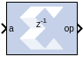

# Exponential

This Xilinx Exponential block preforms the exponential operation on the
input. Currently, only the floating-point data type is supported.

## Block Parameters

The Block Parameters dialog box can be invoked by double-clicking the
icon in your Simulink® model.

Basic tab  
Parameters specific to the Basic tab are as follows.

AXI Interface  
Flow Control  
Blocking  
Selects “Blocking” mode. In this mode, the lack of data on one input
channel does block the execution of an operation if data is received on
another input channel.

NonBlocking  
Selects “Non-Blocking” mode. In this mode, the lack of data on one input
channel does not block the execution of an operation if data is received
on another input channel.

Optimize Goal  
When NonBlocking mode is selected, the following optimization options
are activated.

Resources  
Block is configured for minimum resources.

Performance  
Block is configured for maximum performance.

Block Memory Usage  
BMG Usage  
No Usage  
Do not use Block Memory.

Full Usage  
Make full use of Block Memory.

Latency Specification  
Latency  
This defines the number of sample periods by which the block's output is
delayed.

&nbsp;

Optional Ports tab  
Parameters specific to the Optional Ports tab are as follows.

Input Channel Ports  
Has TLAST  
Adds a tlast port to the input channel.

Has TUSER  
Adds a tuser port to the input channel.

Control Options  
Provide enable port  
Add an enable port to the block interface.

Has Result TREADY  
Add a TREADY port to the result channel.

Exception Signals  
UNDERFLOW  
Add an output port that serves as an underflow flag.

OVERFLOW  
Add an output port that serves as an overflow flag.

Other parameters used by this block are explained in the topic [Common
Options in Block Parameter Dialog
Boxes](common-options-in-block-parameter-dialog-boxes-aa1032308.html).

## LogiCORE™ Documentation

Floating-Point Operator LogiCORE IP Product Guide
([PG060](https://www.xilinx.com/cgi-bin/docs/ipdoc?c=floating_point;v=latest;d=pg060-floating-point.pdf))
