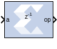

# Exponential

## Description

The Exponential block preforms the exponential operation on the
input. Currently, only the floating-point data type is supported.

## Parameters

### Basic tab  
Parameters specific to the Basic tab are as follows.

#### Flow Control

Dialog parameter.

#### Optimize Goal

When NonBlocking mode is selected, the following optimization options
are activated.

#### BMG Usage

Dialog parameter.

#### Latency

This defines the number of sample periods by which the block's output is
delayed.

### Optional Ports tab  
Parameters specific to the Optional Ports tab are as follows.

#### Has TLAST

Adds a tlast port to the input channel.

#### Has TUSER

Adds a tuser port to the input channel.

#### Provide enable port

Add an enable port to the block interface.

#### Has Result TREADY

Add a TREADY port to the result channel.

#### UNDERFLOW

Add an output port that serves as an underflow flag.

#### OVERFLOW

Add an output port that serves as an overflow flag.

Other parameters used by this block are explained in the topic [Common
Options in Block Parameter Dialog
Boxes](../../GEN/common-options/README.md).

Additional dialog notes:

AXI Interface. Blocking. Selects “Blocking” mode. In this mode, the lack of data on one input
channel does block the execution of an operation if data is received on
another input channel.

NonBlocking. Selects “Non-Blocking” mode. In this mode, the lack of data on one input
channel does not block the execution of an operation if data is received
on another input channel.

Resources. Block is configured for minimum resources.

Performance. Block is configured for maximum performance.

Block Memory Usage. No Usage. Do not use Block Memory.

Full Usage. Make full use of Block Memory.

Latency Specification. Input Channel Ports. Control Options. Exception Signals. ## LogiCORE™ Documentation

Floating-Point Operator LogiCORE IP Product Guide
([PG060](https://docs.xilinx.com/access/sources/ud/document?isLatest=true&url=pg060-floating-point&ft:locale=en-US))

--------------
Copyright (C) 2026 Advanced Micro Devices, Inc.
All rights reserved.

SPDX-License-Identifier: MIT
