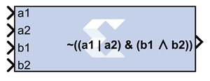

# Expression

The Expression block performs a bitwise logical expression.

## Description

The expression is specified with operators described in the table below.
The number of input ports is inferred from the expression. The input
port labels are identified from the expression, and the block is
subsequently labeled accordingly. For example, the expression:
`~((a1 | a2) & (b1 ^ b2))` results in the following block with 4 input
ports labeled `'a1'`, `'a2'`, `'b1'`, and `'b2'`.

The expression is parsed and an equivalent statement is written in VHDL
(or Verilog). Shown below, in decreasing order of precedence, are the
operators that can be used in the Expression block.

| Operator   | Symbol |
|------------|--------|
| Precedence | ()     |
| NOT        | ~      |
| AND        | &      |
| OR         | \|     |
| XOR        | ^      |

## Parameters

### Basic tab  
Parameters specific to the Basic tab are as follows.

#### Expression  
* Bitwise logical expression.

#### Align Binary Point  
* Specifies that the block must align binary points automatically. If not
selected, all inputs must have the same binary point position.

Other parameters used by this block are explained in the topic [Common
Options in Block Parameter Dialog
Boxes](common-options-in-block-parameter-dialog-boxes-aa1032308.html).
